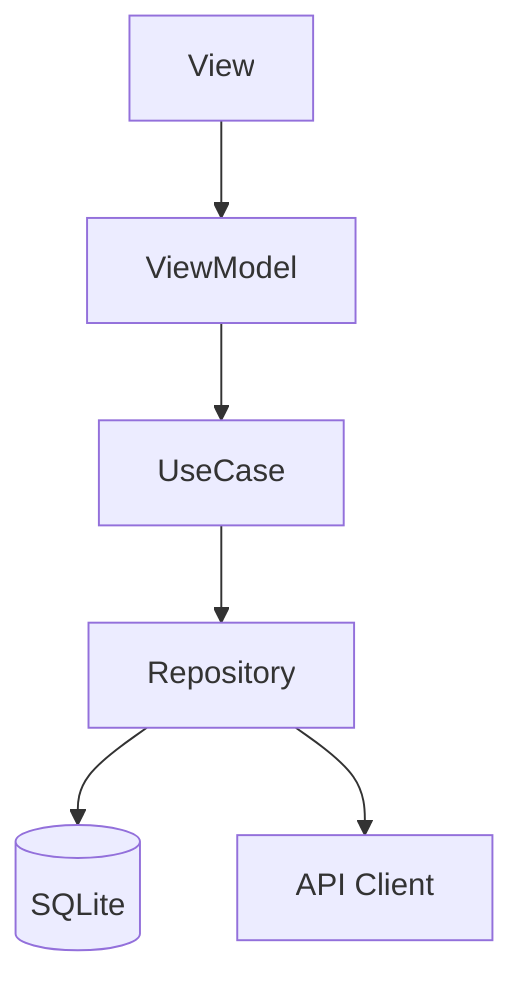

# Contributing to iOS Mobile System Design

Thank you for wanting to make this the best mobile system design resource on the internet. This guide explains how to contribute effectively.

---

## What Makes a Good Contribution

This repository is built on one core principle: **everything must be grounded in reality**. No guessing, no generic advice, no assumptions.

A good contribution:
- Cites **real sources** (engineering blogs, WWDC sessions, official docs, RFC numbers)
- Includes **specific numbers** (latency targets, memory budgets, cache sizes)
- Contains **runnable Swift 5.9+ code** that compiles and follows MVVM
- Is written from the perspective of someone who has **built this at scale**
- Covers **failure modes** — not just the happy path

A bad contribution:
- Says "use a cache" without specifying type, size, TTL, eviction policy
- Has pseudocode instead of real Swift
- Copies content from other tutorials without real-world context
- Makes claims without citations

---

## Ways to Contribute

### 1. Add a New System Design Spec

Use the template below. Save your file to `docs/your-problem-name.md`.

**Spec Template**:
```
# [Problem Title]
## Overview
## Target Companies & Frequency
## Scope Definition (In Scope / Out of Scope)
## Requirements (Functional + Non-Functional with real numbers)
## High-Level Architecture (Mermaid diagram + component table + data flow)
## Data Models (Swift structs + SQLite schema)
## API Design (endpoints + real JSON examples + pagination)
## Client Architecture Deep-Dives (2-3 hardest subsystems with Swift code)
## Performance & Optimizations (table with benchmarks)
## Failure Modes & Fallbacks (table)
## Trade-off Analysis (table with defended decision)
## Observability & Metrics (specific thresholds)
## Common Mistakes (❌ Wrong approach → ✅ Correct approach)
## Mock Interview Q&A (realistic back-and-forth dialogue)
## Related Specs (cross-links)
## Production Benchmarks Reference (table with sources)
## Interview Tips (3-5 bullet points)
```

### 2. Improve an Existing Spec

Found a better approach, a more accurate benchmark, or a missing failure mode? Open a PR with:
- What you changed and why
- Source / citation for the change
- If it contradicts existing content, explain the trade-off

### 3. Fix Incorrect Information

Mobile engineering moves fast. If a benchmark, API, or framework behavior is outdated:
- Open an issue with the label `outdated`
- Link to the current correct source
- PRs welcome

### 4. Share Your Interview Experience

If you've recently interviewed at a top company and encountered a mobile system design question:
- Open a **Discussion** (not an issue) in the Q&A category
- Describe the problem prompt (without violating NDA)
- Share what the interviewer focused on
- What worked / what didn't

---

## Style Guide

### Architecture
- Always use **MVVM**: View → ViewModel → UseCase → Repository → Data Sources
- ViewModels use `ObservableObject` + `@Published` for SwiftUI
- Use `async/await` (Swift 5.5+) for async operations
- Use `actor` for thread-safe shared state

### Code
- All Swift must be **syntactically correct** and follow Swift API Design Guidelines
- No force-unwraps (`!`) unless explicitly justified with a comment
- Prefer `protocol`-based abstractions over concrete types for testability
- Include the full type signature, not just method bodies

### Numbers
Every benchmark must have a source. Use this format in tables:

| Metric | Value | Source |
|:---|:---|:---|
| Cold start target | < 1.2s | Apple HIG + WWDC 2019 Session 423 |

Acceptable sources:
- Apple Developer Documentation
- WWDC session transcripts (cite year + session number)
- Uber Engineering Blog (eng.uber.com)
- Netflix Tech Blog (netflixtechblog.com)
- Instagram / Meta Engineering Blog
- Firebase documentation
- RFC documents (cite RFC number)
- OWASP Mobile Security Testing Guide
- SQLite documentation (sqlite.org)

Not acceptable:
- "I read somewhere that..."
- Medium posts without primary source backing
- Stack Overflow answers without linking to official docs

### Diagrams
Use **Mermaid** for all architecture diagrams (GitHub renders natively):



---

## PR Process

1. Fork the repo
2. Create a branch: `feat/problem-name` or `fix/spec-name-issue`
3. Follow the style guide above
4. Open a PR with:
   - Summary of what you added/changed
   - Sources for any new benchmarks
   - Screenshot of any Mermaid diagrams rendering correctly
5. A maintainer will review within 7 days

---

## Code of Conduct

- Be specific, not vague
- Cite sources, not opinions
- Critique content, not people
- If you've interviewed at a company, share signal — not secret questions

---

*The goal: every engineer who reads a spec here should walk into a Staff or EM interview feeling like they've solved this problem before.*
