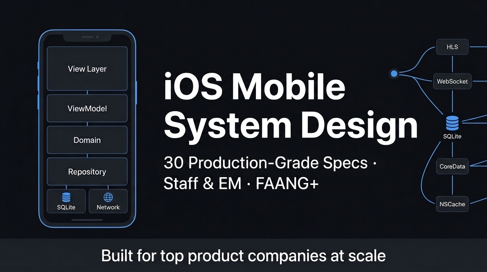

<div align="center">



# iOS Mobile System Design

### The most comprehensive mobile system design resource for senior iOS engineers.
### Built for Engineering Manager & Staff Engineer interviews at top product companies at scale.

[](LICENSE)
[](CONTRIBUTING.md)
[](https://github.com/therahulgoel/ios-system-design/stargazers)

**If this helps you land your dream role — give it a ⭐ so others can find it too.**

[📖 Browse All 33 Specs](#-complete-problem-catalog) · [📊 Cheatsheet](docs/cheatsheet.md) · [🚀 Interview Framework](#-the-45-minute-interview-framework) · [🤝 Contribute](CONTRIBUTING.md) · [👤 Author](#-about-the-author)

</div>

---

## 🎯 Who Is This For?

You are a **senior iOS or mobile engineer** preparing for:

- **Engineering Manager (EM)** interviews at Google, Uber, Meta, Apple, Salesforce, or equivalent
- **Staff / Principal Engineer** interviews at FAANG-tier companies
- Roles requiring mobile system design depth at **100M+ user scale**

This is **not** a LeetCode repo. This teaches you to architect production systems on iOS — the way interviewers at top companies actually expect you to.

---

## ⚡ Why This Repository Is Different

Most system design resources are backend-focused. This is built ground-up for **client-side mobile architecture**.

| What most resources cover | What this covers |
| :--- | :--- |
| Database sharding & load balancing | AVPlayer pooling & adaptive bitrate |
| Distributed consensus (Raft/Paxos) | Operational Transformation & CRDTs |
| Horizontal server scaling | Memory pressure, OOM, and LRU eviction |
| API gateway design | Certificate pinning & token refresh interceptors |
| MapReduce pipelines | Offline-first sync with BGTaskScheduler |
| Message queues (Kafka) | WebSocket lifecycle, heartbeat & reconnect strategy |

Every spec includes:
- ✅ **Real production numbers** (Netflix, Uber, Firebase, Apple WWDC, OWASP)
- ✅ **Swift 5.9+ code** (async/await, Actors, SwiftUI + MVVM)
- ✅ **Actual SQLite schemas** and **API contracts**
- ✅ **Mermaid architecture diagrams** (render natively on GitHub)
- ✅ **Trade-off tables** with defended decisions
- ✅ **FAANG-style Mock Interview Q&A** per problem
- ✅ **Common Mistakes** (❌ Wrong → ✅ Correct)

---

## 🗂 Complete Problem Catalog

**33 production-grade specs** across 10 domains. **13,000+ lines** of real content.

---

### 🤖 AI, LLM & On-Device ML

| Problem | Key Concepts | Target Companies |
| :--- | :--- | :--- |
| [🤖 On-Device LLM & Mobile AI Assistant Engine](docs/on-device-llm-ai-engine.md) | INT4 quantization, CoreML/ExecuTorch runtime, local RAG (USearch/SQLite VSS), token streaming, thermal throttling | Apple, Meta, Google, Microsoft, Snap |

---

### 🎬 Streaming

| Problem | Key Concepts | Target Companies |
| :--- | :--- | :--- |
| [📺 Long-form Video Streaming Player](docs/video-streaming-player.md) | HLS/DASH, AVPlayer, adaptive bitrate, FairPlay DRM, offline download | Google, Apple, Netflix |
| [🎞 Short-form Video Feed](docs/video-feed-streaming.md) | AVPlayer pool (3-item), prefetch engine, low-bandwidth 240p, memory guard | Google, Meta, Snap |
| [🎵 Spotify / Apple Music Audio Player](docs/spotify-audio-player.md) | AVQueuePlayer gapless, AVAssetDownloadURLSession DRM offline, MPNowPlayingInfoCenter, FairPlay | Apple, Spotify |

---

### 💬 Messaging & Collaboration

| Problem | Key Concepts | Target Companies |
| :--- | :--- | :--- |
| [💬 Instant Messaging & Chat](docs/messaging-chat.md) | SQLite WAL, message state machine, E2EE (Signal protocol), offline queue | Meta, Slack, Google |
| [📝 Collaborative Document Editor](docs/collaborative-editor.md) | OT vs CRDTs, delta sync, presence/cursors, op log | Google, Notion, Dropbox |
| [💼 Slack Multi-Workspace Channel Sync](docs/slack-channel-sync.md) | Per-workspace SQLite isolation, WebSocket per workspace, unread badge actor | Slack, Salesforce, Microsoft |
| [📹 Google Meet / Zoom Video Calling](docs/google-meet-webrtc.md) | WebRTC SFU, ICE/STUN/TURN, thermal throttling, AVAudioSession, dynamic grid | Google, Meta, Zoom |

---

### 📡 Real-Time & Geospatial

| Problem | Key Concepts | Target Companies |
| :--- | :--- | :--- |
| [🗺 Real-Time Location & Ride Tracking](docs/realtime-location-tracking.md) | WebSocket, Kalman filter, GPS batching, map delta rendering, battery guard | Uber, Lyft, DoorDash |
| [🍕 DoorDash Live Delivery Tracker](docs/doordash-delivery-tracker.md) | Order state machine, ActivityKit Dynamic Island, hybrid WebSocket+APNs+polling | DoorDash, Uber Eats, Swiggy |

---

### 🏦 Payments, E-Commerce & Marketplace

| Problem | Key Concepts | Target Companies |
| :--- | :--- | :--- |
| [🖥 Server-Driven UI (SDUI) Engine](docs/sdui-engine.md) | Component registry, schema versioning, fallback engine, analytics injection | Uber, Meta, Google |
| [💳 Payment Checkout Flow](docs/payment-checkout.md) | Tokenization, idempotency keys, payment state machine, PCI DSS, 3DS | Google Pay, Stripe, Square |
| [🛍 Product Catalog & Discovery Feed](docs/e-commerce-catalog.md) | Image-heavy grid, cursor pagination, cart sync, wishlist offline queue | Amazon, Shopify, Etsy |
| [🏠 Airbnb Search & Property Booking](docs/airbnb-search-booking.md) | Map+grid sync, 800ms debounce, blurhash, 15-min inventory hold, booking draft | Airbnb, Booking.com |

---

### 🌐 Social & Feed

| Problem | Key Concepts | Target Companies |
| :--- | :--- | :--- |
| [📰 Infinite Social Feed](docs/social-feed.md) | Cursor-based pagination, image pipeline, offline feed (200 items), impression tracking | Meta, Twitter/X, LinkedIn |

---

### 📅 Productivity

| Problem | Key Concepts | Target Companies |
| :--- | :--- | :--- |
| [📅 Google Calendar Mobile Client](docs/google-calendar.md) | RFC 5545 RRule, infinite scroll UICollectionViewLayout, APNs silent sync, conflict resolution | Google, Apple, Microsoft |

---

### 🔐 Security & Identity

| Problem | Key Concepts | Target Companies |
| :--- | :--- | :--- |
| [🔐 Authentication: OAuth2 / SSO / Biometric](docs/authentication-oauth-biometric.md) | PKCE flow, Keychain storage, Secure Enclave, atomic token refresh actor, multi-device logout | All FAANG, Stripe, Salesforce |
| [🛡 Security, Cryptography & Zero-Trust Engine](docs/mobile-security-privacy-engine.md) | Apple App Attest, Secure Enclave key derivation, SPKI TLS 1.3 pinning, SQLCipher encryption | Stripe, Square, Apple, Signal, Meta |
| [🔗 Deep Linking & Universal Links](docs/deep-linking-universal-links.md) | AASA file (no CDN!), deferred deep links, router/coordinator, cold-start race condition | Meta, Airbnb, Spotify |

---

### 🔧 Platform Infrastructure & Engineering Leadership (EM / Staff)

| Problem | Key Concepts | Target Companies |
| :--- | :--- | :--- |
| [🏛 Mobile Platform Eng, Release & Governance (EM)](docs/mobile-platform-engineering-em.md) | Interface vs Implementation graph, 7-day canary train, Sev-1 triage & remote kill switch | Uber, Meta, Airbnb, Stripe |
| [🖼 Image Loading Library](docs/image-loading-library.md) | 3-tier cache (NSCache → Disk → Network), downsampling, request deduplication | Any image-heavy app |
| [🌐 Networking Layer / HTTP Client SDK](docs/networking-layer.md) | Protocol-based endpoints, auth interceptor, atomic token refresh, SPKI pinning | All companies |
| [📊 Mobile Analytics & Telemetry SDK](docs/analytics-sdk.md) | Ring buffer, SQLite journal, battery-aware batching, crash recovery, sampling | Uber, Meta, Google |
| [🚩 Feature Flag & Experimentation System](docs/feature-flag-system.md) | Fallback chain, synchronous local eval, kill switch (<5min), A/B tracking | Uber, Airbnb, Meta |
| [🔄 Offline-First Data Sync Engine](docs/offline-sync-engine.md) | Local-first architecture, dirty-flag sync, LWW conflict resolution, BGTaskScheduler | Google, Apple, Dropbox |
| [🧩 App Modularization & DI System](docs/app-modularization.md) | Module hierarchy, interface modules, DI (Needle pattern), build time, SPM | Uber, Google, Grab |
| [🔔 Push Notification System](docs/push-notification-system.md) | APNs token lifecycle + FCM HTTP v1 cross-platform, silent push, deferred deep links | All FAANG, Airbnb, Spotify |
| [💥 Crash Reporting & Observability SDK](docs/crash-reporting-sdk.md) | Signal handlers, OOM detection, breadcrumb ring buffer, dSYM symbolication | Google (Firebase), Meta, Uber |
| [🧪 A/B Testing & Experimentation SDK](docs/ab-testing-experimentation-sdk.md) | Deterministic MurmurHash bucketing, sticky assignment, kill switch via silent push | Google, Airbnb, Spotify |
| [⚡ App Performance Monitoring (APM)](docs/app-performance-monitoring.md) | MetricKit, pre-main cold start, hitch rate vs hang, URL template anti-pattern | All 10M+ user apps |
| [🚀 Mobile CI/CD Pipeline & Release Eng](docs/mobile-ci-cd-pipeline.md) | Fastlane match, Xcode Cloud, code signing, phased rollout, auto-rollback | Uber, Meta, Google |
| [🔍 Search with Autocomplete & Offline Index](docs/search-autocomplete.md) | Task-based debounce, SQLite FTS5 offline index, request race condition, trie vs FTS5 | Google, Amazon, Airbnb |

---

### 📈 Analytics & Growth

| Problem | Key Concepts | Target Companies |
| :--- | :--- | :--- |
| [📈 User Analytics Event Pipeline](docs/user-analytics-event-pipeline.md) | 8-event taxonomy, DAU/MAU via HyperLogLog, Kafka→BigQuery, user journey, persona segmentation | Meta, Google, Uber, DoorDash |

---

### 📚 References & Cheatsheets

| Resource | What's In It |
| :--- | :--- |
| [📊 Master Cheatsheet](docs/cheatsheet.md) | All key numbers, decisions, and anti-patterns in one page |
| [🧩 Generic Mobile Problems](docs/generic-mobile-problems.md) | Cross-cutting patterns applicable to any mobile system design |

---

## 🏗 The 45-Minute Interview Framework

```
┌─────────────────────────────────────────────────────────────────────┐
│  Phase             │  Time      │  What You Must Achieve             │
├─────────────────────────────────────────────────────────────────────┤
│  1. Clarify        │  0–5 min   │  Scope, scale (DAU), offline?, platform │
│  2. HLD            │  5–15 min  │  Full client-server component map  │
│  3. Data & API     │  15–25 min │  Entities, endpoints, pagination   │
│  4. Deep Dives     │  25–40 min │  Own 2–3 hardest subsystems        │
│  5. Ops & Scale    │  40–45 min │  Failures, metrics, rollout plan   │
└─────────────────────────────────────────────────────────────────────┘
```

### The 4-Layer Client Architecture (Use This Every Time)

```
┌──────────────────────────────────────────────────────────────┐
│  View Layer         (SwiftUI — zero business logic)           │
├──────────────────────────────────────────────────────────────┤
│  Presentation Layer (ViewModel — state, user events)          │
├──────────────────────────────────────────────────────────────┤
│  Domain / Use Case  (Business rules, repository protocols)    │
├──────────────────────────────────────────────────────────────┤
│  Data Layer         (Repository: Remote + Local)              │
│     ├── Remote  → URLSession / gRPC / WebSocket               │
│     └── Local   → SQLite / CoreData / NSCache / Keychain      │
└──────────────────────────────────────────────────────────────┘
```

---

## 📊 Production Benchmarks (Quote These in Interviews)

| Metric | Target | Source |
| :--- | :--- | :--- |
| Cold start (p50) | `< 1.2s` | Apple HIG, Uber Engineering |
| Warm start | `< 400ms` | Google Play Vitals |
| UI frame budget (60Hz) | `16.6ms` | CoreAnimation |
| UI frame budget (120Hz ProMotion) | `8.3ms` | ProMotion / CADisplayLink |
| Memory before OOM warning | `~250MB` | WWDC 2018 |
| Hard OOM crash threshold | `~350MB` | iOS crash telemetry |
| API p99 latency target | `< 200ms` client-side | Uber API principles |
| Search debounce | `300ms` | Apple HIG |
| WebSocket heartbeat | `30s` | RFC 6455 |
| Analytics flush | `30s or 100 events` | Firebase Analytics |
| HLS segment size | `6s` | Apple HLS Authoring Spec |
| APNs max payload | `4KB` | Apple docs |
| FCM messages/day | `400B+` | Firebase I/O 2023 |
| Redis HyperLogLog error | `0.81%` | Redis docs |
| Redis HLL memory | `max 12KB/counter` | Redis docs |
| Session timeout | `30 min inactivity` | Google Analytics, Amplitude |
| DAU/MAU stickiness (great) | `> 40%` | Instagram, Slack |
| Crash-free session target | `> 99.9%` | Firebase Crashlytics |
| BGAppRefreshTask window | `Max 30s` | Apple Background Tasks |
| OAuth2 PKCE code_verifier | `43 char min` | RFC 7636 |
| App Store phased rollout | `7 days to 100%` | App Store Connect |
| On-Device LLM RAM budget | `≤ 500MB` | Apple WWDC 2024 / ExecuTorch |
| LLM Time-to-First-Token | `< 100ms` | Apple Neural Engine / Snapdragon NPU |
| Local Vector Search Latency | `< 15ms` | USearch / HNSW Benchmark |
| Mobile CI Clean Build Budget | `< 6 min` | Bazel / Tuist Remote Cache |
| Secure Enclave Key Gen | `< 80ms` | Apple Secure Enclave Spec |

---

## 🔑 Core Technical Decision Reference

### Storage

| Data Type | Solution | Why |
| :--- | :--- | :--- |
| Structured / relational | SQLite (WAL mode) | Concurrent reads, fast writes, indexed queries |
| Secrets / tokens | Keychain | Hardware-backed encryption, survives reinstall |
| User preferences | UserDefaults | Fast synchronous reads, small data only |
| Large media / files | FileManager (`/Application Support`) | Persists across reinstall for purchases |
| In-session objects | NSCache / LRU Cache | Auto-evicts under memory pressure / max cost ($O(1)$ operations via Hash Map + Doubly Linked List) |

### Real-Time Transport

| Protocol | Choose When | iOS API |
| :--- | :--- | :--- |
| **WebSocket** | Bidirectional, low-latency (chat, location) | `URLSessionWebSocketTask` |
| **APNs Push** | App backgrounded, infrequent alerts | `UserNotifications` |
| **HTTP/2** | Multiple concurrent API requests | `URLSession` (automatic) |
| **gRPC Streaming** | High-frequency, strongly typed | `gRPC-Swift` |

### Pagination

```
✅  Cursor-based:  GET /feed?after_cursor=eyJpZCI6MTIzfQ==&limit=20
    → Stable on inserts | O(1) server cost | No duplicates

❌  Offset-based:  GET /feed?page=5&limit=20
    → Items shift on insert | O(n) server scan | Duplicates on fast feeds
```

---

## 🧠 What Makes a Staff/EM Answer Different

| Dimension | Senior (L5) | Staff / EM (L6/L7) |
| :--- | :--- | :--- |
| **Scope** | Designs what's asked | Explicitly states in-scope AND out-of-scope |
| **Numbers** | "We'll use a cache" | "NSCache 50MB L1, 7-day TTL on disk, evict on `didReceiveMemoryWarning`" |
| **Trade-offs** | Lists options | Defends a choice with cost/complexity/team reasoning |
| **Failure modes** | Mentions errors | Covers stale cache, offline fallback, circuit breaker |
| **Observability** | "We'd add logging" | Names specific metrics: p99 render, OOM rate, crash-free sessions |
| **Drive** | Answers questions | Owns the interview, states agenda, moves through phases |

---

## 🤝 Contributing

Found an issue or want to add a new problem? **PRs are welcome.**  
Please read [CONTRIBUTING.md](CONTRIBUTING.md) for quality standards and the spec format.

---

## 👤 About the Author

Built by a mobile engineering leader with **12+ years** scaling iOS apps to **100M+ users** across streaming, social, payments, and e-commerce.

Connect on LinkedIn: **[linkedin.com/in/therahulgoel](https://www.linkedin.com/in/therahulgoel/)**  
Follow on X / Twitter: **[@therahulgoel](https://x.com/therahulgoel)**

If this helped you level up or land an offer — a ⭐ takes one second and helps this reach engineers who need it.

---

<div align="center">

**📱 iOS Mobile System Design · 33 Production-Grade Specs · 13,000+ Lines of Real Content**

[⭐ Star this repo](https://github.com/therahulgoel/ios-system-design) · [🔗 Share on LinkedIn](https://www.linkedin.com/sharing/share-offsite/?url=https://github.com/therahulgoel/ios-system-design) · [🐦 Share on Twitter](https://twitter.com/intent/tweet?text=The+most+comprehensive+iOS+mobile+system+design+resource+for+Staff+%26+EM+interviews.+33+production-grade+specs+with+real+numbers.&url=https://github.com/therahulgoel/ios-system-design)

</div>