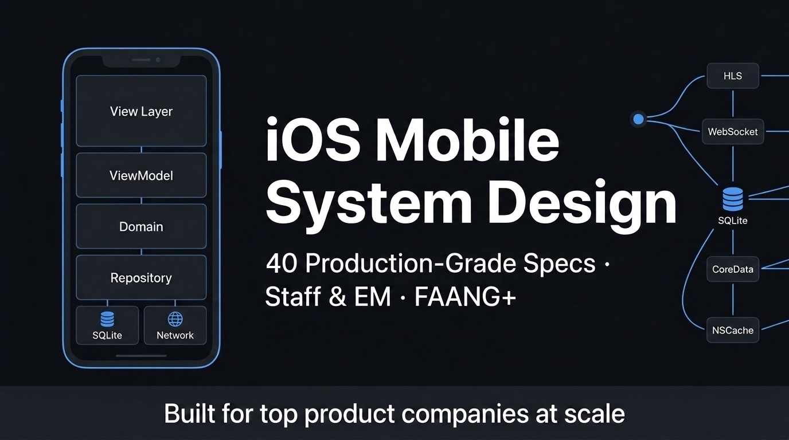

<a id="top"></a>

<div align="center">



# System Design Interview Prep

### Know what to cover. Practice how to answer. Defend the follow-ups.

[](LICENSE)
[](CONTRIBUTING.md)
[](https://github.com/therahulgoel/ios-system-design)

[LinkedIn](https://www.linkedin.com/in/therahulgoel/) · [X / Twitter @therahulgoel](https://x.com/therahulgoel) · [Resume](https://therahulgoel.github.io/Rahul_Goel_Resume.pdf)

Interview preparation for **Senior iOS, Staff / Principal, EM / SDM and engineering leadership** roles.

Study a domain, build an answer, stress-test it with failure questions, and connect your decisions to real experience.

**[Start learning](#your-first-visit-start-here) · [Browse industries](#explore-by-industry-and-domain) · [Choose your role](#choose-your-preparation-track) · [Reference library](#primary-source-reference-library)**

</div>

---

## Your first visit: start here

Choose one route. Each route leads to concepts, an answer structure and questions to rehearse.

| Build your foundation | Practice your interview |
| :--- | :--- |
| **Backend: basics to real apps**<br>[Follow the progressive track](docs/backend-interview-track.md)<br>Requests, APIs, data and distributed systems. | **Learn how to answer**<br>[Open the answer playbook](docs/interview-answer-playbook.md)<br>Worked responses and challenging follow-ups. |
| **Client architecture**<br>[Choose an industry below](#explore-by-industry-and-domain)<br>State, networking, persistence and device constraints. | **Design a backend system**<br>[Open the twelve-case workbook](docs/backend-system-design-casebook.md)<br>APIs, invariants and recovery drills. |
| **Streaming depth**<br>[Explore FAST / SVOD / AVOD / TVOD](docs/streaming-business-and-architecture.md)<br>DRM, ads, live latency, CDN and entitlement. | **Prepare EM and leadership stories**<br>[Build your evidence bank](docs/behavioral-engineering-manager-staff-guide.md)<br>Real decisions, people outcomes and lessons. |

> **Your first session:** pick one problem, explain your design aloud, inject a failure, answer the follow-up, then record what you could not defend.

## What makes this repository different

The material connects **what to design**, **how to explain it**, and **what happens when the interviewer challenges it**. Its distinguishing combination is client behavior, backend correctness and engineering leadership in the same preparation path.

| Preparation need | What this repository contains |
| :--- | :--- |
| Explain a design | [Worked answer walkthroughs](docs/interview-answer-playbook.md), API/data-model discussions and architecture diagrams |
| Go beyond the happy path | Timeouts, concurrent requests, duplicate events, stale workers and recovery drills |
| Defend a decision | Domain-specific trade-offs and questions about the rejected alternative |
| Handle technical probes | Backend casebook follow-ups and mock Q&A in the client specifications |
| Adapt to seniority | Staff implementation/influence depth, EM people/operations depth and leadership scope |
| Tell a credible career story | STAR-style structure, probing questions and an evidence bank based on the author's resume |

A payment timeout, a lost message acknowledgement and a failed ad decision have different consequences. Practice explaining those differences through an actual contract, state model and recovery action.

The diagrams and sketches support reasoning. Worked responses describe proposed designs; career answers must come from your own experience. The repo does not supply invented success stories or guaranteed hiring scripts.

## What a stronger answer sounds like

**Practice prompt: What if the payment request times out?**

> A timeout leaves the outcome unknown. I would retain the operation identity, show pending state, and reconcile through status lookup or provider events. The backend must atomically bind the identity to the caller and request, so concurrent retries do not create separate operations.

**Expect the follow-up:** what if the provider accepted the payment before the worker crashed? Trace the persisted attempt, external idempotency contract and reconciliation path. Then add the EM lens: ownership, exception handling and customer communication.

[Read the full walkthrough and streaming example](docs/interview-answer-playbook.md).

## Choose your preparation track

| Your target | Start here | What to demonstrate |
| :--- | :--- | :--- |
| Senior iOS / mobile frontend | Pick a client design in your domain, then use the [cheatsheet](docs/cheatsheet.md) | State, concurrency, networking, persistence, performance and debugging |
| Staff / principal mobile | [Mobile platform guide](docs/mobile-platform-engineering-em.md) and [modularization](docs/app-modularization.md) | Technical depth, migration, cross-team adoption and durable architecture decisions |
| Backend EM / Amazon SDM | [Basics-to-apps track](docs/backend-interview-track.md), [backend leadership guide](docs/backend-engineering-manager-guide.md) and [behavioral guide](docs/behavioral-engineering-manager-staff-guide.md) | Correctness, operations, people development and delivery judgment |
| Staff / principal backend | [Basics-to-apps track](docs/backend-interview-track.md), [backend casebook](docs/backend-system-design-casebook.md) | APIs, schemas, concurrency, replay, failure recovery and technical influence |
| Director / engineering leadership | [Leadership guide](docs/behavioral-engineering-manager-staff-guide.md) | Actual multi-team scope, portfolio decisions, resource allocation and leadership development |

For a worked preparation path grounded in the author's experience, see [Rahul's resume-based plan](docs/rahul-backend-interview-plan.md). It identifies evidence already present and gaps that require real examples or hands-on work.

**Coverage boundary:** the frontend material focuses on iOS and mobile. Web frontend candidates need additional browser, JavaScript/TypeScript, accessibility and framework preparation. Backend candidates need implementation and operational practice beyond reading these documents.

## Turn reading into interview practice

| Step | What to do | What to produce |
| :---: | :--- | :--- |
| **1** | Choose a domain and role | One client specification and its corresponding backend exercise |
| **2** | State the invariant | What must remain correct and which component enforces it |
| **3** | Draw the normal path | APIs, authoritative data, persistence and acknowledgement boundaries |
| **4** | Inject a failure | A walkthrough of a timeout, concurrent request, duplicate event, stale worker or unavailable dependency |
| **5** | Defend the trade-off | Customer consequences, recovery, operational burden and cost using traceable inputs |
| **6** | Add your role's evidence | Staff: implementation and influence. EM: people, ownership and execution. Leadership: portfolio and organizational decisions |
| **7** | Get feedback and repeat | A repaired answer to the incorrect assumption or unsupported claim |

Practice prompts are authored exercises, not leaked company questions. Use the actual posting and recruiter packet to decide which coding, design, management and writing rounds to rehearse.

Official preparation references: [Amazon SDM](https://amazon.jobs/content/en/how-we-hire/sdm-interview-prep), [Google hiring](https://www.google.com/about/careers/applications/how-we-hire/), [Google DeepMind](https://deepmind.google/careers/) and [SpaceX careers](https://www.spacex.com/careers/).

## Explore by industry and domain

Use the domain map to jump to a reading list. Each list connects a design problem to the decisions and follow-ups to practice.

| Customer-facing systems | Platforms and leadership |
| :--- | :--- |
| [Payments](#payments) - correctness and reconciliation | [Backend systems](#backend) - concurrency, data and recovery |
| [Streaming and media](#streaming) - playback, ads and access | [AI applications](#ai) - inference, evaluation and authorization |
| [E-commerce and booking](#commerce) - discovery and inventory | [Developer platforms](#platforms) - reliability and releases |
| [Messaging and collaboration](#messaging) - ordering and sync | [Leadership and reference](#leadership) - decisions and evidence |
| [Mobility and delivery](#mobility) - live state and connectivity | [Social and analytics](#social) - freshness and measurement |

Product names in document titles identify familiar design problems. They do not imply access to those companies' internal architectures or private interview questions.

<a id="payments"></a>

### Payments & financial workflows

**Central question:** how do you preserve a correct money movement when the client, service or provider can fail independently?

| Resource | Decisions to practice |
| :--- | :--- |
| [Payment checkout](docs/payment-checkout.md) | Stable request identity, pending outcomes, authentication challenges, persisted client state and reconciliation |
| [Authentication, OAuth and biometrics](docs/authentication-oauth-biometric.md) | Token lifecycle, credential storage and authentication recovery |
| [Mobile security and privacy](docs/mobile-security-privacy-engine.md) | Trust boundaries, key protection, encrypted storage and certificate rotation |

Pair these with the casebook's [checkout, payments and inventory exercise](docs/backend-system-design-casebook.md#1-checkout-payments-and-inventory). Be ready to explain why a timeout is not proof of failure and where duplicate-effect protection actually lives.

<a id="streaming"></a>

### Streaming, media & live experiences

**Central question:** how do you sustain playback quality across device constraints, variable networks and service failures?

| Resource | Decisions to practice |
| :--- | :--- |
| [FAST, SVOD, AVOD and TVOD guide](docs/streaming-business-and-architecture.md) | Business models plus detailed DRM, ad measurement, live latency, CDN failover and entitlement failure walkthroughs |
| [Long-form video player](docs/video-streaming-player.md) | Playback lifecycle, adaptive streaming, DRM and downloads |
| [Short-form video feed](docs/video-feed-streaming.md) | Player reuse, prefetching, cancellation and memory pressure |
| [Audio player and offline mode](docs/spotify-audio-player.md) | Playback queues, background audio, system integration and offline media |
| [Video calling and WebRTC](docs/google-meet-webrtc.md) | Connection establishment, relay fallback, media sessions and thermal constraints |

Pair client behavior with the [live-event backend exercise](docs/backend-system-design-casebook.md#8-streaming-platform-and-live-event-control-plane). Separate media delivery from entitlement and metadata, and distinguish playback success from server request success.

<a id="commerce"></a>

### E-commerce, marketplaces & booking

**Central question:** how do you keep discovery responsive while inventory and order state remain correct?

| Resource | Decisions to practice |
| :--- | :--- |
| [Product catalog and discovery](docs/e-commerce-catalog.md) | Pagination, image-heavy screens and local cart state |
| [Property search and booking](docs/airbnb-search-booking.md) | Search coordination, reservations and booking state |
| [Search and autocomplete](docs/search-autocomplete.md) | Debounce, cancellation, stale results and local search |
| [Server-driven UI](docs/sdui-engine.md) | Schema compatibility, component registration and safe fallback |
| [Image loading library](docs/image-loading-library.md) | Caching, downsampling, request coalescing and cancellation |

Extend the client specifications with [exclusive inventory booking](docs/backend-system-design-casebook.md#2-booking-exclusive-inventory) and [search indexing](docs/backend-system-design-casebook.md#5-search-and-autocomplete). Defend concurrent allocation, index lag and old-client compatibility.

<a id="messaging"></a>

### Messaging, collaboration & productivity

**Central question:** what does an acknowledgement mean, and how do multiple devices recover a consistent view?

| Resource | Decisions to practice |
| :--- | :--- |
| [Messaging and chat](docs/messaging-chat.md) | Pending sends, ordering, receipts, reconnection and durable history |
| [Multi-workspace channel sync](docs/slack-channel-sync.md) | Workspace isolation, unread state and connection lifecycle |
| [Collaborative editor](docs/collaborative-editor.md) | Concurrent editing, operation models and convergence |
| [Offline-first sync](docs/offline-sync-engine.md) | Local persistence, conflict handling, replay and resynchronization |
| [Calendar client](docs/google-calendar.md) | Recurrence, time zones, range queries and synchronized state |

Practice [durable messaging](docs/backend-system-design-casebook.md#3-durable-messaging-and-offline-synchronization) and [distributed scheduling](docs/backend-system-design-casebook.md#10-distributed-scheduler-and-work-execution). Explain acceptance versus delivery, cursor expiry and stale worker ownership.

<a id="mobility"></a>

### Mobility, delivery & real-time tracking

**Central question:** how do you keep a useful live view when updates are delayed, devices sleep or connectivity disappears?

| Resource | Decisions to practice |
| :--- | :--- |
| [Geospatial tracking](docs/realtime-location-tracking.md) | Location updates, transport lifecycle, interpolation and battery use |
| [Delivery order tracking](docs/doordash-delivery-tracker.md) | Order transitions, realtime updates and Live Activities |
| [Push notification system](docs/push-notification-system.md) | Device registration, provider responses and background update limits |
| [Deep linking and universal links](docs/deep-linking-universal-links.md) | Routing, cold starts, domain association and authorization |

Use the [notification backend exercise](docs/backend-system-design-casebook.md#7-notification-delivery) to defend preference checks, expiry, retries and token cleanup. Provider acceptance is not proof that the device received or displayed a message.

<a id="social"></a>

### Social feeds, growth & analytics

**Central question:** how do you deliver relevant content and derive trustworthy measurements without losing control of freshness, privacy or cost?

| Resource | Decisions to practice |
| :--- | :--- |
| [Social feed](docs/social-feed.md) | Pagination, optimistic state and impression tracking |
| [User analytics event pipeline](docs/user-analytics-event-pipeline.md) | Event contracts, identity, aggregation and retention |
| [Analytics SDK](docs/analytics-sdk.md) | Durable collection, batching, retries and lifecycle constraints |
| [Feature flags](docs/feature-flag-system.md) | Local evaluation, defaults, configuration updates and recovery |
| [A/B testing SDK](docs/ab-testing-experimentation-sdk.md) | Assignment, exposure tracking and experiment compatibility |

Pair these with [feed and recommendation design](docs/backend-system-design-casebook.md#4-social-feed-and-recommendations) and [telemetry ingestion](docs/backend-system-design-casebook.md#6-analytics-and-telemetry-ingestion). Discuss late events, replay, sampling and deletion before trusting the resulting metric.

<a id="backend"></a>

### Backend platforms & distributed systems

**Central question:** which invariants survive concurrency, overload, replication lag and regional failure?

| Resource | What it provides |
| :--- | :--- |
| [Backend interview track: basics to complete apps](docs/backend-interview-track.md) | Ten stages with plain-language concepts, spoken responses, exit questions and app mappings |
| [Backend EM, staff and leadership master guide](docs/backend-engineering-manager-guide.md) | Consistency, transactions, caching, CDC, security, capacity, migrations and organizational ownership |
| [Backend system design casebook](docs/backend-system-design-casebook.md) | Twelve authored exercises with data-model questions, failure drills and role-specific follow-ups |
| [Networking layer](docs/networking-layer.md) | The client side of API contracts, credential refresh, request handling and recovery |

The casebook also includes [multi-tenant reporting](docs/backend-system-design-casebook.md#9-multi-tenant-csat-and-reporting-platform) and [regional recovery](docs/backend-system-design-casebook.md#11-regional-failure-and-data-recovery). Start with authoritative state and access paths; add infrastructure only when its purpose and failure consequences are clear.

<a id="ai"></a>

### AI applications & inference

**Central question:** how do you make model-backed features measurable, authorized and recoverable?

| Resource | Decisions to practice |
| :--- | :--- |
| [On-device AI architecture](docs/on-device-llm-ai-engine.md) | Runtime choice, weight and working memory, cancellation, retrieval and cloud routing |
| [Summarization systems](docs/how-ai-summarization-agents-work.md) | Tokenization, generation, context selection, provenance and output evaluation |
| [Primary AI reading map](docs/history-of-agentic-loops.md) | Distinguishing training, inference, search and tool orchestration through published research |

Practice the [AI inference gateway](docs/backend-system-design-casebook.md#12-ai-inference-gateway-and-evaluation-platform). Evaluate task quality separately from availability and speed. This material does not substitute for ML research or distributed-training expertise.

<a id="platforms"></a>

### Developer platforms, reliability & release engineering

**Central question:** how do you improve delivery while making failures easier to detect, contain and recover from?

| Resource | Decisions to practice |
| :--- | :--- |
| [Mobile platform leadership](docs/mobile-platform-engineering-em.md) | Module ownership, release coordination and incident response |
| [App modularization and dependency injection](docs/app-modularization.md) | Dependency boundaries, interfaces and adoption |
| [Mobile CI/CD](docs/mobile-ci-cd-pipeline.md) | Build pipelines, signing, validation and distribution |
| [App performance monitoring](docs/app-performance-monitoring.md) | Startup, responsiveness, resource usage and metric definitions |
| [Crash reporting and observability](docs/crash-reporting-sdk.md) | Diagnostics, breadcrumbs and abnormal termination analysis |

Connect these to the [backend guide's reliability and release sections](docs/backend-engineering-manager-guide.md). A backend rollback, an App Store rollout pause and a remote feature flag have different recovery capabilities.

<a id="leadership"></a>

### Leadership, behavioral preparation & reference

| Resource | How to use it |
| :--- | :--- |
| [Leadership and behavioral guide](docs/behavioral-engineering-manager-staff-guide.md) | Reconstruct actual decisions, people outcomes, conflicts, failures and learning |
| [Rahul's preparation plan](docs/rahul-backend-interview-plan.md) | See a resume-grounded evidence bank, scope assessment and preparation sequence |
| [Client architecture cheatsheet](docs/cheatsheet.md) | Recall patterns after studying their constraints |
| [Generic mobile problems](docs/generic-mobile-problems.md) | Practice cross-cutting client design |
| [Evidence standard and sources](docs/evidence-and-sources.md) | Check published behavior and distinguish measurements from proposed targets |
| [Repository review record](docs/repository-review.md) | Understand repairs, validation scope and remaining limitations |

## Streaming terminology to prepare

Streaming interviews can span both product economics and media infrastructure. The [streaming business and architecture guide](docs/streaming-business-and-architecture.md) connects the following concepts to design exercises and primary sources:

| Topic | Preparation focus |
| :--- | :--- |
| FAST | Free ad-supported streaming TV: scheduled channels, program guides, playout and ad breaks |
| SVOD | Subscription VOD: billing lifecycle, entitlement, access restoration and session policy |
| AVOD | Advertising-supported VOD: ad decisions, consent, measurement and playback continuity |
| TVOD | Transactional VOD: purchases, rentals, rights windows and payment reconciliation |
| Hybrid tiers | Separating subscription state, advertising policy and content rights |
| CSAI / SSAI | Client-side versus server-side insertion, timing, fallback and measurement responsibilities |
| HLS / DASH / CMAF | Delivery manifests, renditions, media compatibility and supported player behavior |
| DRM / CDN / QoE | Content protection, cache and origin behavior, and defined playback outcomes |

Definitions: [Amazon Ads VOD guide](https://advertising.amazon.com/library/guides/avod-svod-tvod-video-on-demand), [AWS FAST channel architecture](https://aws.amazon.com/blogs/media/deploying-virtual-linear-ott-channels-using-aws-media-services/). Use the linked guide for the technical references and failure drills.

## Architecture decision reference

Use this to recall decisions, then defend them for the actual workload. There is no single mandatory architecture or cache budget.

| Area | Options and judgment to explain |
| :--- | :--- |
| App layers | SwiftUI view, ObservableObject ViewModel and injected domain/data services under [the repo convention](REPO_SPEC.md) |
| Structured local state | SQLite or Core Data according to access, concurrency and migration needs |
| Credentials | Appropriate Keychain access policy; never rely on ordinary preferences for secrets |
| Media and images | Persistent versus purgeable storage, decoding size, retention and cancellation |
| Realtime transport | WebSocket for interactive sessions; HTTP for request/response; push as a system-controlled hint |
| Pagination | A stable order, matching index and explicit snapshot/expiry semantics |
| Mutating APIs | Durable operation identity, request fingerprint, atomic enforcement and ambiguous-outcome recovery |
| Async work | Durable acceptance, replay-safe effects, bounded queues and observable recovery |
| Release safety | Compatibility, measured canaries and a recovery action that actually works for installed clients |

## A design conversation framework

Adapt the pacing to the actual interview; this is a rehearsal sequence, not a company-prescribed duration.

| Phase | Concrete output |
| :--- | :--- |
| Clarify | Customer journey, scope, workload inputs, authorization and correctness invariant |
| Model | APIs, entities, indexes, authoritative state and acknowledgement boundary |
| Design | Normal request path and justified component boundaries |
| Deep dive | Concurrency, timeout, retry, replay, stale state and dependency failure |
| Operate | User-outcome metrics, overload, recovery, rollout, security and cost |
| Lead | Ownership, staffing, delivery or cross-team adoption appropriate to the role |

## Primary-source reference library

Read for a specific decision. A product overview alone is not evidence for a performance number.

| Area | Primary material | What to extract |
| :--- | :--- | :--- |
| Streaming delivery | [Apple HLS](https://developer.apple.com/streaming/), [HLS authoring](https://developer.apple.com/documentation/http-live-streaming/hls-authoring-specification-for-apple-devices/), [DASH-IF](https://dashif.org/guidelines/iop-v5/) | Supported media profiles, playlist behavior and compatibility |
| Streaming monetization | [VOD models](https://advertising.amazon.com/library/guides/avod-svod-tvod-video-on-demand), [FAST channels](https://aws.amazon.com/blogs/media/deploying-virtual-linear-ott-channels-using-aws-media-services/) | Revenue/access model versus channel and playback behavior |
| Advertising | [IAB Tech Lab VAST 4.3](https://iabtechlab.com/wp-content/uploads/2022/09/VAST_4.3.pdf), [IVS SSAI](https://docs.aws.amazon.com/ivs/latest/LowLatencyUserGuide/server-side-ad-insertion.html), [MediaTailor](https://docs.aws.amazon.com/mediatailor/latest/ug/what-is.html) | Ad contracts, insertion and integration responsibilities |
| Media distribution | [CloudFront streaming](https://docs.aws.amazon.com/AmazonCloudFront/latest/DeveloperGuide/on-demand-streaming-video.html) | Encoding, packaging, origin and delivery boundaries |
| Reliability | [Google SRE objectives](https://sre.google/sre-book/service-level-objectives/), [overload](https://sre.google/sre-book/handling-overload/), [incident management](https://sre.google/sre-book/managing-incidents/) | Defined SLIs, admission control and coordinated recovery |
| Transactions and replication | [PostgreSQL isolation](https://www.postgresql.org/docs/current/transaction-iso.html), [replication](https://www.postgresql.org/docs/current/warm-standby.html), [DDL](https://www.postgresql.org/docs/current/sql-altertable.html) | Actual guarantees, stale reads, failover and locking |
| Events and payments | [Kafka design](https://kafka.apache.org/41/design/design/), [AWS outbox](https://docs.aws.amazon.com/prescriptive-guidance/latest/cloud-design-patterns/transactional-outbox.html), [Stripe idempotency](https://docs.stripe.com/api/idempotent_requests) | Ordering, replay and external-effect boundaries |
| HTTP and identity | [HTTP semantics](https://www.rfc-editor.org/rfc/rfc9110.html), [WebSocket](https://www.rfc-editor.org/rfc/rfc6455), [OAuth security BCP](https://www.rfc-editor.org/rfc/rfc9700), [PKCE](https://www.rfc-editor.org/rfc/rfc7636) | Protocol behavior, authentication and retry implications |
| Mobile persistence | [SQLite WAL](https://sqlite.org/wal.html), [SQLCipher design](https://www.zetetic.net/sqlcipher/design/) | Writer concurrency, checkpoints, durability and encryption behavior |
| Mobile operations | [Jetsam diagnostics](https://developer.apple.com/documentation/xcode/identifying-high-memory-use-with-jetsam-event-reports), [background push](https://developer.apple.com/documentation/usernotifications/pushing-background-updates-to-your-app), [phased release](https://developer.apple.com/help/app-store-connect/update-your-app/release-a-version-update-in-phases) | Device-specific evidence and recovery limitations |
| AI mechanics and runtime | [Transformer paper](https://arxiv.org/abs/1706.03762), [ReAct](https://arxiv.org/abs/2210.03629), [ExecuTorch](https://docs.pytorch.org/executorch/stable/index.html), [Apple Foundation Models](https://developer.apple.com/documentation/foundationmodels) | Model computation versus orchestration and actual platform support |

Use [the evidence standard](docs/evidence-and-sources.md) for how to cite and qualify results. Verify provider and platform versions when implementing a design.

## Evidence, verification & contribution

This is a study library. Embedded client snippets are incomplete sketches rather than a compiled application, and remaining tuning choices require actual measurements. Resume results are candidate-reported. No hiring outcome, company level equivalence or universal production benchmark is promised.

Run the documentation check from the repository root:

```sh
python3 scripts/check_docs.py
```

It checks local links and anchors, code-fence balance, the ASCII hyphen rule and coverage of every document in this README. It does not compile Swift, benchmark systems or certify all technical claims.

Contribute a better failure walkthrough, a substantiated correction or a complete verified implementation. Follow [CONTRIBUTING.md](CONTRIBUTING.md), [REPO_SPEC.md](REPO_SPEC.md) and the [evidence standard](docs/evidence-and-sources.md).

## About the author

Built and maintained by **Rahul Goel**, an engineering manager with experience across streaming, social, payments and e-commerce client platforms. The [resume-based plan](docs/rahul-backend-interview-plan.md) connects those projects to interview evidence while distinguishing team contributions, personal ownership and product-wide scale.

| Connect | Read more |
| :--- | :--- |
| [LinkedIn](https://www.linkedin.com/in/therahulgoel/) | [Career background and resume](https://therahulgoel.github.io/Rahul_Goel_Resume.pdf) |
| [X @therahulgoel](https://x.com/therahulgoel) / [Twitter](https://twitter.com/therahulgoel) | [Technical writing on Medium](https://therahulgoel.medium.com/) |
| [GitHub @therahulgoel](https://github.com/therahulgoel) | [Resume-based interview preparation plan](docs/rahul-backend-interview-plan.md) |

If this helps your preparation, star the repository so other engineers can discover it. Corrections, deeper failure analysis and verified implementations are welcome through [the contribution guide](CONTRIBUTING.md).

[Back to top](#top)

## License

Licensed under [MIT](LICENSE).

---

<div align="center">

[Star this repository](https://github.com/therahulgoel/ios-system-design) · [Connect on LinkedIn](https://www.linkedin.com/in/therahulgoel/) · [Follow on X / Twitter](https://x.com/therahulgoel) · [Share on LinkedIn](https://www.linkedin.com/sharing/share-offsite/?url=https://github.com/therahulgoel/ios-system-design)

</div>
