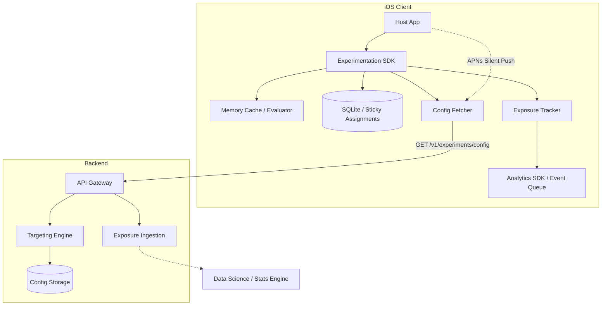

# Design a Mobile A/B Testing & Experimentation SDK

## Overview
Designing an A/B testing and remote configuration SDK involves building a low-latency, deterministic evaluation engine that allows product teams to remotely toggle features and assign users to experiments without requiring app updates. This is frequently asked at FAANG companies because it tests caching strategies, deterministic hashing, concurrency, and minimizing main-thread blocking during app launch.

## Target Companies & Frequency
| Company | Why They Ask | Frequency |
| :--- | :--- | :--- |
| Google / Meta | Experimentation is fundamental to growth and product rollouts. | ★★★★★ |
| Uber / Airbnb | Heavily rely on feature flags and kill switches for daily ops. | ★★★★☆ |
| Spotify | Uses experimentation for nearly every UI and algorithm change. | ★★★★☆ |

## Scope Definition

### In Scope
- Deterministic bucketing and user assignment (MurmurHash3)
- Remote config fetching, caching, and TTL management
- Exposure event tracking for statistical significance
- Local targeting rule evaluation (e.g., country, app version)
- Kill switch architecture via push notifications

### Out of Scope
- Backend experiment statistical analysis (t-tests, p-values)
- UI for the A/B testing dashboard/console
- Real-time multiplayer synchronization
- SDK for web platforms

## Requirements

### Functional Requirements
1. **Feature Flags & Config:** Evaluate boolean feature flags and typed configuration variables instantly.
2. **Deterministic Assignment:** A user must consistently see the same experiment variant across sessions to prevent "flicker".
3. **Exposure Tracking:** Record exactly one exposure event per session when a user encounters a feature flag.
4. **Targeting:** Evaluate audience targeting rules locally (e.g., `appVersion >= 5.0`).
5. **Kill Switch:** Disable broken features globally within 5 minutes.

### Non-Functional Requirements
| Requirement | Target | Source |
| :--- | :--- | :--- |
| Flag Evaluation Time | < 1µs | In-memory dictionary lookup |
| Min Fetch Interval | 1 Hour | Firebase Remote Config |
| Background Fetch Timeout | 2s max | Standard SLA |
| Kill Switch SLA | < 5 mins to 95% of DAU | Uber/Airbnb Targets |
| Config Payload Size | 5KB - 50KB | 100-200 active experiments |

## High-Level Architecture (HLD)

### Component Diagram



### Component Responsibilities
| Component | Responsibility | iOS Implementation |
| :--- | :--- | :--- |
| **Config Fetcher** | Fetches the latest rules JSON from the server. Respects TTL and HTTP ETag cache. | `URLSession` background tasks. |
| **Memory Cache / Evaluator** | Stores configs in memory and evaluates rules instantly. | `Dictionary` wrapped in an actor or lock. |
| **Deterministic Assigner** | Assigns users to buckets. | MurmurHash3 hashing function. |
| **Sticky Storage** | Remembers user bucket assignments to prevent contamination. | SQLite or UserDefaults. |
| **Exposure Tracker** | Records when a user is exposed to a variant. | In-memory `Set` for deduplication, sends to Analytics. |

### Data Flow
1. **App Launch**: SDK initializes, loads cached configs and sticky assignments from SQLite into memory.
2. **Config Fetch**: If TTL expired (e.g., > 1 hour), SDK makes an async call to fetch new configs. If successful, updates SQLite and memory.
3. **Flag Evaluation**: App calls `isEnabled(.newCheckout)`. Evaluator checks local rules. If valid, computes deterministic bucket, returns variant.
4. **Exposure**: Evaluator triggers an exposure event. Exposure Tracker deduplicates and passes to Analytics queue.
5. **Kill Switch**: APNs silent push arrives -> bypass TTL -> fetch new config -> update memory -> UI reacts (via observables).

## Data Models

### Core Entities

```swift
import Foundation

struct ExperimentConfig: Codable {
    let experimentId: String
    let targetingRules: [TargetingRule]
    let buckets: [BucketAllocation]
}

struct BucketAllocation: Codable {
    let rangeStart: Int  // 0 to 9999 (basis points)
    let rangeEnd: Int
    let variant: String  // "control", "treatment_a"
}

struct TargetingRule: Codable {
    let attribute: String // e.g., "appVersion", "country"
    let operatorType: String // e.g., ">=", "IN", "=="
    let value: String
}
```

### Database Schema

```sql
CREATE TABLE sticky_assignments (
    experiment_id TEXT PRIMARY KEY,
    variant TEXT NOT NULL,
    assigned_at REAL NOT NULL
);

CREATE TABLE cached_config (
    key TEXT PRIMARY KEY,
    payload BLOB NOT NULL,
    version_etag TEXT,
    fetched_at REAL NOT NULL
);
```

## API Design

### Endpoints

**1. Fetch Configuration**
- **Method & Path**: `GET /v1/experiments/config`
- **Headers**: `If-None-Match: <etag_version>`
- **Query Params**: `userId=123`, `platform=ios`, `appVersion=5.1`, `locale=en_US`
- **Response (200 OK)**:
```json
{
  "version": "v1abc_992",
  "remoteConfig": {
    "checkout_timeout_seconds": 45
  },
  "experiments": [
    {
      "experimentId": "checkout_v2",
      "buckets": [
        {"rangeStart": 0, "rangeEnd": 4999, "variant": "control"},
        {"rangeStart": 5000, "rangeEnd": 9999, "variant": "treatment"}
      ]
    }
  ]
}
```
- **Response (304 Not Modified)**: If ETag matches, return 304 (empty body) to save bandwidth.

### Pagination Strategy
Not applicable. The config payload is typically small (10-50KB) and downloaded as a single monolithic JSON blob to ensure consistency across flags.

## Client Architecture Deep-Dives

### Deterministic Bucketing (No Flicker)
To avoid jarring user experiences and statistical contamination, bucketing must be deterministic and localized. We use a hashing function (like MurmurHash3) to map a user to a bucket `[0, 9999]`.

```swift
class DeterministicBucketAssigner {
    
    /// Assigns a user to a bucket between 0 and 9999
    func getBucket(userId: String, experimentId: String) -> Int {
        // Concatenate inputs to ensure unique hashing per experiment
        let hashInput = "\(experimentId):\(userId)"
        
        // Use a fast, non-cryptographic hash (e.g., MurmurHash3)
        let hashValue = murmur3_32(hashInput)
        
        // Modulo 10000 gives basis points (0.01% resolution)
        return Int(hashValue % 10000)
    }
    
    func variant(for experiment: ExperimentConfig, userId: String) -> String {
        let bucket = getBucket(userId: userId, experimentId: experiment.experimentId)
        
        // Find which range the bucket falls into
        for allocation in experiment.buckets {
            if bucket >= allocation.rangeStart && bucket <= allocation.rangeEnd {
                return allocation.variant
            }
        }
        return "control" // Fallback
    }
}
```

### Exposure Tracking & Deduplication
For data scientists to calculate significance, they need to know *exactly* when a user saw a variant. We only fire the exposure event once per session to save bandwidth.

```swift
actor ExposureTracker {
    private var exposedExperiments: Set<String> = []
    
    func recordExposure(experimentId: String, variant: String) {
        // Deduplicate per session
        guard !exposedExperiments.contains(experimentId) else { return }
        
        exposedExperiments.insert(experimentId)
        
        let exposureEvent = AnalyticsEvent(
            name: "experiment_exposed",
            properties: [
                "experiment_id": experimentId,
                "variant": variant,
                "timestamp": Date().timeIntervalSince1970
            ]
        )
        
        // Dispatch to centralized analytics SDK for batching
        AnalyticsSDK.shared.logEvent(exposureEvent)
    }
}
```

### Config Fetch & Cache Architecture
The SDK should NEVER block the main thread waiting for a network fetch. It always serves the best available cached data immediately.

```swift
actor ConfigStore {
    private var inMemoryConfig: [String: Any] = [:]
    private var lastFetchTime: Date = .distantPast
    private let minFetchInterval: TimeInterval = 3600 // 1 hour
    
    func getValue<T>(forKey key: String, fallback: T) -> T {
        // Instant memory lookup. Zero network calls in the hot path.
        return (inMemoryConfig[key] as? T) ?? fallback
    }
    
    func fetchLatestConfig(forceRefresh: Bool = false) async {
        let now = Date()
        if !forceRefresh && now.timeIntervalSince(lastFetchTime) < minFetchInterval {
            return // Respect TTL
        }
        
        do {
            // URLSession with timeout
            var request = URLRequest(url: URL(string: "https://api.com/v1/config")!)
            request.timeoutInterval = 2.0 // Don't hang indefinitely
            
            let (data, response) = try await URLSession.shared.data(for: request)
            if let httpResponse = response as? HTTPURLResponse, httpResponse.statusCode == 200 {
                let parsed = try JSONDecoder().decode(ConfigPayload.self, from: data)
                self.inMemoryConfig = parsed.remoteConfig
                self.lastFetchTime = now
                // Persist to SQLite...
            }
        } catch {
            // Fails silently, continues using cached values
        }
    }
}
```

## Performance & Optimizations
| Optimization | Technique | Benchmark/Impact |
| :--- | :--- | :--- |
| **In-Memory Reads** | Serve all `isEnabled` queries from memory. | < 1µs resolution |
| **ETag Caching** | Send `If-None-Match` on config fetches. | 304 responses save 90% bandwidth |
| **Deduplicated Exposures** | `Set<String>` tracks exposures per session. | Massive reduction in analytics event volume |
| **Non-blocking Cold Start** | Fetch new config asynchronously in background. | Zero impact on app launch time |

## Failure Modes & Fallbacks
| Failure Scenario | Detection | Fallback Strategy |
| :--- | :--- | :--- |
| **Server Outage** | 5xx errors or timeouts. | Serve stale cached config indefinitely. |
| **Empty/Corrupt Payload** | JSON decoding fails. | Keep existing cache, don't overwrite with bad data. |
| **Catastrophic Feature Bug** | Feature flag causes 100% crash rate. | APNs silent push triggers emergency config fetch (Kill Switch). |

## Trade-off Analysis
| Decision | Option A | Option B | Chosen | Why |
| :--- | :--- | :--- | :--- | :--- |
| **Bucketing Location** | Server-side API assignment | Client-side Hash Assignment | Client-side | Server assignment requires synchronous network calls blocking UI rendering. Client hashing is instant. |
| **Targeting Evaluation** | Evaluated on Server | Evaluated Locally | Locally | Allows config to be heavily cached via CDN, while client injects its context (OS, app version) locally. |
| **Exposure Triggering** | On App Launch | On First UI Render | UI Render | Firing on launch causes "false exposures" (user never navigated to the screen). Rendering triggers accurate data. |

## Observability & Metrics
- **Fetch Success Rate**: % of `/config` fetches resulting in 200/304 vs errors.
- **Cache Hit Ratio**: % of flag evaluations served from cache vs default fallbacks.
- **Kill Switch Latency**: P90 time from kill switch deployment to client acknowledgement.
- **Exposure Volume**: Total exposure events ingested per minute.

## Production Benchmarks Reference
| Metric | Value | Source |
| :--- | :--- | :--- |
| Concurrent Experiments | 1000+ | Airbnb Engineering Blog (2020) |
| Min Fetch Interval | 1 hour | Firebase Remote Config Docs |
| Hashing Distribution | Uniform across 1B users | Murmur3 specification |
| Flag Evaluation Time | < 1µs | In-memory Swift Dictionary |
| Config Payload | 5-50KB JSON | Typical SaaS experimentation platforms |

## Interview Tips
- **CRITICAL**: Understand the difference between assigning a user to a bucket and logging an exposure. An assigned user might never actually navigate to the screen with the feature.
- **Flicker**: Emphasize that evaluating configs synchronously over the network causes UI flicker. Everything must be evaluated from local memory synchronously.
- **Survivorship Bias**: New experiments should pre-assign existing users to control for a short period to avoid skewing data with veteran power-users vs new installs.
- **Sticky Assignments**: If the config changes mid-experiment (e.g., from 50/50 to 90/10), users who were already exposed to variant A must *stay* in variant A, or the statistical results will be heavily contaminated.
