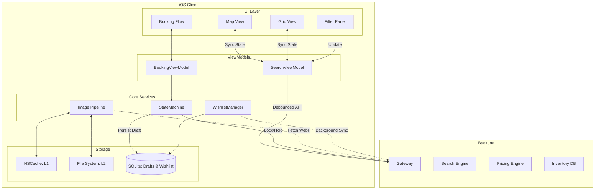

# Design Airbnb Search & Property Booking Engine

## Overview
Designing an app like Airbnb involves creating a highly synchronized Map-to-Grid search experience, handling complex client-side filtering, optimizing a heavy image pipeline, and managing a robust multi-step booking state machine. This problem tests a candidate's ability to sync UI state across complex view hierarchies, manage performance with high-density images, and handle critical transaction states (payments and inventory holds).

## Target Companies & Frequency
| Company | Why They Ask | Frequency |
| :--- | :--- | :--- |
| Airbnb | Core application functionality; UI sync is critical. | ★★★★★ |
| Booking.com | Similar map/search grid and booking engine. | ★★★★★ |
| Expedia / Hotels.com | Core product offering. | ★★★★☆ |
| Zillow / Redfin | Heavy map-to-grid synchronization requirements. | ★★★★☆ |
| Uber (Ride Selection) | State machine and pricing engine similarities. | ★★★☆☆ |

## Scope Definition

### In Scope
- Synchronized Map and Grid search architecture.
- Client-side and Server-side filtering + debouncing.
- High-density image loading pipeline with blurhash placeholders.
- Multi-step booking state machine (drafts, holds, price calculation).
- Wishlist offline mutations.
- Availability calendar rendering.

### Out of Scope
- Host-side listing creation flow.
- Internal messaging system between host and guest.
- Identity verification (Passport/ID scan).
- Detailed payment gateway integration (Stripe/Braintree internals).

## Requirements

### Functional Requirements
1. **Search**: Users can pan a map and see a synchronized list of properties updating dynamically.
2. **Filtering**: Users can apply filters (price, amenities) that apply instantly to visible results.
3. **Booking Flow**: A robust, multi-step checkout process that holds inventory.
4. **Wishlist**: Users can save properties to a wishlist, even offline.
5. **Images**: Fast, memory-efficient loading of property photos.

### Non-Functional Requirements
| Requirement | Target | Source |
| :--- | :--- | :--- |
| Map Debounce Time | ~800ms after pan | Airbnb observation |
| Image Render Time | < 100ms per cell | Standard UI goals |
| Memory Footprint | < 150MB active RAM | iOS limitations |
| Filter Application | < 100ms (perceived) | Local caching goals |
| Inventory Hold Time | 15 minutes | OTA Industry Standard |

## High-Level Architecture (HLD)

### Component Diagram



### Component Responsibilities
| Component | Responsibility | iOS Implementation |
| :--- | :--- | :--- |
| SearchViewModel | Single Source of Truth for Map and Grid. | `ObservableObject` / `@Published` |
| Image Pipeline | Downsamples, caches, and decodes images. | Custom class wrapping `URLSession` + `CGImageSource` |
| BookingViewModel| Manages step transitions and pricing checks. | `ObservableObject` |
| WishlistManager | Handles optimistic UI updates and offline queue. | `actor` with SQLite |
| Database | Stores booking drafts and offline wishlist actions. | `GRDB` or CoreData |

### Data Flow
**Synchronized Search Flow:**
1. User pans the `MKMapView`.
2. `mapView(_:regionDidChangeAnimated:)` fires.
3. `SearchViewModel` debounces input for 800ms.
4. Triggers `GET /v1/listings?bounds=...`.
5. Response is parsed; `listings` array is updated.
6. Map renders new clustered annotations.
7. Grid reloads data using `DiffableDataSource` to animate changes.
8. Images are prefetched via `UICollectionViewDataSourcePrefetching`.

## Data Models

### Core Entities

```swift
import Foundation
import CoreLocation

struct Listing: Identifiable, Hashable {
    let id: String
    let coordinate: CLLocationCoordinate2D
    let title: String
    let pricePerNight: Int
    let currency: String
    let rating: Double
    let thumbnailUrl: URL
    let blurhash: String
    let amenities: [String]
}

struct SearchFilter: Equatable {
    var checkIn: Date?
    var checkOut: Date?
    var guests: Int = 1
    var maxPrice: Int?
    var amenities: Set<String> = []
}

struct BookingDraft: Codable {
    let id: UUID
    let listingId: String
    var checkIn: Date
    var checkOut: Date
    var guestCount: Int
    var currentStep: BookingStep
    var holdToken: String?
    
    enum BookingStep: String, Codable {
        case dateSelection, guests, review, payment
    }
}
```

### Database Schema
```sql
CREATE TABLE booking_drafts (
    id TEXT PRIMARY KEY,
    listing_id TEXT NOT NULL,
    check_in INTEGER NOT NULL,
    check_out INTEGER NOT NULL,
    guest_count INTEGER NOT NULL,
    step TEXT NOT NULL,
    hold_token TEXT,
    updated_at INTEGER NOT NULL
);

CREATE TABLE pending_wishlist_actions (
    listing_id TEXT PRIMARY KEY,
    action TEXT CHECK(action IN ('add', 'remove')) NOT NULL,
    timestamp INTEGER NOT NULL
);
```

## API Design

### Endpoints

**1. Map Bound Search**
- **Method**: `GET`
- **Path**: `/v1/listings`
- **Query Params**: `ne_lat, ne_lng, sw_lat, sw_lng, check_in, check_out, guests`
- **Response**: Array of Listing objects.

**2. Price Calculation**
- **Method**: `POST`
- **Path**: `/v1/listings/{id}/price`
- **Body**: `{"check_in": "2024-05-01", "check_out": "2024-05-05", "guests": 2}`
- **Response**: 
```json
{
  "nightly_rate": 150,
  "nights": 4,
  "cleaning_fee": 50,
  "service_fee": 30,
  "taxes": 45,
  "total": 725
}
```

**3. Inventory Hold**
- **Method**: `POST`
- **Path**: `/v1/bookings/hold`
- **Response**: `{"hold_token": "abc-123", "expires_at": "2024-05-01T12:15:00Z"}`

## Client Architecture Deep-Dives

### 1. Synchronized Map + Grid Architecture
The Map and Grid must share a single `SearchViewModel`. If a user taps a map pin, the grid must scroll to that listing. If the user scrolls the grid, the map must pan to center the visible listings.

```swift
class SearchViewModel: ObservableObject {
    @Published var listings: [Listing] = []
    @Published var selectedListingId: String? // Drives map selection and grid scroll
    @Published var visibleMapRect: MKMapRect = .world // Driven by map pans
    
    private var searchTask: Task<Void, Never>?
    
    func mapRegionDidChange(to rect: MKMapRect) {
        self.visibleMapRect = rect
        debounceSearch(rect: rect)
    }
    
    private func debounceSearch(rect: MKMapRect) {
        searchTask?.cancel()
        searchTask = Task {
            try? await Task.sleep(nanoseconds: 800_000_000) // 800ms debounce
            guard !Task.isCancelled else { return }
            await fetchListings(for: rect)
        }
    }
    
    func userTappedListingOnMap(id: String) {
        selectedListingId = id // Grid observes this and scrolls to index
    }
}
```
*Map Clustering*: Use `MKClusterAnnotation`. When zoomed out, group markers within a 50pt radius to avoid UI clutter.

### 2. High-Density Image Pipeline
An Airbnb grid shows 16+ images simultaneously. Downloading full-resolution JPEGs will cause OOM crashes.
1. **Format**: Server serves WebP format (smaller size).
2. **Placeholder**: Use `blurhash` strings provided in the JSON payload to render a blurry color block instantly (1ms decode time).
3. **Downsampling**: Decode the image at exactly the cell size using `CGImageSourceCreateThumbnailAtIndex`.
4. **Caching**: Memory cache for decoded bitmaps (L1), Disk cache for raw WebP data (L2).

```swift
func downsample(imageAt imageURL: URL, to pointSize: CGSize, scale: CGFloat) -> UIImage? {
    let imageSourceOptions = [kCGImageSourceShouldCache: false] as CFDictionary
    guard let imageSource = CGImageSourceCreateWithURL(imageURL as CFURL, imageSourceOptions) else { return nil }
    
    let maxDimensionInPixels = max(pointSize.width, pointSize.height) * scale
    let downsampleOptions = [
        kCGImageSourceCreateThumbnailFromImageAlways: true,
        kCGImageSourceShouldCacheImmediately: true,
        kCGImageSourceCreateThumbnailWithTransform: true,
        kCGImageSourceThumbnailMaxPixelSize: maxDimensionInPixels
    ] as CFDictionary
    
    guard let downsampledImage = CGImageSourceCreateThumbnailAtIndex(imageSource, 0, downsampleOptions) else { return nil }
    return UIImage(cgImage: downsampledImage)
}
```

### 3. Multi-Step Booking State Machine
Booking involves steps. If the app crashes, the user shouldn't lose their dates. 
- State is saved to `booking_drafts` SQLite table on every step transition.
- **Price Calculation MUST be server-side**. Never calculate taxes/fees on the client.
- **Soft Hold**: Before moving to the payment screen, call `/v1/bookings/hold` to lock the inventory for 15 minutes. This prevents two users from booking the same exact dates while one is entering credit card details.

### 4. Wishlist & Offline Mutations
Users often browse Airbnb on planes or in spotty reception.
When adding to a wishlist:
1. Update SQLite `pending_wishlist_actions`.
2. Update UI (optimistic red heart).
3. Trigger background API call.
4. If successful, remove from `pending` table.
5. If network fails, leave in `pending` table.
`NWPathMonitor` listens for network restoration and syncs pending actions.

## Performance & Optimizations
| Optimization | Technique | Benchmark/Impact |
| :--- | :--- | :--- |
| Map Debouncing | 800ms delay on API call | Reduces API load by ~80% |
| Blurhash | Base64 decode to placeholder | 0 network latency perceived |
| Image Downsampling| `CGImageSource` thumbnailing | RAM per image drops 5MB → 500KB |
| ETag Caching | Conditional GET requests | Saves bandwidth on repeated map pans |
| Grid Prefetching | `prefetchItemsAt` | Prevents scroll stutter |

## Failure Modes & Fallbacks
| Failure Scenario | Detection | Fallback Strategy |
| :--- | :--- | :--- |
| Hold Expired | API returns 409 Conflict | Show "Dates no longer available" alert, reset to date selection. |
| Pricing API Fails | HTTP 500 | Retry 3 times. If fails, disable "Book" button. |
| OOM Memory Warn | `UIApplication.didReceiveMemoryWarning` | Clear L1 image NSCache entirely. |
| Network Loss | `NWPathMonitor` drops | Serve map results from cached ETag data if available. |

## Trade-off Analysis
| Decision | Option A | Option B | Chosen | Why |
| :--- | :--- | :--- | :--- | :--- |
| Map Search Trigger | On pan start/move | On pan end (Debounced) | On pan end | Calling API on every frame of a pan DDoSes the backend. |
| Pricing Logic | Client-side math | Server-side calculation | Server-side | Pricing rules, dynamic taxes, and host fees change constantly. Client must be dumb. |
| Image Format | JPEG | WebP | WebP | 30% smaller file sizes, native support in iOS 14+. |

## Observability & Metrics
- **Search Latency (P95)**: Map debounce to full listing render time.
- **Booking Funnel Drop-off**: Track conversion rates between `date_selection` → `checkout` → `payment`.
- **OOM Crash Rate**: High OOMs indicate the image pipeline is holding too many bitmaps in memory.
- **Wishlist Sync Success**: Percentage of offline wishlist actions that successfully sync when online.
- **Hold Expiry Rate**: How often users abandon the payment screen after holding inventory.

## Production Benchmarks Reference
| Metric | Real World Number | Source |
| :--- | :--- | :--- |
| API Payload Size | ~100KB compressed | Airbnb search results |
| Booking Hold Time | 15 Minutes | Industry standard (Airbnb/Booking) |
| Map Debounce | ~800ms | App behavior reverse engineering |
| Blurhash String | ~20-30 characters | Blurhash specs |

## Interview Tips
- **Single Source of Truth**: Emphasize that Map and Grid share the *exact same* View Model. If they have separate state, syncing them becomes a nightmare.
- **Server-Side Pricing**: If an interviewer asks how you calculate taxes, immediately say "I don't. The server does." This is a huge senior signal.
- **Image Memory**: Understand the difference between compressed image size (network KB) and decoded bitmap size (RAM MB). Downsampling prevents memory explosions.
- **Booking Hold**: Mentioning the 15-minute inventory lock before taking payment shows deep e-commerce domain knowledge.
