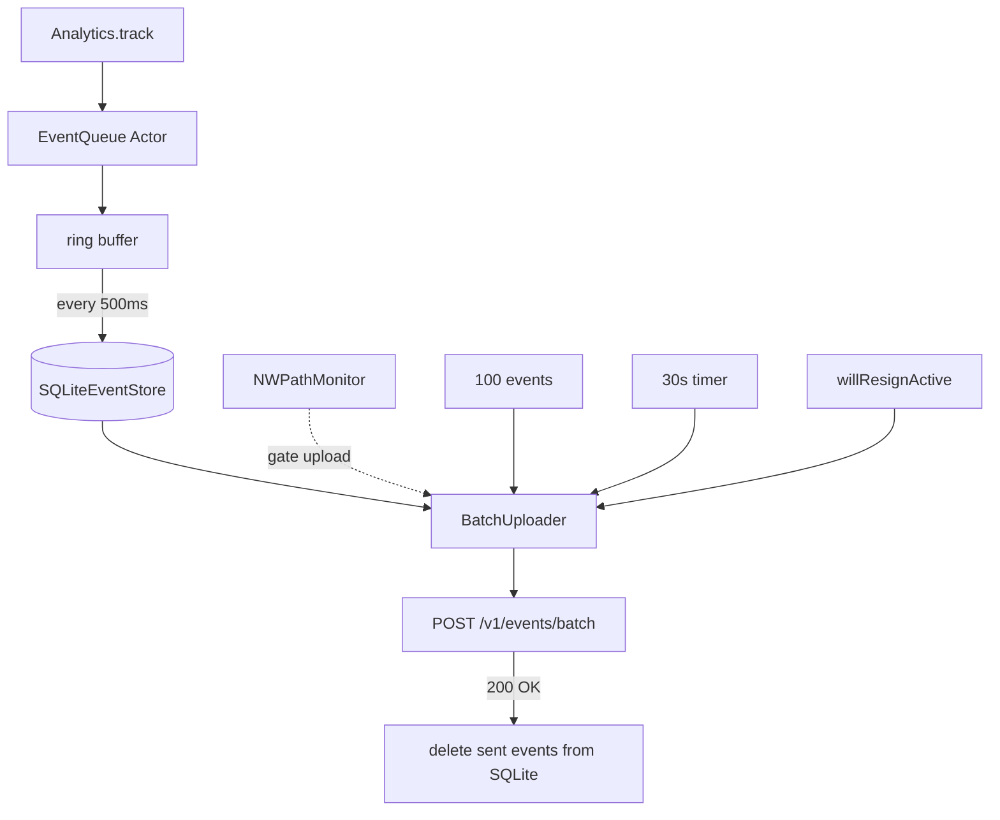

<[Problem Title]>
# Mobile Analytics & Telemetry SDK

> Reference status: client architecture study material. Embedded code and payloads are incomplete design sketches, not verified production implementations or records from the named products. Do not quote remaining numeric tuning choices as employer benchmarks. For backend preparation, start with the [backend guide](backend-engineering-manager-guide.md) and [evidence standard](evidence-and-sources.md).


## Overview
Designing a mobile analytics SDK (like Firebase Analytics, Amplitude, or Mixpanel) is a heavy infrastructure and platform question. The focus is entirely on thread safety, persistent storage, batching, minimizing battery/network impact, and ensuring zero main-thread block time. The SDK must be completely invisible to the host app's performance.

## Scope Definition

### In Scope
- Thread-safe event ingestion (non-blocking).
- Persistent local storage of events (SQLite).
- Batch uploading with compression (GZIP).
- Retry mechanisms and exponential backoff.
- Network condition and battery state awareness.
- Session management.
- Dynamic sampling configurations from the server.

### Out of Scope
- UI event auto-tracking (swizzling views).
- Backend data lake architecture (Kafka/Hadoop).
- Dashboard visualization.
- Crash reporting (e.g., symbolication, stack traces).

## Requirements

### Functional Requirements
1. **Ingest Events**: Accept arbitrary JSON properties attached to an event name.
2. **Persist Events**: Save events locally so they survive app crashes or terminations.
3. **Batch and Upload**: Send events in batches to save network overhead.
4. **Retry**: If upload fails, keep events and retry later.

### Non-Functional Requirements

Define and measure these dimensions for the actual workload; values require evidence under [the evidence standard](evidence-and-sources.md):

- Main Thread Block Time
- Battery Impact
- Network Usage
- Max Local Storage
- Batch Size


## Worked learning walkthrough: An upload response is lost

**Failure drill:** The server accepts an event batch, but the app dies before deleting its local rows. This is a proposed design walkthrough.

1. Persist event identities and payloads before claiming durable acceptance. Best-effort in-memory collection has a different loss contract.
2. Upload a bounded batch with stable event identities. The server defines whether its acknowledgement covers durable ingestion or only receipt.
3. Delete acknowledged rows transactionally. After restart, replay the remaining rows and deduplicate at the defined destination boundary.

**Why the obvious answer breaks:** Crash before local deletion creates replay; deleting before server acceptance creates loss. A lifecycle callback cannot close every crash window.

**Answer to rehearse:**

> I would define which events may be dropped under disk pressure and which require durable acceptance. Actor isolation protects shared state but does not persist it or remove suspension races automatically.

## High-Level Architecture (HLD)

### Component Diagram
```ascii
+-------------------+       +--------------------+       +-------------------+
|                   |       |                    |       |                   |
|    Host App       | ----> | AnalyticsManager   | ----> |   Ring Buffer     |
|   (Any Thread)    |       |   (Singleton)      |       |   (Memory Queue)  |
|                   |       |                    |       |                   |
+-------------------+       +--------------------+       +-------------------+
                                                                   |
                                                             Background Flush
                                                               (Every 500ms)
                                                                   |
                                                                   v
                            +--------------------+       +-------------------+
                            |                    |       |                   |
                            |   BatchUploader    | <---- |   SQLite Store    |
                            |   (NetworkLayer)   |       |   (Persistence)   |
                            |                    |       |                   |
                            +--------------------+       +-------------------+
                                     |
                             Upload (GZIP, POST)
                                     |
                                     v
                            +--------------------+
                            |                    |
                            |  Analytics Server  |
                            |                    |
                            +--------------------+
```

### Component Responsibilities
| Component | Responsibility | iOS Implementation |
| :--- | :--- | :--- |
| AnalyticsManager | Public API surface, handles fast ingestion | Swift Actor or Serial Dispatch Queue |
| Ring Buffer | Holds events in memory temporarily to return instantly to caller | Fixed-size Array or Queue |
| SQLite Store | Safely stores events on disk | SQLite3 C-API or GRDB |
| BatchUploader | Reads events from DB, POSTs them, deletes on success | URLSession background tasks |
| EnvironmentMonitor| Listens for reachability, battery mode, and app lifecycle | NWPathMonitor, ProcessInfo |

### Data Flow
1. App calls `Analytics.shared.track("button_tap", props: ["id": 1])` from *any* thread.
2. `AnalyticsManager` immediately appends the event to a lock-free memory structure (Ring Buffer) and returns.
3. A background timer (every 500ms) or size threshold (100 items) flushes the Ring Buffer to `SQLite Store`.
4. The `BatchUploader` triggers a network upload if conditions are met (e.g., 50 events in DB, WiFi connected).
5. Events are converted to JSON, GZIP compressed, and POSTed.
6. Upon HTTP 200 OK, the successfully uploaded events are deleted from the `SQLite Store`.

## Data Models

### Core Entities
```swift
import Foundation

struct AnalyticsEvent: Codable {
    let id: String           // UUID
    let name: String         // e.g., "checkout_completed"
    let properties: Data?    // JSON encoded payload
    let timestamp: TimeInterval // UNIX epoch
    let sessionId: String
    
    init(name: String, properties: [String: Any]?) {
        self.id = UUID().uuidString
        self.name = name
        self.timestamp = Date().timeIntervalSince1970
        self.sessionId = SessionManager.shared.currentSessionId
        
        if let props = properties {
            self.properties = try? JSONSerialization.data(withJSONObject: props)
        } else {
            self.properties = nil
        }
    }
}
```

### Database Schema
```sql
CREATE TABLE IF NOT EXISTS events (
    id TEXT PRIMARY KEY,
    name TEXT NOT NULL,
    properties BLOB,
    timestamp REAL NOT NULL,
    session_id TEXT NOT NULL,
    retry_count INTEGER DEFAULT 0
);

-- Index for efficient batch querying
CREATE INDEX idx_timestamp ON events(timestamp ASC);
```

## API Design

### Endpoints

**POST /v1/events/batch**
- **Headers**:
  - `Content-Type`: `application/json`
  - `Content-Encoding`: `gzip`
  - `Authorization`: `Bearer {sdk_api_key}`
- **Request Body (Uncompressed Example)**:
```json
{
  "device_info": { "os": "iOS 17.0", "model": "iPhone 15 Pro" },
  "events": [
    {
      "id": "abc-123",
      "name": "login_success",
      "timestamp": 1700000000.0,
      "properties": { "method": "apple_id" }
    }
  ]
}
```
- **Response**: `200 OK` (Indicates SDK can delete these events locally).

## Client Architecture Deep-Dives

### Event collection and durable acceptance
Actor isolation serializes access; it is not a lock-free algorithm or a guarantee of zero blocking. Define whether track acknowledges an in-memory best-effort event or durable storage. Bound producer and storage queues. For durable acceptance, persist successfully before removing the pending event from memory, propagate failures, and serialize or version the flush state across await points. Detached inserts after clearing the buffer can lose events if insertion fails or the process exits.

### [Subsystem 2 - Persistent Storage & App Lifecycle]
Memory is volatile. If the app crashes, items in the buffer are lost. We hook into `UIApplication.willResignActiveNotification` to request a bounded flush opportunity. Lifecycle callbacks do not guarantee a final durable write before termination; persist earlier when durability is required.

```swift
import UIKit

extension Analytics {
    func setupLifecycleObservers() {
        NotificationCenter.default.addObserver(forName: UIApplication.willResignActiveNotification, object: nil, queue: nil) { [weak self] _ in
            guard let self = self else { return }
            
            // Force flush immediately on backgrounding
            Task {
                await self.queue.flushToDisk()
                
                // Optionally trigger a background task to upload
                await self.triggerBackgroundUpload()
            }
        }
    }
    
    private func triggerBackgroundUpload() async {
        // Begin UIBackgroundTaskIdentifier to get ~30s of execution time from OS
        var backgroundTask: UIBackgroundTaskIdentifier = .invalid
        backgroundTask = UIApplication.shared.beginBackgroundTask {
            UIApplication.shared.endBackgroundTask(backgroundTask)
        }
        
        await BatchUploader.shared.uploadPendingEvents()
        
        UIApplication.shared.endBackgroundTask(backgroundTask)
    }
}
```

### [Subsystem 3 - Network & Battery Awareness]
Radios consume massive battery power when powering up. We should batch uploads, and alter our behavior based on the environment.

```swift
import Network

class EnvironmentMonitor {
    static let shared = EnvironmentMonitor()
    let monitor = NWPathMonitor()
    
    var isLowDataMode: Bool = false
    var isLowPowerMode: Bool {
        return ProcessInfo.processInfo.isLowPowerModeEnabled
    }
    
    func startMonitoring() {
        monitor.pathUpdateHandler = { path in
            self.isLowDataMode = path.isConstrained
        }
        monitor.start(queue: DispatchQueue.global(qos: .background))
    }
    
    func shouldUpload() -> Bool {
        // Don't upload telemetry if the user is in Low Data Mode (cellular constrained)
        if isLowDataMode { return false }
        
        // If low power mode, be more aggressive about holding batches (e.g. require 500 events instead of 50)
        return true
    }
}
```

## Performance & Optimizations

| Decision | Mechanism | What to verify |
| :--- | :--- | :--- |
| Batch persistence | Commit bounded groups of event records | Measure write duration, acceptance loss and replay behavior |
| Compression | Compress sufficiently large permitted batches | Compare transferred bytes with CPU/energy overhead |
| Bounded collection | Separate best-effort from durable acceptance | Measure queue pressure, dropped events by policy and app responsiveness |

## Failure Modes & Fallbacks
| Failure Scenario | Detection | Fallback Strategy |
| :--- | :--- | :--- |
| API Rejects Payload (400)| HTTP Status Code | Drop the batch permanently to prevent infinite loops (malformed data). |
| Network Timeout (500)| HTTP Status / `URLError` | Keep events in SQLite, increment `retry_count`, use exponential backoff. |
| Database Corruption | SQLite throws fatal error | Delete the SQLite file entirely and recreate it. Data loss is acceptable for telemetry over a crash. |
| Disk Space Full | DB write fails | Drop events. Do not crash the host app. |

## Trade-off Analysis
| Decision | Option A | Option B | Chosen | Why |
| :--- | :--- | :--- | :--- | :--- |
| Memory Queue | `DispatchQueue.sync` | Swift `Actor` | Swift `Actor` | `DispatchQueue.sync` on a singleton can easily cause deadlocks in complex apps. Actors provide safe, non-blocking asynchronous access. |
| Persistence | CoreData | SQLite C-API / GRDB | SQLite / GRDB | CoreData has huge memory overhead and context merging complexities. Analytics requires raw, fast, append-only logs. |
| Upload Trigger | Every Event | Batched | Batched | Turning on the cellular radio for every single event drains the battery massively. Batching is strictly required by Apple guidelines. |

## Observability & Metrics
- **SDK Crash Rate**: Must be strictly 0.00%. The host app will uninstall the SDK if it causes crashes.
- **Delivery Rate**: Events created vs Events received by server. Target > 98%.
- **Average Payload Size**: Monitor to ensure GZIP is effective.
- **DB Size on Disk**: Monitor 99th percentile to ensure cleanup logic is working and we aren't eating gigabytes of user storage.

## Measurement and evidence

Use [the evidence standard](evidence-and-sources.md) for published limits and measurement methods. The previous benchmark table lacked traceable support and has been removed. Establish workload, device or server configuration, metric denominator and observation window before setting targets.

## Interview Tips
- **Zero Impact Rule**: Stress heavily that an Analytics SDK is a guest in the host app. It must NEVER block the main thread and NEVER crash the host app.
- **Fail Gracefully**: If the database is corrupted, delete it and lose the data. Do not crash.
- **GZIP Compression**: Always mention this. It shows senior-level awareness of mobile network constraints.
- **Low Power/Data Mode**: Showing awareness of `isLowPowerModeEnabled` and `NWPathMonitor` (`.isConstrained`) separates staff engineers from seniors.

## Mermaid Architecture Diagram


## Common Mistakes
- Calling `Analytics.track()` and doing disk I/O synchronously (main thread block)
- Not persisting events to disk before crash (event loss)
- Retrying failed batch uploads infinitely (event duplication)
- Not compressing batch payloads (large network requests)
- Uploading on constrained network (user data plan waste)

## Mock Interview Q&A
- **Q: How do you ensure no events are lost if the app crashes mid-batch?**
  **A:** We only delete events from SQLite *after* receiving a 200 OK from the server. If a crash happens mid-upload, the events are still in SQLite and will be retried on next launch.
- **Q: A user is in Low Data Mode. What happens to analytics?**
  **A:** NWPathMonitor detects constrained networks. We halt background uploads and accumulate events in SQLite, waiting for an unconstrained connection.
- **Q: How do you handle 100 events firing simultaneously without blocking the UI?**
  **A:** `Analytics.track()` delegates work asynchronously to an Actor which maintains a pre-allocated ring buffer, avoiding lock contention and main thread blocking.
- **Q: What happens if the SQLite database gets full?**
  **A:** We set a hard limit (e.g., 10MB or 10k events). If reached, we drop the oldest events (FIFO) to prevent consuming all of the user's local storage.
- **Q: How does the SDK behave when the app moves to the background?**
  **A:** We listen to `willResignActive` and immediately flush the ring buffer to disk. We may also request background task time to flush pending events to the network.

## Related Specs
| Spec | Relationship |
| :--- | :--- |
| [Networking Layer](networking-layer.md) | Batch uploads require handling retries, backoff, and network errors gracefully. |
| [Social Feed](social-feed.md) | Impression events from the feed are sent to this analytics SDK for batching. |
