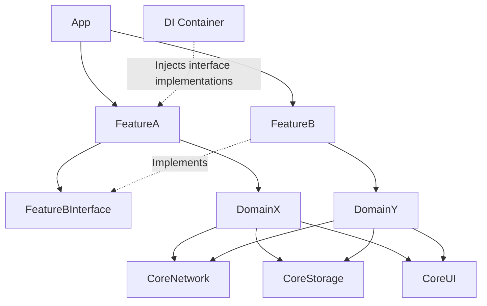

# App Modularization & Dependency Injection System

## Overview
As iOS codebases grow, monolithic architectures lead to slow build times, tight coupling, and merge conflicts. Modularization involves breaking the app into smaller, independent frameworks or packages. This problem is frequently asked for Staff/Senior roles at companies with large codebases, testing a candidate's ability to design scalable project structures, manage dependencies (Dependency Injection), and optimize build performance.

## Target Companies & Frequency
| Company | Why They Ask | Frequency (★ rating) |
| :--- | :--- | :--- |
| Uber | Creators of Needle DI, huge monorepo, 200+ modules. | ★★★★☆ |
| Airbnb | Extensive monorepo, custom tooling, strict modularization. | ★★★★☆ |
| Google | Heavy focus on Bazel, micro-apps, and scalable architecture. | ★★★★☆ |
| Grab | Large Super-app architecture, requires strict isolation. | ★★★☆☆ |
| Any Large Tech | To solve "Xcode is too slow" and "we step on each other's toes." | ★★★☆☆ |

## Scope Definition

### In Scope
- Module hierarchy (App -> Feature -> Domain -> Core)
- Interface vs Implementation modules (Protocol-oriented architecture)
- Dependency Injection (Needle/Factory patterns, preventing singletons)
- Build time optimization and binary size management
- Swift Package Manager (SPM) architecture
- Module testing strategies and mocking

### Out of Scope
- Detailed UI architectural patterns (MVVM/VIPER), focusing instead on structural architecture.
- CI/CD pipeline configuration (e.g., Fastlane scripts).
- Specific Git branching strategies.

## Requirements

### Functional Requirements
1. The architecture must support distinct feature teams working independently without merge conflicts in project files.
2. Feature modules must not have direct dependencies on other feature modules (prevent circular dependencies).
3. Dependencies must be explicitly injected; globally shared state (Singletons) in feature modules should be eliminated.
4. Each module must be independently testable with mocked dependencies.

### Non-Functional Requirements
| Requirement | Target | Source |
| :--- | :--- | :--- |
| Incremental Build Time | < 30s | Developer Velocity Target |
| Framework Overhead | ~500KB - 2MB | Apple / Industry observation |
| Total App Binary Size | < 100MB (compressed) | App Store Over-The-Air Limit |
| Module Count | 100-300+ | Uber / Airbnb Tech Blogs |

## High-Level Architecture (HLD)

### Component Diagram
```text
                  +-------------------+
                  |     App Target    |  (Wiring & Setup)
                  +---------+---------+
                            |
           +----------------+----------------+
           |                                 |
+----------v----------+           +----------v----------+
|  Feature A (Impl)   |           |  Feature B (Impl)   |
| (Depends on Core &  |           | (Depends on Core &  |
|  Feature B Interface|           |  Feature A Interface|
+----------+----------+           +----------+----------+
           |                                 |
+----------v----------+           +----------v----------+
| Feature A Interface |           | Feature B Interface |
|    (Protocols)      |           |    (Protocols)      |
+----------+----------+           +----------+----------+
           |                                 |
           +----------------+----------------+
                            |
                  +---------v---------+
                  |  Core / Utilities | (Network, DB, UI Kit)
                  |    (Foundation)   |
                  +-------------------+
```

### Component Responsibilities
| Component | Responsibility | iOS Implementation |
| :--- | :--- | :--- |
| App Target | Application lifecycle, DI container initialization, module registration. | `AppDelegate`, DI Root |
| Feature Impl | Contains ViewModels, Views, and business logic for a specific domain. | Swift Package Target |
| Feature Interface | Contains public protocols and data models needed by other modules. | Swift Package Target |
| Core Modules | Shared infrastructure (Networking, Logging, Storage, Design System). | Swift Package Target |

### Data Flow (Cross-Module Communication)
1. User interacts with Feature A. Feature A needs to navigate to Feature B.
2. Feature A does NOT import Feature B Implementation. It imports Feature B Interface.
3. Feature A asks the DI Container for an instance conforming to `FeatureBBuildable`.
4. The App Target (which knows about all implementations) has registered Feature B's builder to that protocol.
5. Feature A receives the builder, creates Feature B's view, and navigates.

## Data Models

### Core Entities
```swift
/// Define interfaces in a separate lightweight module (e.g., UserProfileInterface)
public protocol UserProfileProviding {
    func fetchCurrentUser() async throws -> User
}

public struct User: Equatable, Codable {
    public let id: String
    public let name: String
    public init(id: String, name: String) {
        self.id = id; self.name = name
    }
}
```

## API Design
Not strictly applicable for modularization, but modules interact via explicit Swift protocols (interfaces) rather than network endpoints.

## Client Architecture Deep-Dives

### Strict Interface / Implementation Separation
To achieve parallel builds and prevent circular dependencies, features are split into two targets: Interface and Implementation. If Feature A needs Feature B, it only depends on `FeatureBInterface`. Since Interfaces rarely change and contain no logic, they build instantly.

```swift
// Package.swift snippet
.target(name: "CheckoutInterface", dependencies: []),
.target(name: "Checkout", dependencies: [
    "CheckoutInterface", 
    "CartInterface", // Depends on interface, not implementation
    "CoreNetwork"
]),
```

### Dependency Injection (Factory / Needle Pattern)
Instead of relying on Singletons (which hide dependencies and make mocking hard), we use explicit DI. An approach inspired by Uber's Needle uses a protocol-based component tree.

```swift
// --- Core Module ---
public protocol Dependency {}

// --- Checkout Module ---
public protocol CheckoutDependency: Dependency {
    var networkProvider: NetworkProviding { get }
    var cartProvider: CartProviding { get } // Provided by DI, not imported directly
}

open class CheckoutComponent {
    public let dependency: CheckoutDependency
    
    public init(dependency: CheckoutDependency) {
        self.dependency = dependency
    }
    
    // Factory method for the feature's entry point
    public func checkoutViewController() -> UIViewController {
        let viewModel = CheckoutViewModel(
            network: dependency.networkProvider, 
            cart: dependency.cartProvider
        )
        return CheckoutViewController(viewModel: viewModel)
    }
}
```

### Module Registry (App Target Wiring)
The App target acts as the Composition Root. It knows about all implementations and wires them together.

```swift
// --- App Target ---
import Checkout
import Cart
import CoreNetwork

final class AppComponent: CheckoutDependency {
    // Fulfills CheckoutDependency requirements
    var networkProvider: NetworkProviding { NetworkManager.shared }
    var cartProvider: CartProviding { CartManager.shared }
    
    func createCheckoutFeature() -> UIViewController {
        let component = CheckoutComponent(dependency: self)
        return component.checkoutViewController()
    }
}
```

## Performance & Optimizations
| Optimization | Technique | Benchmark/Impact |
| :--- | :--- | :--- |
| Parallel Compilation | Interface/Impl separation | Flattens dependency graph; xcodebuild can compile multiple feature Impls concurrently. |
| Dynamic vs Static | Static linking (mostly) | Reduces app launch time (dyld overhead). Apple recommends < 6 dynamic frameworks. |
| Build Caching | Bazel or Tuist caching | Remote build caches can reduce CI times from 30m to <5m. |
| Asset Catalog Slicing | App Thinning | Deliver only 2x/3x assets to appropriate devices, reducing OTA binary size. |

## Failure Modes & Fallbacks
| Failure Scenario | Detection | Fallback Strategy |
| :--- | :--- | :--- |
| Circular Dependency | Build-time error (SPM/Xcode) | Enforce Interface/Impl pattern. A feature can never depend on another feature's Impl. |
| Missing Dependency | Runtime crash (if using weak DI) | Use strongly-typed DI (like Needle or Constructor Injection) to make missing dependencies compile-time errors. |
| Slow Build Times | Xcode Build Timing Summary | Use `xcodebuild -showBuildTimingSummary`. Break down large modules or optimize macro/type inference usage. |

## Trade-off Analysis
| Decision | Option A | Option B | Chosen | Why |
| :--- | :--- | :--- | :--- | :--- |
| Package Manager | CocoaPods | Swift Package Manager | SPM | Native to Xcode, parallel resolution, no Ruby environment issues, active Apple support. |
| Dependency Injection | Service Locator (Swinject) | Tree-based DI (Needle/Manual) | Tree-based DI | Service locators push errors to runtime. Tree-based DI provides compile-time safety for dependencies. |
| Linking | Dynamic Frameworks | Static Libraries | Static Libraries | Faster app launch time. Dynamic frameworks are only used when sharing code between App and Extensions to save total binary size. |

## Observability & Metrics
- `build_time_seconds`: Tracked in CI and locally via custom tooling. Target incremental < 30s.
- `binary_size_mb`: Tracked on PRs to prevent accidental bloat (e.g., adding large unused assets).
- `dyld_launch_time`: Metric for app cold start, heavily affected by the number of dynamic frameworks.

## Production Benchmarks Reference
| Metric | Value | Source |
| :--- | :--- | :--- |
| Uber iOS Modules | 200+ | Uber Engineering Blog |
| Airbnb iOS Modules | 250+ | Airbnb Tech Blog |
| Incremental Build Target| < 30s | General Developer Velocity Best Practice |
| Dynamic Framework Limit| ~6 (Historically) | WWDC (Optimizing App Startup Time) |

## Interview Tips
- **Understand the "Why":** Modularization isn't just for neatness; it solves concrete scaling problems: build times, merge conflicts, and testability.
- **Explain Interface Separation:** This is the most critical concept. Be able to diagram how Feature A calls Feature B without importing Feature B.
- **Discuss Static vs Dynamic Linking:** Be prepared to explain how linking affects both build time and app launch time (dyld).
- **Avoid Over-Engineering:** Acknowledge that a 5-screen app doesn't need 20 modules. Modularization introduces overhead (module mapping, cross-module boundaries).

## Mermaid Architecture Diagram


## Common Mistakes
- **Circular module dependencies:** Feature A imports Feature B, which imports Feature A. This breaks the build graph and causes compilation failures.
- **Singleton shared state:** Using singletons across module boundaries breaks testability and isolation, making it impossible to run modules independently.
- **Storyboards across modules:** Using Storyboards that reference classes in other modules tightly couples the UI and breaks compile-time safety.
- **No interface modules:** Depending directly on implementation modules instead of interface modules, leading to long, cascaded recompilations when a single implementation detail changes.
- **Monolithic target:** Keeping all modules in one Xcode target defeats the build-time benefits of modularization since Xcode cannot parallelize the work.

## Mock Interview Q&A
- **Q: How do you prevent Feature A from importing Feature B directly?**
  **A:** We use Interface modules. Feature B exposes a lightweight `FeatureBInterface` module containing only protocols and models. Feature A imports `FeatureBInterface`, and the actual implementation is injected at runtime by the App target.
- **Q: Uber has 200+ modules. How do they manage build times?**
  **A:** They use strict interface segregation so implementation changes don't trigger recompilation of dependents. They also use build systems like Bazel or Buck to cache artifacts remotely, so developers only compile the modules they actually changed.
- **Q: How do you test a feature module in isolation when it has dependencies?**
  **A:** Because dependencies are injected via interfaces (protocols), we can create a lightweight test host target that injects mock implementations for all dependencies, allowing the feature to be tested completely in isolation.

## Related Specs
| Spec | Description |
| :--- | :--- |
| [Feature Flag System](feature-flag-system.md) | How to toggle features across different modular boundaries. |
| [E-Commerce Catalog](e-commerce-catalog.md) | Example of a feature module that depends on CoreNetwork. |
| [Design System](design-system.md) | Core UI module implementation details. |
