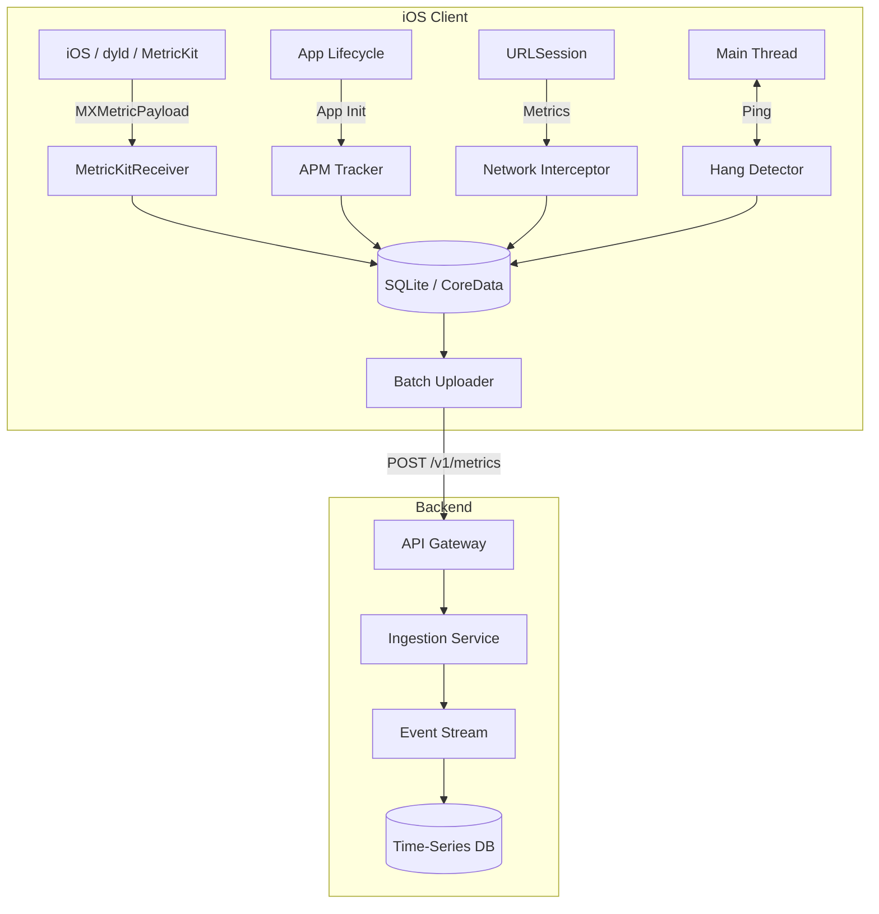

# Design Mobile App Performance Monitoring System (APM)

## Overview
App Performance Monitoring (APM) systems measure, aggregate, and report application performance metrics from real user devices in production. At FAANG-scale companies, even small degradations in performance metrics like cold start time, responsiveness, or network latency can directly impact engagement, user retention, and revenue.

## Target Companies & Frequency
| Company | Why They Ask | Frequency |
| :--- | :--- | :--- |
| Meta | Heavy focus on performance across massive codebases with complex dependency graphs. | ★★★★★ |
| Uber | Critical flow relies on real-time responsiveness and low latency across varying networks. | ★★★★★ |
| Google | Extensive engineering standards; maintaining strict binary size and start time budgets. | ★★★★☆ |
| Airbnb | Focus on smooth scrolling, hitch-free animations, and fast initial paint. | ★★★★☆ |

## Scope Definition

### In Scope
- Cold start performance measurement (pre-main and app init phases).
- Hang and responsiveness tracking (main thread blocking).
- Memory footprint tracking (resident memory, OOM warnings).
- Network performance tracking (latency, payloads, status).
- Integration with Apple's MetricKit.
- Metric aggregation, persistence, and batch uploading.

### Out of Scope
- Crash reporting (handled by a separate Crashpad/PLCrashReporter spec).
- Business analytics (user clicks, funnel tracking).
- Backend pipeline processing (Kafka, Spark) beyond API contract.
- Complete CI/CD regression tracking systems.

## Requirements

### Functional Requirements
1. **Cold Start Measurement**: Measure the time from user tap to the first frame rendered, accounting for pre-main (dyld) time.
2. **Main Thread Hang Detection**: Detect when the main thread is blocked for > 250ms and capture stack traces.
3. **Memory Monitoring**: Track peak resident memory and detect impending Out-Of-Memory (OOM) situations.
4. **Network Tracing**: Intercept and measure network request durations segmented by connection type.
5. **MetricKit Integration**: Retrieve and process daily `MXMetricPayload` reports from the OS.
6. **Batching and Uploading**: Persist metrics locally and upload in batches to avoid battery drain.

### Non-Functional Requirements
| Requirement | Target | Source |
| :--- | :--- | :--- |
| **Cold Start** | < 1.2s | Apple HIG / WWDC 2019 |
| **Hitch Rate** | < 5ms/s | Apple MetricKit Guidelines |
| **Hang Threshold** | > 250ms main thread block | Xcode Organizer / App Store Connect |
| **OOM Limit** | ~350MB (iPhone 12 class) | Empirical / Instruments |
| **Overhead** | < 1% CPU, < 0.1% CPU for Network | Apple URLSession metrics |

## High-Level Architecture (HLD)

### Component Diagram



### Component Responsibilities
| Component | Responsibility | iOS Implementation |
| :--- | :--- | :--- |
| **APM Tracker** | Orchestrates metric collection and lifecycle hooks. | `APMTracker` singleton, `ProcessInfo` |
| **Hang Detector** | Monitors main thread responsiveness. | Background `DispatchQueue` watchdog |
| **Network Interceptor** | Captures request metrics and latency. | `URLSessionTaskDelegate` / Swizzling |
| **MetricKit Receiver** | Ingests daily aggregated OS metrics. | `MXMetricManagerSubscriber` |
| **Local Storage** | Buffers metrics efficiently to survive app kills. | SQLite with WAL mode / FMDB |
| **Batch Uploader** | Uploads metrics in compressed batches. | `BGTaskScheduler` / `URLSession` |

### Data Flow
1. **Cold Start**: At app launch, `APMTracker` gets `systemUptime` and calculates delta against first render.
2. **Network Request**: `URLSessionTaskDelegate` captures `URLSessionTaskTransactionMetrics`.
3. **Storage**: Metrics are converted to lightweight JSON or Protobuf and inserted into SQLite.
4. **Upload Trigger**: On backgrounding or reaching a threshold, `Batch Uploader` pulls records from SQLite.
5. **Transmission**: GZIP-compressed payload sent to `POST /v1/metrics`. On success, records are deleted.

## Data Models

### Core Entities

```swift
import Foundation

/// Represents a single network transaction metric
struct NetworkMetric: Codable {
    let urlTemplate: String // e.g., "/v1/users/:id" (No PII)
    let method: String
    let statusCode: Int
    let latencyMs: Int
    let bytesSent: Int
    let bytesReceived: Int
    let connectionType: String // "wifi", "cellular"
    let timestamp: TimeInterval
}

/// Represents a main thread hang event
struct HangMetric: Codable {
    let durationMs: Int
    let backtrace: String // Symbolicated stack trace
    let appState: String // "active", "background"
    let timestamp: TimeInterval
}

/// Represents application cold start breakdown
struct ColdStartMetric: Codable {
    let totalDurationMs: Int
    let preMainMs: Int
    let appInitMs: Int
    let firstFrameMs: Int
    let timestamp: TimeInterval
}
```

### Database Schema
```sql
CREATE TABLE IF NOT EXISTS metrics_buffer (
    id TEXT PRIMARY KEY,
    type TEXT NOT NULL, -- 'network', 'hang', 'cold_start', 'metrickit'
    payload TEXT NOT NULL, -- JSON or Protobuf serialized
    created_at INTEGER DEFAULT (strftime('%s', 'now'))
);

CREATE INDEX idx_metrics_created_at ON metrics_buffer(created_at);
```

## API Design

### Endpoints

**1. Batch Metrics Upload**
- **Method**: `POST`
- **Path**: `/v1/metrics/batch`
- **Headers**: `Content-Encoding: gzip`, `Authorization: Bearer <token>`
- **Request Body**:
```json
{
  "device_info": {
    "os_version": "17.4",
    "device_model": "iPhone14,2",
    "app_version": "1.4.2"
  },
  "cold_starts": [
    {
      "total_duration_ms": 1150,
      "pre_main_ms": 300,
      "app_init_ms": 150,
      "first_frame_ms": 700,
      "timestamp": 1709401234
    }
  ],
  "hangs": [],
  "network": [
    {
      "url_template": "/api/v1/feed",
      "latency_ms": 450,
      "status_code": 200,
      "connection_type": "wifi"
    }
  ]
}
```
- **Response**: `202 Accepted`

### Pagination Strategy
N/A for metric uploads. If the payload is too large, the client splits it into multiple requests. A maximum batch size (e.g., 500KB compressed) is enforced to ensure reliability over cellular networks.

## Client Architecture Deep-Dives

### 1. Cold Start Measurement
To measure the true cold start, we cannot simply use `didFinishLaunching` as the starting point, as this ignores dynamic linking (`dyld`) and framework initialization time. We use `ProcessInfo.processInfo.systemUptime`.

```swift
import UIKit

class APMTracker {
    static let shared = APMTracker()
    
    private var processStartTime: TimeInterval = 0
    private var appInitStartTime: TimeInterval = 0
    private var appInitEndTime: TimeInterval = 0
    
    func recordProcessStart() {
        // Fetch the process start time directly from the OS via sysctl
        var kinfo = kinfo_proc()
        var size = MemoryLayout<kinfo_proc>.stride
        var mib: [Int32] = [CTL_KERN, KERN_PROC, KERN_PROC_PID, getpid()]
        
        sysctl(&mib, u_int(mib.count), &kinfo, &size, nil, 0)
        let startTime = kinfo.kp_proc.p_un.__p_starttime
        
        // Convert to system uptime delta
        var bootTime = timeval()
        var bootSize = MemoryLayout<timeval>.stride
        var bootMib: [Int32] = [CTL_KERN, KERN_BOOTTIME]
        sysctl(&bootMib, u_int(bootMib.count), &bootTime, &bootSize, nil, 0)
        
        let procStartSinceBoot = Double(startTime.tv_sec - bootTime.tv_sec) + Double(startTime.tv_usec - bootTime.tv_usec) / 1_000_000.0
        self.processStartTime = procStartSinceBoot
    }
    
    func recordAppInitStart() {
        appInitStartTime = ProcessInfo.processInfo.systemUptime
    }
    
    func recordFirstFrameRendered() {
        let firstFrameTime = ProcessInfo.processInfo.systemUptime
        
        let preMainMs = Int((appInitStartTime - processStartTime) * 1000)
        let totalMs = Int((firstFrameTime - processStartTime) * 1000)
        
        print("Pre-main: \(preMainMs)ms, Total: \(totalMs)ms")
        // Store and enqueue metric
    }
}
```

### 2. Main Thread Hang Detection
We use a background thread to continually "ping" the main thread. If the main thread doesn't acknowledge the ping within a threshold, it's considered hung.

```swift
import Foundation

class HangDetector {
    private let watchdogQueue = DispatchQueue(label: "com.app.APM.watchdog", qos: .background)
    private let timeout: TimeInterval = 0.25 // 250ms
    private var isMonitoring = false
    
    func start() {
        isMonitoring = true
        watchdogQueue.async {
            self.monitorLoop()
        }
    }
    
    private func monitorLoop() {
        while isMonitoring {
            let semaphore = DispatchSemaphore(value: 0)
            
            DispatchQueue.main.async {
                semaphore.signal()
            }
            
            let result = semaphore.wait(timeout: .now() + timeout)
            
            if result == .timedOut {
                self.captureHang()
                // Wait for it to recover to avoid spamming
                semaphore.wait() 
            }
            
            Thread.sleep(forTimeInterval: 0.05) // Ping frequency
        }
    }
    
    private func captureHang() {
        // Use thread_get_state to capture main thread backtrace
        // Send to metric storage
        print("⚠️ Main thread hang detected > 250ms")
    }
}
```

### 3. MetricKit Integration
Apple's built-in framework delivers highly accurate, OS-level aggregated metrics every 24 hours.

```swift
import MetricKit

class MetricKitReceiver: NSObject, MXMetricManagerSubscriber {
    func start() {
        MXMetricManager.shared.add(self)
    }
    
    func didReceive(_ payloads: [MXMetricPayload]) {
        for payload in payloads {
            let json = payload.jsonRepresentation()
            // Persist json to SQLite for upload
            uploadMetricKitData(json)
        }
    }
    
    func uploadMetricKitData(_ data: Data) {
        // ... Upload to APM backend via URLSession
    }
}
```

## Performance & Optimizations
| Optimization | Technique | Benchmark/Impact |
| :--- | :--- | :--- |
| **Minimize Pre-Main** | Remove static initializers (`+load`), reduce dynamic frameworks, use statically linked frameworks. | Shaves 100-300ms off dyld time. |
| **Avoid Main Thread I/O** | Move CoreData setup and heavy SQLite reads to background queues. | Eliminates early app hangs. |
| **Metric Cardinality** | Use URL templates (`/user/:id`) instead of raw URLs (`/user/123`). | Reduces backend TSDB cardinality from ∞ to ~500. |

## Failure Modes & Fallbacks
| Failure Scenario | Detection | Fallback Strategy |
| :--- | :--- | :--- |
| **Network Failure on Upload** | `URLSession` returns error. | Keep metrics in SQLite, retry with exponential backoff. |
| **SQLite DB Corruption** | SQL queries throw errors. | Delete `.sqlite` file and recreate schema. |
| **APM SDK Causes Hang** | Crash reporter shows APM in stack. | Kill-switch via remote config to disable tracking. |

## Trade-off Analysis
| Decision | Option A | Option B | Chosen | Why |
| :--- | :--- | :--- | :--- | :--- |
| **Network Interception** | NSURLProtocol | URLSessionDelegate | **Delegate** | NSURLProtocol misses some modern network features and can break HTTP/2 multiplexing. Delegate is safer and native. |
| **Storage Engine** | CoreData | SQLite (FMDB) | **SQLite** | Lower memory footprint, faster cold start initialization, and zero main thread context blocking overhead. |

## Observability & Metrics
- Monitor the monitoring system: track APM upload success rate.
- Server-side alerting on p90 / p95 / p99 metrics.
- Alert Thresholds:
  - Cold start p90 > 2s: P1
  - Hang rate > 0.5%: P2
  - Network p99 > 5s: P1

## Production Benchmarks Reference
| Metric | Benchmark | Source |
| :--- | :--- | :--- |
| **Cold Start** | < 1.2s | Apple HIG / WWDC 2019 Session 423 |
| **Hang Threshold** | 250ms | Xcode Organizer |
| **OOM Threshold** | ~350MB (dirty+compressed) | Instruments on iPhone 12 |
| **MetricKit Delivery** | Once per 24 hours | Apple MetricKit Docs |

## Interview Tips
- ❌ **Common Mistake:** Suggesting `didFinishLaunchingWithOptions` as the start time. This completely misses `dyld` load time. Always bring up `ProcessInfo.processInfo.systemUptime`.
- ❌ **Common Mistake:** Logging raw URLs. Emphasize using URL templates to avoid PII leaks and unbounded cardinality.
- Highlight the tradeoff of the hang detector watchdog: it uses a background thread and wakes the device slightly more often. Discuss battery considerations.
- Differentiate between a *hang* (blocked main thread for a noticeable time, e.g., >250ms) and a *hitch* (missed frame render deadline, e.g., >16.6ms).
- Be prepared to discuss memory types: dirty vs. clean vs. compressed, and that only dirty + compressed cause OOMs.
