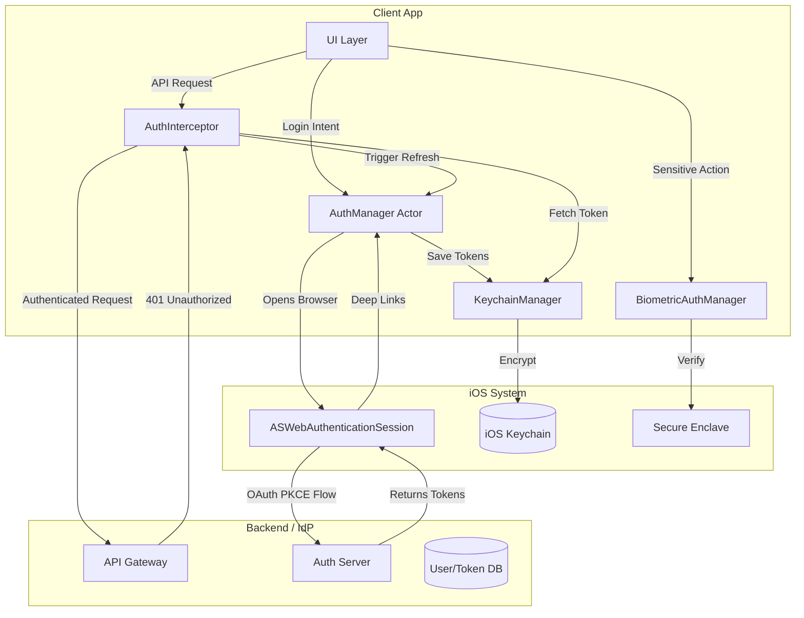

# Design Mobile Authentication System (OAuth2 / SSO / Biometric)

## Overview
Designing a modern mobile authentication system requires handling secure token exchange without client secrets, managing persistent session states securely, and integrating OS-level features like biometric step-up authentication. This problem is frequently asked because it tests knowledge of security primitives (Keychain, Secure Enclave), concurrency (atomic token refresh), and standard protocols (OAuth2 PKCE).

## Target Companies & Frequency
| Company | Why They Ask | Frequency (★ rating) |
| :--- | :--- | :--- |
| Stripe/Square | Crucial for fintech security and session management | ★★★★★ |
| Salesforce | Heavy reliance on Enterprise SSO and OAuth integrations | ★★★★★ |
| Meta | Multi-account management and massive scale auth | ★★★★ |
| Apple | Deep integration with ASWebAuthenticationSession / Sign in with Apple | ★★★★★ |

## Scope Definition

### In Scope
- OAuth2 Proof Key for Code Exchange (PKCE) flow on iOS
- Secure token storage using iOS Keychain
- Atomic token refresh handling concurrent API requests
- Biometric authentication (Face ID / Touch ID) via LocalAuthentication
- SSO integration via `ASWebAuthenticationSession`
- Session invalidation and multi-device logout

### Out of Scope
- Detailed backend implementation of OAuth2 Identity Provider (IdP)
- Custom cryptographic algorithms (assume standard TLS and SHA256)
- Social login SDKs integration (Facebook, Google SDKs) in depth

## Requirements

### Functional Requirements
1. Users must be able to log in securely using OAuth2 without hardcoded client secrets.
2. The app must maintain the session using short-lived access tokens and long-lived refresh tokens.
3. The app must transparently refresh tokens when they expire without dropping concurrent network requests.
4. The app must offer biometric re-authentication for sensitive actions.
5. Users must be able to securely log out, invalidating tokens locally and server-side.

### Non-Functional Requirements
| Requirement | Target | Source |
| :--- | :--- | :--- |
| Keychain Read Latency | < 1ms | Apple Security Benchmarks |
| Token Storage | Encrypted at rest, excluded from iCloud | iOS Security Best Practices |
| Access Token Lifetime | 15min - 1hr | OAuth2 Standard Practice |
| SSO Browser Launch | ~1-3s | Safari/WebAuthSession Benchmarks |

## High-Level Architecture (HLD)

### Component Diagram



### Component Responsibilities
| Component | Responsibility | iOS Implementation |
| :--- | :--- | :--- |
| AuthManager | Orchestrates login, logout, and token refresh | `actor AuthManager` |
| AuthInterceptor | Injects tokens into requests, pauses on 401, retries | `URLSessionTaskDelegate` / Alamofire Interceptor |
| KeychainManager | Secure storage for tokens, non-iCloud synced | `SecItemAdd`, `SecItemCopyMatching` |
| ASWebAuthenticationSession | Renders SSO web flow securely | `AuthenticationServices` framework |

### Data Flow (PKCE Login)
1. App generates cryptographically random `code_verifier` (43-128 chars).
2. App computes `code_challenge = BASE64URL(SHA256(code_verifier))`.
3. App launches `ASWebAuthenticationSession` to `/authorize?code_challenge=...`.
4. User logs in. Browser redirects to `app://callback?code={authCode}`.
5. App intercepts code, calls backend `/token` with `code` and raw `code_verifier`.
6. Backend hashes `code_verifier`, matches it against `code_challenge`, and returns tokens.

## Data Models

### Core Entities

```swift
import Foundation

struct TokenResponse: Codable {
    let accessToken: String
    let refreshToken: String
    let expiresIn: TimeInterval
    
    enum CodingKeys: String, CodingKey {
        case accessToken = "access_token"
        case refreshToken = "refresh_token"
        case expiresIn = "expires_in"
    }
}

enum KeychainKey: String {
    case accessToken = "com.app.access_token"
    case refreshToken = "com.app.refresh_token"
    case tokenExpiry = "com.app.token_expiry"
}
```

### Database Schema (Server-side Reference)
```sql
CREATE TABLE oauth_tokens (
    id UUID PRIMARY KEY,
    user_id UUID NOT NULL,
    refresh_token_hash VARCHAR(255) UNIQUE NOT NULL,
    client_id VARCHAR(100),
    expires_at TIMESTAMP NOT NULL,
    revoked BOOLEAN DEFAULT FALSE,
    token_version INT DEFAULT 1,
    
    CONSTRAINT fk_user FOREIGN KEY(user_id) REFERENCES users(id)
);
```

## API Design

### Endpoints

**1. Authorization Request (Browser GET)**
- **Method:** `GET /authorize`
- **Query Params:** `response_type=code`, `client_id=123`, `redirect_uri=app://auth`, `code_challenge=abc...`, `code_challenge_method=S256`, `state=xyz`

**2. Token Exchange (PKCE)**
- **Method:** `POST /token`
- **Request Body:**
```json
{
  "grant_type": "authorization_code",
  "client_id": "123",
  "code": "auth_code_from_redirect",
  "code_verifier": "original_random_string",
  "redirect_uri": "app://auth"
}
```

**3. Token Refresh**
- **Method:** `POST /token`
- **Request Body:**
```json
{
  "grant_type": "refresh_token",
  "client_id": "123",
  "refresh_token": "long_lived_refresh_token"
}
```

**4. Logout (Revocation)**
- **Method:** `POST /v1/auth/logout`
- **Request Body:** `{"refresh_token": "..."}`

## Client Architecture Deep-Dives

### 1. Atomic Token Refresh (The Hardest Part)
If multiple network requests fire simultaneously and all return `401 Unauthorized`, we must ensure only *one* request executes the refresh token API. Otherwise, the first refresh invalidates the token, causing subsequent refreshes to fail with `invalid_grant`.

```swift
actor TokenRefresher {
    private var isRefreshing = false
    private var pendingContinuations: [CheckedContinuation<String, Error>] = []
    
    /// Returns the new access token. Synchronizes concurrent refresh attempts.
    func refreshToken() async throws -> String {
        // If already refreshing, suspend and wait for the result
        if isRefreshing {
            return try await withCheckedThrowingContinuation { continuation in
                pendingContinuations.append(continuation)
            }
        }
        
        isRefreshing = true
        
        defer { 
            isRefreshing = false 
        }
        
        do {
            let newToken = try await performNetworkRefresh()
            // Resume all waiting tasks with success
            pendingContinuations.forEach { $0.resume(returning: newToken) }
            pendingContinuations.removeAll()
            return newToken
        } catch {
            // Resume all waiting tasks with error
            pendingContinuations.forEach { $0.resume(throwing: error) }
            pendingContinuations.removeAll()
            throw error
        }
    }
    
    private func performNetworkRefresh() async throws -> String {
        // Actual network call to POST /token
        // 1. Fetch refresh token from Keychain
        // 2. Call API
        // 3. Save new tokens to Keychain
        return "new_access_token_mock"
    }
}
```

### 2. Secure Storage (KeychainManager)
Never store tokens in `UserDefaults`. Use Keychain, ensuring `kSecAttrAccessibleAfterFirstUnlock` so background tasks can operate, but restricting iCloud sync.

```swift
import Security
import Foundation

class KeychainManager {
    static let shared = KeychainManager()
    
    func save(_ value: String, forKey key: KeychainKey) throws {
        let data = Data(value.utf8)
        let query: [String: Any] = [
            kSecClass as String: kSecClassGenericPassword,
            kSecAttrAccount as String: key.rawValue,
            kSecValueData as String: data,
            kSecAttrAccessible as String: kSecAttrAccessibleAfterFirstUnlock,
            kSecAttrSynchronizable as String: false // Prevent iCloud sync
        ]
        
        SecItemDelete(query as CFDictionary) // Clear existing
        let status = SecItemAdd(query as CFDictionary, nil)
        
        guard status == errSecSuccess else {
            throw NSError(domain: NSOSStatusErrorDomain, code: Int(status), userInfo: nil)
        }
    }
    
    func load(forKey key: KeychainKey) -> String? {
        let query: [String: Any] = [
            kSecClass as String: kSecClassGenericPassword,
            kSecAttrAccount as String: key.rawValue,
            kSecReturnData as String: kCFBooleanTrue!,
            kSecMatchLimit as String: kSecMatchLimitOne
        ]
        
        var dataTypeRef: AnyObject?
        let status = SecItemCopyMatching(query as CFDictionary, &dataTypeRef)
        
        if status == errSecSuccess, let data = dataTypeRef as? Data {
            return String(data: data, encoding: .utf8)
        }
        return nil
    }
}
```

### 3. Biometric Step-Up Authentication
Biometric auth validates the device owner, not the user identity. It should be used for step-up auth (e.g., viewing a CVV) after OAuth has established identity.

```swift
import LocalAuthentication

class BiometricAuthManager {
    static let shared = BiometricAuthManager()
    
    func authenticate(reason: String) async throws -> Bool {
        let context = LAContext()
        var error: NSError?
        
        // Check if biometrics are available
        guard context.canEvaluatePolicy(.deviceOwnerAuthenticationWithBiometrics, error: &error) else {
            // Fallback to passcode if biometrics unavailable
            return try await context.evaluatePolicy(.deviceOwnerAuthentication, localizedReason: reason)
        }
        
        do {
            return try await context.evaluatePolicy(.deviceOwnerAuthenticationWithBiometrics, localizedReason: reason)
        } catch {
            print("Biometric auth failed: \(error.localizedDescription)")
            return false
        }
    }
}
```

## Performance & Optimizations
| Optimization | Technique | Benchmark/Impact |
| :--- | :--- | :--- |
| Pre-emptive Refresh | Refresh token 5 mins before expiry | Avoids blocking user API requests entirely |
| Ephemeral Sessions | `prefersEphemeralWebBrowserSession = true` | Bypasses SSO, forces login (good for multi-account) |
| Actor Synchronization | Centralize refresh logic in Swift Actor | Solves concurrency / `invalid_grant` races with ~0 overhead |

## Failure Modes & Fallbacks
| Failure Scenario | Detection | Fallback Strategy |
| :--- | :--- | :--- |
| Refresh Token Expired | API returns `401` even on refresh call | Force local logout, clear Keychain, present Login UI |
| User Changes Face ID | `LAContext.evaluatedPolicyDomainState` changes | Invalidate Secure Enclave keys, force password re-entry |
| Keychain Read Failure | `SecItemCopyMatching` returns error code | Treat as logged out, prompt re-authentication |

## Trade-off Analysis
| Decision | Option A | Option B | Chosen | Why |
| :--- | :--- | :--- | :--- | :--- |
| Auth UI Component | `WKWebView` | `ASWebAuthenticationSession` | `ASWebAuthenticationSession` | System-managed, shares Safari cookies for SSO, apps can't snoop credentials. |
| Auth Flow | Implicit Flow | Authorization Code + PKCE | PKCE | Implicit flow is deprecated (leaks tokens in URI). PKCE removes need for client secret. |
| Token Storage | `UserDefaults` | iOS Keychain | Keychain | `UserDefaults` is plaintext in backups. Keychain encrypts data via Secure Enclave. |

## Observability & Metrics
- **Auth Success Rate:** Percentage of PKCE flows that result in successful token exchange.
- **Refresh Failure Rate:** Spike indicates backend token rotation issues or mass user revocation.
- **Biometric Fallback Rate:** Percentage of users falling back to passcode (indicates UX friction or hardware limits).

## Production Benchmarks Reference
| Metric | Number | Source |
| :--- | :--- | :--- |
| Access Token Lifetime | 15 minutes | Google / Stripe API Standards |
| Refresh Token Lifetime | 60 - 90 days | Spotify / Google Platform Docs |
| PKCE Code Verifier | 43 - 128 characters | RFC 7636 |
| Face ID Match Speed | < 1.0 second | Apple Hardware Specs |

## Interview Tips
- ❌ **Common Mistake:** Suggesting `WKWebView` for OAuth. Apple will reject the app, and it breaks SSO. Always use `ASWebAuthenticationSession`.
- ❌ **Common Mistake:** Hardcoding a `client_secret` in the mobile app. Reverse engineers can extract this in minutes. Explain that PKCE solves this.
- ❌ **Common Mistake:** Not handling the atomic refresh race condition. If you don't use a lock, semaphore, or `actor`, your system will break under parallel network load.
- ❌ **Common Mistake:** Using Face ID for primary authentication without tying it to a server session. Face ID just says "this is the phone owner", not "this is User 123".

## Mock Interview Q&A
**Q: "Walk me through the complete OAuth2 PKCE flow for a mobile app. Why can't we use the standard authorization code flow with a client secret?"**
A: Mobile apps cannot securely store a `client_secret` since the binary can be decompiled. PKCE solves this by generating a dynamic secret (`code_verifier`) per request. The app hashes it into a `code_challenge` and sends it in the first auth request. When exchanging the auth code for tokens, the app sends the raw `code_verifier`. The server hashes it and verifies it matches the original challenge, proving the app requesting the token is the exact same app that initiated the login.

**Q: "5 API calls return 401 simultaneously. Your token refresh endpoint only accepts a refresh token once. What happens without proper synchronization, and how do you fix it?"**
A: Without synchronization, all 5 requests will call the refresh API. The first one succeeds and invalidates the refresh token (due to token rotation). The other 4 fail with `invalid_grant`, logging the user out. I would fix this using a Swift `actor` that flags `isRefreshing = true`. The 4 subsequent requests will suspend via `withCheckedContinuation` and wait until the first network call finishes, then reuse the newly fetched token.

**Q: "Where do you store tokens on iOS and why? What are the risks of each alternative?"**
A: Tokens must be stored in the iOS Keychain. It provides hardware-backed encryption via the Secure Enclave. `UserDefaults` is completely insecure as it stores data in plaintext XML/plist files and is visible in iTunes/iCloud backups. `CoreData` without SQLCipher is also plaintext. I would also set `kSecAttrSynchronizable` to false so sensitive tokens don't sync to other Apple devices unnecessarily.

**Q: "A user enables Face ID for your banking app. Walk me through the Secure Enclave flow."**
A: When Face ID is enabled, we create a cryptographic key pair inside the Secure Enclave. The private key never leaves the chip. We configure its access control list (`SecAccessControl`) to require biometric authentication. When the user performs a sensitive action, we ask the Secure Enclave to sign a challenge. The Enclave prompts for Face ID, validates it locally, signs the data, and returns the signature to the app, which is then verified by the backend.

**Q: "How do you implement 'Log out of all devices' for a user who lost their phone?"**
A: The backend maintains a `token_version` (or `session_id`) on the user's database record, which is also embedded in their JWT access tokens and mapped to their refresh tokens. When the user selects "Log out of all devices" from a new device, the backend increments the `token_version`. All existing tokens instantly become invalid because their version no longer matches the database, causing 401s on all other devices.

## Related Specs
- [networking-layer.md](./networking-layer.md)
- [payment-checkout.md](./payment-checkout.md)
- [offline-sync-engine.md](./offline-sync-engine.md)
