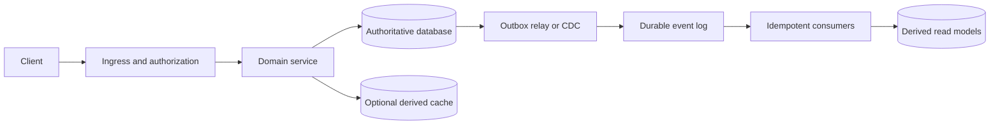

# Master Guide: Backend Engineering Management, Staff Engineering & Leadership

A preparation guide for distributed systems, technical judgment, and organizational execution. Build the fundamentals through [the backend interview track](backend-interview-track.md). Start with [Rahul's evidence and preparation plan](rahul-backend-interview-plan.md), then use the [backend casebook](backend-system-design-casebook.md) for practice. The mobile specifications are supporting client architecture material.

This guide does not claim access to company hiring rubrics or guarantee an offer. Recommendations below are preparation advice. Published technical behavior is linked to primary sources. Workload, latency, budget, and staffing inputs must come from the interview prompt or measured evidence; no universal production numbers are supplied.

## 1. Choose the role before preparing the answer

Titles and levels are not interchangeable across companies. Confirm scope, coding expectations, domain, team size, and reporting structure with the recruiter.

| Track | Demonstrate | Evidence to prepare | Common preparation gap |
| :--- | :--- | :--- | :--- |
| Backend EM / SDM | Technical decisions, people development, delivery, production ownership | An architecture decision, coaching example, incident, prioritization decision, and operational mechanism | Discussing process while delegating every technical follow-up |
| Staff / principal backend IC | Correctness, implementation depth, cross-team influence, durable technical strategy | Data model, concurrency control, failure analysis, migration, and adoption evidence | Naming infrastructure without defending its semantics |
| Director / broader leadership | Portfolio choices, leadership development, organizational design, business accountability | Multi-team strategy, resource allocation, manager development, and measurable portfolio outcomes | Presenting one team's execution as organization-wide leadership |

An EM must still defend transaction boundaries. A staff engineer must still connect architecture to customer impact. Seniority increases judgment and scope rather than eliminating technical depth.

## 2. A repeatable design conversation

Use the actual interview duration. This sequence is a practice framework, not a published company format.

1. **Define the user journey.** Identify actors, authorization boundaries, accepted actions, and explicit exclusions.
2. **State invariants.** What must never become false? Examples of invariants include one accepted booking per exclusive slot, no cross-tenant reads, and no duplicate payment effect for the same operation.
3. **Establish the workload.** Ask for traffic distribution, object sizes, retention, geography, and expected failures. If inputs are unavailable, keep the model symbolic and explain what evidence would change the design.
4. **Design the simplest working path.** Specify API semantics, source of truth, schema, indexes, and acknowledgement boundary before adding components.
5. **Deep dive into the hardest invariant.** Walk through concurrent requests, timeouts, process crashes, retries, failover, and replay.
6. **Explain operations and change.** Cover observability, overload, migrations, backup restoration, rollout, security, and cost.
7. **Add the role lens.** EM: staffing, ownership, coaching, delivery. Staff: protocol and implementation detail, adoption. Director: portfolio sequencing and organizational trade-offs.

Write the invariant beside the diagram. Every new box must have a reason, an owner, and a failure consequence.

## 3. Architecture starts with boundaries

This is a design pattern, not a claimed deployment at Rahul's employers. Use it only when the problem needs asynchronous derived state. A single service and transactional database may be enough.

**Service boundaries:** separate domains with independent invariants, ownership, deployment needs, or failure isolation. Avoid one microservice per entity. Account for synchronous fan-out, incident coordination, schema evolution, and on-call cost.

**BFF:** useful when client-specific aggregation or version adaptation is substantial. It adds another dependency and ownership burden. GraphQL federation and a service mesh are optional. Bound query cost, dependency fan-out, response size, and deadlines. A BFF cannot repair inconsistent writes in downstream services.

**API contract:** define authentication, authorization, validation, request identity, success and error semantics, pagination, cancellation, compatibility, and retry safety. An accepted asynchronous operation needs durable identity and a status lookup. A timeout describes missing knowledge, not a definitive business failure.

**Pagination:** keyset pagination requires a deterministic total order and a matching index. Mutable ranking may require a snapshot or feed session. Encode and validate the cursor, bind it to filters and authorization context, and document expiry. A cursor alone does not guarantee stable membership or eliminate all duplicates.

**Cache validation:** an HTTP 304 avoids the representation body, but headers, request traffic, and round-trip latency remain. Read the conditional request semantics in [RFC 9110](https://www.rfc-editor.org/rfc/rfc9110.html).

## 4. Distributed systems fundamentals to explain without slogans

### Consistency and partitions

- **Linearizability:** operations appear to take effect at a point between invocation and response, respecting real-time ordering.
- **Serializable transactions:** committed transactions have an outcome equivalent to a serial order. This does not by itself imply external real-time ordering.
- **Read-your-writes:** a session can observe its acknowledged writes. Arbitrary time-based primary pinning is insufficient if replication takes longer than the pinning period.
- **Eventual consistency:** explain the convergence mechanism, conflict rules, and permitted stale observations. Do not use the phrase as a substitute for a protocol.
- **CAP:** during a network partition, maintaining linearizable behavior can require rejecting or delaying operations. CAP is not a general menu of three equally selectable features.

Study the definitions and limitations in [Spanner](https://research.google/pubs/spanner-googles-globally-distributed-database/) and [Gilbert and Lynch's CAP paper](https://www.cs.princeton.edu/courses/archive/spr22/cos418/papers/cap.pdf). These are theory and published systems, not a reason to implement consensus yourself for an ordinary product API.

### Replication, quorum, and failover

Explain leader election, stale replicas, acknowledgement policy, and what acknowledged data survives failover. A quorum arithmetic condition is insufficient without the protocol's conflict and ordering rules. Failover requires fencing the old writer; DNS changes alone cannot stop split-brain writes.

Set **RPO** as acceptable data loss and **RTO** as acceptable recovery time with stakeholders. Replication propagates mistakes too. Backups must be independently retained and restoration must be exercised. Verify the chosen database's guarantees rather than inferring them from a replica count.

For PostgreSQL, read [warm standby and replication](https://www.postgresql.org/docs/current/warm-standby.html) before claiming durability or fresh replica reads.

### Concurrency and coordination

Use database constraints and atomic transactions to enforce invariants where possible. Optimistic concurrency needs a version comparison and a conflict response. Locks need ownership, expiry behavior, and failure handling. A leased worker can resume after its lease expires; a protected resource must reject stale owners, for example through fencing tokens it enforces.

Practice explaining write skew, deadlock, lost update, unique constraints, and transaction retry. Use [PostgreSQL transaction isolation](https://www.postgresql.org/docs/current/transaction-iso.html) to distinguish the actual isolation modes.

### Ordering and delivery

A broker's ordering boundary matters. Kafka orders records within a partition, not across all partitions. Consumer rebalances and retries affect processing. Acknowledging an event before its side effect is durable risks loss; acknowledging afterward permits replay.

Kafka transactions support scoped processing guarantees. Arbitrary external side effects require cooperation from the destination. Read [Kafka design](https://kafka.apache.org/41/design/design/) and identify the exact boundary before saying "exactly once."

## 5. Checkout and payments: the correctness deep dive

Use [the casebook](backend-system-design-casebook.md#1-checkout-payments-and-inventory) for the full practice prompt. The core distinction is between internal atomicity and an external payment outcome.

### Durable request identity

An idempotency record must be scoped to the authenticated caller and operation, bound to a canonical request fingerprint, and claimed atomically. Store execution state and durable outcome. Reject reuse with a different request. A read-then-write cache check races under concurrent requests.

Choose retention from the business retry and reconciliation horizon. Stripe documents its own retention and replay behavior in [idempotent requests](https://docs.stripe.com/api/idempotent_requests); that provider contract is not a universal TTL for your order ledger.

### State and invariants

Define order, inventory reservation, payment attempt, and refund states separately. Persist allowed transitions. A provider timeout leaves payment outcome unknown. Return a pending state and reconcile through provider status and authenticated callbacks instead of creating a new charge.

An inventory reservation requires atomic allocation and expiry semantics. If payment confirmation arrives after reservation expiry, choose and document a recovery action. A refund is a new business operation that can fail or remain pending; it does not undo history.

### Outbox and saga boundaries

Commit the business change and outbox record in the same database transaction. The relay can publish again after a crash, so consumers deduplicate and monitor stalled delivery. The [AWS outbox pattern](https://docs.aws.amazon.com/prescriptive-guidance/latest/cloud-design-patterns/transactional-outbox.html) addresses the dual-write problem; it does not make external payments atomic.

A saga coordinates local transactions and compensating actions. Compensation can fail, and intermediate state is visible unless explicitly controlled. Design reconciliation, exception handling, audit history, and customer communication. Read [AWS saga orchestration](https://docs.aws.amazon.com/prescriptive-guidance/latest/cloud-design-patterns/saga-orchestration.html).

### Crash walkthrough

| Failure point | Required recovery |
| :--- | :--- |
| Before local transaction commits | Retry the same operation identity; there is no accepted local operation yet |
| After commit, before event publication | Relay resumes from durable outbox |
| After publication, before relay marks success | Consumer tolerates duplicate event |
| After provider accepts, before response arrives | Query or reconcile the same payment attempt; do not interpret timeout as failure |
| After consumer side effect, before broker acknowledgement | Replayed event must not duplicate the effect |
| During refund or compensation | Persist pending recovery and expose an actionable exception workflow |

Be ready to identify the exact unique key, transaction, state transition, and reconciliation owner at each row.

## 6. Data architecture, caching, and search

### Start with access paths

List queries and writes before choosing a database. Defend keys, indexes, transaction scope, cardinality, tenant isolation, retention, and deletion. SQL versus NoSQL is a consequence of the access and consistency model, not a scale label.

A partition key determines locality and hotspots. Plan for dominant tenants, monotonic writes, hot objects, cross-partition queries, and repartitioning. Sharding introduces routing and migration obligations; it is not the first response to a slow query.

### Cache correctness

Cache-aside can serve stale data during invalidation races. Write-through does not automatically synchronize every replica, writer, and reader. TTL bounds residence, not necessarily freshness across independent updates. Never use cached authorization or financial state without an explicit staleness policy.

For stampedes, coalesce fills, bound waiting, spread refreshes, and serve stale data only when permitted. Protect the database when cache capacity is lost. For absent keys, negative caching or a membership filter requires invalidation on creation. A Bloom filter's no-false-negative property assumes the represented set is complete and maintained.

### Search and CDC

Search is derived state. Define acceptable index lag and how deletion reaches the index. Use versioned updates to prevent an old replay from resurrecting a deleted object. Plan snapshot-to-stream handover, tombstones, schema changes, connector lag, poison records, and complete rebuilds.

Build a new index, validate it, switch an alias, and preserve rollback capability. Avoid a second application write to search that can diverge from the database. Study [Debezium's PostgreSQL connector](https://debezium.io/documentation/reference/stable/connectors/postgresql.html) for snapshot and replication-slot behavior. Retained WAL can exhaust storage if CDC stalls.

## 7. Reliability, overload, and observability

### Measure user outcomes

An SLI is a defined measurement; an SLO sets its objective over a window; an SLA adds agreed consequences. Specify valid requests, good outcomes, measurement point, exclusions, and window. A service returning HTTP success with an incorrect order is still failing its correctness objective.

For a request-based objective, permitted bad events = eligible events multiplied by the permitted bad fraction. For a time-based objective, use eligible time instead. Do not mix the denominators. Set objectives and budget policies with product and operations rather than copying a blanket deployment freeze. See [Google SRE on SLOs](https://sre.google/sre-book/service-level-objectives/).

### Overload

Use end-to-end deadlines, bounded concurrency, bounded queues, admission control, retry budgets, exponential backoff with jitter, and dependency isolation. Retry only safe operations and only within a useful deadline. Multiple independently retrying layers can amplify load.

Choose degradation by customer consequence: stale recommendations may be acceptable; guessing a payment outcome is not. CPU alone is an incomplete overload signal. Watch queue age, saturation, downstream latency, and rejected work. See [Google SRE on overload](https://sre.google/sre-book/handling-overload/).

### Observability

Connect request identity to traces, structured logs, metrics, and durable business state. Track latency distributions, errors, saturation, queue age, freshness, reconciliation exceptions, and resource cost. Limit metric cardinality; do not use user identifiers as unbounded labels. Protect sensitive logs and define retention.

An average can hide tail failures. Compare cohorts by geography, app version, device class, tenant, and dependency when the data supports it. A client playback SLI and a server request SLI need separate denominators.

### Incident leadership

Assign incident command, technical coordination, communication, and timeline recording. Mitigate with a verified safe action: disabling a feature, reducing load, failing over, or rolling back compatible code. A rollback can worsen a data migration or remove a security fix.

State what is known, unknown, and being tested. Confirm recovery from user outcome signals. Follow with a blameless analysis and prioritized actions with owners and verification. An incident commander role should follow training and incident needs, not automatically seniority. See [Google SRE incident management](https://sre.google/sre-book/managing-incidents/).

## 8. Migration and release safety

Expand-contract is a sequence for compatibility, not a guarantee of no locking or downtime. PostgreSQL `ALTER TABLE` often takes an `ACCESS EXCLUSIVE` lock. Set lock and statement timeouts, inspect long-running transactions, and evaluate each DDL operation's behavior for the deployed version. See [PostgreSQL ALTER TABLE](https://www.postgresql.org/docs/current/sql-altertable.html).

1. Add compatible structures with reviewed DDL and a bounded lock wait.
2. Deploy code that preserves old readers and writers.
3. Backfill resumably with checkpoints, throttling, and reconciliation. Handle concurrent writes explicitly.
4. Compare old and new representations before switching reads.
5. Observe after switching and preserve a recovery path.
6. Remove old code and schema only after dependent jobs, clients, and retention obligations are resolved.

Do not split a person's full name into assumed first and last names as a trivial migration example. Transformation semantics are part of correctness.

Canaries need adequate traffic and observation time, a comparable control, user outcome checks, and dependency and data compatibility. A percentage and fixed timer do not prove safety. For mobile clients, halting distribution cannot replace binaries already installed; feature flags require built-in safe paths and actual delivery.

## 9. Security and multi-tenancy

Explain identity, authorization, tenant boundaries, encryption, secret rotation, auditing, abuse prevention, and deletion. Authentication does not authorize access to arbitrary object IDs.

OAuth public clients need an appropriate authorization flow and PKCE. Validate token signature, allowed algorithm, issuer, audience, and time claims. Refresh-token rotation needs atomic state change and reuse detection; policy determines which token family is revoked and how legitimate retry ambiguity is handled. See [OAuth security BCP, RFC 9700](https://www.rfc-editor.org/rfc/rfc9700).

A JWT revocation design trades local validation against freshness and availability. A central revocation check creates a dependency; define failure behavior. Device identifiers alone are not proof of device possession. Do not invent a cryptographic protocol.

For multi-tenancy, propagate trusted tenant context, authorize every resource path, isolate caches and exports, impose fair quotas, and test background jobs as well as foreground APIs. Define how backups and derived indexes handle deletion. Never claim "PCI compliant" merely because card tokenization is used; scope and validation require the applicable [PCI standards](https://www.pcisecuritystandards.org/standards/).

## 10. Capacity and economics without invented inputs

Use measured or interviewer-provided inputs and retain units. Record which input is missing rather than inventing a peak multiplier or pod throughput.

| Quantity | Model | Evidence needed |
| :--- | :--- | :--- |
| Average request rate | Requests in window / window duration | Actual event counts and window |
| Peak demand | Traffic distribution over relevant intervals | Peak shape, duration, regions, coordinated events |
| In-flight concurrency | Arrival rate multiplied by mean time in system, when stable | Same-boundary arrival and latency measurements |
| Queue recovery | Backlog / (sustained processing rate - incoming rate) | Positive spare capacity, payload and downstream limits |
| Storage | Retained records multiplied by measured size, plus indexes and replication | Retention, compression, growth, backup footprint |
| Fleet capacity | Demand / measured safe capacity per unit, rounded up | Tail latency at load, failed-zone capacity, scaling delay |
| Unit cost | Allocated cost / successful business units | Compute, storage, network, observability, vendor and support costs |

Do not sum component p99 values as though the result is the end-to-end p99. Do not derive request QPS from concurrent streaming viewers without request cadence. Benchmark the full path, including failure scenarios and skew.

Compare cost changes against reliability and customer outcomes. Avoid universal cloud prices or savings percentages; record provider, region, tier, currency, date, and billing assumptions. Savings on origin traffic can be offset by CDN or request costs.

## 11. EM and leadership mechanisms

| Mechanism | Concrete decision | Evidence of effectiveness |
| :--- | :--- | :--- |
| Ownership | One accountable owner for each domain, contract, and on-call surface | Reduced unresolved handoffs and clear escalation |
| Planning | Capacity includes incidents, maintenance, leave, and learning | Forecast changes explained against actual delivery |
| Technical debt | Rank debt by customer risk, recurring toil, and delivery blockage | Outcomes after remediation, not ticket counts |
| People development | Diagnose a skill or scope gap and agree observable goals | Progress and independent ownership over time |
| Performance management | Clear expectations, direct feedback, support, and appropriate HR process | Fair decisions supported by documented observations |
| Cross-team strategy | Explicit alternatives, dependencies, decision authority, and rollout sequence | Adoption and customer outcomes across teams |
| Portfolio management | Select investments and stop lower-value work | Opportunity cost and risk accepted by stakeholders |

Use actual examples. Rahul's resume reports leadership of engineers; it does not establish management of managers, budget authority, or specific promotion and performance cases. Prepare those only if real.

## 12. Practice evaluation

This is a self-assessment tool, not a company's internal scorecard. Record each item as **missing**, **partially defended**, or **defended under follow-up**.

- Requirements and customer outcome are explicit.
- The invariant is enforced at a concrete boundary.
- APIs and schema support the access paths.
- Acknowledgement, retry, ordering, and replay semantics are correct.
- Capacity is dimensionally correct and inputs are traceable.
- Security and isolation survive alternate access paths.
- Overload, failure, recovery, and migration are explained.
- Trade-offs include operational and organizational cost.
- Personal evidence distinguishes decisions from team contributions.
- The role-specific leadership or implementation depth is demonstrated.

Repeat practice with a changed constraint or injected failure. If the design only works when every dependency is healthy, deepen the failure model before adding more technologies.
