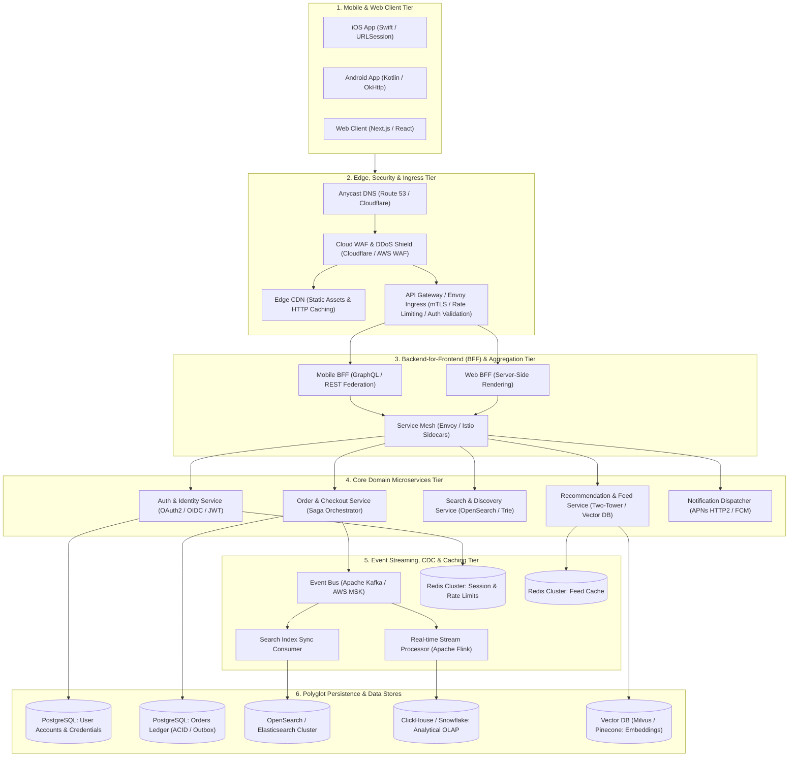
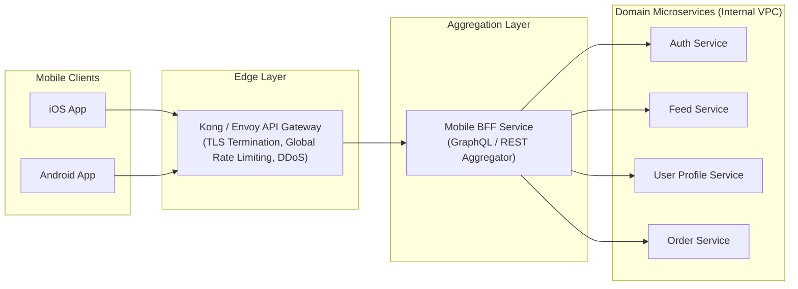
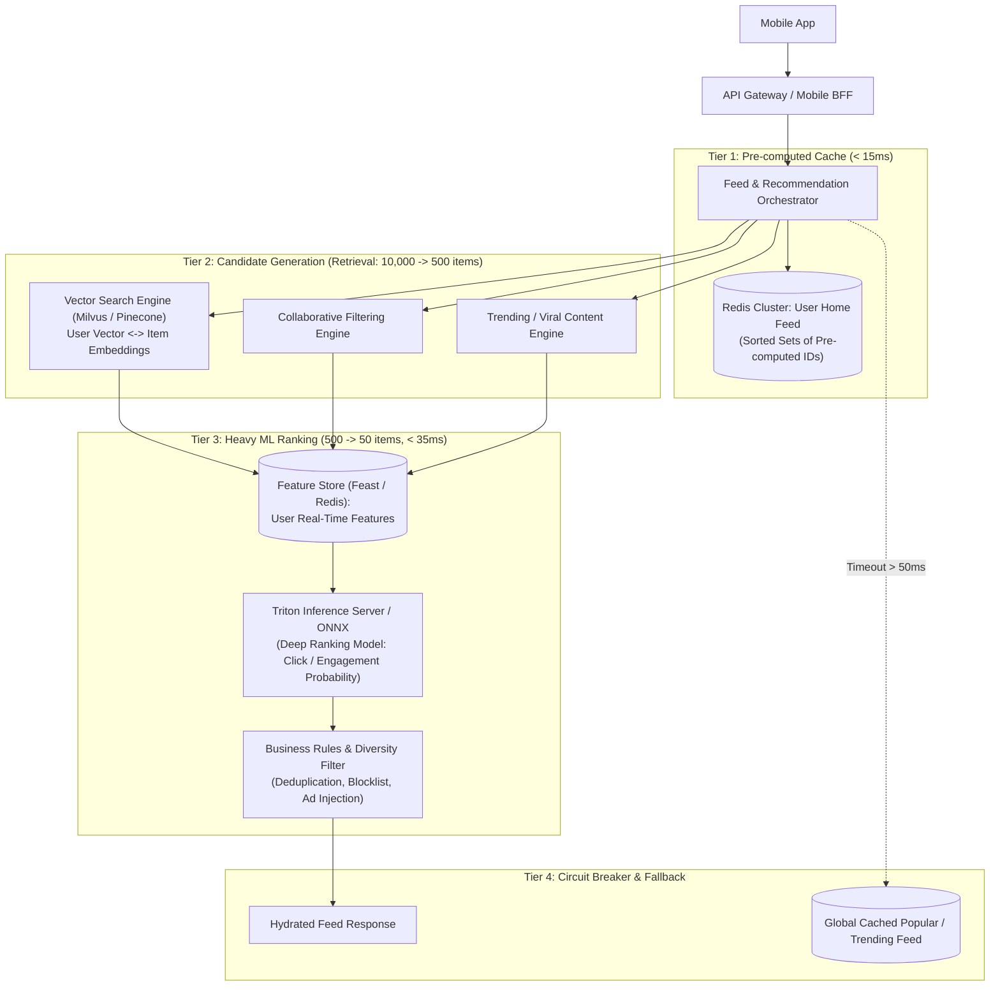
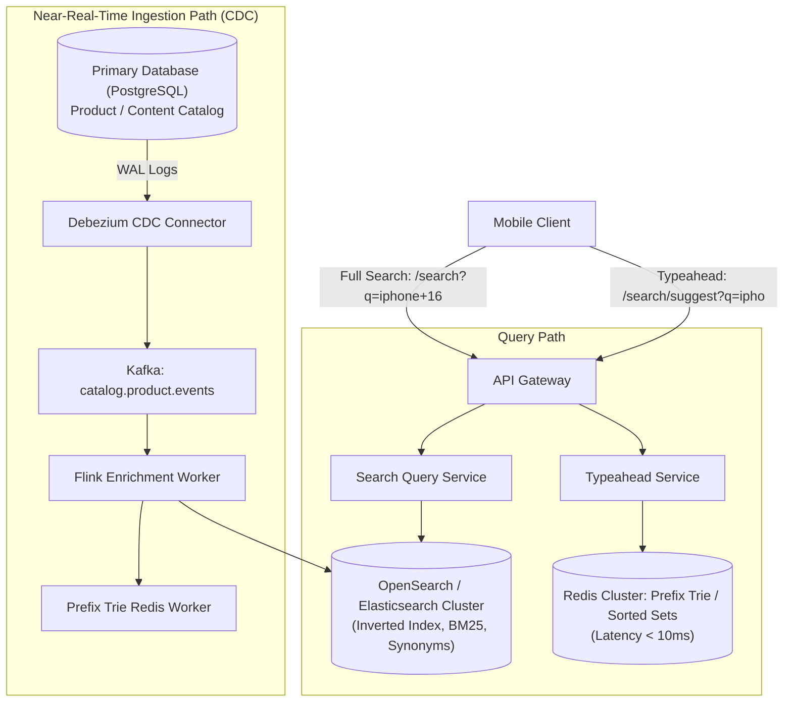
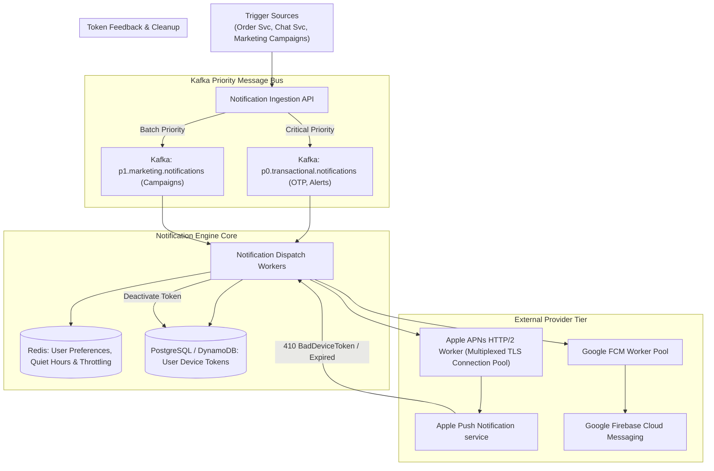
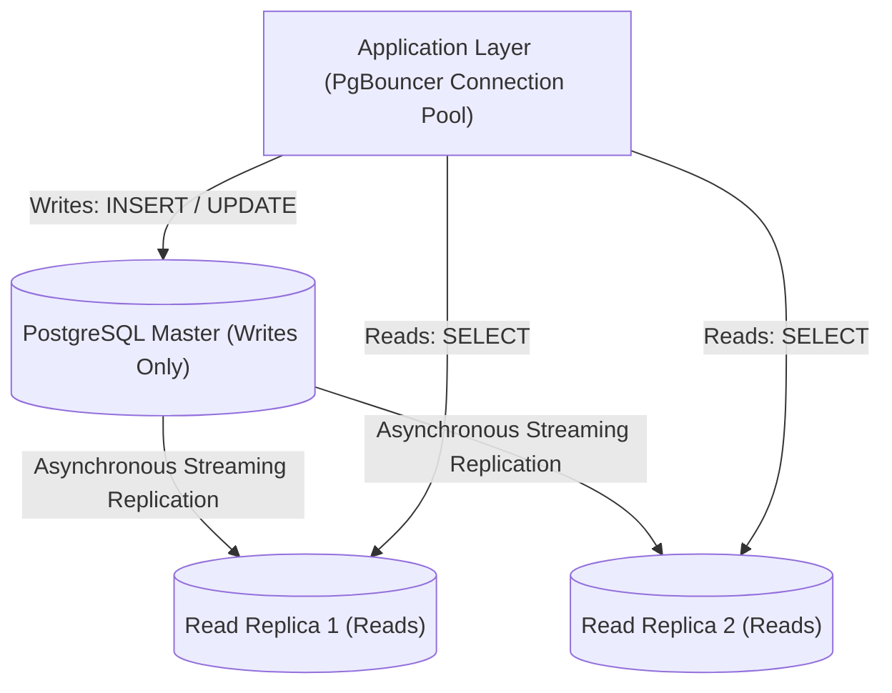
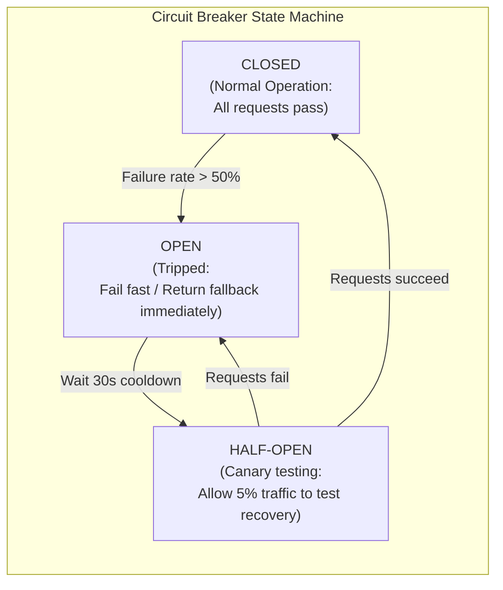
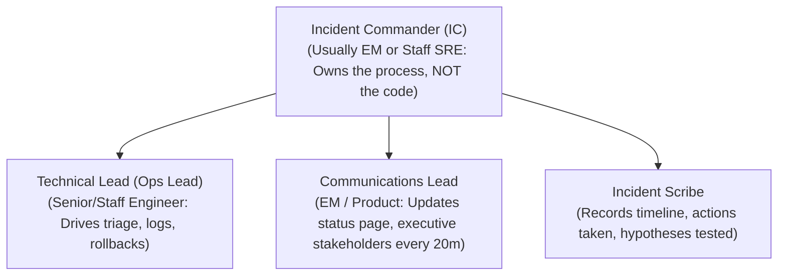
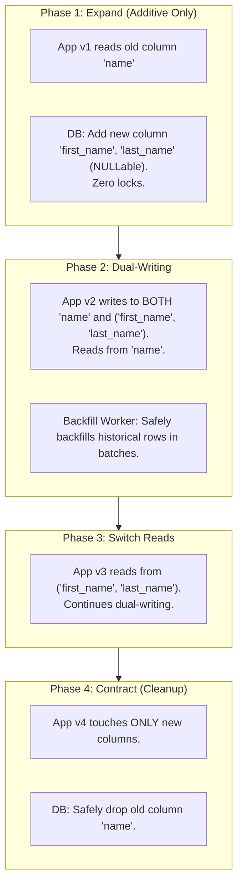

# Master Guide: Senior Backend Engineering Management (EM / SDM) — Distributed Systems & Client Architecture
### The End-to-End Blueprint for Leading High-Scale Backend Teams, Governing Mobile-to-Cloud APIs, Scaling Distributed Systems, and Cracking Tier-1 EM / SDM System Design Interviews

---

## 🗺️ Master Backend Architecture: Mobile Apps to Multi-Region Cloud



---

## 🎯 Executive Overview & The Senior EM Evaluation Lens

In Senior Engineering Manager (Senior EM, M1/M2) and Software Development Manager (Amazon SDM II / L7) loops at Tier-1 tech companies (**Meta, Google, Amazon, Uber, Stripe, Netflix, Airbnb**), backend system design interviews are fundamentally different from Senior or Staff Software Engineer rounds:

```ascii
+----------------------------------------------------------------------------------------------------+
|                         BACKEND SYSTEM DESIGN: STAFF ENGINEER VS SENIOR EM                         |
+--------------------------+------------------------------------+------------------------------------+
| Evaluation Dimension     | Staff / Principal Engineer         | Senior Engineering Manager (EM)    |
+--------------------------+------------------------------------+------------------------------------+
| Primary Focus            | Deep algorithmic correctness, data | Business viability, organizational |
|                          | structures, protocols, performance | boundaries, resilience, delivery,  |
|                          | micro-optimizations, concurrency.  | cost (FinOps), team ownership.     |
+--------------------------+------------------------------------+------------------------------------+
| Architecture Framing     | "We can use Raft for consensus     | "We define team service contracts, |
|                          | and partition keys by hash(UUID)." | set explicit p99 SLAs, isolate     |
|                          |                                    | failure domains, and staff teams." |
+--------------------------+------------------------------------+------------------------------------+
| Production Reliability   | Circuit breaker implementation,    | SRE error budgets, Sev-1 incident  |
|                          | thread pool bulkhead sizing.       | command, MTTR/MTTD, on-call health.|
+--------------------------+------------------------------------+------------------------------------+
| Scale & Cost Governance  | IOPS math, memory footprint bytes. | Cloud FinOps, compute rightsizing, |
|                          |                                    | capacity forecasting, tech debt %. |
+--------------------------+------------------------------------+------------------------------------+
```

### The 45-Minute Senior EM System Design Framework

```ascii
[00:00 – 05:00]  Phase 1: Scope, Clarify Requirements & Define Business / Technical SLAs
                 - Functional: Core user journeys from app perspective.
                 - Non-Functional: Throughput (QPS), p99 latency target (< 100ms), availability (99.99%).
                 - Clarify constraints: Data consistency (Strong vs Eventual), mobile network variability.

[05:00 – 10:00]  Phase 2: High-Level API Contracts & Data Flow
                 - Define REST / gRPC endpoint signatures.
                 - Request/response payloads tailored for mobile (avoid over-fetching).
                 - Core entity schema models & persistence choices (RDBMS vs NoSQL).

[10:00 – 25:00]  Phase 3: Deep Dive into Critical Subsystems & Scaling Architecture
                 - Component architecture: Ingress, BFF, Microservices, Caching, Event Bus.
                 - Scaling bottlenecks: Cache stampede mitigation, DB sharding, async decoupling.
                 - Mobile edge considerations: Delta synchronization, cursor pagination, idempotency.

[25:00 – 35:00]  Phase 4: Fault Tolerance, Failure Modes & Graceful Degradation
                 - What happens when DB or downstream microservice fails?
                 - Circuit breakers, bulkheads, exponential backoff with jitter, fallback feeds.
                 - Zero data loss guarantees (Outbox pattern, Saga distributed transactions).

[35:00 – 42:00]  Phase 5: Operational Excellence, SRE & Team Governance (The EM Differentiator)
                 - Observability: SLI/SLO definitions, RED/USE metrics, distributed tracing.
                 - Deployment: Canary releases, automated rollbacks, zero-downtime DB migrations.
                 - Team ownership: Domain-Driven Design (DDD) boundaries, team staffing, on-call rotation.

[42:00 – 45:00]  Phase 6: Summary, Trade-offs & Future Scaling Roadmaps
                 - Key architectural compromises accepted (e.g., eventual consistency for latency).
                 - Cost model & cloud infrastructure optimization (FinOps).
```

---

## 📱 1. Client-to-Backend Architecture & Mobile-First Best Practices

Leading a backend team that powers mobile applications requires understanding that **mobile clients are fundamentally different from web or server-to-server clients**:
1. **Network Instability**: Radios switch between 5G, LTE, and intermittent Wi-Fi; connections drop mid-flight.
2. **Battery & Radio Wakeups**: Frequent short polling drains battery; connections must be batched or multiplexed.
3. **App Store Release Cycle**: Client software is immutable once shipped; older app versions remain active in the wild for months. APIs must guarantee backwards compatibility.

### 1.1 Architecture Topology: Backend-for-Frontend (BFF) Pattern

Instead of having mobile apps communicate directly with dozens of internal domain microservices, enterprise backend architectures use an API Gateway paired with a **Mobile BFF**:



#### Why Mobile BFF is Mandatory for Scaled Engineering:
* **Payload Tailoring & Shaping**: Mobile screens need fewer fields than desktop web. Mobile BFF strips unneeded attributes, saving cellular bandwidth.
* **Request Collapsing (Scatter-Gather)**: A home screen needing Profile + Notifications Count + Feed Items makes **1 request** to Mobile BFF over cellular; Mobile BFF queries internal services over ultra-low-latency 10Gbps AWS VPC fiber.
* **Legacy Client Version Translation**: Mobile BFF inspects `User-Agent` or `X-App-Version` headers and transforms modern microservice response schemas to match app versions released 12 months ago.

---

### 1.2 Protocol Comparison: REST vs. GraphQL vs. gRPC

| Protocol | Best Used For | Pros | Cons / Gotchas for Mobile |
| :--- | :--- | :--- | :--- |
| **REST (JSON over HTTP/2)** | Public APIs, Simple Crud Services, Auth | Universal tooling, HTTP-level caching (`ETag`, CDN), human-readable. | Over-fetching or under-fetching; versioning complexity (`/v1`, `/v2`). |
| **GraphQL** | Mobile BFF, Complex Aggregate Screens (Home Feed) | Client requests exact fields needed; eliminates round-trips; typed schema. | Difficult CDN caching; risk of unbounded nested queries causing backend DoS; CPU parsing overhead on mobile. |
| **gRPC (Protobuf over HTTP/2)** | Internal Microservice-to-Microservice, High-Perf Mobile Feeds | Binary packing (3-10x smaller than JSON), strict contract typing, bidirectional streaming. | Requires Protobuf codegen in iOS/Android builds; difficult to inspect with standard Charles/Proxyman proxies without schema files. |

---

### 1.3 Critical Mobile-First API Design Standards

#### 1. Cursor-Based Pagination (Never Use Offset/Limit for Feeds)
* **The Flaw of `OFFSET / LIMIT`**: If a user is viewing page 1 (items 1-10) and 3 new items are published, requesting page 2 (`OFFSET 10`) causes items 8, 9, 10 to duplicate on screen. Furthermore, `OFFSET 50000` requires SQL engines to scan and discard 50,000 rows ($O(N)$ query time).
* **The Production Standard (Opaque Cursor)**:
```json
GET /api/v1/feed?limit=20&cursor=eyJjcmVhdGVkX2F0IjoxNzI4MDAwMCwiaWQiOjM4OTF9
```
* The cursor is a Base64-encoded tuple: `{"created_at": 17280000, "id": 3891}`.
* Backend query:
```sql
SELECT id, title, created_at 
FROM posts 
WHERE (created_at, id) < ($cursor_time, $cursor_id) 
ORDER BY created_at DESC, id DESC 
LIMIT 20;
```
* **Performance**: Index seek on `(created_at, id)` runs in $O(\log N)$ regardless of depth. Zero item duplication.

#### 2. Delta Synchronization & HTTP Caching (`ETag` / `If-None-Match`)
* Cellular data and battery are conserved by validating local client caches against the backend:
```http
--> GET /api/v1/settings/config
    If-None-Match: "33a64df551425fcc55e4d42a148795d9f25f89d4"

<-- HTTP/1.1 304 Not Modified
    ETag: "33a64df551425fcc55e4d42a148795d9f25f89d4"
    Cache-Control: private, max-age=300
```
* Result: 0 bytes of payload transmitted over cellular; response latency < 25ms.

#### 3. Client Idempotency Keys for State-Mutating APIs
* Mobile network drops mean the client does not know if a `POST /checkout` reached the server before disconnecting.
* Client generates a UUID v4 `Idempotency-Key` header with every mutating request.
* If the user re-taps or the network retries, the backend returns the cached prior response without charging twice (detailed in Section 5).

---

## 🔐 2. High-Level Design (HLD) 1: Authentication & Identity Microservice

### 2.1 Requirements & Scale
* **Functional**: User registration, login (password, Apple Sign-In, Google), MFA (SMS/Authenticator), Token refresh, Session invalidation (single device or all devices).
* **Scale**: 50 Million registered users, 5 Million DAU. Peak Login QPS: 15,000 requests/sec. Token Validation QPS: 150,000 requests/sec.
* **Latency SLA**: Login p99 < 150ms; Token verification at API Gateway p99 < 5ms.

---

### 2.2 System Architecture Diagram

```mermaid
graph TD
    Client["Mobile Client (iOS / Android)"]
    APIGW["API Gateway / Envoy Ingress"]
    AuthSvc["Auth Microservice"]
    DBAuth[("PostgreSQL Master + Read Replicas<br/>(Users, Password Hashes, Salts)")]
    RedisAuth[("Redis Cluster<br/>(Refresh Tokens, Revocation Blacklist, Rate Limits)")]
    KMS["Cloud KMS / Vault<br/>(Private RSA/ECDSA Signing Keys)"]

    Client -->|1. POST /login (Credentials + DeviceID)| APIGW
    APIGW --> AuthSvc
    AuthSvc -->|2. Verify Password Argon2id| DBAuth
    AuthSvc -->|3. Sign JWT with Private Key| KMS
    AuthSvc -->|4. Store Opaque Refresh Token (UUID)| RedisAuth
    AuthSvc -->|5. Return Access Token (JWT 15m) + Refresh Token (30d)| Client

    Client -->|6. Subsequent API Call (Header: Bearer JWT)| APIGW
    APIGW -->|7. Verify JWT Locally via Cached Public Key (< 1ms)| APIGW
    APIGW -->|8. Check Redis Blacklist for Revoked Tokens| RedisAuth
    APIGW -->|9. Route to Downstream Services| InternalMicroservices["Downstream Services"]
```

---

### 2.3 Token Strategy: Dual-Token Architecture

```ascii
+----------------------------------------------------------------------------------------------------+
|                                    DUAL-TOKEN ARCHITECTURE                                         |
+----------------------+---------------------------+-------------------------------------------------+
| Token Type           | Lifetime                  | Storage & Transmission                          |
+----------------------+---------------------------+-------------------------------------------------+
| **Access Token**     | Short (10 – 15 minutes)   | Stateless Signed JWT (RS256 / Ed25519).         |
|                      |                           | Verified locally at API Gateway using public key|
|                      |                           | without database hits. Never stored in DB.      |
+----------------------+---------------------------+-------------------------------------------------+
| **Refresh Token**    | Long (30 – 90 days)       | High-entropy cryptographically random UUIDv4.   |
|                      |                           | Stored hashed (SHA-256) in Redis + Postgres.    |
|                      |                           | Bound to exact `device_id` and `client_id`.     |
+----------------------+---------------------------+-------------------------------------------------+
```

#### The Refresh Token Rotation (RTR) Protocol:
1. When the client's 15-minute Access Token expires, it calls `POST /auth/refresh` sending the Refresh Token and `device_id`.
2. The server verifies the token in Redis, **invalidates that Refresh Token immediately**, and issues a **brand-new Access Token AND a brand-new Refresh Token**.
3. **Breach Detection**: If an attacker steals a Refresh Token and tries to reuse it after the legitimate client already rotated it, the server detects a replay attack, immediately revokes **all** active sessions for that user, and flags the account for security review.

---

### 2.4 Immediate Token Revocation at Scale
* **Problem**: Pure JWTs are stateless; if an admin bans a user or a phone is reported stolen, a 15-minute JWT remains valid until expiration.
* **Senior EM Solution: The Hybrid Redis Blacklist**:
  * Instead of querying a database for every API request, the API Gateway verifies the JWT cryptographic signature locally (< 1ms).
  * If a user logs out or changes their password, a revocation event is published to Redis:
    `SETEX blacklist:user:{user_id} 900 {revocation_timestamp}`
  * The API Gateway checks this in-memory key (single digit sub-millisecond Redis read). If the JWT's `iat` (issued-at) timestamp is older than the blacklist timestamp, the request is rejected with `401 Unauthorized`.
  * **Memory Optimization**: Keys auto-expire after 15 minutes (the maximum lifespan of an access token), preventing unbounded memory growth in Redis.

---

### 2.5 Distributed Rate Limiting & Brute-Force Defenses
* To block credential-stuffing attacks:
  * **Per-IP Rate Limit**: Sliding window counter in Redis: 10 failed login attempts per minute per IP.
  * **Per-Account Rate Limit**: Leaky bucket algorithm: 5 failed login attempts per account triggers exponential CAPTCHA verification and temporary 15-minute lock.
  * **Password Hashing**: **Argon2id** (memory-hard, resistant to GPU brute-force) with calibrated cost parameters (memory: 64MB, iterations: 3, parallelism: 4).

---

## 🧠 3. High-Level Design (HLD) 2: Recommendation & Personalization Service (App Home Feed)

### 3.1 Requirements & Scale
* **Functional**: Deliver personalized home screen feeds (posts, products, or videos) tailored to user history, social graph, and trending content.
* **Scale**: 20 Million DAU. Peak Feed Fetch QPS: 50,000 requests/sec.
* **Latency SLA**: p99 < **60ms** over cellular. (If the recommendation engine takes > 60ms, the entire app feels laggy).

---

### 3.2 System Architecture Diagram: Two-Stage Retrieval Pipeline



---

### 3.3 The Core Architectural Trade-off: Push vs. Pull vs. Hybrid Feed Fan-Out

```ascii
+----------------------------------------------------------------------------------------------------+
|                               FEED FAN-OUT ARCHITECTURE COMPARISON                                 |
+---------------------+-------------------------------+----------------------------------------------+
| Model               | Plain English Workflow        | Trade-offs & When to Use                     |
+---------------------+-------------------------------+----------------------------------------------+
| **Push Model**      | When author posts, write the  | **Read Latency**: Extremely fast (O(1)).     |
| *(Fan-out-on-write)*| post ID into every follower's | **Write Latency**: Disastrous for celebrities.|
|                     | Redis feed inbox immediately. | A celebrity with 50M followers causes 50M    |
|                     |                               | Redis writes on 1 post (Fan-out explosion).  |
+---------------------+-------------------------------+----------------------------------------------+
| **Pull Model**      | When user opens app, query all| **Write Latency**: O(1) instantaneous.       |
| *(Fan-out-on-read)* | followees, fetch recent posts,| **Read Latency**: Terrible (p99 > 800ms).    |
|                     | merge-sort, and score in real | Aggregating 1,000 followees on every app open|
|                     | time.                         | overwhelms database and cache tiers.         |
+---------------------+-------------------------------+----------------------------------------------+
| **Hybrid Model**    | Normal users (< 25k followers)| **The Tier-1 Standard (Twitter/Instagram)**. |
| *(The Production    | use **Push**. Celebrities     | Standard feeds load instantly from Redis;    |
|  Standard)*         | (> 25k followers) use **Pull**| celebrity posts are dynamically merged into  |
|                     | and are merged at read time.  | the feed buffer at read time.                |
+---------------------+-------------------------------+----------------------------------------------+
```

---

### 3.4 SRE & EM SLA Governance: Graceful Degradation Strategy
* **The 50ms Hard Timeout**: The Recommendation Orchestrator wraps the ML Ranking microservice in an asynchronous circuit breaker (`Resilience4j` / Envoy timeout set to 50ms).
* **Degradation Tiers**:
  * **Level 1 (Healthy, < 40ms)**: Full personalized ML ranking with real-time feature vectors.
  * **Level 2 (ML Service Slow / High Load, 50ms Timeout)**: Fall back to pre-computed candidate heuristics based on user's top 5 favorite categories.
  * **Level 3 (Total System Stress / Database Sev-1)**: Fall back to statically cached global trending feed stored directly at the Edge CDN. **The mobile user never sees a blank screen or an error spinner.**

---

## 🔎 4. High-Level Design (HLD) 3: Search & Discovery Microservice

### 4.1 Requirements & Scale
* **Functional**: Real-time typeahead autocomplete (< 20ms), full-text search with typo tolerance and category filters, near-real-time index updates (< 2 seconds after item created).
* **Scale**: 100 Million searchable documents. Search QPS: 30,000 requests/sec. Typeahead QPS: 120,000 requests/sec.

---

### 4.2 System Architecture Diagram: Dual Ingestion & Query Path



---

### 4.3 Why Dual Ingestion via CDC is Mandatory
* **Never Dual-Write from Application Code**: Having an API write to PostgreSQL and then immediately write to Elasticsearch introduces distributed failure:
  * If PostgreSQL succeeds and the Elasticsearch write network-times out, the database and search index are permanently out of sync.
  * If PostgreSQL transactions roll back, phantom data can persist in Elasticsearch.
* **The Senior EM Solution (Change Data Capture - CDC)**:
  * The application writes exclusively to PostgreSQL (ACID guaranteed).
  * Debezium reads the PostgreSQL Write-Ahead Log (WAL) directly at the database engine level and emits events to Kafka.
  * Kafka consumers ingest and index documents into OpenSearch. If OpenSearch goes down, Kafka queues the events without data loss until OpenSearch recovers.

---

### 4.4 Autocomplete Prefix Trie Data Structure in Redis
* Storing full search indices in OpenSearch for 120,000 typeahead QPS is prohibitively expensive.
* **Redis Sorted Set Prefix Pattern**:
  * For query prefix `iph`, query a Redis Sorted Set (`ZREVRANGEBYLEX` or score by search volume):
  * Key: `autocomplete:prefix:iph` $\rightarrow$ Score: Search Volume Frequency.
  * Results return in < 5ms directly from memory.

---

## 💳 5. High-Level Design (HLD) 4: Checkout, Orders & Payment Microservice

### 5.1 Requirements & Scale
* **Functional**: Cart checkout, inventory reservation, payment gateway charging (Stripe/Adyen), order state machine, zero duplicate charges, zero lost orders.
* **Scale**: 5,000 checkouts/sec peak (e.g., Flash sale / Black Friday).
* **Reliability SLA**: **99.999% availability, 100% data consistency, Zero double charges**.

---

### 5.2 System Architecture Diagram: The Saga Orchestration & Outbox Pattern

```mermaid
graph TD
    Client["Mobile Client"] -->|POST /orders/checkout (Idempotency-Key: UUID)| APIGW["API Gateway"]
    APIGW --> OrderOrchestrator["Order Saga Orchestrator"]

    subgraph IdempotencyEngine["Step 1: Atomic Idempotency Check"]
        OrderOrchestrator --> RedisIdemp[("Redis Distributed Lock:<br/>SET idemp:key NX EX 120")]
    end

    subgraph SagaSteps["Step 2: Distributed Saga Execution"]
        OrderOrchestrator -->|1. Reserve Stock| InventorySvc["Inventory Service"]
        OrderOrchestrator -->|2. Authorize Payment| PaymentSvc["Payment Service (Stripe Gateway)"]
        OrderOrchestrator -->|3. Record Order| OrderDB[("Postgres: Orders + Outbox Table<br/>(Single Atomic Transaction)")]
    end

    subgraph EventRelay["Step 3: Transactional Outbox Pattern"]
        OrderDB -->|Read WAL / Debezium| KafkaBus["Kafka Event Bus"]
        KafkaBus --> NotificationSvc["Notification Service (Send Email / Push)"]
        KafkaBus --> FulfillmentSvc["Fulfillment & Warehouse Service"]
    end

    subgraph CompensatingTx["Step 4: Rollback Compensation (If Step 2 Fails)"]
        OrderOrchestrator -.->|Payment Failed: Unreserve Stock| InventorySvc
    end
```

---

### 5.3 Distributed Transaction Patterns: Saga vs. Two-Phase Commit (2PC)

```ascii
+----------------------------------------------------------------------------------------------------+
|                               SAGA VS TWO-PHASE COMMIT (2PC) COMPARISON                            |
+--------------------------+------------------------------------+------------------------------------+
| Dimension                | Two-Phase Commit (2PC)             | Saga Orchestrator (Event-Driven)   |
+--------------------------+------------------------------------+------------------------------------+
| **Consistency Model**    | Immediate strict ACID consistency. | Eventual consistency.              |
+--------------------------+------------------------------------+------------------------------------+
| **System Availability**  | Low (CAP theorem CP). Locks tables | High (CAP theorem AP). No locking  |
|                          | across all services during commit. | across service database boundaries.|
+--------------------------+------------------------------------+------------------------------------+
| **Failure Recovery**     | Coordinator crash leaves databases | Explicit **Compensating Actions**  |
|                          | hung in locked state.              | roll back partial state changes.   |
+--------------------------+------------------------------------+------------------------------------+
| **When to Use**          | Single database cluster internally.| **The Microservices Gold Standard**.|
+--------------------------+------------------------------------+------------------------------------+
```

#### Compensating Actions in Saga:
* If Payment Service returns `Card Declined`:
  1. Saga Orchestrator catches error.
  2. Orchestrator calls `InventoryService.releaseStock(reservationId)`.
  3. Orchestrator marks order status as `FAILED_PAYMENT` in PostgreSQL.
  4. Client receives clean error response without stock leaking.

---

### 5.4 Production Idempotency Ledger Implementation
To prevent a mobile user from being billed twice when their Wi-Fi reconnects and retries:

```sql
CREATE TABLE idempotency_records (
    idempotency_key VARCHAR(64) PRIMARY KEY,
    user_id BIGINT NOT NULL,
    request_hash VARCHAR(64) NOT NULL,
    status VARCHAR(20) NOT NULL, -- 'PENDING', 'COMPLETED', 'FAILED'
    response_code INT,
    response_body JSONB,
    created_at TIMESTAMP WITH TIME ZONE DEFAULT NOW(),
    expires_at TIMESTAMP WITH TIME ZONE NOT NULL
);
CREATE INDEX idx_idemp_user ON idempotency_records(user_id);
```

#### Execution Flow in Code / Logic:
1. When `POST /orders/checkout` arrives with `Idempotency-Key: abc-123`:
2. Acquire Redis distributed lock: `SET lock:idemp:abc-123 1 NX EX 30`.
   * If lock fails $\rightarrow$ A duplicate request is currently executing; return `409 Conflict` or poll for completion.
3. Check `idempotency_records` in PostgreSQL:
   * If record exists with `COMPLETED` $\rightarrow$ Return cached `response_body` immediately without re-running payment.
   * If record does not exist $\rightarrow$ Insert record as `PENDING` and proceed with Saga.
4. On Saga completion, update record to `COMPLETED` and store response JSON. Release Redis lock.

---

### 5.5 Transactional Outbox Pattern
* **The Problem**: A service updates its SQL database and then publishes an event to Kafka. If the database commit succeeds but Kafka network fails, downstream services never hear about the order.
* **The Solution**:
  * Within the **same local SQL transaction**, insert the order into `orders` table AND write an event row into an `outbox` table.
  * A CDC connector (Debezium) reads the database transaction log and publishes the outbox row to Kafka.
  * Guarantees **At-Least-Once Delivery** with 100% transactional integrity.

---

## 🔔 6. High-Level Design (HLD) 5: Notification & Engagement Microservice

### 6.1 Requirements & Scale
* **Functional**: Deliver push notifications to iOS (APNs) and Android (FCM), transactional SMS, and emails. Handle device token registration, quiet hours, and per-user throttling.
* **Scale**: 100 Million registered devices. Peak dispatch: 100,000 pushes/sec (breaking news / flash event).
* **Latency SLA**: Transactional (OTP / order status) < 2 seconds; Marketing blast delivered within 10 minutes.

---

### 6.2 System Architecture Diagram



---

### 6.3 Critical Production Engineering for Push Notifications
1. **Persistent HTTP/2 Connection Pools for APNs**:
   * Establishing TLS connections to Apple APNs takes ~150ms. Creating connections per push message destroys throughput.
   * Workers maintain **persistent, multiplexed HTTP/2 connection pools** kept open continuously. A single connection handles hundreds of concurrent push streams.
2. **Device Token Hygiene & Invalidation**:
   * When an app is uninstalled, APNs returns `HTTP 410 Unregistered`.
   * Workers immediately catch this response and mark the token `is_active = FALSE` in the database. Continuing to blast dead tokens triggers Apple/Google provider-level throttling.
3. **User Throttling & Quiet Hours**:
   * Redis sliding log limits marketing pushes to a maximum of 3 notifications per user per day.
   * If user local time (stored in preferences) is between 10:00 PM and 8:00 AM, marketing notifications are held in delayed SQS/Kafka queues until morning.

---

## ⚡ 7. The Backend Scaling Playbook (Scaling to 100k+ QPS)

### 7.1 Caching Mastery & Failure Mitigation

```ascii
+----------------------------------------------------------------------------------------------------+
|                                    CACHING TOPOLOGY COMPARISON                                     |
+---------------------+-------------------------------+----------------------------------------------+
| Strategy            | Flow                          | Trade-off & When to Use                      |
+---------------------+-------------------------------+----------------------------------------------+
| **Cache-Aside**     | App reads cache. On miss, app | Most common. Cache can get stale if DB write |
| *(Lazy Loading)*    | reads DB and writes to cache. | fails to invalidate. Cache warming required. |
+---------------------+-------------------------------+----------------------------------------------+
| **Write-Through**   | App writes to cache; cache    | Guarantees cache consistency. Higher write   |
|                     | synchronously writes to DB.   | latency since both tiers are updated.        |
+---------------------+-------------------------------+----------------------------------------------+
| **Write-Behind**    | App writes to cache; cache    | Ultra-fast write latency. Risk of data loss  |
| *(Write-Back)*      | asynchronously flushes to DB. | if cache crashes before flushing to disk.    |
+---------------------+-------------------------------+----------------------------------------------+
```

#### The 3 Classic Cache Disasters and How to Solve Them:

1. **Cache Stampede (Thundering Herd)**:
   * **Problem**: A hot key (e.g., home banner) expires. 20,000 concurrent requests miss the cache at the same millisecond and hit PostgreSQL simultaneously, crashing the database.
   * **Solution 1 (SingleFlight / Distributed Mutex)**: Only the first thread that missed the cache acquires a lock to query the DB and write back to Redis; the other 19,999 requests wait for the mutex or receive a slightly stale cached response.
   * **Solution 2 (Probabilistic Early Expiration - XFetch Algorithm)**: Compute background refresh *before* the key hard-expires based on request volume.

2. **Cache Penetration**:
   * **Problem**: An attacker queries non-existent IDs (`/user/-999999`). Every request misses Redis and queries PostgreSQL.
   * **Solution**: Place a **Bloom Filter** in front of Redis. A Bloom filter uses bits to verify with 100% certainty if an ID definitely *does not* exist, rejecting the query immediately without hitting Redis or SQL.

3. **Cache Avalanche**:
   * **Problem**: 100,000 keys were cached with a flat TTL of 3,600 seconds. Exactly 1 hour later, all 100,000 keys expire simultaneously.
   * **Solution**: Add **randomized jitter** to every TTL: `TTL = 3600 + rand(-300, +300)` seconds.

---

### 7.2 Database Scaling: Sharding, Replication & Replication Lag



#### How to Handle Replication Lag (Read-Your-Own-Writes Consistency):
* In asynchronous replication, write-to-replica propagation takes 50ms – 500ms.
* **The Mobile Problem**: User posts a comment, the screen refreshes, the app reads from a replica that has not synced yet, and the user's comment disappears! User files a bug report.
* **Senior EM Solutions**:
  1. **Session Pinning / Write Forwarding**: When a user performs a write, set a temporary cookie/header flag pinning their reads to the **Master DB** for the next 3 seconds.
  2. **Replication Offset Tracking**: Track the master WAL position `LSN` on write; client passes `LSN` on read, and proxy routes query only to replicas whose sync position is $\ge \text{LSN}$.

---

### 7.3 Resilience Patterns: Circuit Breakers, Bulkheads & Load Shedding



* **Bulkheads**: Isolate thread pools and connection pools per dependency. If the Email service slows down, its thread pool saturates, but the Payment and Order thread pools remain completely unblocked.
* **Load Shedding**: When CPU exceeds 85%, API Gateways drop low-priority background traffic (telemetry, marketing sync) with `HTTP 503 Service Unavailable` + `Retry-After: 30` to protect critical revenue checkout paths.

---

## 🛠️ 8. Backend Operations, SRE & Incident Leadership

### 8.1 SRE Metrics: SLI, SLO, SLA & Error Budgets

```ascii
+----------------------------------------------------------------------------------------------------+
|                                    SRE DEFINITIONS & HIERARCHY                                     |
+--------------------------+-------------------------------------------------------------------------+
| Term                     | Definition & Real-World Example                                         |
+--------------------------+-------------------------------------------------------------------------+
| **SLI (Indicator)**      | The actual measured metric: *"The percentage of successful HTTP calls   |
|                          | to /checkout with response latency < 200ms."*                           |
+--------------------------+-------------------------------------------------------------------------+
| **SLO (Objective)**      | Internal target committed by engineering: *"99.9% of calls meet SLI     |
|                          | over a 30-day rolling window."*                                         |
+--------------------------+-------------------------------------------------------------------------+
| **SLA (Agreement)**      | Legal contract with financial penalties: *"99.5% availability or 15%    |
|                          | credit refund to enterprise customers." (SLO is always tighter than SLA)|
+--------------------------+-------------------------------------------------------------------------+
| **Error Budget**         | The acceptable unreliability: $100\% - 99.9\% = 0.1\%$ allowable error.   |
|                          | For 10M requests, exactly 10,000 requests can fail per month.           |
+--------------------------+-------------------------------------------------------------------------+
```

#### Error Budget Policy (How an EM Balances Speed vs. Reliability):
* If **> 20% of Error Budget remains**: Teams ship feature releases and experiments at maximum velocity.
* If **Error Budget is Exhausted (0% left)**: **All feature deployments freeze.** 100% of sprint capacity pivots to technical debt, reliability, infrastructure scaling, and automated testing until the 30-day rolling window recovers.

---

### 8.2 Sev-1 / Sev-2 Incident Command Structure

When an outage occurs, the Senior EM establishes an immediate Incident Command structure:



* **Golden Rule of Sev-1**: **Mitigate First, Investigate Later.**
  * Do not spend 45 minutes debugging why a line of code crashed.
  * Roll back the deployment immediately or disable the feature flag. Restore service within 5 minutes, then analyze root cause safely in staging.
* **Blameless Postmortem Protocol**:
  * 5-Whys methodology to identify systemic process failures, not human blame.
  * Every postmortem produces P0 action items tracked in JIRA with assigned owners, due within 14 days.

---

## 🚀 9. Delivery Engineering & Zero-Downtime Deployment Governance

### 9.1 Zero-Downtime Database Schema Migrations: The Expand-Contract Pattern

Modifying a relational database column or table while processing 10,000 QPS without locking tables is a mandatory competency for Backend EMs:



---

### 9.2 Canary Release Governance with Automated Metric Rollbacks
* Deploying to Kubernetes via ArgoCD / Spinnaker:
  * **Step 1**: Route **1% of traffic** to Canary pod for 15 minutes.
  * **Step 2**: Automated Prometheus metric verification:
    * Is HTTP 5xx error rate > 0.05%?
    * Is p99 latency > 150ms?
    * Is container crash restart count > 0?
  * **Step 3**: If metrics violate thresholds, **automatically roll back** Canary to 0% in < 30 seconds without human intervention.
  * **Step 4**: If healthy, step to 10%, 25%, 50%, 100%.

---

## 👥 10. Team Topology, Capacity Planning & FinOps

### 10.1 Capacity Planning Formulas & Back-of-the-Envelope Estimation

When asked in an interview to size an architecture, use these exact formulas:

#### 1. Throughput & QPS Math
$$\text{Average QPS} = \frac{\text{Daily Active Users (DAU)} \times \text{Requests per User per Day}}{86,400\text{ seconds}}$$
$$\text{Peak QPS} = \text{Average QPS} \times \text{Peak Multiplier (typically } 2.5\times\text{ to }4\times\text{)}$$

* *Example*: 10 Million DAU, each making 50 requests/day:
  * Total daily requests = $10\text{M} \times 50 = 500,000,000$ requests/day.
  * Average QPS = $\frac{500,000,000}{86,400} \approx 5,787$ QPS.
  * Peak QPS ($3\times$) $\approx \mathbf{17,400\text{ QPS}}$.

#### 2. Network Bandwidth Math
$$\text{Bandwidth (Bytes/sec)} = \text{Peak QPS} \times \text{Average Payload Size}$$
* If average response is 20 KB:
  * Bandwidth = $17,400 \times 20\text{ KB} = 348,000\text{ KB/sec} \approx \mathbf{348\text{ MB/sec}} = \mathbf{2.78\text{ Gbps}}$.
  * Requires 10 Gbps AWS Direct Connect or multi-instance network provisioning.

#### 3. Storage Estimation (3-Year Horizon)
$$\text{Storage per Year} = \text{Daily Writes} \times \text{Record Size} \times 365\text{ days}$$
$$\text{Raw Storage (3 Years)} = \text{Storage per Year} \times 3$$
$$\text{Total Storage with Replication \& Indexes} = \text{Raw Storage} \times 3\text{ (Replication)} \times 1.4\text{ (Index Overhead)}$$

#### 4. Server Compute Instance Sizing
$$\text{Instances Required} = \frac{\text{Peak QPS}}{\text{QPS Capacity per Container/Node}} \times \text{Redundancy Buffer (e.g., } 1.3\times\text{)}$$
* If a 4-vCPU Go/Java microservice handles 1,000 QPS safely:
  * Instances needed = $\frac{17,400}{1,000} \times 1.3 \approx \mathbf{23\text{ Pods/Instances}}$ in the auto-scaling group.

---

### 10.2 Cloud FinOps: Cutting Cloud Spend by 30-50%
A Senior EM is expected to manage cloud budgets responsibly:
1. **Compute Rightsizing**: Analyze P95 CPU/Memory utilization in Datadog/CloudWatch. Downscale over-provisioned Kubernetes requests/limits.
2. **Spot / Preemptible Instances for Stateless Workloads**: Use AWS Spot instances (up to 70% discount) for async Kafka workers and ML inference batch jobs; reserve On-Demand / Savings Plans for stateful databases.
3. **Data Egress Reduction**: AWS charges \$0.09/GB for data egress. Placing an Edge CDN (Cloudflare) in front of API Gateways caches static responses, cutting origin egress costs dramatically.
4. **S3 Tiering**: Configure automated S3 Lifecycle Rules: move media from S3 Standard $\rightarrow$ S3 Infrequent Access (30 days) $\rightarrow$ S3 Glacier Flexible (90 days).

---

## 🎯 11. How to Crack the Senior EM / SDM Backend Interview

### 11.1 The Senior EM Scoring Matrix (What FAANG Interviewers Look For)

| Dimension | Junior/Senior Signal | Staff Engineer Signal | Senior EM / SDM Signal (Strong Hire) |
| :--- | :--- | :--- | :--- |
| **Requirements** | Takes prompt literally. | Deep technical questions on scale and consistency. | Frames requirements in terms of **business value, mobile user experience, and SLA/SLO metrics**. |
| **Component Design** | Draws single boxes. | Names specific frameworks (Kafka, Redis, Postgres). | Defines **service ownership boundaries, API contracts, failure domains, and team topology**. |
| **Trade-offs** | Claims their design has no flaws. | Explains algorithmic and latency trade-offs. | Explains **operational complexity, financial cost, team maintenance overhead, and failure modes**. |
| **Reliability** | "We add a backup server." | Details Raft, replication lag, and Paxos consensus. | Details **canary releases, zero-downtime DB migrations, circuit breakers, and Sev-1 incident protocols**. |

---

### 11.2 High-Signal Verbatim Phrases to Use in Interviews

* *"From an apps standpoint, cellular radio wake-ups mean we must avoid chatty microservice calls. I'm placing a Mobile BFF at the edge to aggregate these three domains into a single binary payload with cursor-based pagination."*
* *"For this checkout path, I will trade off write latency for strict consistency. We will use a Saga Orchestrator paired with the Transactional Outbox pattern so we never charge a credit card without a guaranteed order state."*
* *"To prevent a cache stampede when our recommendation feed expires, we will implement SingleFlight mutex locks on cache misses and introduce randomized TTL jitter."*
* *"I define our team's SLO as 99.9% of requests served in under 80ms over a rolling 30-day window. If our error budget burns below 20%, our engineering policy pauses feature velocity to remediate reliability."*
* *"Regarding database evolution, my team enforces the Expand-Contract pattern for all migrations so that active mobile clients running older app versions continue operating with zero downtime."*

---

### 11.3 Quick Reference Architecture Cheatsheet

```ascii
+----------------------------------------------------------------------------------------------------+
|                               BACKEND EM ARCHITECTURE QUICK SELECTOR                               |
+--------------------------+------------------------------------+------------------------------------+
| Problem Scenario         | Golden Standard Pattern            | Technologies                       |
+--------------------------+------------------------------------+------------------------------------+
| Mobile Screen Aggregation| Mobile BFF / GraphQL Federation    | Envoy, GraphQL, Node/Go            |
| Mobile Feed Pagination   | Cursor-based (Time + ID tuple)     | Base64 Cursor, PostgreSQL index    |
| Auth Token Verification  | Dual-token + Redis Blacklist       | RS256 JWT, UUIDv4 Refresh, Redis   |
| Real-Time Feed Ranking   | Two-stage: Retrieval + ML Ranking  | Milvus Vector DB, Triton, Redis    |
| Database-to-Search Sync  | Change Data Capture (CDC)          | Debezium, Kafka, OpenSearch        |
| Distributed Payment Tx   | Saga Orchestration + Outbox        | Postgres Outbox, Kafka, Stripe SDK |
| Hot Key Cache Overload   | SingleFlight Mutex + TTL Jitter    | Redis, In-Memory Local Cache       |
| Read-Your-Own-Writes     | Master DB Session Pinning (3s)     | PgBouncer, Envoy Routing Cookie    |
| Zero-Downtime Deployments| Canary Rollout (1% -> 10% -> 100%) | ArgoCD, Prometheus Metric Checks   |
+--------------------------+------------------------------------+------------------------------------+
```
