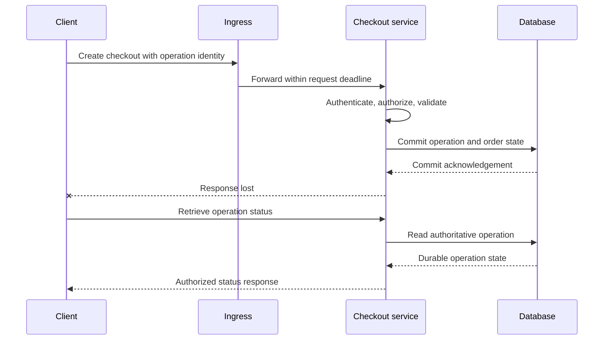
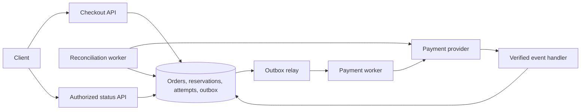
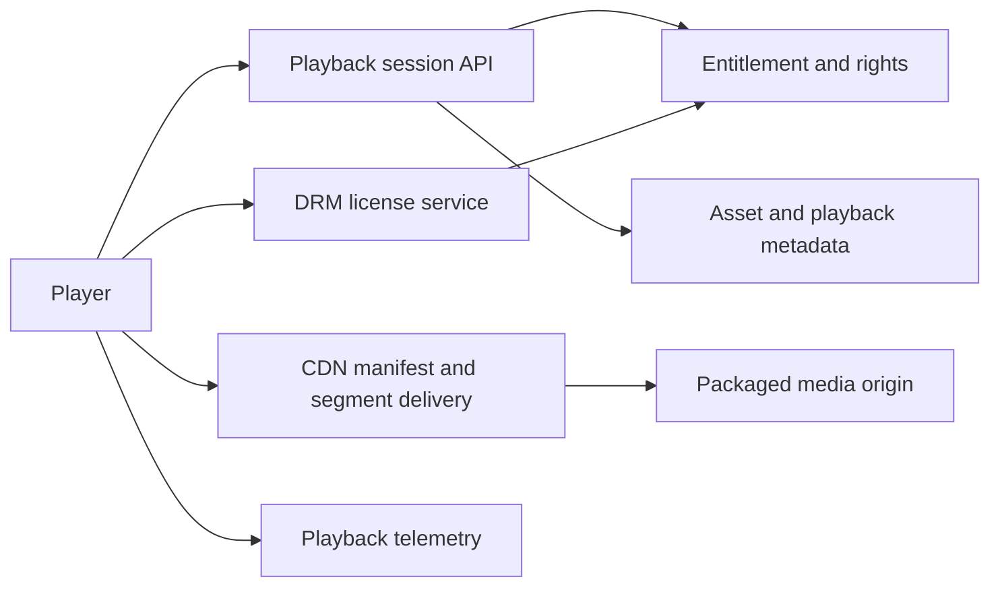

# Backend Interview Track: Fundamentals to Complete App Designs

A progressive study path for senior backend, staff and EM / SDM interviews. Focus on understanding, diagrams, spoken answers and follow-up reasoning. Work through the request traces, data contracts and failure timelines below. The focus is interview reasoning, with only a small amount of SQL where it makes concurrency concrete. It cannot cover every specialty; use the actual role description to identify additional depth.

Start with the first stage you cannot explain confidently. Advance by defending the exit question, not by marking a page as read. Proposed answers below are rehearsal material, not claimed production experience. Use measured or interviewer-provided inputs instead of inventing traffic or outcomes.

## Before the stages: understand the backend parts

A backend receives a request, decides whether the caller may perform it, changes or retrieves durable state, and returns an outcome with defined meaning. A request handler may wait for a storage connection or another service. Waiting still consumes resources, so asynchronous execution does not make capacity unlimited.

| Part | Plain-language explanation | Checkout example |
| :--- | :--- | :--- |
| Process | A running program with memory and resources | An app instance can die without erasing committed orders |
| Stateless app instance | No indispensable customer state exists only in that instance's memory | Another instance recovers the same order from durable storage |
| Connection pool | A bounded set of reusable storage connections | Requests wait when every connection is busy |
| Relational table | Records with declared fields, keys and constraints | Orders, inventory, reservations and attempts |
| Index | An access structure supporting particular searches/orderings | Find a caller's orders without scanning unrelated histories |
| Transaction | A local commit/rollback boundary with specified concurrency behavior | Commit order and reservation together |
| Cache | A reusable derived value with a freshness policy | Product descriptions can be cached; current payable terms are revalidated |
| Replica | Another copy maintained under a replication protocol | A lagging reader can miss a just-committed order |
| Queue/log | Accepted work retained for separate processing | Payment intent is accepted before its provider call completes |
| Worker | A process executing background work | Requests payment and records or reconciles its result |
| Object store | Storage for objects such as media or export artifacts | Export file stored separately from its authorized job record |
| Search index | Derived structure optimized for search access | Product discovery follows indexed data that can lag source changes |

**Why these parts are separate:** an API response must not wait indefinitely for slow providers, but accepted work must survive the API process. A queue helps separate timing. It does not solve payment correctness; durable attempt identity and recovery do. Likewise, a cache reduces read work but cannot allocate stock. Each component earns its place by a specific requirement.

**SQL versus document/key-value storage:** start with the access paths and required updates. Local joins/constraints/transactions can suit order invariants; key lookup can suit simple derived values. Neither label proves scalability. Explain the selected store's actual atomicity, indexing, partitioning and recovery boundaries before choosing it.

## The full path

| Stage | Understand | Demonstrate before moving on |
| :--- | :--- | :--- |
| 1 | Requests, networks and server execution | Trace a request and explain a timeout |
| 2 | APIs, identity and authorization | Define an accepted operation and secure resource access |
| 3 | Data models, indexes and transactions | Enforce an invariant under concurrent requests |
| 4 | Caches and replication | Explain stale state and failed dependencies |
| 5 | Queues, workers and event streams | Explain acknowledgement, replay and ordering |
| 6 | Distributed correctness | Defend consistency, leases and failover |
| 7 | Capacity, latency and overload | Derive demand and protect useful work |
| 8 | Operations and change | Detect, mitigate, migrate and recover |
| 9 | Complete app designs | Join the previous stages into one defensible system |
| 10 | Seniority and leadership | Add implementation, influence or management depth |

**Start with a worked answer:** [checkout](#worked-app-checkout-from-request-to-reconciliation), [chat](#worked-app-chat-from-send-to-reconnect), or [streaming](#assemble-an-answer-for-a-streaming-app). Then return to the stages explaining each decision.

The walkthroughs are proposed interview designs, not reports of deployed company systems. They use symbolic entities and states rather than fabricated traffic, revenue or incident measurements. Product and protocol behavior is linked to official documentation. Primary reading for technical behavior is collected at the end. The explanations here are a learning sequence, not a company's hiring rubric.

## 1. Start with one request

**Client:** the caller initiating an operation. **Server:** the process handling it. **DNS:** maps names to records used to find services. **TLS:** protects transport and authenticates the peer under its trust model. **HTTP:** defines request/response semantics. **Load balancer:** distributes traffic across eligible destinations; its behavior depends on configuration.

Trace name resolution, connection establishment, TLS, ingress, authorization, application work, database access and response. Connections may be reused, and a proxy can terminate TLS before a separate internal connection. Explain where measurement starts and ends.

A process holds state and resources. Threads or asynchronous tasks allow overlapping work, but blocked downstream operations still consume bounded resources. Concurrency is overlapping work; parallelism is simultaneous execution. More workers cannot remove a saturated database or CPU bottleneck.

**Practice question:** the app receives no response. Did the server perform the action?

> I cannot infer the business outcome from the client timeout. I would locate the request identity and the operation's durable state. The response may have been lost after commit, so retry safety depends on the operation contract.

### Walk the checkout request, one boundary at a time



**What the server actually does:** it parses the request, checks access, waits for a database connection, executes its transaction, then serializes the response. Waiting for the connection is different from executing a slow query. Instrument both or you may blame the database for time spent in the application pool.

| Failure location | What is known | Safe next step |
| :--- | :--- | :--- |
| Name lookup or connection fails | This connection did not complete; earlier attempts may still exist | Preserve the business operation identity across retries |
| Request reaches the app, app stops before commit | No successful local commit is established | Look up durable state; retry under the same operation contract |
| Database commits, response is lost | Client outcome is unknown; server state may be complete | Return the existing operation when the client retries |
| Ingress times out while app continues | HTTP deadline ended; downstream work may still run | Propagate cancellation where supported and reconcile committed work |

A request ID traces one attempt. A business operation ID connects several attempts to the same intended action. Confusing them makes tracing look complete while duplicate orders remain possible.

**Interviewer:** "Why not add more app servers?"

**Answer:** "First I would separate CPU execution from pool wait and downstream wait. More app servers can increase database connections and contention. If storage is saturated, I need to bound admission and fix the expensive access path before increasing callers."

HTTP response semantics and retry constraints are defined in [RFC 9110](https://www.rfc-editor.org/rfc/rfc9110.html). The operation lifecycle above is the proposed application contract.

**Exit:** draw the request path and identify failures before receipt, during processing and after commit. Distinguish transport success, HTTP status and business success.

## 2. APIs, identity and security

A useful API defines actors, resources, methods, validation, authorization, success/error semantics, pagination, compatibility and retry behavior. REST, GraphQL and gRPC are choices with different contracts and tooling; none provides business correctness by itself.

Authentication establishes identity. Authorization decides whether that identity may perform the action on this resource. Encryption does not replace either. Tenant identity supplied by the client must be verified against trusted context.

Idempotency means repeated application of an operation has the intended repeat-safe effect within its contract. For a business API, define identity scope, request fingerprint, concurrent execution, durable result and retention. A randomly generated key has no effect unless the server enforces it.

**Practice question:** how do you make a retried checkout safe?

> I would reuse the same operation identity and atomically bind it to the caller and request. A repeated request observes the durable operation state; a different payload conflicts. External payment outcome still needs provider cooperation and reconciliation.

### Design the actual contract, not just the endpoint name

For the checkout exercise, use these proposed interfaces:

| Interface | Contract |
| :--- | :--- |
| `POST /checkouts` | Authenticated caller submits cart reference and stable operation identity. Server computes payable amount from trusted product and pricing state |
| `GET /checkouts/{checkout_id}` | Authorized owner sees durable order and payment state; knowledge of an identifier does not grant access |
| `GET /operations/{operation_id}` | Authorized caller recovers an accepted operation after losing the response |
| Provider event endpoint | Validate provider authenticity, deduplicate events and apply legal state transitions |

**Accepted is not paid.** If payment is processed asynchronously, acceptance means the operation was durably recorded for processing. A `202` response does not mean processing succeeded. A status endpoint must distinguish pending from terminal results. [HTTP semantics](https://www.rfc-editor.org/rfc/rfc9110.html#section-15.3.3).

Here is what the operation record must let you decide:

| Stored information | Why it exists |
| :--- | :--- |
| Caller scope + operation identity, uniquely constrained | Two app instances must agree that a retry belongs to one operation |
| Canonical request fingerprint | Reusing the identity for a different cart must not silently return an unrelated result |
| Checkout reference and durable status | A retry finds accepted work even after process restart |
| Provider attempt identity and result reference | External recovery follows the same attempt rather than starting another charge |
| Retention and recovery policy | An expired deduplication record must not reopen a completed business action |

**Concurrent retry timeline:** both instances attempt to claim the same scoped identity. The database arbitrates the unique constraint. Only the accepted operation schedules work; the other request reads its state after the winning transaction resolves. An in-memory map cannot enforce this across instances or restarts.

**Real provider detail:** Stripe stores a request's resulting status and body for an idempotency key once execution begins. Its documented retention, parameter matching and retry rules constrain recovery. Do not promise that a provider key works forever. [Stripe idempotent requests](https://docs.stripe.com/api/idempotent_requests).

**Interviewer:** "The caller changes `user_id` in the URL."

**Answer:** "I authorize the target checkout against the authenticated principal. I also apply the same access rule to operation status and exports. Hiding a button in the client does not enforce access."

**Exit:** explain an asynchronous accepted response, status lookup, duplicate request, unauthorized object lookup and schema change for old clients.

Read [the answer playbook](interview-answer-playbook.md#2-worked-design-response-payment-timeout) and [identity guidance](backend-engineering-manager-guide.md#9-security-and-multi-tenancy).

## 3. Databases: access paths before product names

A schema represents entities, relationships and constraints. A primary key identifies a row; a uniqueness constraint enforces uniqueness in its declared scope. An index supports particular access paths, with storage and write costs. An execution plan reveals how a query runs.

A transaction groups database operations into a commit/rollback boundary. Isolation determines what concurrent transactions can observe and which anomalies are possible. Durability depends on the actual persistence and acknowledgement configuration. ACID is not an automatic guarantee across independent services and external providers.

Explain lost update, write skew, lock contention, deadlock and retry. Optimistic concurrency checks a version; pessimistic coordination locks appropriate state. The chosen mechanism must cover every writer.

**Practice question:** two customers try to book the same resource.

> Checking availability before inserting is insufficient because both callers may observe it as free. I would enforce the allocation invariant through a suitable constraint or transaction and define the losing request's conflict response. The design depends on discrete slots versus overlapping intervals.

### The inventory race, with the decision made explicit

The invariant in this exercise is **available stock must not become negative**. The broken flow is: read available stock, decide it is enough, then write a value calculated from that old read. Concurrent buyers can both approve themselves.

A small SQL statement makes the alternative precise:

```sql
UPDATE inventory
SET available = available - :requested_quantity
WHERE sku = :sku
  AND available >= :requested_quantity
RETURNING sku;
```

This is a proposed single-item PostgreSQL transaction step, using bound parameters. Validate that the requested quantity is positive. A returned row means this step reserved stock; no row means it did not. Put the reservation record and order change in the same transaction. If later local work fails, rollback restores the decrement.

**What happens concurrently:** competing updates to the same row coordinate through database locking. In PostgreSQL Read Committed, an update's condition is rechecked against a concurrently updated row. [PostgreSQL isolation](https://www.postgresql.org/docs/current/transaction-iso.html).

| Changed requirement | What changes in the answer |
| :--- | :--- |
| Order contains multiple SKUs | Reserve all within a transaction; use consistent lock order and bounded retries for deadlocks |
| User abandons a checkout | Persist a reservation lifecycle. Release stock once through an atomic state transition, not every time an expiry message arrives |
| Exclusive appointment slot | Enforce uniqueness for the allocated resource/slot in the database |
| Booking spans overlapping intervals | A unique start time is insufficient. Model interval overlap and choose a constraint/coordination mechanism that covers it |
| Inventory lives in another service | The local order transaction cannot commit both databases. Introduce explicit pending states and recovery between owners |

### Explain an index using a real query shape

For an order-history screen, the access path is: this caller's orders, newest first, with a stable tie-breaker. A proposed B-tree on `(customer_id, created_at, order_id)` aligns filtering and ordering. A cursor carries the last ordering tuple; the next query continues after it. Define how new orders and status changes affect pagination.

The database does not become fast merely because you say "index." Inspect the plan, rows examined, sort work and writes added by each index. B-tree multicolumn behavior is described in [PostgreSQL's index documentation](https://www.postgresql.org/docs/current/indexes-multicolumn.html).

**Interviewer:** "Why not hold the inventory transaction open while charging?"

**Answer:** "A slow provider would hold locks and a connection while the outcome can still be unknown. I would commit a bounded reservation and payment intent, then call the provider outside that transaction. That creates a business recovery problem, which I model explicitly."

**Exit:** name the invariant, index, constraint, transaction and retry behavior. Explain why an external side effect cannot be rolled back by rolling back the local transaction.

Practice [booking](backend-system-design-casebook.md#2-booking-exclusive-inventory) and [multi-tenant reporting](backend-system-design-casebook.md#9-multi-tenant-csat-and-reporting-platform).

## 4. Caching, replicas and stale observations

A cache holds derived or reusable state to reduce work. A replica maintains a copy under its replication protocol. Neither necessarily provides the newest acknowledged state.

Cache-aside reads the cache, fills on a miss and needs an update/invalidation policy. Explain a stale fill racing with a write, a hot key expiring, negative caching after object creation, and loss of cache capacity. TTL alone does not coordinate concurrent writers.

Read-your-writes is a session guarantee, not simply "use replicas." Route to authoritative state or use a freshness mechanism the storage system can actually enforce. A fixed wait or pinning duration does not prove that lag has ended.

**Practice question:** the cache is unavailable.

> I would protect the database with bounded concurrency and an explicit degradation policy. For eligible data I may serve a permitted stale value; for authoritative payment or access decisions I need the defined correctness policy. Falling through every request to storage can turn a cache outage into a database outage.

### Watch a stale value return after invalidation

For a product description, cache-aside can look correct and still race:

| Order | Reader | Writer |
| :--- | :--- | :--- |
| First | Cache miss; reads old database value | |
| Next | Pauses before filling cache | Commits new description and deletes cache entry |
| Last | Fills cache with old value | Invalidation has already happened |

Deleting the key after a write did not prevent an in-flight stale fill. For this exercise, choose an explicit product policy: bounded stale descriptions may be acceptable; checkout recomputes authoritative price and availability. TTL limits exposure under its configured lifetime but does not establish current truth.

If strict freshness is required, bypass that derived path or design version validation that covers both writes and fills. Adding a version field to the payload without checking it against authoritative progress does not fix the race.

**Replica-lag walkthrough:** checkout commits on the writer; the order-history read goes to an asynchronous replica; the order is absent. The client thinks the purchase vanished. Route recovery/status reads to authoritative state, or use a storage-supported replay-position check before serving them. Route less sensitive browsing reads according to their freshness policy.

Asynchronous replication can lag and can lose recent acknowledged changes on failover, depending on the acknowledgement policy. [PostgreSQL standby documentation](https://www.postgresql.org/docs/current/warm-standby.html).

**Interviewer:** "The cache dies during a popular event."

**Answer:** "Unrestricted misses would shift the entire demand onto storage. I would coalesce eligible fills, cap database concurrency, serve permitted stale catalog content, and reject excess work before connections are exhausted. Payment status has a different correctness policy from catalog descriptions."

**Exit:** distinguish freshness, availability and latency; explain a fill race and one replica-lag failure.

## 5. Queues, workers and event streams

A durable queue or log separates acceptance from processing. A worker claims work and produces an effect. An acknowledgement or offset identifies progress under the chosen protocol. Backpressure limits producers or consumers when capacity is insufficient.

At-least-once delivery permits duplicates. At-most-once behavior can lose work. Exactly-once claims need an explicit boundary and participating components. Kafka ordering is per partition; increasing consumers does not parallelize an ordered partition without changing the processing model.

The outbox commits business state and an event record locally; publication can replay. A dead-letter path requires diagnosis and repair, not silent abandonment. Event-time processing must account for delayed records and corrections.

**Practice question:** the worker commits its effect and crashes before acknowledgement.

> The work can replay. I would make the effect and deduplication atomic where possible, or use the destination's operation identity and reconciliation contract. A broker alone cannot make an arbitrary external action repeat-safe.

### Follow an order event through commit and replay

The dangerous dual write is: commit order, then publish event. A crash between them leaves an order with no event. Reversing the order can publish a change that never commits.

The proposed local transaction commits **order state + outbox event** together. A separate relay publishes persisted events. A relay crash after publication but before recording progress causes publication again; consumers must handle replay. This boundary and duplicate-delivery concern are documented in [AWS transactional outbox guidance](https://docs.aws.amazon.com/prescriptive-guidance/latest/cloud-design-patterns/transactional-outbox.html).

| Crash boundary | Durable evidence | Recovery |
| :--- | :--- | :--- |
| Before order/outbox commit | Neither is committed | Same operation can be retried |
| After local commit, before publication | Order and event exist | Relay resumes from persisted outbox |
| After publication, before relay checkpoint | Event may already be delivered | Republish safely; consumer deduplicates |
| After consumer effect, before acknowledgement | Effect exists, input may replay | Atomic local deduplication or destination operation contract |

For a reporting consumer, commit the processed-event identity and report update together in its own database transaction. If either fails, rollback both. For an email provider, that local transaction cannot atomically commit the remote send. Use the provider's supported recovery contract and state which duplicate/loss risk remains.

**Ordering:** if using Kafka for order events, key related changes by order so they share a partition. Per-partition ordering does not imply order across all orders, and concurrent application processing must still preserve the needed sequence. Kafka's transactional guarantees do not automatically cover an arbitrary remote sink. [Kafka design](https://kafka.apache.org/41/design/design/).

**Interviewer:** "Why not just enable exactly once?"

**Answer:** "I would name the boundary: consuming and producing within Kafka differs from charging a provider or updating a separate database. The external effect needs its own atomicity or reconciliation mechanism."

**Exit:** explain crash before commit, crash after effect, poison work, lag, partition skew and bounded recovery.

Practice [analytics](backend-system-design-casebook.md#6-analytics-and-telemetry-ingestion), [notifications](backend-system-design-casebook.md#7-notification-delivery) and [scheduling](backend-system-design-casebook.md#10-distributed-scheduler-and-work-execution).

## 6. Distributed correctness

Linearizability respects real-time ordering of operations. Serializability gives a transaction outcome equivalent to a serial execution. Eventual convergence requires an actual conflict and propagation mechanism. Do not confuse these guarantees.

A network partition prevents communication. Keeping strong correctness can require refusing operations rather than accepting conflicting writes. A consensus protocol coordinates agreement under a stated failure model; adding a replica count is not a substitute for understanding that protocol.

A lease permits ownership for a period but a paused worker can resume after expiry. Fencing requires the protected resource to reject stale owners. Sharding changes routing, locality and transaction boundaries; resharding needs a migration protocol.

A saga coordinates local transactions and compensating business operations. Intermediate state and failed compensation must be handled. Refunds and cancellation are new effects, not erasure of history.

**Practice question:** the old regional writer comes back after failover.

> I would ensure it cannot resume authoritative writes before traffic is accepted in the replacement region. Routing changes alone do not fence it. I would also state which acknowledged writes survived under the replication policy and how recovery is verified.

### A lease expires, but the worker is still alive

Consider an export worker that pauses while holding ownership. Its lease expires and another worker takes over. The original resumes. Both can now attempt to publish an export.

The proposed protocol issues monotonically increasing ownership generations. Every completion is a conditional update checked by the authoritative job store against its current generation. A stale worker cannot mark the job complete. Write outputs to attempt-specific object paths; only the winning job record points to the visible artifact. A stale worker's file can then be cleaned up without replacing the winning export.

**Where the guarantee lives:** in the conditional write and authoritative generation check. Checking a lease only at worker startup leaves a race later. If the external destination cannot reject stale ownership, describe the remaining exposure and redesign that effect boundary.

### Failover is a write-ownership problem

| Decision | What the answer must specify |
| :--- | :--- |
| Which acknowledged writes survive? | The actual replication/acknowledgement policy and last verified recovery point |
| Who can write after promotion? | Old writer is fenced through a supported storage or infrastructure mechanism |
| What does the client retry? | The same business operation, reconciled against recovered state and external providers |
| When is service restored? | Dependencies ready, ownership verified, reads and writes validated, then controlled traffic |

A DNS change selects a destination; it cannot stop an isolated old writer accepting traffic through another path. With asynchronous replication, "we have a replica" is insufficient evidence for zero data loss. [PostgreSQL failover behavior](https://www.postgresql.org/docs/current/warm-standby.html).

**Interviewer:** "Payment succeeded, reservation expired. Roll it back?"

**Answer:** "The payment is external history. I must execute a new authorized business action, such as a refund, and track its outcome. I would define whether late payment reacquires inventory or refunds, and keep unresolved compensation visible."

**Exit:** explain split brain, stale ownership, replication loss exposure, compensation and RPO/RTO.

Use [the fundamentals section](backend-engineering-manager-guide.md#4-distributed-systems-fundamentals-to-explain-without-slogans) and [regional recovery](backend-system-design-casebook.md#11-regional-failure-and-data-recovery).

## 7. Capacity, latency and overload

Separate throughput, concurrency, latency and backlog. State units and use a consistent measurement boundary.

- Request rate = requests in an observation window divided by its duration.
- In a stable system, mean in-flight work relates to arrival rate multiplied by mean time in the system.
- Queue drain time requires processing rate greater than continuing incoming rate.
- Storage depends on measured record size, retention, indexes, replication and backups.
- Fleet sizing needs safe measured capacity and the required capacity after failures.

Do not invent a peak multiplier, container throughput or universal price. Do not add component p99 values as though they produce the end-to-end p99. Fan-out and retries can amplify demand and tail latency.

**Practice question:** traffic grows and requests queue up.

> I would find the saturated resource and bound admission and queueing within useful deadlines. I would prioritize critical operations, limit retries and degrade eligible work. Scaling application workers helps only if the downstream bottleneck can support the additional load.

### Diagnose overload from evidence, not a traffic slogan

Begin with observed arrival rate, completed work, queue age, pool wait, database execution and dependency latency. No traffic number is supplied in this track, so the answer derives capacity from measurements rather than making up a fleet size.

| Observation | Interpretation to investigate | First controlled action |
| :--- | :--- | :--- |
| App CPU has headroom, connection wait increases | More requests compete for finite database connections | Cap admission and inspect slow/blocked queries |
| Provider latency rises, retry volume rises too | Retries may amplify a dependency incident | Bound attempts, use deadlines, reconcile unknown outcomes |
| Workers are busy, oldest job age keeps rising | Effective completion rate cannot catch incoming demand | Add proven processing capacity or reduce admitted work |
| One partition lags while others drain | Skew or ordered work limits parallelism | Inspect key distribution and ordering requirement |
| Healthy servers start failing probes under load | Overload can trigger removal and concentrate load elsewhere | Separate health semantics and reduce demand |

Define symbols before estimating: `lambda` is observed arrivals per second; `W` is mean time inside the same system boundary; stable mean in-flight work is `lambda * W`. It includes waiting. It is not a p99 formula and does not prove safe container capacity.

For a backlog `B`, continuing arrival rate `lambda` and sustainable completion rate `mu`, estimated drain time is `B / (mu - lambda)` only while rates are stable and `mu > lambda`. If incoming work equals processing capacity, the backlog never drains. Account for poison jobs and retries before trusting that estimate.

**What I would say:** "I would protect order-status and payment reconciliation, shed optional recommendations, and set a bounded admission policy. I would validate recovery by completion rate and oldest unresolved work, not just a falling HTTP error rate."

Load shedding and retry-driven cascading failure are grounded in [Google SRE overload guidance](https://sre.google/sre-book/handling-overload/). The checkout prioritization is a proposed product policy.

**Exit:** explain deadlines, jitter, retry budgets, bulkheads, load shedding, cache warming and hot partitions.

## 8. Operate and change the system

Define user outcomes, eligible requests and observation windows before setting SLOs. Track latency distributions, errors, saturation, queue age, freshness and unresolved business operations. Logs, metrics and traces have different roles; correlate with safe identities and control sensitive data and metric cardinality.

For incidents, choose a safe mitigation, coordinate responsibilities and verify recovery. A rollback may be incompatible with changed data. Expand-contract helps compatibility, but DDL can still lock. Backfills need checkpoints, throttling and concurrent-write reconciliation.

Replication is not an independent backup. Exercise restoration and inspect dependency readiness. Separate availability recovery from repairing inconsistent business state.

**Practice question:** how do you change a large table while the service runs?

> I would review the actual DDL lock behavior, bound lock waits, introduce compatible structures, backfill resumably and compare representations. I would switch reads only after validation and retire old paths after dependencies and recovery needs are resolved.

### An incident answer with an actual decision sequence

**Failure drill:** checkout requests time out, provider requests may have succeeded, and unresolved attempts accumulate.

| Phase | Action | Evidence to inspect |
| :--- | :--- | :--- |
| Establish scope | Separate checkout acceptance, provider completion and customer-visible status | Stage latency, attempt state, provider references and affected release |
| Contain | Stop unsafe new attempts or roll back a compatible release; preserve reconciliation | New ambiguous attempts stop accumulating |
| Communicate | Assign incident command, provider investigation and customer-impact ownership | Decision log with responsibilities and next checkpoint |
| Recover | Resolve persisted attempts through the provider-supported status/event path | Unknown outcomes reach legal terminal states |
| Verify | Compare authoritative orders with provider results and remaining exceptions | Business recovery, not only healthy endpoints |

Do not log payment credentials or use every order ID as a metric label. Keep high-cardinality identities in access-controlled logs/traces and aggregate metrics by bounded categories.

### A live schema migration, step by step

Suppose the proposed order model moves from one status field to separate order and payment status. Do not guess how legacy states map; write and review that mapping first.

1. Add compatible fields after reviewing the exact database lock behavior. Set bounded lock waits and retry safely.
2. Deploy code that maintains both representations in the same transaction while old readers remain supported.
3. Backfill in resumable batches. Guard updates with the row version or applicable predicate so a stale backfill cannot overwrite a newer live transition.
4. Compare representations and investigate mismatches. A completed batch counter is not proof of semantic correctness.
5. Switch reads gradually and monitor both user outcomes and mismatches. Keep the compatible fallback during the agreed recovery period.
6. Retire old readers/writers before removing the legacy field. After removal, old binaries may no longer be safe rollback targets.

DDL lock and validation behavior varies by operation; consult [PostgreSQL ALTER TABLE](https://www.postgresql.org/docs/current/sql-altertable.html), not a blanket claim that schema changes are online.

**Exit:** explain an SLI denominator, alert response, migration race, canary validation and restored-data verification.

## 9. From fundamentals to complete apps

These are familiar product-domain exercises, not verified internal architectures. Build one end-to-end answer at a time.

| App type | Put these concepts together | Required failure walkthrough |
| :--- | :--- | :--- |
| Commerce / checkout | APIs, inventory transaction, payment attempt, outbox, status | Provider accepts while the response is lost |
| Booking | Resource/time model, allocation invariant, hold expiry | Confirmation races with expiration |
| Chat | Durable acceptance, conversation ordering, realtime hints, sync | Gateway dies after accepting a message |
| Feed | Candidate generation, access rules, caching, pagination | Deletion or blocked content remains in derived state |
| Search | Snapshot, CDC, index versions, query serving | Old replay tries to resurrect a deletion |
| Analytics | Durable ingestion, schema, deduplication, windows, storage | A sink succeeds before its offset is committed |
| Notifications | Intent, preferences, expiry, provider worker, token version | Old provider feedback arrives after registration changes |
| Streaming | Entitlement, session, licensing, media/CDN, ad decisions | Paid playback fails while segments remain reachable |
| Reporting platform | Tenant isolation, queries, export jobs, retention | Export authorization bypasses the UI checks |
| AI gateway | Authorization, admission, cancellation, versioned evaluation | Client disconnects but expensive work continues |

Use [all twelve backend cases](backend-system-design-casebook.md) and [streaming failure walkthroughs](streaming-business-and-architecture.md). Each answer should identify the source of truth, acceptance boundary, invariant, failure policy and customer consequence.

### Worked app: checkout from request to reconciliation

**Opening answer to rehearse:**

> I would start with one merchant checkout and separate accepting an order from completing payment. The core invariants are no oversold stock and no new charge merely because a caller retries. I would put the operation claim, order, reservation and payment intent in one local transaction, publish work through an outbox, and recover provider uncertainty through the persisted attempt. The customer gets a durable status path throughout.

#### Draw the boundaries



Start with logical components; the API, handler and workers do not all need separately deployed services. The database is authoritative for local order state. The provider is authoritative for its payment outcome.

#### Records and state transitions

| Record | Fields that matter | Enforcement |
| :--- | :--- | :--- |
| Operation | Caller, operation identity, fingerprint, checkout reference | Unique scoped identity; payload comparison |
| Reservation | Order, SKU, quantity, state, expiry, version | Atomic inventory allocation and one-time release |
| Payment attempt | Order, provider operation identity, state, provider reference | Persist before external call; reconcile the same attempt |
| Provider event | Verified source, event identity, associated attempt | Deduplicate transactionally with the local transition |
| Outbox | Event identity, aggregate, payload, publication progress | Commit with business state; replay-safe relay |

Proposed payment progression: `created -> submitted -> unknown / succeeded / failed`. Unknown is unresolved, not terminal failure. Late evidence may resolve unknown. Refund has its own attempt and outcome rather than changing history to "never paid."

#### The normal path

1. Authenticate and authorize the cart. Compute price server-side and validate current products and quantity.
2. Atomically claim the operation, allocate inventory and store order, reservation, payment attempt and outbox event. A conflict rolls back local changes.
3. Return durable acceptance with the checkout reference. A concurrent retry observes the same operation.
4. Worker calls the provider using the persisted attempt identity within its supported retry contract.
5. Persist verified provider outcome and the permitted order transition. Fulfillment follows the completed business condition, not an HTTP response from the initial API.

#### The failure that reveals whether the design works

The provider accepts payment; the worker dies before writing success. The durable attempt still exists. Another worker must not generate a new provider identity. Recover by provider-supported retrieval, verified events or safe same-attempt retry within the provider contract. If the result remains unknown, preserve it for reconciliation and exceptions.

**Changed constraint: reservation expired.** Decide the product policy before implementing it. A late success may reacquire inventory atomically if allowed, or start a refund. Keep refund failure visible. Do not promise the local reservation rollback reverses a provider charge.

**Staff follow-up:** show which transactions arbitrate duplicate callers, expiry and callbacks. **EM follow-up:** name the reconciliation owner, exception process, rollout dependencies and support communication. **Leadership follow-up:** explain the accepted customer and business risk of the late-payment policy.

See [the complete payment case](backend-system-design-casebook.md#1-checkout-payments-and-inventory) for additional constraints.

### Worked app: chat from send to reconnect

**Opening answer to rehearse:**

> I would separate durable acceptance, recipient delivery and reading. A WebSocket is an online transport, not the source of message history. The sender uses a stable message identity, the server validates membership and persists before acknowledging, and reconnecting devices recover from a durable cursor. Realtime hints can be missed without losing accepted history.

#### Request and data model

| Contract or record | Purpose |
| :--- | :--- |
| `POST /conversations/{id}/messages` | Stable sender message identity; authenticated conversation access |
| `GET /conversations/{id}/messages?after={cursor}` | Ordered durable history with authorized, bounded pagination |
| Message record | Conversation, sender, client identity, server sequence, content reference and deletion state |
| Membership record | Principal, conversation and permitted access history |
| Device cursor | Last applied durable position; persisted after local application |
| Read watermark | Monotonic read position under the chosen receipt policy |

A proposed transaction serializes sequence allocation for a conversation and inserts the message with a unique sender/client identity. This makes retries repeat-safe and order explicit, but a hot conversation can contend on the sequencer. That is an accepted baseline cost, not a reason to invent global ordering.

#### Follow a send through a crash

1. Client persists a pending message and operation identity before sending.
2. Server authorizes membership and commits the message and online-delivery event locally.
3. Gateway dies before the sender sees the acceptance acknowledgement.
4. Sender retries the same identity against another gateway. Server returns the existing message rather than inserting another.
5. Recipient reconnects with its cursor. Server serves missed durable history; client inserts messages and advances its local cursor in one transaction.

If the sync cursor is older than retained history, return an explicit resync requirement. The client obtains a new snapshot while preserving its local unsent messages. Silently returning an empty page would imply it is caught up when it is not.

**Changed constraint: removed group member.** Check access on history reads as well as online delivery. A cursor is a position, not permission. Decide whether removal revokes historical access and handle cached/encrypted content under the actual product policy.

**Interviewer:** "Why not push every message and call it delivered?"

**Answer:** "Provider acceptance or socket write only describes that hop. Device application and read acknowledgement are separate observations. I would keep receipt states distinct and recover from durable history even when a realtime hint is missing."

See [the messaging case](backend-system-design-casebook.md#3-durable-messaging-and-offline-synchronization) and [the client design](messaging-chat.md).

### Assemble an answer for a streaming app

**Opening answer to rehearse:**

> I would split playback startup from media delivery. The control path verifies entitlement and creates a playback session; the data path delivers packaged media through a CDN. DRM licensing is a separate dependency that must authorize key access. I would measure where startup fails before choosing a fallback, and I would not send every media segment through the entitlement database.



HLS uses playlists and media segments; delivery and compatibility details are documented by [Apple](https://developer.apple.com/streaming/). The control-plane boundaries above are a proposed application design.

| Startup step | Persist or validate | Failure response to explain |
| :--- | :--- | :--- |
| Discover content | Asset identity and available product/rights policy | Catalog visibility does not prove playback permission |
| Create session | Principal, asset, policy decision, session state | Resolve stale subscription or unavailable authorization under an explicit policy |
| Fetch manifest | Session-scoped access and compatible renditions | Reject cross-user personalized cache reuse; diagnose stale live playlist |
| Acquire license | Session/asset authorization and supported DRM exchange | Media bytes being available does not supply decryption keys |
| Start playback | First rendered frame and subsequent stall observations | Separate startup failure, buffering and decode errors |
| Renew or switch delivery | Active policy and compatible segment continuity | Bound retries; do not assume the alternate CDN is already warm or sufficiently provisioned |

**Licensing outage walkthrough:** a new session has no usable key and cannot decrypt media. An existing session may continue only while its valid license and access policy permit. Segment availability or a healthy session API does not prove recovery. Inspect new-start and renewal outcomes separately.

**Ad decision timeout walkthrough:** the chosen ad policy determines whether content continues, filler is used or the session fails. Keep the decision within a deadline and assign one measurement owner. A server-side inserted creative does not prove it was rendered.

**Live latency walkthrough:** trace capture, encode, package, publish, CDN freshness and player buffer. A late playlist can keep a player behind the live edge despite fast segment downloads. Diagnose the stage before reducing buffers and increasing stalls.

**CDN failover walkthrough:** confirm compatible asset paths, credentials, freshness and media continuity. Move traffic within verified survivor capacity; retries against an overloaded alternate can worsen the outage.

**EM follow-up:** define the rehearsal across entitlement, media, licensing, ads and player owners, with customer-outcome checks for new and existing sessions. **Staff follow-up:** trace cache keys, signed access, renewal and live continuity. **Leadership follow-up:** explain rights and fallback policy with the stakeholders who own those decisions.

Read the [five detailed streaming failure walkthroughs](streaming-business-and-architecture.md) after you can explain this normal startup path.

## 10. Adapt the same design to your role

| Role | Add to the technical answer |
| :--- | :--- |
| Senior backend | Concrete access paths, request lifecycle, error handling and operational reasoning |
| Staff / principal | Protocol depth, failure boundaries, migrations and cross-team adoption |
| EM / SDM | Ownership, people development, staffing, delivery and incident mechanisms |
| Broader leadership | Portfolio choices, dependency investment, business risk and leadership development |

For Rahul, use [the resume evidence plan](rahul-backend-interview-plan.md). Streaming and CSAT are actual project anchors; reconstruct personal server-side ownership before presenting a practice design as work you delivered.

## Reading map and readiness

| Need | Primary source |
| :--- | :--- |
| Request and method semantics | [RFC 9110](https://www.rfc-editor.org/rfc/rfc9110.html) |
| Identity security | [OAuth security BCP](https://www.rfc-editor.org/rfc/rfc9700) |
| Isolation and concurrency | [PostgreSQL isolation](https://www.postgresql.org/docs/current/transaction-iso.html) |
| Replication and failover | [PostgreSQL replication](https://www.postgresql.org/docs/current/warm-standby.html) |
| Ordering and replay | [Kafka design](https://kafka.apache.org/41/design/design/) |
| Atomic local event publication | [AWS outbox](https://docs.aws.amazon.com/prescriptive-guidance/latest/cloud-design-patterns/transactional-outbox.html) |
| Distributed compensation | [AWS saga orchestration](https://docs.aws.amazon.com/prescriptive-guidance/latest/cloud-design-patterns/saga-orchestration.html) |
| Overload and operational objectives | [Google SRE overload](https://sre.google/sre-book/handling-overload/), [SLOs](https://sre.google/sre-book/service-level-objectives/) |
| Safe DDL | [PostgreSQL ALTER TABLE](https://www.postgresql.org/docs/current/sql-altertable.html) |

You are ready to advance when you can explain the concept simply, apply it to an app, defend a changed constraint and walk through a failure. Use [the answer playbook](interview-answer-playbook.md) to practice aloud and [the master guide](backend-engineering-manager-guide.md) to deepen a weak topic. Coding requirements vary by role; this interview track emphasizes reasoning and explanation rather than adding code.
