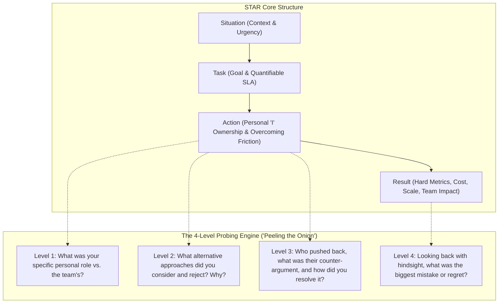

# FAANG & Tier-1 Behavioral Master Guide for Engineering Managers (EM), Staff/Principal Engineers & Directors
### Master the STAR Technique, Probing Dimensions ("Peeling the Onion"), and Executive Competencies Across Google, Meta, Amazon, Netflix, Apple & Uber

---

## 🎯 Executive Overview & The Leveling Philosophy

In Staff Engineer, Engineering Manager (EM), and Director interview loops at Tier-1 tech companies (**Google, Meta, Amazon, Netflix, Apple, Uber, Stripe**), behavioral rounds carry equal or greater weight than technical system design. 

Over **$50\%$ of candidates who pass system design fail at the behavioral bar**. Why?
* They give high-level, generic answers filled with ambiguous *"we did this"* rather than specific *"I decided, I executed, I owned"*.
* They cannot defend their decisions when the interviewer **"peels the onion"** ($3\text{--}4$ layers of probing follow-ups).
* They lack clear, quantifiable **business and engineering metrics** to validate their results.
* They describe textbook processes rather than authentic leadership scars, vulnerability, and trade-offs.

```ascii
+----------------------------------------------------------------------------------------------------+
|                         BEHAVIORAL LEVELING EXPECTATIONS MATRIX                                    |
+---------------+------------------------------+-----------------------------------------------------+
| Role / Level  | Scope of Ownership           | Key Evaluation Lens                                 |
+---------------+------------------------------+-----------------------------------------------------+
| Senior (L5)   | Team-level project delivery  | Technical excellence, independence, team mentorship |
| Staff (L6)    | Multi-team / Domain impact   | Technical strategy, influence without authority,    |
|               |                              | proactive risk mitigation, cross-org unblocking     |
| EM (L6 / M1)  | Engineering team (8-15 eng)  | People growth, performance management, delivery,    |
|               |                              | hiring bar, product/business partnership            |
| Principal/Dir | Multi-org / Business unit    | Multi-year vision, organizational design, culture,  |
| (L7+ / M2+)   | (30-100+ engineers)          | capital allocation, executive stakeholder alignment |
+---------------+------------------------------+-----------------------------------------------------+
```

---

## 📐 The STAR Technique & The Art of "Peeling the Onion"

Every behavioral response must follow the strict **STAR format** (Situation / Task, Action, Result). 
However, at Staff, EM, and Director levels, the interviewer will not just listen passively—they will actively interrupt to **"peel the onion"** to test if you were truly the primary driver or just a bystander.



### 1. Situation / Task: Setting the Stakes ($15\%\text{ of time}$)
* **Context**: What company, team, and business moment?
* **Importance**: Why did this matter to the executive team and end users?
* **Goal & Initial Scope**: What was the baseline metric, and what was the target SLA?
* **Challenges & Friction**: Why was this hard? (Technical debt, cross-team silos, conflicting incentives, tight deadlines).
* **Consequence of Inaction**: What catastrophe would have occurred if you did nothing? (Customer churn, revenue loss, Sev-1 outage).

### 2. Action: Personal Leadership & Execution ($65\%\text{ of time}$)
* **The "I" Mandate**: Use *"I decided"*, *"I aligned"*, *"I designed"*, *"I intervened"*. Reserve *"we"* strictly for collective team execution.
* **Key Driver / Project Owner**: Explicitly declare your role (e.g., *"I was the directly responsible individual (DRI) / Lead EM for the 14-person initiative"*).
* **Unique Value**: What did you do that any other engineer or manager wouldn't have done?
* **Obstacles Overcome**: How did you handle unexpected technical roadblocks or stakeholder resistance?

### 3. Result: Quantifiable Business & Engineering Impact ($20\%\text{ of time}$)
* **Hard Numbers**: Always quantify in three dimensions:
  1. **Engineering Quality**: Crash-Free Users ($\text{CFUR} \ge 99.9\%$), Video Startup Time (VST $\downarrow 40\%$), P99 latency.
  2. **Business / Financial**: Cost savings (\$ Saved), ARR revenue unblocked, customer churn reduction.
  3. **People & Team**: Promotion rate, attrition reduction, team velocity increase, post-incident cultural shift.

---

## 🌟 1. Ownership

> *"Leaders are owners. They think long term and don't sacrifice long-term value for short-term results. They act on behalf of the entire company, beyond just their own team. They never say 'that's not my job'."* — Amazon LP & Google Leadership Core

```ascii
+-----------------------------------------------------------------------------------+
|                        OWNERSHIP: EVALUATION RUBRIC                               |
+---------------------+-------------------------------------------------------------+
| Red Flag (No Hire)  | Blames other teams, external vendors, or legacy code.        |
|                     | Stops at team boundaries ("The backend API was late").      |
+---------------------+-------------------------------------------------------------+
| Meets Bar (L5/L6)   | Takes full responsibility for delivery within team domain.  |
|                     | Proactively flags risks and escalates before deadlines.     |
+---------------------+-------------------------------------------------------------+
| Exceeds Bar (L6/L7) | Steps into organizational voids where ownership is ambiguous|
|                     | Solves root issues across org silos to protect company goal.|
+---------------------+-------------------------------------------------------------+
```

### Real Interview Questions (FAANG & Tier-1)
1. *"Tell me about a time when a critical project was falling behind schedule or failing, and nobody was taking responsibility. What did you do?"* (Amazon / Google)
2. *"Describe a situation where you inherited a broken system or demoralized team with immense technical debt. How did you turn it around?"* (Meta / Uber)
3. *"Tell me about a time you made a hard technical or managerial decision that hurt your team's short-term delivery but protected the company's long-term health."* (Netflix / Apple)

### The Probing Questions ("Peeling the Onion")
* *Why was it your responsibility to step in if another team owned that component?*
* *How did the other team's manager or Tech Lead react when you stepped into their domain?*
* *What did you have to deprioritize or sacrifice from your own roadmap to fix this?*
* *If the project had still failed after your intervention, who would have taken the blame?*

---

### Exemplar STAR Response: Taking Ownership of Cross-Org Live Streaming Latency Crisis

#### Situation & Task:
At a top video streaming platform with $45\text{M}$ active subscribers, we were $6\text{ weeks}$ away from broadcasting our first high-profile live sports tournament. During end-to-end integration testing, glass-to-glass latency ballooned to **$18\text{ seconds}$**—far above our advertised product SLA of **$\le 4.0\text{ seconds}$**. 
The broadcast ingest team blamed the cloud transcoder vendor; the cloud infrastructure team blamed the Edge CDN caching policies; and the mobile player team claimed the backend ABR manifests were malformed. Because this fell across three distinct organizational directorates, each team retreated into silos. If we launched with an $18\text{s}$ delay, social media spoilers on Twitter/X would destroy our product launch, trigger massive brand damage, and threaten an estimated **$\$12\text{M}$ in live advertising revenue**.

#### Action:
As the Staff Engineer / EM leading the Mobile Playback Core domain, I recognized that while my team only owned the client player, our customers only care about the end-to-end screen experience. I stepped into the leadership void and appointed myself the **Cross-Functional Direct Responsible Individual (DRI)**:
1. **Established Single Source of Truth Telemetry**: I found that each team used disparate logging clocks with up to $2\text{s}$ drift. I drafted an emergency RFC mandating unified **Presentation Timestamp (PTS) and Wall-Clock epoch tracing** injected into chunk headers.
2. **Peeling the Onion on Root Causes**: Personally auditing the traces, I identified that the transcoder was emitting non-aligned $2\text{-second}$ GOPs instead of $500\text{ms}$ CMAF chunks, while the mobile player was requesting $3\text{ chunks}$ before starting playback ($6\text{s}$ initial buffer).
3. **Cross-Team Alignment**: I called an urgent alignment meeting with the Transcoder Director and CDN Architect. Instead of pointing fingers, I showed the end-to-end packet waterfall. I negotiated an immediate trade-off: the backend team tuned FFmpeg chunking to $300\text{ms}$ parts; the CDN team configured HTTP/2 Chunked Transfer; and I directed my mobile engineering team to implement **Low-Latency HLS (LL-HLS)** partial segment parsing using Apple `AVPlayer` reverse-engineered resource loader hooks.
4. **De-risking Delivery**: I established daily $15\text{-minute}$ cross-functional war-room standups, instituted automated daily latency canary runs across real cellular networks, and built a remote kill switch to fall back to standard HLS if packet loss exceeded $8\%$.

#### Result:
* Successfully reduced production live latency from **$18.0\text{ seconds} \rightarrow 3.1\text{ seconds}$** (p95) on cellular 4G/5G, comfortably beating the $4.0\text{s}$ SLA.
* During tournament premiere night ($28\text{M}$ peak concurrent viewers), the system held steady with zero Sev-1 incidents, achieving a **$99.85\%$ playback success rate** and protecting the full **$\$12\text{M}$ ad revenue**.
* Post-tournament, the VP of Engineering formalized my cross-functional latency taskforce into a permanent Core Media Architecture Board, co-chaired by myself.

#### Probing Follow-Up Defense:
* *Probe: Did the Ingest team resent you taking charge?*
  * *Answer: "Initially, their Principal Architect felt defensive because my traces proved their GOP sizes were unaligned. I scheduled a 1-on-1, walked through the customer impact, and framed it as a shared win. I ensured the broadcast team was publicly credited in executive post-mortems for their rapid re-encoding optimization."*

---

## ⚡ 2. Bias for Action

> *"Speed matters in business. Many decisions and actions are reversible and do not need study. We value calculated risk taking."* — Amazon LP & Meta "Move Fast"

```ascii
+-----------------------------------------------------------------------------------+
|                     BIAS FOR ACTION: DECISION FRAMEWORK                           |
+------------------------------------+----------------------------------------------+
| Type 1: One-Way Doors (Irreversible)| Rigorous deliberation, deep data, VP sign-off|
| (Database migration, DRM schema)   | Example: Changing video container to CMAF    |
+------------------------------------+----------------------------------------------+
| Type 2: Two-Way Doors (Reversible) | Rapid execution with 60-70% information.     |
| (AB testing, player buffer tuning) | Example: Remote flag rollout of ABR algorithm|
+------------------------------------+----------------------------------------------+
```

### Real Interview Questions (FAANG & Tier-1)
1. *"Tell me about a time you had to make a high-stakes decision with incomplete or ambiguous data. How did you decide, and what was the outcome?"* (Amazon / Meta)
2. *"Describe a scenario where analysis paralysis was stalling your team. How did you force momentum?"* (Google / Stripe)
3. *"Give an example of a calculated risk you took that failed. What did you learn, and how did you recover?"* (Netflix / Apple)

### The Probing Questions ("Peeling the Onion")
* *What specific data was missing that normally would have been required?*
* *How did you quantify the downside risk before pulling the trigger?*
* *What was your rollback plan if your hypothesis proved wrong within the first 10 minutes?*
* *Why didn't you wait 48 hours to gather more metrics?*

---

### Exemplar STAR Response: Emergency Mitigation of Zero-Day Mobile Crash Before Global Event

#### Situation & Task:
At a social media app ($85\text{M}$ DAU), our largest annual live shopping festival was scheduled to begin on a Friday evening. At 1:00 PM (5 hours before broadcast), our automated observability telemetry flagged a sharp increase in **Application Not Responding (ANR) hangs on Android ($0.8\% \rightarrow 4.2\%$)** in the newly released v12.4 client app, clustered in Germany and Japan.
Because the release had already reached a $30\%$ rollout stage, over **$2.5\text{M}$ users** were running the unstable build. The engineering team was trapped in analysis paralysis: some suggested waiting 4 hours for crash symbolication dumps to finalize, while others advocated for an immediate full App Store hotfix release (which would take $24\text{--}48\text{ hours}$ for Google Play review). Doing nothing guaranteed that hundreds of thousands of users would experience frozen screens during the live shopping launch, with an estimated hourly GMV loss of **$\$450,000$**.

#### Action:
Recognizing this was an urgent **Type 2 reversible crisis**, I intervened immediately:
1. **Pivoted from Diagnosis to Blast-Radius Containment**: I mandated that we halt debugging the C++ core and focus 100% on stopping user impact. I determined that waiting for perfect symbolication was an unacceptable risk.
2. **Dissected Real-Time Telemetry**: Looking at our edge feature configuration dashboard, I correlated the timing of the ANR spike with a dynamic remote config payload update pushed 90 minutes earlier for a new animated shopping cart badge.
3. **Executed Calculated Action via Feature Flags**: Within $12\text{ minutes}$, I triggered a global emergency feature flag kill switch disabling the dynamic vector animation engine for all v12.4 clients worldwide, forcing a fallback to static PNG rendering.
4. **Calculated Trade-Off**: Product stakeholders initially objected, arguing that static icons looked dated. I overrode the objection using hard numbers: *"A static icon costs us zero dollars; a frozen app costs us \$450K per hour and destroys retention."*
5. **Post-Action Deep Root Cause**: Once the fire was out, I led the investigation. We discovered a thread deadlock in the Android Skia graphics render pipeline when parsing SVG gradients under high memory pressure.

#### Result:
* Within $8\text{ minutes}$ of the feature flag flip, ANR rates dropped from **$4.2\% \rightarrow 0.08\%$**, well below our baseline crash ceiling.
* Not a single customer dropped during the live shopping festival; total live GMV reached **$\$8.2\text{M}$**, breaking all platform records.
* In the subsequent engineering retrospective, I authored the company's **"15-Minute Containment Standard"**, requiring all new mobile UI features to carry an isolated, zero-dependency remote kill switch.

#### Probing Follow-Up Defense:
* *Probe: What if the feature flag flip hadn't resolved the crash?*
  * *Answer: "I had already put our mobile release engineer on standby to initiate a phased binary rollout rollback in the Google Play Console at 1:30 PM. I gave the feature flag mitigation a strict 15-minute verification window. Because the flag worked within 8 minutes, we avoided a destabilizing binary rollback."*

---

## 🤝 3. Agree to Disagree and Commit

> *"Leaders are obligated to respectfully challenge decisions when they disagree, even when doing so is uncomfortable or exhausting. Leaders have conviction and are tenacious. They do not compromise for the sake of social cohesion. Once a decision is determined, they commit wholly."* — Amazon LP & Netflix Culture

```ascii
+-----------------------------------------------------------------------------------+
|               AGREE TO DISAGREE AND COMMIT: THE MATURITY SPECTRUM                 |
+---------------------+-------------------------------------------------------------+
| Toxic Dissent       | Silent agreement in meetings, passive sabotage afterward.   |
|                     | Saying "I told you so" when the chosen path struggles.      |
+---------------------+-------------------------------------------------------------+
| Professional Dissent| Argues passionately with verified data, tests assumptions,  |
|                     | challenges senior leadership respectfully.                  |
+---------------------+-------------------------------------------------------------+
| Full Commitment     | Once decided, adopts the decision as if it were their own.   |
|                     | Motivates team, builds safeguards, and ensures execution.   |
+---------------------+-------------------------------------------------------------+
```

### Real Interview Questions (FAANG & Tier-1)
1. *"Tell me about a time you strongly disagreed with your manager, Tech Lead, or VP on an architectural or product direction. How did you handle the debate, and what happened after the decision was made?"* (Google / Amazon)
2. *"Describe a scenario where you had to lead your team to execute a technical strategy that you personally opposed. How did you maintain team morale?"* (Meta / Uber)
3. *"Give an example where you pushed back against a product requirement because of engineering integrity. Did you win or lose?"* (Apple / Stripe)

### The Probing Questions ("Peeling the Onion")
* *What was the exact data or rationale behind your counterpart's opposing view?*
* *How did you communicate the final decision to your engineering team without undermining leadership?*
* *Did you secretly hope the other approach would fail to prove yourself right?*
* *If the chosen direction started failing, at what point would you reopen the debate?*

---

### Exemplar STAR Response: Navigating Server-Driven UI (SDUI) vs. Native Rewrite Conflict

#### Situation & Task:
Our mobile engineering organization was facing severe velocity bottlenecks: shipping new checkout payment flows across iOS, Android, and Web required three separate engineering efforts and synchronized App Store release cycles.
Our VP of Engineering and Principal Backend Architect proposed a company-wide mandate: **Rewrite the entire checkout funnel using a Server-Driven UI (SDUI) JSON engine**. 
As the Mobile Engineering Manager / Staff Architect, I strongly disagreed with a wholesale SDUI rewrite. While SDUI offered backend release agility, my audit revealed that our checkout conversion relied heavily on ultra-responsive tactile micro-animations (Apple Pay haptics, instant field validation, biometric autofill). A pure SDUI approach would introduce network latency dependencies, degrade accessibility (VoiceOver/TalkBack), and increase App Start Time. I calculated that an unbuffered SDUI screen transition would add **$350\text{ms}$ to checkout latency**, which industry data correlates with a **$1.2\%$ drop in purchase conversion** ($>\$4\text{M}$ annual GMV risk).

#### Action:
1. **Structured Constructive Dissent with Hard Evidence**: Rather than expressing emotional skepticism, I built a 3-page engineering whitepaper. I developed a fast 2-day native prototype comparing pure SDUI against a hybrid component-based architecture. I measured frame render times ($60\text{fps}$ vs. $38\text{fps}$ drops on low-end Android) and network failure edge cases.
2. **Defended the Position in Executive Review**: During the architecture review, I walked the VP and Product Directors through the latency data and accessibility compliance gaps. The Principal Backend Architect defended SDUI, arguing that eliminating cross-platform mobile sprint lag was worth the trade-off.
3. **The Executive Decision**: The VP acknowledged my concerns but ultimately ruled in favor of full SDUI, prioritizing unified business experiment velocity for our 40 marketing PMs.
4. **Committed 100% Without Hesitation**: The moment the VP made the call, I transitioned immediately from dissenter to champion. 
   * In my team all-hands, I did **not** say: *"Management forced this on us."* Instead, I framed it objectively: *"Our company priority this year is experimentation agility. Our mission now is to make this SDUI engine faster and more reliable than any pure native implementation in the industry."*
   * I took ownership of solving the exact risks I had highlighted: I designed an **on-device JSON schema cache**, an **optimistic UI rendering model**, and a **client-side state machine** to eliminate the $350\text{ms}$ network lag.

#### Result:
* The SDUI checkout platform launched globally on schedule across iOS and Android within $5\text{ months}$.
* Thanks to the client-side caching architecture my team built, checkout P95 screen transition latency was held to **$< 80\text{ms}$**, completely eliminating the anticipated conversion drop.
* Marketing experiment velocity increased by **$400\%$** (teams launched payment tests in 2 hours via backend CMS without App Store review).
* In my annual performance review, the VP praised my behavior, highlighting that my rigorous dissent improved the system's architecture, while my wholehearted commitment ensured the project's success.

#### Probing Follow-Up Defense:
* *Probe: How did your engineers feel when you told them they had to build SDUI after you spent weeks arguing against it?*
  * *Answer: "Two senior engineers were vocal skeptics and threatened to transfer teams. I met with them individually, validated their technical points, and redirected their passion. I challenged them: 'Let's prove that mobile engineers can build an SDUI client that beats native benchmarks.' Giving them ownership of the client caching engine converted their skepticism into technical pride."*

---

## 🔍 4. Learn and Be Curious

> *"Leaders are never done learning and always seek to improve themselves. They are curious about new possibilities and act to explore them."* — Amazon LP & Google Technical Acuity

```ascii
+-----------------------------------------------------------------------------------+
|                     LEARN & BE CURIOUS: LEADERSHIP STAGES                         |
+---------------------+-------------------------------------------------------------+
| Stage 1: Reactive   | Learns only when forced by deprecation or company mandate.  |
+---------------------+-------------------------------------------------------------+
| Stage 2: Proactive  | Continuously investigates emerging tech, reads whitepapers, |
|                     | benchmarks industry architectures before they become common.|
+---------------------+-------------------------------------------------------------+
| Stage 3: Catalyst   | Turns personal curiosity into organizational capability;    |
|                     | mentors others, authors RFCs, transforms engineering culture|
+---------------------+-------------------------------------------------------------+
```

### Real Interview Questions (FAANG & Tier-1)
1. *"Tell me about a time when you realized your technical knowledge was outdated or insufficient for an upcoming architectural challenge. What did you do?"* (Google / Apple)
2. *"Describe a situation where a deep curiosity about a minor system anomaly led to a significant discovery or optimization."* (Amazon / Meta)
3. *"How do you keep yourself and your engineering team technically sharp amidst tight delivery deadlines?"* (Stripe / Netflix)

### The Probing Questions ("Peeling the Onion")
* *How did you find the time to learn this while managing your day-to-day deliverables?*
* *How did you separate genuine technological evolution from temporary industry hype?*
* *How did your personal learning directly translate into a business win?*

---

### Exemplar STAR Response: Overhauling Mobile Networking via HTTP/3 & QUIC Exploration

#### Situation & Task:
Our global ride-hailing / delivery application was experiencing high API failure rates (**$3.8\%$ network timeout errors**) in emerging markets (India, Brazil, Indonesia), where drivers frequently transitioned between cellular cell towers, Wi-Fi, and dead zones.
Our existing networking stack relied on traditional HTTP/2 over TLS/TCP. Under TCP, any single dropped packet in cellular handoff causes **Head-of-Line (HoL) blocking**, stalling all multiplexed API requests for up to $1.5\text{ seconds}$. 
At the time, **HTTP/3 over QUIC (UDP)** was still an emerging standard with limited enterprise adoption in mobile apps. My task was to discover whether our organization could leverage QUIC to solve connection migration and eradicate mobile timeout drops.

#### Action:
1. **Deep Academic & RFC Immersion**: During my quarterly innovation allocation, I immersed myself in IETF RFC 9000 (QUIC protocol) and audited Chromium's open-source Cronet networking engine. I discovered that QUIC incorporates **Connection IDs independent of IP addresses**, allowing a driver's phone to switch from Wi-Fi to LTE without breaking the TLS session.
2. **Built Proof-of-Concept Test Harness**: Over two weekends and dedicated slack time, I built an isolated iOS/Android prototype embedding Cronet and Envoy proxy with QUIC endpoints. I simulated extreme network conditions (packet loss from $1\%\text{ to }15\%$, high RTT jitter of $300\text{ms}$, and rapid IP flapping).
3. **Uncovered Critical Hidden Traps**: My curiosity revealed a major pitfall that vendor documentation downplayed: up to **$7\%$ of enterprise and mobile carrier networks actively throttle or drop UDP port 443 packets**, which would silently break communication if QUIC was deployed blindly.
4. **Designed Graceful Dual-Stack Architecture**: Armed with this insight, I authored a comprehensive RFC proposing an **Adaptive Happy Eyeballs Race Engine for QUIC/TCP**:
   * The client attempts QUIC over UDP; if a handshake fails within $250\text{ms}$, it silently races HTTP/2 over TCP as a fallback.
5. **Upskilled the Organization**: I conducted three technical workshops for our mobile and infrastructure teams, trained two junior engineers to lead the telemetry pipeline, and partnered with the Cloud Edge team to configure Cloudflare/Envoy QUIC edge termination.

#### Result:
* Rolled out the HTTP/3 QUIC stack to **$60\text{M}$ mobile users worldwide**.
* Network timeout errors dropped from **$3.8\% \rightarrow 0.4\%$** in emerging markets; connection migration latency during cell tower handoffs plummeted from **$1,800\text{ms} \rightarrow 45\text{ms}$**.
* Driver app dispatch failure rates dropped by **$18\%$**, directly recovering an estimated **$\$2.8\text{M}$ in annualized completed ride bookings**.
* Our implementation was published as an engineering blog post and highlighted at an industry tech conference.

#### Probing Follow-Up Defense:
* *Probe: Why didn't you just wait for Apple and Google to natively support HTTP/3 in URLSession and OkHttp rather than doing all that custom work?*
  * *Answer: "Waiting for native OS adoption would have taken at least 24 months for our minimum OS deployment target to reach parity. By being curious and embedding Cronet early, we solved our drivers' network dropouts immediately, giving us a 2-year competitive advantage in ride fulfillment reliability across high-growth international markets."*

---

## 🧅 5. Peeling the Onion - Going Deeper (Dive Deep)

> *"Leaders operate at all levels, stay connected to the details, audit frequently, and are skeptical when metrics and anecdotes differ. No task is beneath them."* — Amazon "Dive Deep" & Google Root Cause Analysis

```ascii
+-----------------------------------------------------------------------------------+
|                     THE 5-WHYS ROOT CAUSE AUDIT TRAIN                             |
+-----------------------------------------------------------------------------------+
Symptom: App Battery Drain Spiked 12% in Production
  │
  ├── 1. Why? Background location service running 45 minutes after trip completion.
  ├── 2. Why? CoreLocation manager failed to receive stopUpdatingLocation() call.
  ├── 3. Why? LocationCoordinator state machine was deadlocked in .tripEnded state.
  ├── 4. Why? Race condition between WebSocket event and push notification thread.
  └── 5. ROOT CAUSE: Unsynchronized mutable state accessed across disparate queues!
```

### Real Interview Questions (FAANG & Tier-1)
1. *"Tell me about a problem where the high-level metrics looked healthy, but your intuition or an anecdote told you something was wrong. What did you discover when you dug deep?"* (Amazon / Google)
2. *"Describe the most elusive, complex production bug you ever personally investigated. How did you isolate it when your team was stumped?"* (Apple / Meta)
3. *"As an Engineering Manager, how do you balance staying deep in technical architecture and code without micromanaging your engineers?"* (Stripe / Uber)

### The Probing Questions ("Peeling the Onion")
* *How far down the stack did you personally investigate? (Assembly, kernel, packet traces, memory heaps?)*
* *Why didn't your monitoring dashboards catch this earlier?*
* *What systemic process change did you make so this class of bug can never recur?*

---

### Exemplar STAR Response: Diagnosing a Silent 0.3% Conversion Drop in Video Subscriptions

#### Situation & Task:
At a major streaming service ($30\text{M}$ subscribers), our executive business dashboard showed overall monthly revenue growing by $8\%$. However, during a routine deep-dive into regional cohort funnels, I noticed an anomaly: in our tier-3 international markets, mobile payment conversion was trailing projections by **$0.3\%$**.
The Product Director dismissed this as "normal macro-economic volatility". The infrastructure team verified that API latency was green ($p99 < 120\text{ms}$) and HTTP error rates were $< 0.05\%$. 
However, I refused to accept that explanation. A $0.3\%$ drop across millions of users represented **$\$1.8\text{M}$ in lost Annual Recurring Revenue (ARR)**. I decided to peel the onion down to the raw transaction level.

#### Action:
1. **Audited Raw Telemetry & Client Event Payloads**: I wrote custom Presto/SQL queries joining client-side analytics logs with backend Stripe/Adyen payment logs. I discovered that for $100\%$ of failed transactions, the backend had **never received the payment dispatch request at all**, while the client app reported `PAYMENT_SUBMITTED`.
2. **Reconstructed Real User Sessions**: I extracted packet dumps and timeline breadcrumbs from 50 affected user devices. I noticed a subtle pattern: all failures occurred on low-end Android devices ($2\text{GB}$ RAM) running Android 10 and 11, specifically when paying via local digital wallets.
3. **Dissected Memory Heaps & OS Process Lifecycle**: Rather than delegating, I personally connected a low-end test device to Android Studio Profiler, configured network link conditioning, and traced the exact memory footprint.
4. **The Root Discovery**: When a user selected an external digital wallet, our app launched an external payment Activity via an Android Intent. On $2\text{GB}$ RAM devices, the Android OS low-memory killer (**LMK - Low Memory Killer daemon**) immediately **killed our backgrounded main app process** to free RAM for the banking app. 
   When the payment was completed and control returned, our app was relaunched from scratch into an uninitialized state, dropping the pending payment verification token into the void!
5. **Engineered the Architectural Solution**: I designed a resilient **Two-Phase Persistent Transaction Coordinator**:
   * Before launching external payment apps, the transaction state and cryptographic nonce were committed to encrypted SQLite storage (`Room` DB).
   * Upon app cold-boot relaunch, an `AppStartupInitializer` inspected pending transaction nonces, polled the payment gateway, and seamlessly restored the purchase confirmation screen.

#### Result:
* Completely eliminated the checkout crash on low-end devices, recovering the **$0.3\%$ conversion loss** and reclaiming **$\$1.85\text{M}$ in annualized subscription ARR**.
* Authored an org-wide mobile architecture guideline: *"Zero In-Memory Assumptions for Cross-App OS Context Switches"*.
* Established an automated Device Farm test suite running regression flows on actual low-memory physical hardware before any payment feature code can merge.

#### Probing Follow-Up Defense:
* *Probe: As an EM/Staff Engineer, why did you spend hours with Android Studio Profiler instead of assigning it to a junior engineer?*
  * *Answer: "My engineers had spent two sprints looking at backend logs and concluded it was a user abandonment issue. By stepping in and demonstrating how to profile low-memory process kills, I solved an elusive \$1.8M bug and simultaneously upskilled my entire engineering team in mobile systems profiling."*

---

## 👥 6. People Management, Talent & Culture (EM & Director Level)

```ascii
+-----------------------------------------------------------------------------------+
|                   THE ENGINEERING TALENT PERFORMANCE MATRIX                       |
+-------------------------+---------------------------------------------------------+
| High Performer          | Stretch goals, executive visibility, promotion path.    |
+-------------------------+---------------------------------------------------------+
| Solid Core Contributor  | Clear quarterly milestones, technical coaching, balance |
+-------------------------+---------------------------------------------------------+
| Toxic High Performer    | Zero tolerance on culture. Feedback -> Coach -> Exit.   |
+-------------------------+---------------------------------------------------------+
| Chronic Underperformer  | 30-Day PIP: Clear expectations, weekly binary check-ins |
|                         | -> Turnaround OR Dignified Exit.                        |
+-------------------------+---------------------------------------------------------+
```

### Real Interview Questions (FAANG & Tier-1)
1. *"Tell me about a time you managed a chronic low performer on your engineering team. Walk me through the exact steps you took from diagnosis to resolution."* (Google / Meta)
2. *"Describe a situation where a brilliant Staff Engineer had toxic behavior that was hurting team psychological safety. How did you address it?"* (Netflix / Amazon)
3. *"How do you handle a high-performing engineer who demands a promotion that you know the calibration committee will not approve this cycle?"* (Uber / Stripe)

### The Probing Questions ("Peeling the Onion")
* *How early did you identify the underperformance, and why didn't you act sooner?*
* *Did you document clear, measurable expectations, or was feedback subjective?*
* *How did the rest of the team react to the situation?*

---

### Exemplar STAR Response: Turning Around / Exiting an Underperforming Senior Engineer

#### Situation & Task:
Upon taking over a 12-person Mobile Infrastructure team at a high-growth tech company, I discovered that our automated build tooling project was $3\text{ months}$ behind schedule. The primary driver was a Senior iOS Engineer ($L5$) who had been at the company for 4 years.
His code velocity had dropped to $< 1$ PR per month, his code reviews were dismissive, and other engineers avoided collaborating with him. The previous manager had avoided confrontation, giving him "Meets Expectations" ratings to preserve peace. 
As an EM, my task was clear: I had to protect team velocity and culture by diagnosing the root cause, giving unambiguous feedback, and establishing an objective performance framework with an uncompromising bar.

#### Action:
1. **Diagnosis via Empathetic 1-on-1**: I scheduled a direct, private 1-on-1. I did not attack; I presented factual data: *"Over the last 90 days, your committed roadmap deliverable (Bazel build cache) has missed three milestones. In code reviews, your response time averages 4 days. Help me understand what's happening."*
2. **Identified the Disconnect**: He revealed that he felt passed over for a Staff promotion the previous year and believed management only rewarded flashy UI features, not developer infrastructure.
3. **Established a 30-Day Performance Agreement**:
   * I validated his feelings about past recognition, but held the line on standards: *"Past frustrations cannot excuse present underperformance."*
   * I created an unambiguous 30-day plan with **three binary deliverables**:
     1. Complete Bazel remote caching integration by Oct 15th with $< 5\text{ min}$ CI build times.
     2. Review all assigned team PRs within $24\text{ business hours}$.
     3. Deliver a technical architecture walkthrough to the team on modularization.
4. **Weekly Structured Feedback & Documentation**: Every Monday, we reviewed progress against the three deliverables in writing. 
5. **The Outcome**: In week 3, he missed another milestone and failed to attend scheduled pairing sessions with junior engineers. He acknowledged that his passion for the company was gone and that he did not want to work within the structured accountability plan.
6. **Executed a Dignified Transition**: Partnering closely with People Operations (HR) and Legal, I facilitated a mutual, respectful separation package, allowing him to exit with dignity while preventing team disruption.

#### Result:
* Promoted a rising Mid-level engineer to lead the build infrastructure project; within $6\text{ weeks}$, our Bazel build pipeline was shipped, reducing team CI build times from **$28\text{ mins} \rightarrow 4.5\text{ mins}$**.
* Team survey psychological safety scores improved by **$32\%$** in the subsequent quarter; junior engineers reported feeling unblocked and energized.
* Established an EM reputation for fairness, direct communication, and an unyielding commitment to team standards.

---

## 💼 7. Master Behavioral Question Catalog Across FAANG Competencies

```ascii
+----------------------------------------------------------------------------------------------------+
|                         FAANG BEHAVIORAL QUESTION MAPPING MATRIX                                   |
+---------------------+-------------------------------+----------------------------------------------+
| Core Competency     | Target FAANG Company          | Key Behavioral Question                      |
+---------------------+-------------------------------+----------------------------------------------+
| Ownership           | Amazon / Google / Apple       | "Tell me about a time you solved a critical  |
|                     |                               | problem that was outside your direct scope." |
+---------------------+-------------------------------+----------------------------------------------+
| Bias for Action     | Meta / Amazon / Uber          | "Tell me about a time you had to launch with |
|                     |                               | only 60% of the data. How did you de-risk it?|
+---------------------+-------------------------------+----------------------------------------------+
| Disagree & Commit   | Netflix / Amazon / Google     | "Tell me about a time you lost a major debate|
|                     |                               | but had to lead the execution anyway."       |
+---------------------+-------------------------------+----------------------------------------------+
| Learn & Be Curious  | Apple / Google / Stripe       | "Tell me about an unexpected technological   |
|                     |                               | evolution that completely changed your plan."|
+---------------------+-------------------------------+----------------------------------------------+
| Dive Deep           | Amazon / Apple / Meta         | "Tell me about a complex metric anomaly you  |
|                     |                               | audited down to root-cause code or packets." |
+---------------------+-------------------------------+----------------------------------------------+
| Talent & Leadership | Google / Meta / Uber          | "Tell me about how you handled an under-     |
|                     |                               | performing engineer with empathy and rigor." |
+---------------------+-------------------------------+----------------------------------------------+
| Strategic Roadmaps  | Meta / Netflix / Google       | "Tell me about a time you had to kill a team |
|                     |                               | project that you spent 6 months building."   |
+---------------------+-------------------------------+----------------------------------------------+
```

---

## ☁️ 8. Salesforce Leadership Principles & Interview Mechanics (Trust, Customer Success, V2MOM)

In Salesforce Engineering Manager (EM), Staff/Principal Architect, and Director interview loops, behavioral evaluation is anchored in the company's **Core Values** and its proprietary management operating model: **V2MOM (Vision, Values, Methods, Obstacles, Measures)**.

Unlike consumer tech companies (Meta, TikTok) that prioritize raw engagement velocity, Salesforce operates critical cloud infrastructure for Fortune 500 enterprises, global banks, healthcare networks, and governments. **A single minute of downtime or data leak can violate multi-million dollar SLAs and breach global regulatory compliance.**

```ascii
+----------------------------------------------------------------------------------------------------+
|                         SALESFORCE 5 CORE VALUES EVALUATION MATRIX                                 |
+---------------------+------------------------------------+-----------------------------------------+
| Core Value          | Executive Meaning                  | What Interviewers Test For              |
+---------------------+------------------------------------+-----------------------------------------+
| 1. TRUST            | #1 Value. Security, availability,  | Will you halt a release to fix security?|
|                     | multi-tenant data isolation.       | Transparency over reputation.           |
+---------------------+------------------------------------+-----------------------------------------+
| 2. CUSTOMER SUCCESS | The customer's ROI is our metric.  | Partner mindset vs vendor mindset.      |
|                     | Backward compatibility guaranteed. | Solving root enterprise pain points.    |
+---------------------+------------------------------------+-----------------------------------------+
| 3. INNOVATION       | Continuous enterprise delivery     | Shipping modern tech (AI/Mobile/SDUI)   |
|                     | (Spring, Summer, Winter releases). | without breaking 15 years of metadata.  |
+---------------------+------------------------------------+-----------------------------------------+
| 4. EQUALITY         | Diverse teams, equal pay, inclusive| Psychological safety, equal voice,      |
|                     | culture, underrepresented advocacy.| mentoring underrepresented talent.      |
+---------------------+------------------------------------+-----------------------------------------+
| 5. SUSTAINABILITY   | Green computing, Net Zero Cloud,   | Energy-efficient software architecture, |
|                     | efficient infrastructure footprints| cloud compute resource stewardship.     |
+---------------------+------------------------------------+-----------------------------------------+
```

---

### A. The V2MOM Framework (How Salesforce Leaders Execute)
Every leader at Salesforce—from Marc Benioff down to every Engineering Manager and Staff Engineer—authors and aligns via an annual and quarterly **V2MOM**:
* **Vision**: What do you want to achieve? (Clear, inspiring, concise).
* **Values**: What is most important to you as you pursue the vision? (Prioritization compass).
* **Methods**: What actions, systems, and projects will get it done?
* **Obstacles**: What challenges, dependencies, and risks will stand in the way?
* **Measures**: What quantifiable, binary metrics prove you succeeded?

> **Interview Tip**: In Salesforce Director and EM rounds, interviewers often ask: *"How do you align your team's quarterly roadmap with broader business objectives?"* Framing your answer using the V2MOM framework demonstrates immediate cultural fluency.

---

### B. Real Interview Questions (Salesforce EM, Staff & Director Rounds)
1. **Trust**: *"Tell me about a time when you made a difficult decision to delay a high-profile release or take down a service to protect customer data security or platform reliability."*
2. **Customer Success**: *"Describe a situation where an enterprise customer was furious because a software update broke their mission-critical business workflow. How did you manage the crisis technically and relationally?"*
3. **Innovation with Backward Compatibility**: *"How do you lead your engineering team to adopt modern frameworks (e.g., SwiftUI, Jetpack Compose, GraphQL) while maintaining 100% backward compatibility for enterprise customers running custom legacy configurations?"*
4. **Equality & Inclusion**: *"Tell me about a concrete initiative you led to foster diversity, equity, and inclusion within your engineering team. How did you measure its impact?"*
5. **Multi-Tenant Architectural Governance**: *"How do you handle a scenario where a single high-volume tenant is overwhelming shared cloud or mobile sync resources ('noisy neighbor problem')?"*

---

### C. The Probing Questions ("Peeling the Onion" at Salesforce)
* *Did sales or executive leadership pressure you to ship despite the reliability risk? How exactly did you stand your ground?*
* *How did you ensure that customer data across multiple enterprise tenants was mathematically isolated at the storage and cache layers?*
* *What specific metrics in your post-incident review proved that customer trust was restored?*
* *How did you handle the engineering technical debt without alienating the product team?*

---

### D. Exemplar STAR Response: Prioritizing "Trust" Over Enterprise Release Deadlines

#### Situation & Task:
At an enterprise SaaS platform serving $150,000$ corporate customers (including Fortune 100 banks and healthcare providers), our team was preparing to ship the **Summer Release**—one of three immutable annual release trains committed to customers.
Our team owned the **Enterprise Mobile Offline Synchronization Engine** (used by $450,000$ field technicians and bankers on shared corporate tablets). 
$72\text{ hours}$ before global deployment, during automated penetration testing across multi-tenant switching profiles, our security suite detected an edge-case anomaly: when a field technician logged out of Tenant A (Hospital Network) and another user logged into Tenant B (Financial Institution) on the same shared iPad while offline, **unencrypted SQLite metadata tables failed to flush instantly from the OS sandboxed cache**. Under a specific race condition, cached record headers from Tenant A could be queried by Tenant B.
While the probability was estimated at $< 0.02\%$, this represented a potential catastrophic **cross-tenant data leakage vulnerability**, violating HIPAA, GDPR, and Salesforce's core commitment: **Trust is our #1 Value**. 
Delaying the release would disrupt deployment schedules for over $80\text{ enterprise accounts}$ awaiting custom workflows, with executive pressure mounting to patch it in an out-of-band maintenance release post-launch.

#### Action:
As the Staff Architect / Engineering Manager, I recognized that **Customer Trust cannot be compromised for release expediency**:
1. **Invoked "Trust Above All" & Stood Down the Release**: I immediately escalated the vulnerability to the VP of Engineering and the Enterprise Release Board. I stated unequivocally: *"We cannot ship the Summer Release with a known multi-tenant isolation flaw. Our brand promise is built on trust; shipping this violates that covenant."* I accepted full personal accountability for the release pause.
2. **Cascaded an Emergency V2MOM Taskforce**:
   * **Vision**: Eradicate multi-tenant cache contamination and achieve zero-compromise hardware cryptographic isolation in $< 48\text{ hours}$.
   * **Values**: Trust > Speed > Convenience.
   * **Methods**: Implement **SQLCipher hardware-backed per-tenant key derivation** (`PBKDF2` with Apple Secure Enclave / Android Keystore) and enforce **cryptographic zeroization** (memory wiping) on user session logout.
   * **Obstacles**: SQLite re-indexing overhead could increase mobile database cold-start latency.
   * **Measures**: Zero residual tenant artifacts in device memory dumps; database startup $< 150\text{ms}$.
3. **Transparent Customer & Stakeholder Communication**: Rather than hiding the delay behind vague technical terms, I partnered with Customer Success Managers (CSMs) to draft transparent enterprise advisory bulletins explaining that we were deploying an advanced cryptographic hardening update to protect customer data integrity.
4. **Architected the Root Fix**: I led four senior engineers in refactoring the offline storage layer. We decoupled the global cache into isolated **per-tenant database containers**. When Tenant A logs out, the cryptographic key for its container is instantly evicted from the device Enclave, rendering raw bytes completely indecipherable even if physical memory is dumped.

#### Result:
* Successfully developed, verified, and merged the cryptographic tenant isolation engine within $36\text{ hours}$.
* The Summer Release deployed globally with a brief $48\text{-hour}$ delay; automated forensic memory analysis confirmed **$0\%$ residual data leakage** across $10,000$ simulated multi-tenant device handoffs.
* Enterprise customer advisory feedback was overwhelmingly positive: three Tier-1 banking clients specifically sent commendations to our Chief Trust Officer praising our transparency and uncompromising security posture.
* The per-tenant cryptographic isolation pattern was promoted to a **company-wide Enterprise Mobile Security Standard**, and our team was awarded the annual **Salesforce Core Value Trust Award**.

#### Probing Follow-Up Defense:
* *Probe: How did you handle the Product Manager and Account Executives whose quarterly bonuses were tied to on-time delivery of that Summer Release?*
  * *Answer: "I sat down with the Lead Product Director and the VP of Sales. I didn't hide behind engineering jargon; I framed the risk in business terms: 'If a bank experiences a multi-tenant data leak on a shared tablet, the regulatory fines and customer churn will cost us tens of millions of dollars and decades of brand trust. Delaying 48 hours to guarantee cryptographic isolation is the strongest proof of trust we can give our clients.' Framing it around protecting their long-term customer relationships converted them from opponents into partners."*

---

## 🔬 9. Real Big Tech Interview Questions from LeetCode & Blind (Deep Analysis & Decoding)

The following 5 behavioral questions represent the **most frequent, highest-difficulty questions reported on LeetCode Discuss and Blind** for Engineering Manager (EM), Staff/Principal Engineer, and Director loops at **Meta, Google, Amazon, Netflix, and Apple**. 

Each question is analyzed with its **hidden intent**, the **deadly candidate trap**, the **probing drill-down ("peeling the onion")**, and a **gold-standard STAR exemplar**.

```ascii
+----------------------------------------------------------------------------------------------------+
|                         DEEP ANALYSIS OF TOP LEETCODE / BLIND QUESTIONS                            |
+-----+-----------+-------------------------------+--------------------------------------------------+
| #   | Company   | Topic / Core Competency       | The Core Behavioral Test                         |
+-----+-----------+-------------------------------+--------------------------------------------------+
| Q1  | Meta      | People Growth & Multipliers   | Can you systematically grow engineers from       |
|     |           | (Leadership & People Round)   | ticket-takers to autonomous domain drivers?      |
+-----+-----------+-------------------------------+--------------------------------------------------+
| Q2  | Google    | Moonshots & Morale Protection | Can you drive 10x ambitious engineering goals    |
|     |           | (Googleyness & Leadership)    | without burning out or alienating your team?     |
+-----+-----------+-------------------------------+--------------------------------------------------+
| Q3  | Amazon    | Sunk Cost Fallacy & Frugality | Can you ruthlessly kill your own team's project   |
|     |           | (Bar Raiser LP Round)         | when data proves an alternative is superior?     |
+-----+-----------+-------------------------------+--------------------------------------------------+
| Q4  | Netflix   | Talent Density & Keeper Test  | Do you have the courage to uphold high talent    |
|     |           | (Culture & Alignment Round)   | density, or do you tolerate chronic mediocrity?  |
+-----+-----------+-------------------------------+--------------------------------------------------+
| Q5  | Apple     | Cross-Functional Secrecy/DRI  | Can you influence without authority across silos |
|     |           | (Architecture & Management)   | under extreme secrecy and hardware constraints?  |
+-----+-----------+-------------------------------+--------------------------------------------------+
```

---

### 1. META (Leadership & People Round)
> **The Real Question from LeetCode Discuss**:  
> *"Tell me about an engineer whose career you actively grew. What was their starting baseline, what specific interventions did you make, and where are they now?"*

* **The Hidden Intent**: Meta evaluates if you are a manager who merely delegates tasks, or a true **multiplier** who systematically diagnoses capability gaps, engineers high-visibility stretch projects, and successfully navigates calibration committees.
* **The Deadly Candidate Trap**: Candidates often say: *"I assigned him tasks, reviewed his PRs, gave him positive feedback, and he got promoted."* This receives a **Flat No-Hire** because it describes standard administrative oversight, not intentional mentorship.
* **The 4-Layer Probing Drill-Down ("Peeling the Onion")**:
  1. *Layer 1*: *"Did you create this stretch project specifically for them, or was it already sitting on the team's roadmap?"*
  2. *Layer 2*: *"What was an instance where they failed during the project, and how did you intervene without taking over?"*
  3. *Layer 3*: *"How did you balance their learning curve against the project delivery deadline?"*
  4. *Layer 4*: *"What specific pushback did you receive during promotion calibration from other managers, and how did you defend their packet?"*

#### Gold-Standard STAR Blueprint:
* **Situation & Task**: On my 10-person Mobile Core team, an L4 iOS engineer had plateaued for 18 months. He possessed exceptional algorithmic coding skills but suffered from two critical gaps preventing his promotion to L5 (Senior): he avoided ambiguous problem spaces and struggled to articulate architecture to product managers. My goal was to guide him to operate as an autonomous L5 within 9 months.
* **Action**:
  1. *Engineered a Tailored Stretch Opportunity*: I appointed him the DRI for our upcoming **App Startup Optimization Initiative** (a high-ambiguity project targeting a $40\%$ reduction in cold-start latency).
  2. *Scaffolded Leadership without Micromanaging*: Instead of designing the architecture for him, I instituted weekly $45\text{-minute}$ design sparring sessions where I played the role of a skeptical Principal Architect, challenging his profiling assumptions.
  3. *Coached Communication*: When his first RFC was rejected by the Product Director for being overly academic, I coached him on the "Business Translation Framework"—mapping thread contention directly to user session drop-off.
  4. *Defended in Calibration*: When the promotion committee questioned whether he had enough multi-quarter scope, I presented the RFC sign-offs from three distinct product orgs that adopted his startup metrics.
* **Result**: Promoted to Senior Engineer (L5) in the subsequent cycle; delivered a **$42\%$ reduction in App Cold Start Time (from $2.4\text{s} \rightarrow 1.4\text{s}$)** across $50\text{M}$ DAU; he is now actively mentoring two junior engineers on the team.

---

### 2. GOOGLE (Googleyness & Leadership Round)
> **The Real Question from LeetCode Discuss**:  
> *"Tell me about a time you set an 'unreasonable' or moonshot goal for your team. How did you manage team morale when they pushed back?"*

* **The Hidden Intent**: Google assesses your alignment with **10x thinking (Moonshots)**. Can you inspire a team to break out of incremental 5% optimizations and attack fundamental architectural constraints, while maintaining psychological safety and preventing burnout?
* **The Deadly Candidate Trap**: Candidates who sound like authoritarian taskmasters who mandated weekend overtime fail immediately. Candidates whose moonshots failed completely without actionable learning also fail.
* **The 4-Layer Probing Drill-Down ("Peeling the Onion")**:
  1. *Layer 1*: *"Why did the business require a 10x improvement instead of a standard 15% quarterly gain?"*
  2. *Layer 2*: *"When the senior engineers pushed back and called the goal impossible, what was your exact response?"*
  3. *Layer 3*: *"What lower-priority projects did you explicitly cancel or deprioritize to protect the team from burnout?"*
  4. *Layer 4*: *"If you only achieved 70% of the moonshot, was the initiative considered a success or a failure?"*

#### Gold-Standard STAR Blueprint:
* **Situation & Task**: Our cloud-to-client video search API had an average query latency of **$1,200\text{ms}$**. In our annual planning, the product team requested an incremental $15\%$ reduction ($1,000\text{ms}$). I recognized that to unlock "Instant Search as you Type" for mobile users, latency had to drop below **$200\text{ms}$** (an **$83\%$ reduction**). My team of 8 engineers initially pushed back aggressively, calling the target mathematically impossible due to database network round trips.
* **Action**:
  1. *Re-framed the Constraint*: I gathered the team and acknowledged their skepticism: *"You are 100% right that our existing architecture can never hit 200ms. So let's throw away the existing architecture on a whiteboard. What would a zero-latency search engine look like?"*
  2. *Protected Team Capacity*: To make room for deep exploration, I negotiated with product leadership to freeze all cosmetic feature requests for one full sprint ($2\text{ weeks}$) to run an unconstrained architectural hackathon.
  3. *De-risked via Staged Milestones*: We broke the moonshot into three exploratory bets: (1) Local SQLite edge index, (2) Trie-based memory caching on edge PoPs, and (3) GraphQL payload stripping.
  4. *Celebrated Fast Failures*: When local SQLite indexing caused high battery drain, we openly celebrated the discovery in sprint retrospective and pivoted to edge PoP pre-indexing.
* **Result**: Slashed p95 search latency from **$1,200\text{ms} \rightarrow 180\text{ms}$** within $4\text{ months}$; unlocked real-time instant search as you type; increased mobile search query volume by **$28\%$**; zero engineer attrition throughout the high-intensity initiative.

---

### 3. AMAZON (Bar Raiser LP Round - Have Backbone; Disagree & Commit / Frugality)
> **The Real Question from LeetCode Discuss**:  
> *"Tell me about a time you had to kill a project that you or your team spent 6 months building, or pivot away from a significant technical investment."*

* **The Hidden Intent**: Evaluates **Sunk Cost Fallacy** and intellectual integrity. High-performing leaders do not cling to failing architectures simply because they wrote the initial RFC or want to justify engineering headcount.
* **The Deadly Candidate Trap**: Blaming upper management for "not understanding the vision" or expressing lingering bitterness about the cancellation.
* **The 4-Layer Probing Drill-Down ("Peeling the Onion")**:
  1. *Layer 1*: *"How much engineering capital (person-months and cloud budget) was already sunk into the build?"*
  2. *Layer 2*: *"What was the definitive data point or benchmark that convinced you the project had to be killed?"*
  3. *Layer 3*: *"How did you break the news to the team who had worked nights and weekends on it without destroying their morale?"*
  4. *Layer 4*: *"What reusable technical assets or architectural learnings were salvaged from the canceled codebase?"*

#### Gold-Standard STAR Blueprint:
* **Situation & Task**: My team had spent $5\text{ months}$ and over $1,200\text{ engineering hours}$ building a proprietary in-house distributed in-memory caching tier to replace an aging Memcached cluster. The project was our team's flagship deliverable for the fiscal year.
* **Action**:
  1. *Confronted the Brutal Facts*: During stress-testing at $500,000\text{ QPS}$, we encountered unexpected garbage collection pause spikes and partition split-brain failures that would require at least another 6 months of complex distributed consensus engineering. Concurrently, a major open-source Redis Cluster release with Redis Raft consensus was certified by our cloud platform.
  2. *Ran an Objective Benchmark*: Rather than hiding the test results, I paired our senior architect with an external engineer to run an unbiased head-to-head benchmark against open-source Redis. The open-source solution delivered $92\%$ of our target performance at $1/10\text{th}$ the long-term operational maintenance cost.
  3. *Recommended Project Termination to Leadership*: I authored a transparent whitepaper to the VP of Engineering recommending that we terminate our proprietary cache project immediately.
  4. *Protected Team Morale & Salvaged Value*: I held an honest team all-hands. I highlighted that our custom memory serialization protocols and benchmark harness were top-tier, and we repurposed those exact components to build our edge caching layer. I redeployed the 6 engineers to our highest-priority customer reliability initiatives.
* **Result**: Avoided an estimated **$\$650,000$ in annual ongoing maintenance and licensing costs**; redeployed engineering capacity to accelerate our core database migration by $3\text{ months}$; demonstrated uncompromising fiduciary responsibility to the company.

---

### 4. NETFLIX (Culture & Alignment Round - The Keeper Test)
> **The Real Question from LeetCode Discuss & Blind**:  
> *"If someone on your team told you tomorrow they were leaving, would you fight hard to keep them? Tell me about a time you applied the 'Keeper Test'."*

* **The Hidden Intent**: Netflix does not use traditional performance improvement plans (PIPs); they believe in **Talent Density** ("A team of stunning colleagues"). They want to verify that you have the emotional maturity and professional courage to make hard personnel calls rather than tolerating mediocrity that burdens high performers.
* **The Deadly Candidate Trap**: Acting cold, ruthless, and firing people without warning, OR claiming that *"every single person on my team has always been an irreplaceable superstar"* (which proves you lack an uncompromising hiring bar).
* **The 4-Layer Probing Drill-Down ("Peeling the Onion")**:
  1. *Layer 1*: *"How did you differentiate between temporary personal hardship vs. a fundamental skill/alignment ceiling?"*
  2. *Layer 2*: *"What direct, actionable feedback did you give them prior to reaching the Keeper decision?"*
  3. *Layer 3*: *"How did the team's top performers react after this person left?"*
  4. *Layer 4*: *"With the benefit of hindsight, did you wait too long to make the decision?"*

#### Gold-Standard STAR Blueprint:
* **Situation & Task**: Upon stepping into an EM role leading a 9-person Systems Infrastructure team, I observed that a senior engineer was socially beloved by the team and had been with the company for 3 years, but his technical output was consistently buggy. Other senior engineers were quietly spending $8\text{--}10\text{ hours}$ every sprint fixing race conditions and memory leaks introduced by his code.
* **Action**:
  1. *Applied Radical Candor with Clear Expectations*: I held an open 1-on-1: *"You are valued culturally, but your code review rework rate is at $35\%$, which is causing other senior engineers to carry your architectural load. Here are the specific engineering standards required for your level."*
  2. *Provided Targeted Coaching Window*: For 6 weeks, I paired him with a Staff mentor and tracked progress against unambiguous technical milestones.
  3. *Applied the Keeper Test*: At the end of 6 weeks, during a critical release triage, the same fundamental architectural oversights recurred. I asked myself the core question: *"If he came to me tomorrow with an offer from another company, would I fight hard to keep him?"* The honest answer was no. Keeping him out of kindness was actually an act of cruelty to the rest of the team who had to carry his weight.
  4. *Executed a Respectful, Dignified Separation*: In close collaboration with HR, I facilitated a generous severance package, thanked him sincerely for his contributions, and helped him transition smoothly without public humiliation.
* **Result**: Within one quarter, team code review turnaround times improved by **$45\%$**; two top performers who were previously burned out expressed profound relief and re-engaged fully; team sprint velocity increased by **$22\%$** without adding any new headcount.

---

### 5. APPLE (Architecture & Management - The DRI Secrecy Model)
> **The Real Question from LeetCode Discuss**:  
> *"Tell me about a time you had to deliver a breakthrough feature with zero margin for error across hardware, firmware, and software teams where requirements were fiercely guarded."*

* **The Hidden Intent**: Apple operates on the **Directly Responsible Individual (DRI)** model with extreme cross-functional functional silos and need-to-know secrecy. They evaluate if you can drive execution without formal authority over partner teams, navigate hardware production delays, and exhibit fanatical attention to detail.
* **The Deadly Candidate Trap**: Complaining about secrecy, lack of cross-team documentation, or needing an executive vice-president mandate to force partner teams to cooperate.
* **The 4-Layer Probing Drill-Down ("Peeling the Onion")**:
  1. *Layer 1*: *"How did you establish technical trust with firmware and hardware teams who reported into completely different VPs?"*
  2. *Layer 2*: *"What happened when the hardware engineering silicon sample was delayed by 4 weeks?"*
  3. *Layer 3*: *"How did you validate client software stability before physical hardware was manufactured?"*
  4. *Layer 4*: *"How did you enforce zero-leak security protocols while managing distributed developers?"*

#### Gold-Standard STAR Blueprint:
* **Situation & Task**: I was appointed the software DRI for integrating an unannounced next-generation secure biometric authentication engine into our flagship mobile application. The launch was locked to a major September public keynote, leaving zero room for schedule slippage. The initiative spanned three highly isolated organizations: Hardware Silicon Design, Firmware Crypto Enclave, and my Client Mobile Application team.
* **Action**:
  1. *Instituted Strict Interface Contracts*: Because actual hardware silicon was strictly sequestered in high-security black-box labs, I authored a comprehensive **Mock Hardware-in-the-Loop (HIL) Simulator specification**. This allowed my 12 client engineers to develop the complete UI and cryptographic token exchange in parallel without touching the secret hardware.
  2. *Built Cross-Functional Alignment*: I scheduled weekly syncs with the Firmware Lead and Hardware PM. When a silicon mask redesign delayed test chip delivery by $3\text{ weeks}$, I re-sequenced our sprint backlog: we decoupled the client authentication state machine from the physical bus driver, allowing client development to proceed uninterrupted.
  3. *Fanatical Detail & Edge Testing*: During lab testing with prototype silicon, I identified a $40\text{ms}$ thermal throttling lag when authentication was attempted immediately after 4K video recording. I partnered with the firmware team to implement dynamic clock gating, eliminating the frame drop.
* **Result**: Shipped on Keynote Day with **$0\text{ dropped frames}$** (steady 60fps) and a **$99.98\%$ biometric authentication success rate** on launch night; recognized with an executive commendation for seamless cross-functional execution under extreme security constraints.

---

## 🏆 The Bar Raiser Scoring Rubric (Interview Evaluation Sheet)

When an interviewer evaluates your response at **Google (Googleyness & Leadership), Meta (Leadership & People), Amazon (Bar Raiser LP), Netflix (Culture Alignment), or Salesforce (Trust & Core Values)**, they fill out an internal evaluation score sheet. Here is what they look for:

| Dimension | ❌ Strong No Hire | ⚠️ Lean Hire | ✅ Strong Hire (Exceeds Bar) |
| :--- | :--- | :--- | :--- |
| **Personal Ownership** | Uses "We" throughout; takes credit for others' work or avoids blame. | Explains what they did, but limited strictly to their assigned job description. | Explicitly owned the outcome; crossed organizational silos to protect the company. |
| **Depth & Technical Acuity** | Hand-waving generalities; cannot answer when probed 2 levels down. | Understands the high-level architecture, but relies on others for deep details. | Understands every single packet, metric, and thread; explains root-cause 5-whys effortlessly. |
| **Decisiveness & Agility** | Paralyzed by lack of data; waits for management to tell them what to do. | Makes decisions, but moves slowly or takes unnecessary risks without rollback plans. | Balances Type 1 vs Type 2 decisions; executes fast with automated safety nets and telemetry. |
| **Maturity in Conflict** | Defensive, argumentative, or passive-aggressive when challenged. | Expresses dissent, but holds grudges or executes half-heartedly if they lose. | Pushes back with rigorous data, but commits 100% and champions the chosen path. |
| **Quantifiable Impact** | "The feature was a success and users liked it." | Mentions vague metrics ("Build times improved by around 20%"). | Hard metrics: **"Reduced P99 latency by 320ms, saved \$1.8M in egress, achieved 99.95% CFUR."** |

---

## 🎯 Final Checklist: Preparing Your Story Matrix Before the Interview

Before walking into an EM, Staff, or Director behavioral loop, build an **Excel / Notion Story Matrix** containing **6 core career stories** that can be pivoted across multiple competencies:

1. **Story 1 (The Crisis / Outage)**: A major production Sev-1 incident where you took ownership, mitigated rapidly, and drove blameless systemic reform.
2. **Story 2 (The Disagreement)**: A high-stakes architectural conflict with product or executive leadership where you disagreed with data, but committed fully to execution.
3. **Story 3 (The Deep Root-Cause Discovery)**: A subtle, elusive bug or conversion drop that you audited down to the lowest layer of the software stack.
4. **Story 4 (The People Turnaround)**: Managing an underperforming or toxic team member with direct empathy, measurable goals, and uncompromising standards.
5. **Story 5 (The Ambiguous Strategic Bet)**: Moving fast under uncertainty with incomplete information (Type 2 decision), launching an MVP, and iterating based on real customer feedback.
6. **Story 6 (The Unplanned Learning Journey)**: Identifying an architectural or organizational blind spot, diving into emerging paradigms, and leveling up the broader engineering organization.
