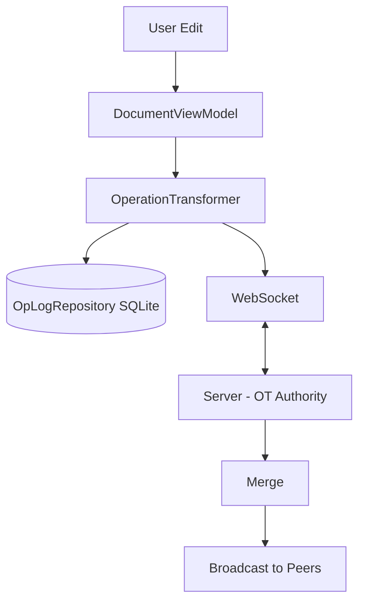

# Collaborative Document Editor (Google Docs / Notion / Quip)

> Reference status: client architecture study material. Embedded code and payloads are incomplete design sketches, not verified production implementations or records from the named products. Do not quote remaining numeric tuning choices as employer benchmarks. For backend preparation, start with the [backend guide](backend-engineering-manager-guide.md) and [evidence standard](evidence-and-sources.md).


## Overview
Designing a collaborative document editor involves complex distributed systems concepts applied to mobile clients. It tests a candidate's grasp of conflict resolution, optimistic UI updates, and synchronization mechanisms when multiple users edit the same text simultaneously.

## Scope Definition

### In Scope
- Real-time text editing by multiple concurrent users.
- Conflict resolution mechanisms.
- Offline editing capabilities and background sync.
- Optimistic UI updates.
- Cursor and presence sharing.

### Out of Scope
- Rich text formatting (bold, italic, embedded images) - limit to plain text / simple blocks.
- Document permissions and ACLs.
- Folder hierarchies and search.
- Version history UI.

## Requirements

### Functional Requirements
1. Users can open and edit a document concurrently with others.
2. Changes appear in real-time to other users.
3. Edits made while offline are saved and synced upon reconnection without overwriting others' work.
4. Users can see where others are currently typing (presence).

### Non-Functional Requirements

Define and measure these dimensions for the actual workload; values require evidence under [the evidence standard](evidence-and-sources.md):

- Sync Latency
- Local Input Latency
- Concurrent Editors
- Presence Broadcast


## Worked learning walkthrough: Reconnect without losing unsent edits

**Failure drill:** A device edits offline while other users change the same document. This is a proposed design walkthrough.

1. Persist the base revision and pending operations separately from the acknowledged document snapshot. The chosen OT or CRDT protocol defines conflict handling.
2. On reconnect, retrieve missing history or a supported snapshot and reconcile pending edits according to that protocol. Preserve operation identity across resend.
3. Advance acknowledged revision only after applying confirmed changes. If reconciliation cannot be proved, preserve a recoverable draft and present a conflict path.

**Why the obvious answer breaks:** A snapshot reload that deletes pending operations can destroy user work. A position-shift example is not a complete OT algorithm; tie-breaking and transformation properties must cover all operations.

**Answer to rehearse:**

> I would distinguish durable edits from ephemeral cursors. OT versus CRDT depends on offline/concurrency requirements and verified implementation complexity, not a universal metadata slogan.

## High-Level Architecture (HLD)

### Component Diagram
```text
[iOS Client]
    │
    ├─► UI Layer (TextKit / CoreText ViewModels)
    │
    ├─► Domain Layer (OT Engine / CRDT, Optimistic Applier)
    │
    ├─► Repository Layer (Local OpLog, Snapshot Cache)
    │      │
    │      └─► SQLite (Append-only Op Log)
    │
    └─► Network Layer
           │
           ├─► WebSocketManager (Real-time Ops & Presence)
           └─► REST API (Initial Snapshot Fetch)

[Backend Infrastructure]
    │
    ├─► WebSocket Gateway
    ├─► OT Server (Single Source of Truth, Sequence Assigner)
    ├─► Redis (Pub/Sub for Presence)
    └─► Document Database (MongoDB / DynamoDB for Snapshots & Op History)
```

### Component Responsibilities
| Component | Responsibility | iOS Implementation |
|-----------|----------------|--------------------|
| OperationTransformer | Handles OT math (transforming client ops against server ops). | Pure Swift struct/class |
| OpLogRepository | Persists local pending ops and server applied ops. | SQLite |
| DocumentViewModel | Manages Text view state, handles local inputs. | `ObservableObject` |
| SyncEngine | Coordinates between OpLog, OT Engine, and Network. | Actor / Background Queue |

### Data Flow
1. **Local Edit**: User types character -> Generated Op -> Applied locally immediately (Optimistic UI) -> Saved to pending queue.
2. **Sync**: Send pending Op + `baseRevision` to server via WebSocket.
3. **Server Transform**: Server receives Op. If server revision > `baseRevision`, server transforms Op against intermediate history, applies, broadcasts to others, and ACKs client with `newRevision`.
4. **Client ACK**: Client receives ACK, removes Op from pending, updates local revision.
5. **Remote Edit**: Client receives remote Op -> Transforms against local pending ops -> Applies to UI.

## Data Models

### Core Entities
```swift
import Foundation

enum OpType: String, Codable {
    case insert
    case delete
    case retain // For rich text, but useful for basic OT to skip chars
}

struct Operation: Codable, Equatable {
    let id: String // UUID
    let type: OpType
    let position: Int
    let text: String
    
    // Generates a reverse operation for local undo
    func inverse() -> Operation {
        switch type {
        case .insert: return Operation(id: UUID().uuidString, type: .delete, position: position, text: text)
        case .delete: return Operation(id: UUID().uuidString, type: .insert, position: position, text: text)
        case .retain: return self
        }
    }
}

struct DocumentSnapshot: Codable {
    let id: String
    let content: String
    let revision: Int
}
```

### Database Schema
```sql
CREATE TABLE document_snapshots (
    doc_id TEXT PRIMARY KEY,
    content TEXT NOT NULL,
    revision INTEGER NOT NULL
);

-- Append-only log of operations
CREATE TABLE operation_log (
    id TEXT PRIMARY KEY,
    doc_id TEXT NOT NULL,
    revision INTEGER, -- Null if pending locally
    op_type TEXT NOT NULL,
    position INTEGER NOT NULL,
    text_content TEXT,
    state INTEGER NOT NULL, -- 0: pending, 1: synced
    created_at REAL NOT NULL,
    FOREIGN KEY(doc_id) REFERENCES document_snapshots(doc_id)
);

CREATE INDEX idx_oplog_state ON operation_log(doc_id, state);
```

## API Design

### Endpoints

**1. GET /v1/docs/{id}/snapshot**
- **Response**:
```json
{
  "doc_id": "doc-123",
  "content": "Hello World",
  "revision": 42
}
```

**2. WebSocket Sync Channel**
- **Payloads**:
```json
// Client -> Server (Submit Ops)
{
  "action": "submit_ops",
  "base_revision": 42,
  "ops": [
    { "type": "insert", "position": 5, "text": "!" }
  ]
}

// Server -> Client (Broadcast/ACK)
{
  "action": "apply_ops",
  "new_revision": 43,
  "ops": [
    { "type": "insert", "position": 5, "text": "!" }
  ]
}

// Client -> Server (Presence)
{
  "action": "presence",
  "user_id": "user-1",
  "cursor_position": 6
}
```

## Client Architecture Deep-Dives

### 1. Operational Transformation (OT) Engine
OT is the core algorithm. If two clients edit at the same time, their operations must be mathematically transformed so the final document state matches regardless of application order.

```swift
class OperationTransformer {
    /// Transforms Op A against Op B. 
    /// Assumes both ops were generated at the same base revision.
    static func transform(clientOp: Operation, serverOp: Operation) -> Operation {
        // Simplified OT logic for single character insert/delete
        var transformedPosition = clientOp.position
        
        if serverOp.type == .insert {
            if serverOp.position < clientOp.position {
                // Server inserted before client, shift client right
                transformedPosition += serverOp.text.count
            } else if serverOp.position == clientOp.position {
                // Tie breaker: standard is server wins, or rely on site/user ID
                // Let's assume server op comes first
                transformedPosition += serverOp.text.count
            }
        } else if serverOp.type == .delete {
            if serverOp.position < clientOp.position {
                // Server deleted before client, shift client left
                let shift = min(clientOp.position - serverOp.position, serverOp.text.count)
                transformedPosition -= shift
            }
        }
        
        return Operation(
            id: clientOp.id,
            type: clientOp.type,
            position: transformedPosition,
            text: clientOp.text
        )
    }
}
```

### 2. Synchronization & Pending Queue
The client must maintain a `localRevision` and a queue of `pendingOps`.

```swift
actor SyncEngine {
    private var localRevision: Int
    private var pendingOps: [Operation] = []
    private var documentContent: String
    
    init(snapshot: DocumentSnapshot) {
        self.localRevision = snapshot.revision
        self.documentContent = snapshot.content
    }
    
    // 1. User types -> Optimistic application
    func applyLocalEdit(op: Operation) {
        documentContent = apply(op: op, to: documentContent)
        pendingOps.append(op)
        // Trigger network send: send(ops: pendingOps, baseRevision: localRevision)
    }
    
    // 2. Network receives server ops
    func receiveServerOps(serverOps: [Operation], newRevision: Int) {
        // We must transform pending ops against incoming server ops
        var transformedServerOps = serverOps
        
        for serverOp in serverOps {
            var currentServerOp = serverOp
            
            for (index, pendingOp) in pendingOps.enumerated() {
                // Transform pending op against server op
                let transformedPending = OperationTransformer.transform(clientOp: pendingOp, serverOp: currentServerOp)
                // Transform server op against pending op (for local application)
                currentServerOp = OperationTransformer.transform(clientOp: currentServerOp, serverOp: pendingOp)
                
                pendingOps[index] = transformedPending
            }
            
            // Apply the transformed server op to local document
            documentContent = apply(op: currentServerOp, to: documentContent)
        }
        
        // Remove pending ops that were ACK'd by server (simplified matching)
        // Update revision
        self.localRevision = newRevision
    }
    
    private func apply(op: Operation, to string: String) -> String {
        // String manipulation logic
        var result = string
        // ... apply index manipulation
        return result
    }
}
```

### 3. Local Persistence & Offline Mode
In offline mode, all local edits are appended to the SQLite `operation_log` as pending. The document can always be reconstructed by loading the last snapshot and replaying the log. When reconnecting, the background task batches the pending ops and sends them.

## Performance & Optimizations

| Decision | Mechanism | What to verify |
| :--- | :--- | :--- |
| Operation batching | Group compatible edits without changing semantics | Measure bandwidth and collaboration delay |
| Snapshotting | Checkpoint with compatible revision/log boundary | Measure snapshot load plus remaining replay; snapshot cost is not constant |
| Rendering | Use the supported text engine for document requirements | Measure edit/cursor responsiveness across document sizes |

## Failure Modes & Fallbacks
| Failure Scenario | Detection | Fallback Strategy |
|------------------|-----------|-------------------|
| Desync / Bad OT | Client hash mismatch with Server hash | Pause synchronization, preserve pending edits, and reconcile against a compatible snapshot or expose recoverable conflict. |
| Prolonged Offline | Local ops > 1000 | Warn user; auto-compact local ops where possible (e.g. insert+delete same char = no-op). |

## Trade-off Analysis
| Decision | Option A | Option B | Chosen | Why |
|----------|----------|----------|--------|-----|
| Algorithm | CRDTs | OT (Op Transformation) | OT | OT is standard for centralized servers (Google Docs). CRDTs (Figma) use more memory and metadata (tombstones) per character, which can bloat mobile memory. |
| Text Input | SwiftUI `TextEditor` | `UITextView` / TextKit | `UITextView` | Standard UI components don't expose character-level precise offsets and mutations easily; TextKit allows granular control. |
| Sync Protocol | REST Polling | WebSockets | WebSockets | 100ms latency requirement makes polling unviable. |

## Observability & Metrics
- **Sync Latency**: Time from local edit to server ACK.
- **Desync Rate**: Number of times client hashes mismatch server hashes (critical metric for OT correctness).
- **Conflict Resolution Time**: CPU time spent in `OperationTransformer` per loop.

## Measurement and evidence

Use [the evidence standard](evidence-and-sources.md) for published limits and measurement methods. The previous benchmark table lacked traceable support and has been removed. Establish workload, device or server configuration, metric denominator and observation window before setting targets.

## Interview Tips
- **CRDT vs OT**: You WILL be asked this. Know that CRDTs resolve conflicts mathematically without a central server by assigning unique IDs to every character. OT relies on a central server to dictate order.
- **Optimistic UI**: Emphasize that the user should NEVER feel blocked by the network.
- **Text Frameworks**: Acknowledge that standard SwiftUI bindings (`@State var text`) break down here; you need precise offset control via `UITextViewDelegate`.

## Architecture Diagram


## Common Mistakes
- Using last-write-wins for text (data loss).
- Not maintaining pendingOps queue (out-of-order application).
- Applying remote ops before transforming against pending local ops.
- Not storing op log locally (can't reconstruct state offline).
- Using CRDT when server authority is available (unnecessary complexity).

## Mock Interview Q&A
**Q: Two users type in the same paragraph at the same time. Walk me through exactly what happens.**
A: Both clients optimistically apply their edits locally. Client A sends `Insert(pos:5, "X")` and Client B sends `Insert(pos:5, "Y")`. The server receives A first, broadcasts it. B receives A's edit, transforms its pending "Y" against "X" (shifting position to 6), and applies it.

**Q: Why would you choose OT over CRDTs for this?**
A: We already have a central server. Compare the actual OT/CRDT implementation, offline semantics, convergence properties, metadata retention and compaction. Neither family has one universal memory cost. A central server does not by itself prove OT is the simpler correct choice.

**Q: How do you handle offline editing for 20 minutes then reconnect?**
A: Edits are appended to a local SQLite operation log. Upon reconnect, we batch these pending ops and send them to the server with our last known `baseRevision`. The server transforms them against the 20 minutes of history and broadcasts the result.

**Q: What if the OT transformation fails or state diverges?**
A: We implement a hash check. Periodically, the client sends a hash of its document state. If it mismatches the server, the client pauses sync and preserves pending edits before reconciling a compatible snapshot. If automatic recovery fails, expose a recoverable draft/conflict instead of erasing unsent work.

**Q: How do you handle cursor positions of other users?**
A: Cursor positions are ephemeral state broadcast via a separate Redis Pub/Sub channel over WebSocket. They are transformed similarly to text edits so they don't drift as the document changes.

## Related Specs
| Spec | Reason |
|------|--------|
| [Offline Sync Engine](./offline-sync-engine.md) | Details local DB structure and conflict resolution paradigms. |
