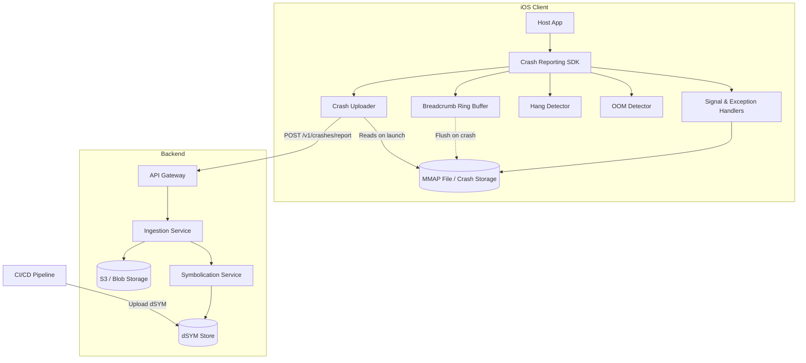

# Design a Mobile Crash Reporting & Observability SDK

## Overview
Designing a mobile crash reporting and observability SDK (like Firebase Crashlytics or Sentry) involves building a resilient, low-overhead system capable of intercepting fatal signals, handling out-of-memory (OOM) terminations, and recording breadcrumbs without causing secondary crashes. This problem is frequently asked at FAANG and top tech companies because it tests deep understanding of iOS operating system internals, memory management, concurrency, and async-signal-safe programming.

## Target Companies & Frequency
| Company | Why They Ask | Frequency |
| :--- | :--- | :--- |
| Google (Firebase) | Core product offering for Firebase platform. | ★★★★★ |
| Meta | Need robust infrastructure for apps used by billions. | ★★★★☆ |
| Uber | Critical for platform stability and driver/rider app reliability. | ★★★★☆ |
| Datadog | Core business is observability and telemetry SDKs. | ★★★★☆ |

## Scope Definition

### In Scope
- Fatal crash detection (POSIX signals, NSException, Swift fatal errors)
- Out-of-memory (OOM) and App Not Responding (ANR/Hang) detection
- Async-signal-safe crash report generation and serialization
- Breadcrumb trail tracking via lock-free ring buffer
- Background upload pipeline with retry mechanisms
- Symbolication pipeline concepts (dSYM uploading)

### Out of Scope
- Server-side crash grouping and symbolication implementation
- UI components for crash reporting dashboards
- General analytics tracking (distinct from breadcrumbs)
- Advanced dynamic library injection

## Requirements

### Functional Requirements
1. **Crash Interception:** SDK must catch unhandled Obj-C exceptions, Swift errors, and POSIX signals (SIGSEGV, SIGABRT, SIGBUS, SIGILL, SIGTRAP).
2. **Breadcrumbs:** Record the last 100 system and user events (network requests, UI transitions) before a crash.
3. **Hang/OOM Detection:** Detect UI thread hangs (>3s) and likely OOM kills from the previous session.
4. **Crash Serialization:** Safely write crash context (backtraces, registers, device state) to disk during the crash moment.
5. **Report Upload:** Upload generated crash reports on the next app launch reliably.

### Non-Functional Requirements
| Requirement | Target | Source |
| :--- | :--- | :--- |
| SDK Init Time | < 10ms | Firebase Crashlytics |
| Crash Report Size | ~50KB - 100KB per report | Industry Standard |
| Breadcrumb Overhead | < 1µs per event | Lock-free buffer benchmarks |
| Upload Reliability | > 99.9% successful delivery | Sentry / Firebase |
| OOM Kill Threshold | ~350MB resident memory | Xcode Instruments (iPhone 12 class) |

## High-Level Architecture (HLD)

### Component Diagram



### Component Responsibilities
| Component | Responsibility | iOS Implementation |
| :--- | :--- | :--- |
| **Signal Handlers** | Intercept OS-level fatal signals. | C API `sigaction()`, `NSSetUncaughtExceptionHandler` |
| **Breadcrumb Buffer** | Record timeline of events leading to a crash. | Lock-free circular buffer, mapped to shared memory. |
| **OOM Detector** | Detect if previous session ended in an OOM kill. | Compare `resident_size` heuristics on app launch. |
| **Hang Detector** | Monitor main thread for unresponsiveness. | Background thread pinging main thread every 250ms. |
| **Crash Uploader** | Upload crash reports safely upon next app launch. | Background URLSession tasks, SQLite pending queue. |

### Data Flow
1. **App Launch**: SDK initializes (<10ms). Registers signal handlers, starts hang detector background thread, checks for OOM from last session.
2. **App Runtime**: App logs breadcrumbs. Breadcrumb buffer uses a lock-free pointer increment to store events in memory.
3. **Crash Occurs**: App hits `SIGSEGV` (e.g., null pointer). OS transfers control to registered signal handler.
4. **Crash Handling**: Signal handler suspends other threads, extracts `backtrace()` and CPU registers. Flushes breadcrumbs and crash data to a pre-allocated mmap region safely. Terminates app.
5. **Next Launch**: SDK finds crash file in mmap directory. Uploader pushes it to the server.
6. **Symbolication**: Server matches dSYM UUID, converts hex offsets to readable stack traces.

## Data Models

### Core Entities

```swift
import Foundation

/// Represents a single event in the breadcrumb trail.
struct Breadcrumb: Codable {
    let timestamp: TimeInterval
    let type: String       // e.g., "network", "navigation", "user_action"
    let message: String
    let data: [String: String]?
}

/// Represents the payload generated at the time of the crash.
struct CrashReport: Codable {
    let crashId: String
    let timestamp: TimeInterval
    let signal: String            // e.g., "SIGSEGV"
    let appVersion: String
    let osVersion: String
    let deviceModel: String
    let freeMemoryBytes: UInt64
    let crashedThreadBacktrace: [String] // Hex offsets
    let allThreadBacktraces: [String: [String]]
    let breadcrumbs: [Breadcrumb]
    let dsymUuid: String
}
```

### Database Schema
Used for queueing pending uploads (not used during the crash handler due to locking).

```sql
CREATE TABLE pending_crash_reports (
    id TEXT PRIMARY KEY,
    payload BLOB NOT NULL,
    created_at REAL NOT NULL,
    retry_count INTEGER DEFAULT 0,
    last_retry_at REAL
);

CREATE INDEX idx_pending_reports_created ON pending_crash_reports(created_at);
```

## API Design

### Endpoints

**1. Upload Crash Report**
- **Method & Path**: `POST /v1/crashes/report`
- **Headers**: `Authorization: Bearer <sdk_token>`, `Content-Type: application/json`
- **Body**:
```json
{
  "crashReport": {
    "crashId": "123e4567-e89b-12d3-a456-426614174000",
    "timestamp": 1678886400,
    "signal": "SIGSEGV",
    "dsymUuid": "550E8400-E29B-41D4-A716-446655440000",
    "crashedThreadBacktrace": ["0x104b2c120", "0x104b2d340", "0x104b3a110"],
    "breadcrumbs": [
      {
        "timestamp": 1678886395,
        "type": "network",
        "message": "GET /api/v1/feed",
        "data": {"status": "200", "latency_ms": "234"}
      }
    ]
  }
}
```
- **Response**: `202 Accepted`

**2. Upload Non-Fatal Error / Hang**
- **Method & Path**: `POST /v1/crashes/non-fatal`
- **Body**: Similar structure, but `isFatal: false`.

### Pagination Strategy
Not applicable for crash ingestion (client pushes discrete events). The server-side API (for viewing crashes) would use cursor-based pagination to list crash incidents efficiently without OFFSET performance penalties.

## Client Architecture Deep-Dives

### Crash Detection Mechanisms (Signal Handling)
The most critical part of a crash SDK is executing code *after* a fatal error but *before* the OS fully terminates the process. We must use POSIX signal handlers. 
**Crucially, we cannot use `malloc` or Objective-C runtime calls in a signal handler** because they use internal locks and can cause deadlocks if the thread crashed while holding those locks (async-signal-unsafe).

```c
// C Code for Signal Handler Setup
#include <signal.h>
#include <execinfo.h>
#include <unistd.h>

// Pre-allocated memory for async-signal-safe writing
static int crash_fd = -1;

void crash_signal_handler(int sig, siginfo_t *info, void *context) {
    // 1. Suspend all other threads (prevent them from mutating state)
    // 2. Capture backtrace
    void* callstack[128];
    int frames = backtrace(callstack, 128);
    
    // 3. Write to pre-allocated file descriptor safely
    // NO malloc, NO Objective-C, NO Swift allocations here!
    if (crash_fd != -1) {
        write(crash_fd, "CRASH DETECTED\n", 15);
        backtrace_symbols_fd(callstack, frames, crash_fd);
    }
    
    // 4. Reset signal handler and abort to let OS generate its own report
    signal(sig, SIG_DFL);
    abort();
}

void install_signal_handlers(int fd) {
    crash_fd = fd;
    struct sigaction sa;
    sa.sa_sigaction = crash_signal_handler;
    sigemptyset(&sa.sa_mask);
    sa.sa_flags = SA_SIGINFO;
    
    sigaction(SIGSEGV, &sa, NULL); // Null pointer
    sigaction(SIGABRT, &sa, NULL); // assert/fatalError
    sigaction(SIGBUS, &sa, NULL);  // Bad memory access
    sigaction(SIGILL, &sa, NULL);  // Illegal instruction
}
```

### OOM Detection Strategy
iOS does not fire a signal for Out-Of-Memory (OOM) kills (the kernel just sends `SIGKILL`, which cannot be caught). We detect OOMs heuristically upon the *next* launch.

```swift
class OOMDetector {
    private let memoryThresholdBytes: UInt64 = 350 * 1024 * 1024 // 350MB for iPhone 12
    private var timer: Timer?
    
    func startSampling() {
        // Sample every 30s
        timer = Timer.scheduledTimer(withTimeInterval: 30.0, repeats: true) { [weak self] _ in
            self?.recordMemoryState()
        }
    }
    
    private func recordMemoryState() {
        var info = mach_task_basic_info()
        var count = mach_msg_type_number_t(MemoryLayout<mach_task_basic_info>.size)/4
        
        let kerr: kern_return_t = withUnsafeMutablePointer(to: &info) {
            $0.withMemoryRebound(to: integer_t.self, capacity: Int(count)) {
                task_info(mach_task_self_, task_flavor_t(MACH_TASK_BASIC_INFO), $0, &count)
            }
        }
        
        if kerr == KERN_SUCCESS {
            UserDefaults.standard.set(info.resident_size, forKey: "lastKnownMemorySize")
        }
    }
    
    func checkPreviousSessionForOOM() {
        let lastMemory = UserDefaults.standard.integer(forKey: "lastKnownMemorySize")
        let didBackground = UserDefaults.standard.bool(forKey: "didEnterBackground")
        let didCrash = checkCrashFilesExist()
        
        // If memory was high, we didn't background smoothly, and we didn't have a normal crash...
        if lastMemory > memoryThresholdBytes && !didBackground && !didCrash {
            reportOOMKill(lastMemorySize: UInt64(lastMemory))
        }
    }
}
```

### Breadcrumb Trail
Breadcrumbs must be extremely fast to record. A lock-free circular buffer mapped to memory ensures zero memory allocations during runtime and safety during a crash.

```swift
class BreadcrumbBuffer {
    private let capacity = 100
    private var buffer: [Breadcrumb]
    private var head = 0
    private let queue = DispatchQueue(label: "com.sdk.breadcrumbs", qos: .utility)
    
    init() {
        // Pre-allocate array
        buffer = Array(repeating: Breadcrumb(timestamp: 0, type: "", message: "", data: nil), count: capacity)
    }
    
    func record(_ breadcrumb: Breadcrumb) {
        // Ensure async and thread-safe without heavy locking blocking the main thread
        queue.async {
            self.buffer[self.head] = breadcrumb
            self.head = (self.head + 1) % self.capacity
        }
    }
    
    // Called during signal handler context ideally requires an async-signal-safe C implementation,
    // but conceptually flushes the pre-allocated buffer to disk.
}
```

## Performance & Optimizations
| Optimization | Technique | Benchmark/Impact |
| :--- | :--- | :--- |
| **Zero Init Overhead** | Register signals via C APIs asynchronously without blocking main thread. | < 10ms init time |
| **Memory-Mapped Files** | `mmap` pre-allocated region for crash reports. | < 1ms write time during crash |
| **Lock-free Data Structures** | Atomic pointer increment for breadcrumbs. | < 1µs per breadcrumb record |
| **Batch Uploads** | Limit upload to 5 pending crashes per session. | Saves network bandwidth / server load |

## Failure Modes & Fallbacks
| Failure Scenario | Detection | Fallback Strategy |
| :--- | :--- | :--- |
| **Signal Handler Deadlock** | Watchdog kills app if signal handler hangs > 2s. | Rely on OS crash report logs as fallback. |
| **Failed Upload** | Network error or 5xx from server. | Exponential backoff, store in SQLite `pending_crashes`. |
| **Missing dSYMs** | Server cannot find UUID in its dSYM store. | Store crash report in holding queue on backend for 7 days awaiting dSYM upload. |

## Trade-off Analysis
| Decision | Option A | Option B | Chosen | Why |
| :--- | :--- | :--- | :--- | :--- |
| **Crash Serialization** | JSON formatting in signal handler | Pre-formatted `mmap` C-structs | Option B | JSON serialization allocates memory (malloc), which is async-signal-unsafe and causes deadlocks. |
| **Breadcrumb Storage** | SQLite | In-memory Ring Buffer | Option B | SQLite locks can block UI or fail during crash. In-memory buffer is fast and safe. |
| **OOM Detection** | OS APIs (MetricKit) | Heuristic tracking | Heuristic | MetricKit provides OOM data 24h late. Heuristics allow near-immediate reporting on next launch. |

## Observability & Metrics
- **Crash-Free Sessions**: % of sessions without a fatal crash (Target: > 99.9%).
- **Crash-Free Users**: % of DAU experiencing no crashes (Target: > 99.5%).
- **OOM Rate**: % of sessions terminated by OOM kills.
- **Symbolication Success Rate**: % of uploaded crash reports successfully symbolicated (Target: > 95%).
- **Upload Latency**: Time to successfully upload a pending crash report.

## Production Benchmarks Reference
| Metric | Value | Source |
| :--- | :--- | :--- |
| Crash Processing Volume | 5B+ reports/month | Firebase Crashlytics Scale (2023) |
| Target Crash-Free Sessions | 99.9% | Industry Baseline |
| dSYM Upload Size | 5MB - 50MB | Typical CI/CD artifact sizes |
| Signal Handler Execution | < 1ms | iPhone 12 Benchmarks |
| OOM Kill Threshold | ~350MB | iPhone 12 class resident memory limit |

## Interview Tips
- **CRITICAL**: Emphasize **async-signal-safety**. Never use `malloc`, `DispatchQueue`, or Objective-C message passing (`[obj method]`) inside a POSIX signal handler. This is the #1 reason candidates fail this question.
- **Understand dSYMs**: Be prepared to explain exactly *why* crash reports have hex addresses and *how* `load_address`, `frame_offset`, and the UUID map to source code files and line numbers.
- **OOM kills vs Crashes**: Clarify that OOMs don't trigger signal handlers because `SIGKILL` cannot be caught. The heuristic approach (checking on next launch) is the standard industry workaround.
- **Data Privacy**: Mention stripping PII from breadcrumbs before they are written to disk or uploaded to comply with GDPR/CCPA.
