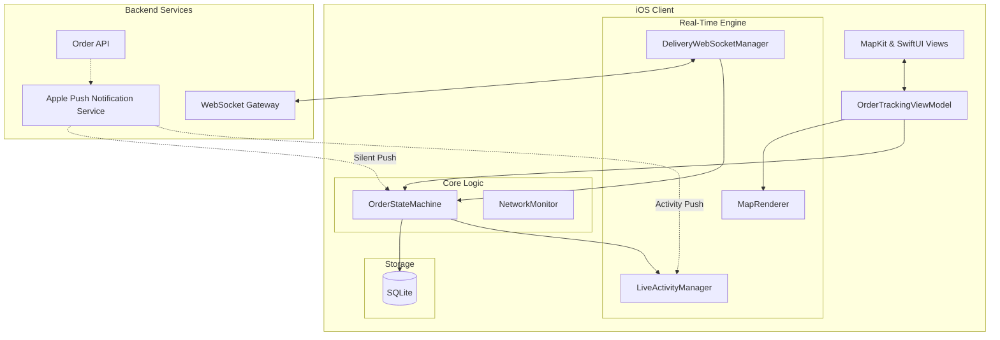

# Design DoorDash / UberEats Live Delivery Order Tracking

## Overview
Designing a live delivery tracking screen (like DoorDash or UberEats) involves managing complex real-time geospatial data, strict state machines, and battery-efficient background updates. This problem is frequently asked because it tests your ability to handle real-time synchronization, manage map rendering performance, implement modern iOS features (Live Activities), and balance real-time needs against device battery life.

## Target Companies & Frequency
| Company | Why They Ask | Frequency |
| :--- | :--- | :--- |
| DoorDash | Core app experience; realtime geospatial tracking. | ★★★★★ |
| Uber / UberEats | Driver-rider tracking; map rendering performance. | ★★★★★ |
| Lyft | Same as Uber; real-time location sync. | ★★★★★ |
| Instacart | Real-time shopper state and location updates. | ★★★★☆ |
| Zomato / Swiggy | Major food delivery players; similar core flows. | ★★★★☆ |

## Scope Definition

### In Scope
- Order state machine management.
- Real-time transport strategy (WebSocket + APNs Fallback + Polling).
- iOS Live Activities (Dynamic Island) integration.
- Smooth driver location rendering on `MKMapView`.
- ETA calculation and display.
- Battery and background execution optimization.

### Out of Scope
- Restaurant menu browsing and cart management.
- Payment processing.
- Driver app architecture (sending location).
- Complex routing algorithms (A* or Dijkstra's) — server handles routing.

## Requirements

### Functional Requirements
1. **Live Tracking**: Users must see the driver's location update smoothly on a map.
2. **Order State**: Accurate reflection of order status (preparing, picked up, etc.).
3. **Live Activities**: Tracking must be visible on the Lock Screen and Dynamic Island.
4. **ETA Updates**: Delivery ETA must update dynamically based on driver progress.
5. **Resilience**: The tracking state must survive app kills and network drops.

### Non-Functional Requirements
| Requirement | Target | Source |
| :--- | :--- | :--- |
| Location Update Freq | Every 2-4 seconds | DoorDash / Uber standard |
| Map Render Latency | < 16ms (60fps) | iOS MapKit performance |
| Live Activity Update | Max 1/sec, typ. driven by APNs | Apple ActivityKit Docs |
| ETA Accuracy | ±3 min for 80% of orders | DoorDash Eng Blog |
| Battery Drain | < 3% per delivery session | App Store Guidelines |

## High-Level Architecture (HLD)

### Component Diagram



### Component Responsibilities
| Component | Responsibility | iOS Implementation |
| :--- | :--- | :--- |
| OrderStateMachine | Manages valid state transitions and persists to DB. | Swift struct/actor + SQLite |
| DeliveryWebSocketManager | Maintains WS, parses location and state events. | `URLSessionWebSocketTask` |
| LiveActivityManager | Starts, updates, and ends ActivityKit sessions. | `ActivityKit` framework |
| MapRenderer | Animates driver marker and draws polylines. | `MKMapViewDelegate`, `UIView.animate` |
| NetworkMonitor | Switches from WS to Polling on poor network. | `NWPathMonitor` |

### Data Flow
**Receiving a Driver Location Update:**
1. Driver app sends GPS ping to server.
2. Server publishes event to client's active WebSocket.
3. `DeliveryWebSocketManager` receives JSON `{lat, lng, heading, timestamp}`.
4. Payload passed to `OrderTrackingViewModel`.
5. `MapRenderer` receives new coordinate.
6. `UIView.animate(withDuration: 2.0, delay: 0, options: .curveLinear)` animates the `MKAnnotationView` from old coordinate to new coordinate.
7. ETA is updated if included in the payload.

## Data Models

### Core Entities

```swift
import Foundation
import CoreLocation

enum OrderState: String, Codable {
    case placed
    case confirmed
    case preparing
    case dasherAssigned = "dasher_assigned"
    case pickedUp = "picked_up"
    case nearDelivery = "near_delivery"
    case delivered
    case cancelled
}

struct Order: Identifiable, Codable {
    let id: String
    var state: OrderState
    var estimatedDeliveryTs: Int64
    let restaurantId: String
    var dasherId: String?
    let createdAt: Int64
}

struct LocationEvent: Codable {
    let orderId: String
    let lat: Double
    let lng: Double
    let heading: Double?
    let etaSeconds: Int?
}
```

### Database Schema
```sql
CREATE TABLE orders (
    id TEXT PRIMARY KEY,
    state TEXT NOT NULL,
    estimated_delivery_ts INTEGER NOT NULL,
    restaurant_id TEXT NOT NULL,
    dasher_id TEXT,
    created_at INTEGER NOT NULL
);

-- Note: We do not store every driver location ping in SQLite.
-- Location pings are ephemeral. We only care about the latest state on launch.
```

## API Design

### Endpoints

**1. Initial Order Status**
- **Method**: `GET`
- **Path**: `/v1/orders/{id}`
- **Response**: Full `Order` object + current driver location if active.

**2. WebSocket Connection**
- **Endpoint**: `wss://realtime.example.com/v1/orders/{id}`
- **Events**: `location_update`, `state_change`

**3. Status Polling (Fallback)**
- **Method**: `GET`
- **Path**: `/v1/orders/{id}/status`

**4. APNs Payload (Silent Push Fallback)**
```json
{
  "aps": {
    "content-available": 1
  },
  "order_id": "O123",
  "event_type": "state_change",
  "state": "picked_up",
  "eta_seconds": 840
}
```

## Client Architecture Deep-Dives

### 1. Order State Machine & Persistence
Order state must be rigorously validated. A client shouldn't transition from `placed` to `delivered` skipping intermediate states unless instructed by the server. Storing this in SQLite ensures that if the user force-kills the app and re-opens it, the app instantly reads the last known state while establishing the WebSocket.

```swift
actor OrderStateMachine {
    private let db: DatabaseConnection
    
    init(db: DatabaseConnection) {
        self.db = db
    }
    
    func processStateUpdate(orderId: String, newState: OrderState, eta: Int64) async throws {
        // Read current state
        let currentOrder = try await db.fetchOrder(id: orderId)
        
        // Ensure valid transition (simplified)
        guard isValidTransition(from: currentOrder.state, to: newState) else { return }
        
        // Persist
        try await db.updateOrderState(id: orderId, state: newState, eta: eta)
        
        // Notify UI (via Combine/NotificationCenter)
        await MainActor.run {
            NotificationCenter.default.post(name: .orderStateChanged, object: nil)
        }
    }
    
    private func isValidTransition(from: OrderState, to: OrderState) -> Bool {
        // E.g., cannot go from delivered back to preparing
        return true 
    }
}
```

### 2. Real-Time Transport Strategy (Hybrid)
Relying solely on WebSockets is brittle on mobile (tunnels, subways). Relying solely on APNs is slow.
- **Foreground + Good Network**: WebSocket.
- **Foreground + Poor Network (`NWPathMonitor`)**: HTTP Polling every 15s.
- **Background**: WebSocket disconnects to save battery. Rely on APNs Silent Push (`content-available: 1`) to wake app briefly and update SQLite/Live Activities.

### 3. iOS Live Activities (ActivityKit)
Live Activities provide Lock Screen and Dynamic Island tracking. You request the activity when the order is placed, update it via WebSockets (foreground) or APNs Push-to-Update (background), and end it upon delivery.

```swift
import ActivityKit

struct DeliveryAttributes: ActivityAttributes {
    public struct ContentState: Codable, Hashable {
        var dasherName: String?
        var eta: String
        var stateMessage: String
    }
    
    var orderId: String
    var restaurantName: String
}

class LiveActivityManager {
    var activity: Activity<DeliveryAttributes>?
    
    func startTracking(order: Order, restaurantName: String) {
        guard ActivityAuthorizationInfo().areActivitiesEnabled else { return }
        
        let attributes = DeliveryAttributes(orderId: order.id, restaurantName: restaurantName)
        let contentState = DeliveryAttributes.ContentState(
            eta: "Calculating...",
            stateMessage: "Confirming order"
        )
        
        do {
            activity = try Activity.request(
                attributes: attributes,
                contentState: contentState,
                pushType: .token // Enables APNs push-to-update
            )
            
            // Send activity.pushToken to backend
            sendPushTokenToServer(activity?.pushToken)
        } catch {
            print("Failed to start activity")
        }
    }
    
    func update(state: OrderState, eta: String, dasher: String?) async {
        let contentState = DeliveryAttributes.ContentState(
            dasherName: dasher,
            eta: eta,
            stateMessage: state.rawValue
        )
        await activity?.update(using: contentState)
    }
    
    func endTracking(finalState: OrderState) async {
        let contentState = DeliveryAttributes.ContentState(
            eta: "Delivered",
            stateMessage: "Enjoy your food!"
        )
        await activity?.end(using: contentState, dismissalPolicy: .after(.now + 120))
    }
}
```

### 4. Smooth Driver Location Rendering
GPS updates arrive every 2-4 seconds. Simply snapping the annotation to the new coordinate causes a jittery map. We must interpolate between points.

```swift
// In MKMapViewDelegate
func animateDriverMarker(to newCoordinate: CLLocationCoordinate2D) {
    guard let driverAnnotation = self.driverAnnotation else { return }
    
    // The duration should roughly match the ping interval (e.g., 2.0 seconds)
    // curveLinear ensures a constant speed rather than slowing down at the end
    UIView.animate(withDuration: 2.0, delay: 0, options: .curveLinear) {
        driverAnnotation.coordinate = newCoordinate
    }
}
```
*Note*: For extreme accuracy, use a client-side Kalman filter or predictive path-snapping, but typically the backend provides snapped coordinates via Google Maps Roads API.

## Performance & Optimizations
| Optimization | Technique | Benchmark/Impact |
| :--- | :--- | :--- |
| Battery | Disconnect WS in background, use APNs | Saves ~10% battery per hour |
| Rendering | Animate annotation instead of removing/adding | 60fps map rendering, no flicker |
| Polyline | Only redraw active segment of route | Reduces CPU load on MKMapView |
| Networking | Multiplex state + location in 1 WS | Reduces TCP overhead |

## Failure Modes & Fallbacks
| Failure Scenario | Detection | Fallback Strategy |
| :--- | :--- | :--- |
| WebSocket Drops | `URLSession` delegate error | Exponential backoff. Start HTTP polling if down > 10s. |
| APNs Delayed | Missed push in background | On foregrounding, instantly `GET /status` to reconcile. |
| Dasher Loses Signal| No location pings for 30s | Show toast: "Locating Dasher..." and gray out marker. |
| App Crash | Next launch | Read last state from SQLite, fetch full state from `/v1/orders/{id}`. |

## Trade-off Analysis
| Decision | Option A | Option B | Chosen | Why |
| :--- | :--- | :--- | :--- | :--- |
| Location Sync Protocol | Polling HTTP | WebSocket | WebSocket | Lower latency, lower server load, better battery when in foreground. |
| Background Updates | Background Fetch (Timer) | APNs Push | APNs Push | Apple severely limits background execution time. Silent pushes are the only reliable way. |
| Live Activity Updates | Client wakes up to update | Server pushes to token | Server pushes | Guarantees Live Activity updates even if the app is entirely killed. |

## Observability & Metrics
- **Location Ping Latency**: Time from driver sending ping to user receiving it (Target: < 2s).
- **Time in State**: How long orders spend in `preparing` vs `dasher_assigned`.
- **Live Activity Token Refresh Success Rate**: Crucial for ensuring Lock Screen UI doesn't freeze.
- **WebSocket Reconnection Rate**: Spikes indicate routing/infrastructure issues.
- **Battery Drain**: Measured via XCTest metric logs during UI tests.

## Production Benchmarks Reference
| Metric | Real World Number | Source |
| :--- | :--- | :--- |
| GPS Update Frequency | 2-4 seconds | Uber / DoorDash observation |
| ETA Accuracy | ±3 min (80% orders) | DoorDash Eng Blog |
| APNs Latency | < 5s (typical) | Apple Documentation |
| Map Render FPS | 60 FPS | iOS CoreAnimation target |
| Live Activity Update Limit | 1 per second max | ActivityKit Docs |

## Interview Tips
- **Highlight Battery Impact**: Always discuss how WebSockets drain battery if left open in the background. Mentioning the switch to APNs for background updates is a senior signal.
- **State Machine Resilience**: Talk about what happens if the app crashes mid-delivery. Persisting to SQLite ensures the user doesn't see a "No active orders" flash on launch.
- **Map Animation**: Emphasize `UIView.animate` with `.curveLinear`. Snapping markers is a huge red flag for frontend candidates.
- **Live Activities**: Knowing `ActivityKit` and push-to-update via APNs shows you are up-to-date with modern iOS APIs (iOS 16.1+).
