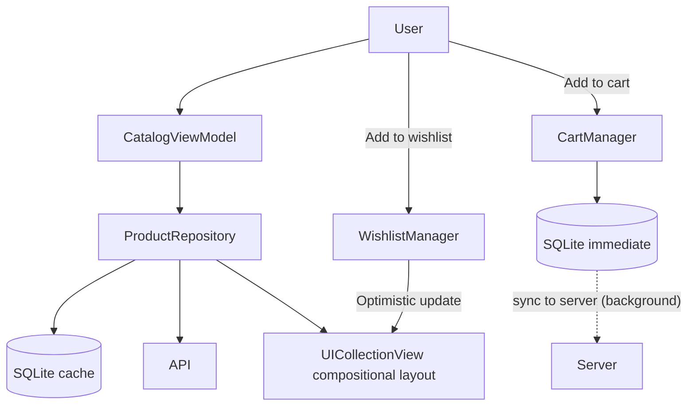

# E-Commerce Product Catalog & Discovery Feed

## Overview
The Product Catalog and Discovery Feed is the entry point for most e-commerce applications. It involves displaying an image-heavy grid of products, handling complex filtering/search, and managing local cart/wishlist state. This problem is frequently asked because it tests UI performance (UICollectionView), pagination, image caching strategies, and data synchronization between client and server.

## Target Companies & Frequency
| Company | Why They Ask | Frequency (★ rating) |
| :--- | :--- | :--- |
| Amazon / Shopify | Core to their product. Tests scalability, image pipelines, and caching. | ★★★★★ |
| Etsy / Pinterest | Heavy focus on image grid performance and visual discovery. | ★★★★☆ |
| Fashion/Retail Apps | Tests UI slickness, prefetching, and state management. | ★★★★☆ |
| Generic Consumer | Good general-purpose system design question for iOS. | ★★★☆☆ |

## Scope Definition

### In Scope
- Image-heavy grid UI (UICollectionView compositional layout)
- Image pipeline (Downloading, downsampling, caching)
- Cursor-based pagination and prefetching
- Search, filtering, and debouncing
- Cart and Wishlist local management and server synchronization
- Price polling and cache invalidation (ETag)

### Out of Scope
- Checkout and payment processing (covered in separate spec)
- Detailed backend recommendation engine algorithms
- AR try-on features or complex video player implementation

## Requirements

### Functional Requirements
1. The app must display a grid of products with images, titles, and prices.
2. Scrolling must remain smooth (60fps/120fps) even with hundreds of items.
3. Users must be able to search and filter the catalog efficiently.
4. Users can add items to a Cart or Wishlist, which works offline and syncs.
5. Product prices and availability must be kept relatively fresh.

### Non-Functional Requirements
| Requirement | Target | Source |
| :--- | :--- | :--- |
| Scroll Frame Rate | 60/120 fps | Apple UI Guidelines |
| Image Cache (Memory) | ~50 MB | NSCache limits |
| Image Cache (Disk) | ~500 MB | App limits |
| Thumbnail Size | 50-100 KB (WebP) | Amazon/Industry standard |
| Search Debounce | 300ms | UI best practice |

## High-Level Architecture (HLD)

### Component Diagram
```text
+-------------------+        +----------------+        +-----------------+
|     Client UI     |        |   API Gateway  |        |    CDN (Images) |
| (UICollectionView)|        +-------+--------+        +--------+--------+
+---------+---------+                |                          |
          |                          |                          |
          | 1. Fetch Catalog         |                          |
          |------------------------->|                          |
          |                          |                          |
          | 2. JSON Response         |                          |
          |<-------------------------|                          |
          |                          |                          |
          | 3. Fetch Image URLs      |                          |
          |---------------------------------------------------->|
          |                          |                          |
          | 4. Return WebP Images    |                          |
          |<----------------------------------------------------|
+---------+---------+
|   Image Pipeline  | (Downsample -> Memory Cache -> Disk Cache)
+---------+---------+
          |
+---------+---------+
| Local State Mngr  | (Cart, Wishlist SQLite + Sync Queue)
+-------------------+
```

### Component Responsibilities
| Component | Responsibility | iOS Implementation |
| :--- | :--- | :--- |
| Grid Layout | Manages layout, cell reuse, and prefetching. | `UICollectionViewCompositionalLayout` |
| Image Pipeline | Downloads, resizes, caches, and provides images. | Custom `ImagePipeline` or Kingfisher |
| Catalog Repository| Fetches API data, handles cursor pagination. | `CatalogRepository` |
| Local State Mngr | Manages offline Cart/Wishlist mutations. | `CartManager` (SQLite/CoreData) |
| Search Manager | Handles debouncing and request cancellation. | `Combine` / `AsyncStream` |

### Data Flow (Catalog Load & Scroll)
1. View requests initial data from `CatalogRepository`.
2. Repository calls `GET /catalog`. Updates UI.
3. As items appear, cells request images from `ImagePipeline`.
4. `ImagePipeline` checks Memory Cache -> Disk Cache -> Network.
5. If Network, fetches WebP, downsamples it to cell size, caches it, returns it.
6. As user scrolls to 70% depth, `UICollectionViewDataSourcePrefetching` triggers next page load.

## Data Models

### Core Entities
```swift
import Foundation

struct Product: Identifiable, Codable, Hashable {
    let id: String
    let title: String
    let price: Decimal
    let currency: String
    let imageUrl: URL
    let rating: Double
}

struct CatalogResponse: Codable {
    let items: [Product]
    let nextCursor: String?
}

struct CartItem: Identifiable, Codable {
    let id: String
    let productId: String
    let quantity: Int
    let addedAt: Date
}
```

## API Design

### Endpoints

#### 1. Fetch Catalog
- **Method:** `GET /v1/catalog`
- **Query Params:** `cursor={string}`, `limit=20`, `category=shoes`, `sort=price_desc`
- **Response (200 OK):**
```json
{
  "items": [
    {
      "id": "prod_123",
      "title": "Running Shoes",
      "price": 129.99,
      "currency": "USD",
      "image_url": "https://cdn.example.com/images/prod_123_thumb.webp"
    }
  ],
  "next_cursor": "eyJvZmZzZXQiOjIwfQ=="
}
```

#### 2. Cart Operations
- **Method:** `POST /v1/cart/items`
- **Body:** `{"product_id": "prod_123", "quantity": 1}`

### Pagination Strategy: Cursor-Based
Cursor-based pagination is essential for feeds. If using offset-based (`page=1`, `page=2`), and a new product is added to the database at the top, items shift down. The client requesting `page=2` might see a duplicate item from `page=1`. A cursor represents a pointer to a specific record, ensuring stable pagination even during live database updates.

## Client Architecture Deep-Dives

### High-Performance Image Pipeline
Large images consume massive memory, leading to OOM (Out Of Memory) crashes. We must downsample images during decoding to match the exact physical pixels needed by the screen.

```swift
import UIKit

final class ImagePipeline {
    static let shared = ImagePipeline()
    private let cache = NSCache<NSURL, UIImage>()
    
    init() {
        cache.totalCostLimit = 50 * 1024 * 1024 // 50 MB
    }
    
    func loadImage(from url: URL, targetSize: CGSize) async throws -> UIImage {
        if let cached = cache.object(forKey: url as NSURL) {
            return cached
        }
        
        // 1. Fetch data
        let (data, _) = try await URLSession.shared.data(from: url)
        
        // 2. Downsample (Offload to background thread)
        let downsampledImage = try await Task.detached(priority: .userInitiated) {
            return try self.downsample(imageData: data, to: targetSize)
        }.value
        
        // 3. Cache and return
        cache.setObject(downsampledImage, forKey: url as NSURL, cost: data.count)
        return downsampledImage
    }
    
    private func downsample(imageData: Data, to pointSize: CGSize) throws -> UIImage {
        let imageSourceOptions = [kCGImageSourceShouldCache: false] as CFDictionary
        guard let imageSource = CGImageSourceCreateWithData(imageData as CFData, imageSourceOptions) else {
            throw URLError(.cannotDecodeRawData)
        }
        
        let scale = await UIScreen.main.scale
        let maxDimensionInPixels = max(pointSize.width, pointSize.height) * scale
        
        let downsampleOptions = [
            kCGImageSourceCreateThumbnailFromImageAlways: true,
            kCGImageSourceShouldCacheImmediately: true,
            kCGImageSourceCreateThumbnailWithTransform: true,
            kCGImageSourceThumbnailMaxPixelSize: maxDimensionInPixels
        ] as CFDictionary
        
        guard let downsampledImage = CGImageSourceCreateThumbnailAtIndex(imageSource, 0, downsampleOptions) else {
            throw URLError(.cannotDecodeRawData)
        }
        
        return UIImage(cgImage: downsampledImage)
    }
}
```

### Search Debouncing & Cancellation
When a user types "S-H-O-E-S", we don't want to fire 5 API requests. We debounce the input (wait 300ms after they stop typing) and cancel any in-flight requests if they resume typing.

```swift
import Combine

class SearchViewModel: ObservableObject {
    @Published var searchText = ""
    @Published var results: [Product] = []
    
    private var cancellables = Set<AnyCancellable>()
    private var searchTask: Task<Void, Never>?
    
    init() {
        $searchText
            .debounce(for: .milliseconds(300), scheduler: RunLoop.main)
            .removeDuplicates()
            .sink { [weak self] query in
                self?.performSearch(query: query)
            }
            .store(in: &cancellables)
    }
    
    private func performSearch(query: String) {
        // Cancel in-flight request
        searchTask?.cancel()
        guard !query.isEmpty else {
            results = []
            return
        }
        
        searchTask = Task {
            do {
                // Networking call that supports cancellation
                let items = try await repository.search(query: query)
                if !Task.isCancelled {
                    await MainActor.run { self.results = items }
                }
            } catch {
                // Handle error
            }
        }
    }
}
```

### Optimistic State Updates (Cart/Wishlist)
When a user adds an item to the wishlist, we should immediately update the UI (optimistic update) and sync in the background. If the sync fails, we rollback the UI.

```swift
actor CartManager {
    private var localCart: [CartItem] = []
    private let db: Database
    private let api: APIClient
    
    func addToCart(product: Product) async {
        // 1. Optimistic local update
        let newItem = CartItem(id: UUID().uuidString, productId: product.id, quantity: 1, addedAt: Date())
        localCart.append(newItem)
        try? db.saveCart(localCart)
        
        // Notify UI to update immediately
        await notifyUIChanged()
        
        // 2. Sync with Server
        do {
            try await api.addToCart(productId: product.id, quantity: 1)
        } catch {
            // 3. Rollback on failure
            localCart.removeAll { $0.id == newItem.id }
            try? db.saveCart(localCart)
            await notifyUIChanged()
            // Optionally queue for later offline sync
        }
    }
}
```

## Performance & Optimizations
| Optimization | Technique | Benchmark/Impact |
| :--- | :--- | :--- |
| Image Downsampling | `CGImageSourceCreateThumbnail` | Reduces memory footprint from 10MB per image to <500KB. |
| Prefetching | `UICollectionViewDataSourcePrefetching` | Trigger next page API request at 70% scroll depth. Trigger image downloads for cells just outside viewport. |
| Conditional GET | HTTP ETag | Return 304 Not Modified if catalog hasn't changed. Saves bandwidth and parsing time. |
| Cell Reuse | standard reuse identifier | Prevents view allocation overhead during fast scrolling. |

## Failure Modes & Fallbacks
| Failure Scenario | Detection | Fallback Strategy |
| :--- | :--- | :--- |
| Image Load Failure | Error from `ImagePipeline` | Show placeholder image. Do not show error alert to user. |
| Offline Cart Add | Reachability / Network Error | Save to SQLite offline queue. Sync when network returns. |
| Pagination Error | Network Error on Page > 1 | Show inline "Retry" button at the bottom of the list. Do not clear existing data. |

## Trade-off Analysis
| Decision | Option A | Option B | Chosen | Why |
| :--- | :--- | :--- | :--- | :--- |
| Pagination | Offset (`page=2`) | Cursor (`cursor=xyz`) | Cursor | Prevents duplicates when the database has new insertions during an active user session. |
| Image Format | JPEG/PNG | WebP | WebP | 25-34% smaller file sizes than comparable JPEG images, heavily reducing CDN costs and speeding up loads. |
| Prefetch Scope | Next Page API Data | API Data + Next Images | API Data + Next Images | Downloading images before the cell appears is critical for a smooth 60fps scrolling experience. |

## Observability & Metrics
- `scroll_hitch_rate`: Number of dropped frames during scrolling. Keep near 0.
- `image_cache_hit_rate`: Ratio of images loaded from memory/disk vs network.
- `search_latency_ms`: Time from user typing to results rendered.
- `cart_add_success_rate`: Percentage of optimistic updates that successfully sync.

## Production Benchmarks Reference
| Metric | Value | Source |
| :--- | :--- | :--- |
| Thumbnail Size | 50-100KB | Amazon Mobile guidelines |
| Prefetch Distance | 10-20 items | Standard iOS implementation |
| Grid Layout Cell | (screenWidth/2 - 16px) | Standard 2-column layout math |

## Interview Tips
- **Nail the Image Pipeline:** This is the most critical part of this question. You must mention downsampling. Just caching full-resolution images will cause an OOM crash.
- **Explain Cursors Clearly:** Be ready to draw on the whiteboard how an offset-based feed breaks when a new item is inserted at the top.
- **Differentiate Caches:** Mention both Memory Cache (fast, limited, flushed on memory pressure) and Disk Cache (slower, persistent, larger).
- **Graceful Degradation:** Emphasize that if an image fails, the app shouldn't crash or show a popup. It should just show a placeholder.

## Mermaid Architecture Diagram


## Common Mistakes
- **Full images in grid:** Loading full-resolution product images in a grid view instead of thumbnails, leading to memory bloat and OOM crashes on large catalogs.
- **Offset pagination for feeds:** Using offset pagination (page=1, page=2) for a dynamic catalog with stable products and new arrivals. This causes duplicate items when the catalog shifts.
- **Blocking UI on cart add:** Blocking the "Add to Cart" action while waiting for the server response, which feels sluggish. It should be an optimistic local update.
- **Over-polling for prices:** Polling for price updates on every scroll event instead of using ETag headers and conditional GETs to check for staleness efficiently.
- **No skeleton loading:** Showing a blank screen or a simple spinner instead of a skeleton loading state, leading to janky perceived performance.

## Mock Interview Q&A
- **Q: A user adds an item to cart while offline. What happens?**
  **A:** The `CartManager` immediately saves the item to the local SQLite database and updates the UI (optimistic update). A background sync task is queued. When the network becomes reachable, it syncs the local cart with the server.
- **Q: How do you ensure prices are fresh on the product detail page?**
  **A:** When navigating to the detail page, we show the cached price instantly, but trigger a background fetch using an ETag (Conditional GET). If the server responds with 304 Not Modified, we do nothing. If the price changed, we update the UI and the cache.
- **Q: How do you handle a catalog of 10 million products efficiently on the client?**
  **A:** The client never loads 10 million products. We use cursor-based pagination to load chunks of 20-50 items at a time. The `UICollectionView` reuses cells, and off-screen images are flushed from the memory cache to keep the footprint under 50MB.

## Related Specs
| Spec | Description |
| :--- | :--- |
| [Checkout Flow](checkout-flow.md) | What happens after items are added to the cart. |
| [Image Pipeline](image-pipeline.md) | Deep dive into downsampling and caching strategies. |
| [Offline Sync](offline-sync.md) | Detailed architecture for background syncing. |
