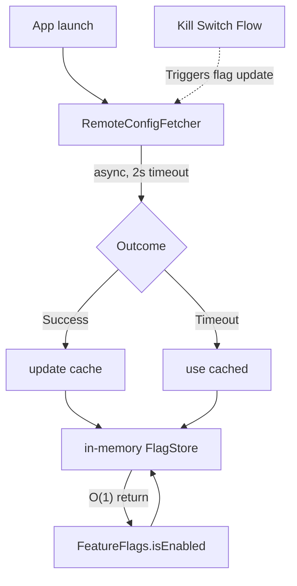

# Feature Flag & Experimentation System

## Overview
A Feature Flag (Remote Config) and Experimentation System allows companies to dynamically change app behavior, rollout features gradually, and run A/B tests without requiring App Store updates. At scale, this system must be extremely resilient—a bad configuration can crash the app for millions of users. Interviewers ask this to test your ability to design low-latency, highly available fallback chains and state management.

## Target Companies & Frequency
| Company | Why They Ask | Frequency |
| :--- | :--- | :--- |
| Uber / Lyft | Every single feature is flagged and A/B tested in multiple markets concurrently. | ★★★★☆ |
| Meta | "Move fast and break things" relies heavily on server-side kill switches. | ★★★★★ |
| Airbnb | Deep emphasis on experimentation and data-driven product decisions. | ★★★★☆ |
| Google | Creators of Firebase Remote Config, highly value scalable configuration. | ★★★★☆ |

## Scope Definition

### In Scope
- Fetching configuration on app launch without blocking the UI
- Multi-layer fallback chain (Memory -> Disk -> Bundled -> Hardcoded)
- Synchronous local flag evaluation (O(1) time complexity)
- Support for multiple flag types (Bool, Int, String, JSON)
- Experiment tracking and impression logging (analytics integration)
- Server-side targeting (client passes attributes, server evaluates rules)
- Kill switch pattern for emergency rollbacks

### Out of Scope
- Building the backend dashboard or rule evaluation engine on the server
- Real-time WebSocket push updates for flags (usually overkill for mobile configs; polling/background fetch is standard)

## Requirements

### Functional Requirements
1. The client must retrieve a map of key-value pairs representing the current active flags for the user.
2. Flag evaluation in the code must be instantaneous and synchronous.
3. The system must support default values in case of network or disk failure.
4. When a user evaluates an A/B test flag, an "impression" event must be logged to analytics.
5. The system must support background refreshing to keep configs reasonably up to date.

### Non-Functional Requirements
| Requirement | Target | Source |
| :--- | :--- | :--- |
| App Launch Delay | < 2 seconds fetch timeout | Firebase Remote Config defaults |
| Local Read Latency | < 1ms (O(1) dictionary lookup) | Standard Swift Dictionary performance |
| Kill Switch Propagation | < 5-10 minutes globally | Uber Engineering Blog |
| Payload Size | < 50 KB | Optimization for fast startup |

## High-Level Architecture (HLD)

### Component Diagram

```ascii
                                +-------------------+
                                |   Config Server   |
                                | (Rule Evaluation) |
                                +---------+---------+
                                          ^
                                          | JSON HTTP GET
                                          v
+-----------------------------------------------------------------------+
|                               iOS Client                              |
|                                                                       |
|                       +--------------------------+                    |
|                       |  RemoteConfigFetcher     |                    |
|                       | (Handles network/timeout)|                    |
|                       +-------------+------------+                    |
|                                     |                                 |
|                                     v                                 |
|                       +--------------------------+                    |
|                       |     FeatureFlagStore     |                    |
|                       | (Coordinates storage)    |                    |
|                       +-------------+------------+                    |
|                                     |                                 |
|           +-------------------------+-------------------------+       |
|           |                         |                         |       |
|           v                         v                         v       |
|  +-------------------+    +-------------------+    +----------------+ |
|  |  In-Memory Cache  |    |    Disk Storage   |    | Default Plist  | |
|  |  (Dictionary)     |    |   (UserDefaults)  |    |  (App Bundle)  | |
|  +--------+----------+    +-------------------+    +----------------+ |
|           |                                                           |
|           v                                                           |
|  +-------------------+          +-------------------+                 |
|  |   FlagEvaluator   | -------> | Analytics Tracker |                 |
|  |  (Reads memory)   | (Logs)   | (Impression sent) |                 |
|  +--------+----------+          +-------------------+                 |
|           |                                                           |
|           v                                                           |
|  +-------------------+                                                |
|  |     App Code      |                                                |
|  | (UI / Logic / VM) |                                                |
|  +-------------------+                                                |
+-----------------------------------------------------------------------+
```

### Component Responsibilities
| Component | Responsibility | iOS Implementation |
| :--- | :--- | :--- |
| `ConfigFetcher` | Makes the HTTP request on launch, enforces timeout. | `URLSession` |
| `FlagStore` | Manages the fallback chain hierarchy. | Orchestrator class |
| `MemoryCache` | Holds the active config for O(1) synchronous reads. | `[String: Any]` dictionary |
| `FlagEvaluator` | Main API for the app. Handles type casting and impression tracking. | Singleton or Injected Service |
| `AnalyticsTracker`| Queues and sends A/B test impression events. | Analytics SDK wrapper |

### Data Flow
1. **App Launch**: `ConfigFetcher` fires an async request with a strict 2-second timeout.
2. **Setup**: Regardless of network outcome, `FlagStore` loads the last known good config from Disk into Memory.
3. **Network Success**: New config arrives, writes to Disk, updates Memory.
4. **Evaluation**: App code calls `evaluator.bool(forKey: "new_checkout_enabled", default: false)`.
5. **Read**: Evaluator checks Memory O(1). If found, returns value. If not, returns hardcoded default.
6. **Tracking**: If the flag is part of an A/B test (metadata attached), Evaluator triggers `AnalyticsTracker.logImpression()`.

## Data Models

### Core Entities

```swift
import Foundation

// Represents the payload returned from the server
struct RemoteConfigPayload: Codable {
    let version: Int
    let flags: [String: FlagValue]
}

enum FlagValue: Codable, Equatable {
    case bool(Bool)
    case int(Int)
    case string(String)
    case json(Data)
    
    // Custom Codable implementation to handle heterogeneous types
    init(from decoder: Decoder) throws {
        let container = try decoder.singleValueContainer()
        if let boolVal = try? container.decode(Bool.self) { self = .bool(boolVal) }
        else if let intVal = try? container.decode(Int.self) { self = .int(intVal) }
        else if let stringVal = try? container.decode(String.self) { self = .string(stringVal) }
        else { throw DecodingError.dataCorruptedError(in: container, debugDescription: "Unknown flag type") }
    }
}
```

## API Design

### Endpoints

**GET** `/v1/config/resolve`
Fetches the evaluated flags for the current user/device.

**Query Parameters:**
- `user_id`: string (optional, for user-level targeting)
- `device_id`: string (for device-level sticky bucketing)
- `app_version`: string (e.g., "2.5.0", to restrict flags to certain app versions)
- `os`: "ios"

**Response Body (Pre-computed by Server):**
```json
{
  "version": 1690004500,
  "flags": {
    "new_checkout_enabled": true,
    "max_retries": 3,
    "hero_banner_title": "Welcome Back!",
    "search_algorithm_variant": "control" 
  }
}
```
*Note: The server evaluates all targeting rules (e.g., "Is user in Canada?", "Is app version > 2.0?") and returns a flat map. The client is dumb and just consumes.*

## Client Architecture Deep-Dives

### [Subsystem 1 — The Fallback Chain & Storage]
The storage architecture guarantees we NEVER crash if a flag is missing.

```swift
class FeatureFlagStore {
    private var memoryCache: [String: FlagValue] = [:]
    private let queue = DispatchQueue(label: "com.app.flagstore", attributes: .concurrent)
    
    // Fallback 1: Disk
    private let userDefaults = UserDefaults.standard
    private let diskKey = "com.app.cached_flags"
    
    // Fallback 2: Bundled Plist
    private var bundledDefaults: [String: FlagValue] = [:]
    
    init() {
        loadBundledDefaults()
        loadFromDisk()
    }
    
    func update(with payload: RemoteConfigPayload) {
        queue.async(flags: .barrier) {
            self.memoryCache = payload.flags
            // Save to disk for next launch
            if let data = try? JSONEncoder().encode(payload) {
                self.userDefaults.set(data, forKey: self.diskKey)
            }
        }
    }
    
    func getValue(forKey key: String) -> FlagValue? {
        var result: FlagValue?
        queue.sync {
            // 1. Check Memory (Latest Network or Disk)
            if let val = memoryCache[key] { result = val }
            // 2. Check Bundled Defaults
            else if let val = bundledDefaults[key] { result = val }
        }
        return result
    }
    
    private func loadFromDisk() {
        guard let data = userDefaults.data(forKey: diskKey),
              let payload = try? JSONDecoder().decode(RemoteConfigPayload.self, from: data) else {
            return
        }
        self.memoryCache = payload.flags
    }
    
    private func loadBundledDefaults() {
        // Load default values shipped with the IPA bundle
    }
}
```

### [Subsystem 2 — Synchronous Evaluation & Impression Tracking]
When a UI component needs a flag, it must be synchronous.

```swift
class FlagEvaluator {
    private let store: FeatureFlagStore
    private let analytics: AnalyticsTracker
    
    init(store: FeatureFlagStore, analytics: AnalyticsTracker) {
        self.store = store
        self.analytics = analytics
    }
    
    func bool(forKey key: String, default defaultValue: Bool) -> Bool {
        let value = store.getValue(forKey: key)
        
        // Log Impression (vital for A/B testing)
        // We log the value actually used by the app to ensure accurate experiment data
        let finalValue: Bool
        if case .bool(let v) = value {
            finalValue = v
        } else {
            finalValue = defaultValue
        }
        
        analytics.logImpression(flagKey: key, valueEvaluated: String(finalValue))
        
        return finalValue
    }
}
```

### [Subsystem 3 — App Launch Network Strategy]
We don't want to freeze the splash screen waiting for configs.

```swift
class RemoteConfigFetcher {
    func fetchOnLaunch(store: FeatureFlagStore) {
        Task {
            do {
                // Set a strict 2-second timeout
                let config = URLSessionConfiguration.default
                config.timeoutIntervalForRequest = 2.0 
                let session = URLSession(configuration: config)
                
                let (data, _) = try await session.data(from: URL(string: "https://api.app.com/v1/config/resolve")!)
                let payload = try JSONDecoder().decode(RemoteConfigPayload.self, from: data)
                
                // Update store. UI might have already rendered with disk defaults,
                // but next screen push will use new network values.
                store.update(with: payload)
                
            } catch {
                print("Config fetch failed, relying on disk cache: \(error)")
            }
        }
    }
}
```

## Performance & Optimizations
| Optimization | Technique | Benchmark/Impact |
| :--- | :--- | :--- |
| **Strict Timeouts** | `timeoutIntervalForRequest = 2.0` | Ensures app TTI (Time to Interactive) is never severely degraded by bad network. |
| **Dumb Client** | Server evaluates rules | Saves CPU battery on client, reduces payload size (client only gets flat Map). |
| **Concurrent Reads** | `DispatchQueue` with `.concurrent` and `.barrier` writes | Allows massive multi-threaded UI access (O(1) reads) without data races. |

## Failure Modes & Fallbacks
| Failure Scenario | Detection | Fallback Strategy |
| :--- | :--- | :--- |
| **Timeout/Network Error** | Fetch task fails | Fail silently. Use Disk Cache. If no disk cache, use hardcoded code default. |
| **Corrupted Payload** | JSON decoding fails | Discard payload. DO NOT overwrite disk cache. Use existing cache. |
| **Critical Bug in Feature** | Crashlytics spike | Server-side Kill Switch. Update flag to `false`. Background fetch or next launch will disable it. |

## Trade-off Analysis
| Decision | Option A | Option B | Chosen | Why |
| :--- | :--- | :--- | :--- | :--- |
| **Targeting Logic** | Client evaluates rules | Server evaluates rules | **Server** | Client payloads stay tiny. Client doesn't need to download millions of rules. Server handles logic securely. |
| **App Launch Refresh** | Block UI until fetch | Async fetch in background | **Async fetch** | Apple heavily penalizes long launch times. Using last-cached values is acceptable for 99% of features. |
| **Updates** | WebSockets (Realtime) | HTTP Polling / Launch Fetch | **Launch Fetch** | Realtime config updates cause unpredictable UI shifts (content jumping) while user is interacting. |

## Observability & Metrics
- **Fetch Success Rate**: Must be > 99%. Track timeout rates specifically.
- **Cache Hit Rate**: How often the app successfully uses disk cache vs hardcoded defaults on first launch.
- **Impression Volume**: Ensure impressions logged matches expected user base (detects if evaluation code is unreachable).
- **Config Payload Size**: Alert if payload > 50KB to prevent bloated startup times.

## Production Benchmarks Reference
| Benchmark | Value | Source |
| :--- | :--- | :--- |
| Firebase Default Timeout | 60 seconds (Too long for UI blocking!) | Firebase Remote Config Docs |
| Recommended UI blocking timeout | 1-2 seconds max | Industry standard |
| Concurrent Experiments | 1000s | Uber Engineering (R2/Experimentation platform) |

## Interview Tips
- **The "Dumb Client" Rule**: Always design the client to be dumb. The server should figure out if the user is in the 10% A/B test bucket. The client just asks "What are my flags?" and gets a key-value map.
- **Timeouts are Critical**: If you suggest blocking the app launch to fetch configs, you will fail. Always use a strict timeout and fallback to cache.
- **Impressions**: Do not forget to mention logging impressions. An A/B test is useless if the data science team doesn't know *when* the user actually saw the feature.
- **Thread Safety**: Reading flags happens all over the app on different threads. Your `FeatureFlagStore` MUST be thread-safe (using actors or concurrent queues with barriers).

## Mermaid Architecture Diagram


## Common Mistakes
- **Blocking app launch:** Waiting for a flag fetch on the splash screen instead of running it asynchronously with a strict timeout (e.g., 2s).
- **Network evaluation on hot path:** Evaluating flags via network calls in UI code. It must always be a local, synchronous O(1) lookup.
- **No kill switch:** Failing to implement an emergency kill switch (override to false) for every major new feature.
- **Missing offline defaults:** Not caching the last-known-good config, meaning the app breaks or features disappear if the server is unreachable.
- **Over-tracking experiments:** Logging experiment impression events on every single flag check instead of just the first evaluation or view event.

## Mock Interview Q&A
- **Q: The server is unreachable on app launch. What happens to all the features gated by flags?**
  **A:** The `RemoteConfigFetcher` will fail or hit its 2-second timeout. The `FeatureFlagStore` instantly falls back to the disk-cached config from the previous session. If it's a fresh install, it falls back to the hardcoded defaults bundled in the app.
- **Q: How do you ensure a flag kill switch takes effect within 5 minutes?**
  **A:** The app periodically polls for config updates in the background (e.g., on `applicationDidBecomeActive` or via Background Fetch) or relies on the next app launch. When the new payload arrives, the flag is flipped to `false`, immediately disabling the feature.
- **Q: How do you prevent the flag evaluation from slowing down the main thread?**
  **A:** Flag evaluations read directly from an in-memory dictionary. We use a concurrent dispatch queue or an actor to ensure thread-safe O(1) read access without blocking the main thread.

## Related Specs
| Spec | Description |
| :--- | :--- |
| [App Modularization](app-modularization.md) | How feature flags intersect with separated module builds. |
| [E-Commerce Catalog](e-commerce-catalog.md) | A/B testing different catalog UI layouts using flags. |
| [Network Layer Design](network-layer.md) | Core networking infrastructure used by the config fetcher. |
