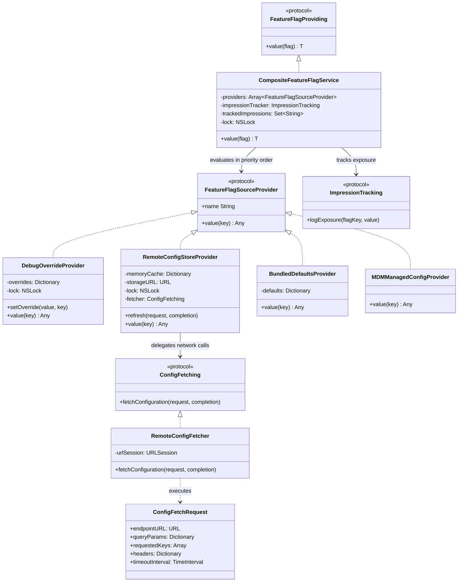

# Feature Flag & Experimentation SDK: Production System Design & Whiteboard Master Guide

## 1. Interview Context & Problem Statement

In mobile system design interviews at top tech companies (Uber, Meta, Airbnb, Google, Stripe, Apple), candidates are asked to design an infrastructure-grade **Feature Flag and Experimentation SDK**.

### The Exact Interview Prompt:
> *"Design a generic, extensible Feature Flag SDK in iOS that can be embedded across multiple mobile apps. The SDK must support dynamic endpoint URLs and query parameters configured by the host app, guarantee synchronous O(1) evaluation without blocking the UI, support a resilient multi-tier fallback chain, handle A/B test impression tracking, and adhere strictly to the Open/Closed Principle without relying on a rigid, hardcoded singleton."*

---

## 📋 2. Requirements & Production SLAs (Whiteboard Section A)

### Functional Requirements (FR)
1. **Synchronous O(1) Evaluation**: Calling code in a SwiftUI `body` or UIKit `viewDidLoad` evaluates flags instantly without `await` or thread blocking.
2. **Dynamic Configuration**: The host app injects custom target URLs, environment switches, query parameters (`userId`, `country`, `appVersion`), and requested flag subsets from the outside.
3. **Resilient 4-Tier Fallback Chain**: Memory -> Disk -> Bundled Plist -> In-Code Default (the app must never crash if a key is missing or network fails).
4. **A/B Test Impression Tracking**: Automatically logs a deduplicated exposure event to analytics only when the user actually views or interacts with the feature.
5. **Emergency Sev-1 Kill Switch**: Remote capability to instantly deactivate a broken feature in < 5 minutes via high-priority silent push.

### Non-Functional Requirements & Budgets (NFR)
| Requirement | Target SLA | Production Benchmark / Source |
| :--- | :--- | :--- |
| **Evaluation Latency** | **< 0.1ms** | In-memory synchronous dictionary read under `NSLock` |
| **Launch Fetch Timeout**| **1.5 - 2.0s** | Firebase Remote Config recommended mobile SLA |
| **Payload Size** | **< 50 KB** | Compressed JSON config payload |
| **Disk Storage** | **< 100 KB** | Atomic file write in Application Support directory |
| **Kill Switch Propagation** | **< 5-10 minutes** | APNs high-priority silent push delivery |
| **Crash Budget** | **0% crash rate** | Fallback chain must catch all missing/corrupt keys |

### Out of Scope
- Backend machine-learning models for automated experiment termination.
- Web-based feature flag management UI portal.

---

## 🏛️ 3. High-Level Design (HLD): System Architecture Flowchart

Below is the complete system design flowchart that you draw on the whiteboard, detailing the interaction between the **Host App**, the **Client SDK Subsystems**, and the **Edge & Cloud Backend**:

```mermaid
flowchart TD
    subgraph HostApp["1. Host Application Tier (Client App)"]
        UI["SwiftUI Views / UIKit Controllers"]
        VM["ViewModels / Coordinators"]
        Init["App Launch (AppDelegate)"]
    end

    subgraph SDK["2. Feature Flag SDK (Client Subsystem)"]
        Interface(["<<FeatureFlagProviding>>
Public Interface"])
        Composite["CompositeFeatureFlagService
(Orchestrator - Closed for Modification)"]
        
        subgraph PriorityChain["Priority Fallback Chain (Open for Extension)"]
            CheckDebug{"1. Debug Override
Active?"}
            DebugStore["DebugOverrideProvider (P0)
Local QA / Dev Toggles"]
            
            CheckMemory{"2. In-Memory Cache
Hit?"}
            MemoryStore["RemoteConfigStoreProvider (P1)
Hot Memory Cache (< 0.1ms)"]
            
            CheckDisk{"3. Local Disk
Cache Valid?"}
            DiskStore[("Application Support/
cached_flags.json")]
            
            CheckBundle{"4. Bundled Defaults
Available?"}
            BundleStore["BundledDefaultsProvider (P2)
Factory defaults.json"]
            
            CodeDefault["In-Code Fallback
Flag.defaultValue"]
        end
        
        subgraph NetEngine["Dynamic Network Engine"]
            ConfigReq["ConfigFetchRequest
(URL, Query Params, Keys, SLA 1.5s)"]
            Fetcher["RemoteConfigFetcher
URLSession + ETag"]
        end
        
        subgraph ImpressionEngine["Experiment Tracking"]
            Dedup{"Already Logged
This Session?"}
            ImpressionSet[("Session Set<String>
Deduplicator")]
            AnalyticsHook(["ImpressionTracker
Analytics Interface"])
        end

        PushReceiver(["SilentPushReceiver
APNs Kill Switch Handler"])
    end

    subgraph Backend["3. Edge & Cloud Infrastructure"]
        CDN["Cloudflare Anycast CDN
(Edge ETag Cache)"]
        Gateway["Envoy API Gateway
(mTLS & Auth)"]
        ConfigSvc["Remote Config Microservice
(Segmentation & Targeting Engine)"]
        RedisCluster[("Redis Cluster
Hot Flag Cache")]
        APNsGateway["APNs Push Gateway
(High-Priority Silent Push)"]
        KafkaAnalytics[("Kafka -> ClickHouse
Experiment Data Pipeline")]
    end

    %% Interactions & Flows
    UI --> VM
    VM -->|"1. value(for: .newCheckout)
Sync O(1) Read"| Interface
    Interface --> Composite
    
    Composite --> CheckDebug
    CheckDebug -- Yes --> DebugStore --> ReturnValue(["Return Value
< 0.1ms"])
    CheckDebug -- No --> CheckMemory
    
    CheckMemory -- Yes --> MemoryStore --> ReturnValue
    CheckMemory -- No --> CheckDisk
    
    CheckDisk -- Yes --> DiskStore --> MemoryStore
    CheckDisk -- No --> CheckBundle
    
    CheckBundle -- Yes --> BundleStore --> ReturnValue
    CheckBundle -- No --> CodeDefault --> ReturnValue
    
    ReturnValue --> Dedup
    Dedup -- No --> ImpressionSet
    ImpressionSet --> AnalyticsHook
    AnalyticsHook -->|"Stream Exposure Events"| KafkaAnalytics
    Dedup -- Yes -->|"Suppress Duplicate"| EndNode((End))
    
    %% Dynamic Launch Fetch
    Init -->|"Passes URL, userId, country,
version, requested keys"| ConfigReq
    ConfigReq --> Fetcher
    Fetcher -->|"2. HTTP GET /v1/config
(1.5s Timeout SLA)"| CDN
    CDN --> Gateway
    Gateway --> ConfigSvc
    ConfigSvc <--> RedisCluster
    ConfigSvc -- "200 OK (New Flags)" --> Fetcher
    Fetcher -->|"Update Cache & Atomic Write"| DiskStore
    DiskStore -.->|"Promote to Active"| MemoryStore
    
    %% Emergency Kill Switch
    APNsGateway -.->|"3. Emergency Silent Push
(< 5 mins)"| PushReceiver
    PushReceiver -.->|"Instant Disable"| MemoryStore
    PushReceiver -.->|"Atomic Write"| DiskStore
```

---

## 🔄 4. The 4 Whiteboard Data Flows to Explain

When walking the interviewer through the flowchart, explain the **4 numbered lifecycle paths**:

### 1. Synchronous Hot Path Read (`< 0.1ms`)
* App code (SwiftUI `body` or ViewModel) calls `featureFlags.value(for: .newCheckout)`.
* `CompositeFeatureFlagService` queries registered providers in priority order under an `NSLock`:
  1. **DebugOverrideProvider (P0)**: Returns local QA/developer override if active.
  2. **RemoteConfigStoreProvider (P1)**: Returns downloaded flag from hot memory cache.
  3. **BundledDefaultsProvider (P2)**: Returns factory default shipped in `defaults.json`.
  4. **Code Fallback**: Returns `flag.defaultValue` defined on the `Flag<T>` token.
* Returns immediately on the calling thread without requiring `await`.

### 2. Dynamic Cold-Start Fetch (`1.5s SLA Timeout`)
* During app launch, the host app passes a `ConfigFetchRequest` with:
  - Custom target URL (`https://api.mycompany.com/v1/config/resolve`)
  - Target attributes: `["userId": "usr_99182", "country": "US", "appVersion": "5.4.0"]`
  - Optional requested flag subset: `["checkout_v2_enabled", "cart_max_limit"]`
  - Custom headers and strict **1.5-second timeout**.
* `RemoteConfigFetcher` executes an HTTP GET with an `If-None-Match` ETag header.
* If 304 Not Modified, the existing cache is retained.
* If 200 OK arrives before the timeout, it updates the memory cache and writes to disk atomically.
* If it times out, the app proceeds seamlessly using the cached disk configuration.

### 3. A/B Test Impression Tracking (Session Deduplication)
* When a user views a flagged feature, the SDK checks an in-memory `Set<String>`.
* If it is the first exposure of the session, it flushes an analytics event to Kafka/ClickHouse for data scientists.
* Subsequent calls (e.g., during list scrolling) are deduplicated, preventing phantom analytics events.

### 4. Severity-1 Emergency Kill Switch (`< 5 Minutes`)
* If a newly released feature causes crash loops in production, backend operators update the flag and send a high-priority **APNs Silent Push**.
* `SilentPushReceiver` on the device immediately writes `false` to disk and memory without requiring an app launch.

---

## 🛠️ 5. Low-Level Design (LLD): Class Architecture & Swift Implementation

### 1. Mermaid Class & Interface Diagram


```mermaid
classDiagram
    class FeatureFlagProviding {
        <<protocol>>
        +value(flag) T
    }

    class FeatureFlagSourceProvider {
        <<protocol>>
        +name String
        +value(key) Any
    }

    class ImpressionTracking {
        <<protocol>>
        +logExposure(flagKey, value)
    }

    class ConfigFetching {
        <<protocol>>
        +fetchConfiguration(request, completion)
    }

    class CompositeFeatureFlagService {
        -providers: Array~FeatureFlagSourceProvider~
        -impressionTracker: ImpressionTracking
        -trackedImpressions: Set~String~
        -lock: NSLock
        +value(flag) T
    }

    class ConfigFetchRequest {
        +endpointURL: URL
        +queryParams: Dictionary
        +requestedKeys: Array
        +headers: Dictionary
        +timeoutInterval: TimeInterval
    }

    class RemoteConfigFetcher {
        -urlSession: URLSession
        +fetchConfiguration(request, completion)
    }

    class DebugOverrideProvider {
        -overrides: Dictionary
        -lock: NSLock
        +setOverride(value, key)
        +value(key) Any
    }

    class RemoteConfigStoreProvider {
        -memoryCache: Dictionary
        -storageURL: URL
        -lock: NSLock
        -fetcher: ConfigFetching
        +refresh(request, completion)
        +value(key) Any
    }

    class BundledDefaultsProvider {
        -defaults: Dictionary
        +value(key) Any
    }

    class MDMManagedConfigProvider {
        +value(key) Any
    }

    FeatureFlagProviding <|.. CompositeFeatureFlagService
    CompositeFeatureFlagService --> FeatureFlagSourceProvider : evaluates in priority order
    CompositeFeatureFlagService --> ImpressionTracking : tracks exposure
    FeatureFlagSourceProvider <|.. DebugOverrideProvider
    FeatureFlagSourceProvider <|.. RemoteConfigStoreProvider
    FeatureFlagSourceProvider <|.. BundledDefaultsProvider
    FeatureFlagSourceProvider <|.. MDMManagedConfigProvider
    RemoteConfigStoreProvider --> ConfigFetching : delegates network calls
    ConfigFetching <|.. RemoteConfigFetcher
    RemoteConfigFetcher ..> ConfigFetchRequest : executes
```

---

### 2. Production Swift Implementation (Clean, Robust, No Sendable)

#### Step 1: Dynamic Request Model & Network Fetcher
```swift
import Foundation

// Injected dynamically from outside by the host application
public struct ConfigFetchRequest {
    public let endpointURL: URL
    public let queryParams: [String: String]
    public let requestedKeys: [String]? // Optional: filter subset of flags
    public let headers: [String: String]
    public let timeoutInterval: TimeInterval

    public init(
        endpointURL: URL,
        queryParams: [String: String] = [:],
        requestedKeys: [String]? = nil,
        headers: [String: String] = [:],
        timeoutInterval: TimeInterval = 1.5
    ) {
        self.endpointURL = endpointURL
        self.queryParams = queryParams
        self.requestedKeys = requestedKeys
        self.headers = headers
        self.timeoutInterval = timeoutInterval
    }
}

public protocol ConfigFetching {
    func fetchConfiguration(
        request: ConfigFetchRequest,
        completion: @escaping (Result<[String: Any], Error>) -> Void
    )
}

public final class RemoteConfigFetcher: ConfigFetching {
    private let urlSession: URLSession

    public init(urlSession: URLSession = .shared) {
        self.urlSession = urlSession
    }

    public func fetchConfiguration(
        request: ConfigFetchRequest,
        completion: @escaping (Result<[String: Any], Error>) -> Void
    ) {
        guard var components = URLComponents(url: request.endpointURL, resolvingAgainstBaseURL: false) else {
            completion(.failure(URLError(.badURL)))
            return
        }

        var queryItems = request.queryParams.map { URLQueryItem(name: $0.key, value: $0.value) }
        if let keys = request.requestedKeys, !keys.isEmpty {
            queryItems.append(URLQueryItem(name: "keys", value: keys.joined(separator: ",")))
        }
        components.queryItems = queryItems.isEmpty ? nil : queryItems

        guard let finalURL = components.url else {
            completion(.failure(URLError(.badURL)))
            return
        }

        var urlRequest = URLRequest(url: finalURL)
        urlRequest.httpMethod = "GET"
        urlRequest.timeoutInterval = request.timeoutInterval
        for (headerKey, headerValue) in request.headers {
            urlRequest.setValue(headerValue, forHTTPHeaderField: headerKey)
        }

        let task = urlSession.dataTask(with: urlRequest) { data, response, error in
            if let error = error {
                completion(.failure(error))
                return
            }

            guard let data = data,
                  let json = try? JSONSerialization.jsonObject(with: data) as? [String: Any] else {
                completion(.failure(URLError(.cannotParseResponse)))
                return
            }

            completion(.success(json))
        }
        task.resume()
    }
}
```

---

#### Step 2: Strongly-Typed Flag Descriptor & Protocols
```swift
// Strongly-typed flag token preventing string typo bugs
public struct Flag<T> {
    public let key: String
    public let defaultValue: T

    public init(key: String, defaultValue: T) {
        self.key = key
        self.defaultValue = defaultValue
    }
}

// Common flag definitions
public extension Flag where T == Bool {
    static let newCheckout = Flag<Bool>(key: "checkout_v2_enabled", defaultValue: false)
    static let biometricAuth = Flag<Bool>(key: "biometric_quick_login", defaultValue: true)
}

public extension Flag where T == Int {
    static let maxCartItems = Flag<Int>(key: "cart_max_limit", defaultValue: 50)
}

public protocol FeatureFlagProviding {
    func value<T>(for flag: Flag<T>) -> T
}

public protocol FeatureFlagSourceProvider {
    var name: String { get }
    func value(forKey key: String) -> Any?
}

public protocol ImpressionTracking {
    func logExposure(flagKey: String, value: String)
}
```

---

#### Step 3: Pluggable Source Providers (Open for Extension)
```swift
// P0: Local Debug Overrides (QA & Developer Menu)
public final class DebugOverrideProvider: FeatureFlagSourceProvider {
    public let name = "DebugOverride"
    private var overrides: [String: Any] = [:]
    private let lock = NSLock()

    public init() {}

    public func setOverride<T>(value: T?, for key: String) {
        lock.lock()
        defer { lock.unlock() }
        overrides[key] = value
    }

    public func clearAll() {
        lock.lock()
        defer { lock.unlock() }
        overrides.removeAll()
    }

    public func value(forKey key: String) -> Any? {
        lock.lock()
        defer { lock.unlock() }
        return overrides[key]
    }
}

// P1: Remote Config & Disk Storage Provider
public final class RemoteConfigStoreProvider: FeatureFlagSourceProvider {
    public let name = "RemoteConfig"
    private var memoryCache: [String: Any] = [:]
    private let lock = NSLock()
    private let storageURL: URL
    private let fetcher: ConfigFetching

    public init(storageURL: URL, fetcher: ConfigFetching = RemoteConfigFetcher()) {
        self.storageURL = storageURL
        self.fetcher = fetcher
        loadFromDisk()
    }

    public func value(forKey key: String) -> Any? {
        lock.lock()
        defer { lock.unlock() }
        return memoryCache[key]
    }

    public func refresh(request: ConfigFetchRequest, completion: ((Bool) -> Void)? = nil) {
        fetcher.fetchConfiguration(request: request) { [weak self] result in
            guard let self = self else { return }
            switch result {
            case .success(let newFlags):
                self.lock.lock()
                for (key, val) in newFlags {
                    self.memoryCache[key] = val
                }
                let snapshot = self.memoryCache
                self.lock.unlock()

                // Persist asynchronously to disk with atomic write
                DispatchQueue.global(qos: .utility).async {
                    if let data = try? JSONSerialization.data(withJSONObject: snapshot) {
                        try? data.write(to: self.storageURL, options: .atomic)
                    }
                }
                completion?(true)

            case .failure:
                completion?(false)
            }
        }
    }

    private func loadFromDisk() {
        guard let data = try? Data(contentsOf: storageURL),
              let json = try? JSONSerialization.jsonObject(with: data) as? [String: Any] else { return }
        self.memoryCache = json
    }
}

// P2: Bundled Defaults Provider (Factory JSON shipped in IPA)
public final class BundledDefaultsProvider: FeatureFlagSourceProvider {
    public let name = "BundledDefaults"
    private let defaults: [String: Any]

    public init(bundle: Bundle = .main, resourceName: String = "FeatureFlagDefaults") {
        if let url = bundle.url(forResource: resourceName, withExtension: "json"),
           let data = try? Data(contentsOf: url),
           let json = try? JSONSerialization.jsonObject(with: data) as? [String: Any] {
            self.defaults = json
        } else {
            self.defaults = [:]
        }
    }

    public func value(forKey key: String) -> Any? {
        defaults[key]
    }
}
```

---

#### Step 4: Composite Orchestrator (`CompositeFeatureFlagService`)
```swift
public final class CompositeFeatureFlagService: FeatureFlagProviding {
    private let providers: [FeatureFlagSourceProvider]
    private let impressionTracker: ImpressionTracking?
    private var trackedImpressions: Set<String> = []
    private let lock = NSLock()

    public init(
        providers: [FeatureFlagSourceProvider],
        impressionTracker: ImpressionTracking? = nil
    ) {
        self.providers = providers
        self.impressionTracker = impressionTracker
    }

    public func value<T>(for flag: Flag<T>) -> T {
        for provider in providers {
            if let rawValue = provider.value(forKey: flag.key),
               let castedValue = rawValue as? T {
                trackImpressionIfNeeded(for: flag.key, value: castedValue)
                return castedValue
            }
        }

        trackImpressionIfNeeded(for: flag.key, value: flag.defaultValue)
        return flag.defaultValue
    }

    private func trackImpressionIfNeeded<T>(for key: String, value: T) {
        guard let impressionTracker = impressionTracker else { return }

        lock.lock()
        let alreadyTracked = trackedImpressions.contains(key)
        if !alreadyTracked {
            trackedImpressions.insert(key)
        }
        lock.unlock()

        if !alreadyTracked {
            impressionTracker.logExposure(flagKey: key, value: String(describing: value))
        }
    }
}
```

---

#### Step 5: How the Host App Wires the SDK from the Outside
```swift
// Host App Assembly (AppDelegate / AppLaunch)
let appSupportURL = FileManager.default.urls(for: .applicationSupportDirectory, in: .userDomainMask).first!
let flagFile = appSupportURL.appendingPathComponent("cached_flags.json")

let debugProvider = DebugOverrideProvider()
let remoteStore = RemoteConfigStoreProvider(storageURL: flagFile)
let bundledDefaults = BundledDefaultsProvider()

let featureFlagService = CompositeFeatureFlagService(
    providers: [debugProvider, remoteStore, bundledDefaults]
)

// Dynamic Configuration injected from outside!
let request = ConfigFetchRequest(
    endpointURL: URL(string: "https://api.mycompany.com/v1/config/resolve")!,
    queryParams: [
        "userId": "usr_99182",
        "appVersion": "5.4.0",
        "country": "US",
        "tier": "enterprise"
    ],
    requestedKeys: ["checkout_v2_enabled", "cart_max_limit"],
    headers: ["Authorization": "Bearer session_token_xyz"],
    timeoutInterval: 1.5 // Strict 1.5s launch timeout
)

remoteStore.refresh(request: request) { success in
    print("Feature flags updated from remote: \(success)")
}
```

---

## ⚖️ 6. Why Avoiding Direct Singletons Wins in Staff & EM Interviews

| Dimension | Hardcoded Singleton (`FeatureFlag.shared`) | Interface-Driven Composite (Our Design) |
|:---|:---|:---|
| **Unit Testing** | Tests share global mutable state; parallel execution causes test flakiness. | **100% Isolated**: Inject `MockFeatureFlagService` per test. |
| **SwiftUI Previews** | Stuck on whatever state the singleton holds; cannot preview both variants. | **Instant Multi-Variant**: Inject different mocks into `#Preview`. |
| **Open/Closed Principle** | Modifying sources requires editing the core singleton class. | **Zero Edits**: Add any new source conforming to `FeatureFlagSourceProvider`. |
| **Scoping & Tenants** | Inability to support multi-account or guest vs logged-in flag sets. | **Scopeable**: Different containers can have distinct flag service instances. |

---

## 🔄 7. Critical Architectural Dilemmas to Defend

### 1. The Activation Dilemma: When Do New Flags Take Effect?
- **Immediate In-Flight Activation**: Network response updates memory cache immediately.
  - *Risk*: Jarring UI mutation. If a user is on Step 2 of checkout and the flag updates, Step 3 might switch to a new flow, causing state crashes or broken user experience.
- **Next-Launch Activation**: New flags are saved to disk but only promoted to active memory cache on next cold boot.
  - *Benefit*: Guaranteed session consistency.
  - *Tradeoff*: Takes two launches for a new feature to appear.
- **The Hybrid SLA Pattern (Recommended)**:
  - On launch, fetch with a strict **1.5s timeout**.
  - If received before splash dismisses, apply immediately.
  - If timed out, run on cached disk config, save the new payload to a `staged_flags` disk buffer, and promote on next launch.
  - **Exception**: Emergency kill switches bypass this rule and deactivate instantly.

### 2. Client vs Server-Side Rule Evaluation
- **Server-Side Evaluation**: Client sends attributes (`user_id`, `app_version`, `country`); server returns a pre-evaluated flat key-value map.
  - *Advantage*: Tiny client payload (< 50KB), zero client battery/CPU cost, business targeting rules stay private.
- **Client-Side Evaluation**: Server sends raw rule sets; client evaluates locally using MurmurHash3.
  - *Advantage*: Works offline; instant re-evaluation if user changes profile attributes.
  - *Tradeoff*: Large payload (> 500KB); exposes unreleased feature names and targeting rules in client JSON.

### 3. Impression Tracking: Exposure vs Evaluation
- **The Anti-Pattern**: Firing an analytics impression event every time `value(for:)` is called. If a list cell pre-fetches off-screen items, analytics records phantom impressions for features the user never saw, corrupting A/B test sample data.
- **The Solution**: 
  1. Separate **Evaluation** (getting the value for logic) from **Exposure** (user actually rendered the UI).
  2. Maintain an in-memory `Set<String>` per session to deduplicate impressions so repetitive calls in scroll views only emit a single exposure event.

---

## 👔 8. The EM Dimension: Governance & Operations

### 1. Preventing "Flag Rot" (Technical Debt Governance)
- **The Problem**: After 6-12 months, an enterprise codebase accumulates hundreds of dead feature flags. Engineers leave, nobody knows if a flag is safe to delete, and apps suffer from nested `if/else` complexity.
- **The EM Governance Framework**:
  1. **Flag Expiration Metadata**: Every flag created in the dashboard must specify an owner and a `sunset_date` (90 days maximum).
  2. **Automated CI Alerts**: CI scripts query flags at 100% rollout for over 30 days and automatically file Jira/GitHub cleanup tickets assigned to the author.
  3. **Linter Enforcement**: A custom SwiftLint rule flags deprecated feature tokens older than 2 release cycles.

### 2. Emergency Kill-Switch Strategy (Sev-1 Defense)
- If a flagged feature causes a crash loop or security vulnerability:
  1. Update flag to `false` in the backend dashboard.
  2. Dispatch a high-priority **APNs Silent Push** payload: `{"action": "kill_flag", "key": "checkout_v2_enabled"}`.
  3. The client's background push handler updates disk cache and memory cache immediately without requiring an app launch.
  4. Global fleet deactivation SLA: **< 5-10 minutes**.

---

## ❓ 9. Mock Interview Q&A (Staff & EM Level)

### Q1: What is the difference between your HLD and your LLD in this design?
**Answer**: Our HLD captures the end-to-end system topology: dividing the client device (host app, SDK memory cache, disk persistence) from the edge tier (CDN / ETag validation) and cloud infrastructure (remote rule microservice, Redis hot cache, APNs silent push gateway, and Kafka analytics pipeline). Our LLD zooms into the client SDK internals: defining the `FeatureFlagProviding` interface, the `FeatureFlagSourceProvider` chain conforming to the Open/Closed Principle, the dynamic `ConfigFetchRequest` injection, and `NSLock` thread safety for sub-0.1ms reads.

### Q2: Why should we avoid a direct singleton for the Feature Flag SDK?
**Answer**: A direct singleton couples calling code to global mutable state, making parallel unit testing impossible, breaking SwiftUI preview multi-variant isolation, and violating the Open/Closed Principle whenever a new source (like QA debug overrides or MDM profiles) is added. We replace it by defining an interface and a composite service that evaluates an array of providers.

### Q3: How do you support passing dynamic endpoints and targeting parameters from the outside?
**Answer**: We decouple the network engine using a `ConfigFetchRequest` model passed into `RemoteConfigStoreProvider.refresh(request:)`. The host application injects the base URL (allowing staging vs production switches), query parameters (userId, country, appVersion), and an optional subset of requested keys with a strict 1.5-second timeout.

### Q4: How do you prevent over-counting A/B test impressions?
**Answer**: We implement session-level impression deduplication inside the composite service using an in-memory `Set<String>`. Furthermore, we decouple evaluation from exposure: background pre-warming checks do not log impressions until the user actually renders the view displaying the feature.

---

## 🔗 Related Specs
| Spec | Description |
| :--- | :--- |
| [A/B Testing & Experimentation SDK](ab-testing-experimentation-sdk.md) | Deep dive into MurmurHash bucketing, variance analysis, and statistical significance. |
| [App Modularization & DI System](app-modularization.md) | How feature flags intersect with decoupled module builds and dependency injection. |
| [Mobile Security & Privacy Engine](mobile-security-privacy-engine.md) | Managing secure MDM configurations and enterprise policy enforcement. |
