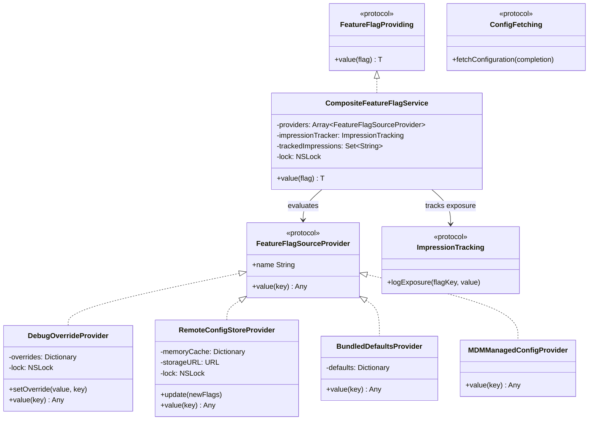
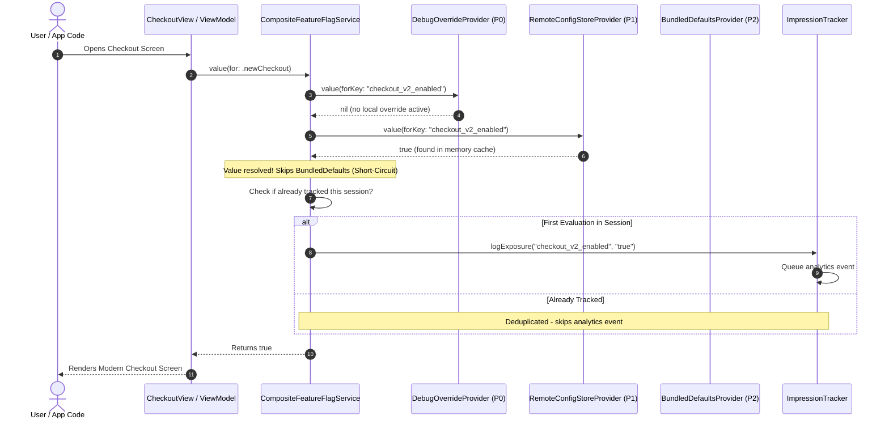

# Feature Flag & Experimentation System: Extensible SDK Architecture

## Overview
A Feature Flag (Remote Config) and Experimentation System allows mobile teams to dynamically alter app behavior, roll out features gradually, and execute A/B experiments without submitting new builds to the App Store. At scale, this is an infrastructure-critical SDK: a bad configuration or a crashing evaluation loop can brick the application for millions of users.

### The Core System Design Question:
> *"Design a generic, extensible Feature Flag SDK in iOS that provides synchronous O(1) flag evaluation, supports a multi-tier fallback chain, tracks A/B test impressions, and strictly adheres to the Open/Closed Principle (open for extension, closed for modification without relying on a rigid, untestable singleton)."*

---

## Target Companies & Frequency
| Company | Why They Ask | Frequency |
| :--- | :--- | :--- |
| **Uber / Lyft** | Every flow is gated by flags; concurrent geo-based rollouts and rapid kill switches. | ★★★★★ |
| **Meta** | Massive continuous deployment relying on server-driven kill switches and gatekeepers. | ★★★★★ |
| **Airbnb** | Heavy data-driven experimentation culture where every UI change is an A/B test. | ★★★★☆ |
| **Google** | Creator of Firebase Remote Config; values scalable, robust client SDK architecture. | ★★★★☆ |
| **Apple / Stripe** | Focuses on SDK API ergonomics, thread safety, and clean object-oriented design. | ★★★★☆ |

---

## Scope & Constraints

### In Scope
- **Interface-Driven Architecture**: Clean protocols adhering to SOLID principles (Open/Closed Principle & Dependency Inversion).
- **Composite Provider Pattern**: Extensible source chain (Debug Overrides -> Remote Config Cache -> Bundled Defaults -> In-Code Defaults).
- **Synchronous O(1) Evaluation**: Thread-safe reads executing in < 0.1ms without blocking the main thread or requiring `await`.
- **Strongly-Typed Flag Descriptors**: Generic `Flag<T>` tokens preventing string typo bugs.
- **Impression Tracking**: Session-deduplicated exposure logging for accurate A/B test data pipelines.
- **Activation Lifecycle**: Hybrid SLA launch strategy balancing consistency and freshness.
- **Emergency Kill Switch**: Fast remote invalidation via APNs silent push.

### Out of Scope
- Backend ML assignment engine or web experimentation dashboards.
- Continuous real-time WebSocket streaming (unnecessary battery and socket overhead for mobile config).

---

## Requirements & Production SLAs

### Functional Requirements
1. The SDK must evaluate flags synchronously and return typed values (`Bool`, `Int`, `Double`, `String`, `JSON`).
2. The SDK must support plugging in new flag sources (e.g., QA debug menu, MDM config, third-party provider) without modifying core classes.
3. The SDK must never crash or block UI if a flag key is missing or corrupted (4-tier fallback guarantee).
4. When a user experiences an A/B test variant, a single deduplicated impression event must be sent to analytics.
5. In-flight network updates must not cause jarring mid-session UI shifts.

### Non-Functional Requirements & Budgets
| Requirement | Target SLA | Production Benchmark / Source |
| :--- | :--- | :--- |
| **Evaluation Latency** | **< 0.1ms** | In-memory synchronous dictionary read with `NSLock` |
| **Launch Fetch Timeout**| **1.5 - 2.0s** | Firebase Remote Config recommended mobile SLA |
| **Payload Size** | **< 50 KB** | Compressed JSON config payload |
| **Disk Storage** | **< 100 KB** | Atomic file write in Application Support directory |
| **Kill Switch Propagation** | **< 5-10 minutes** | APNs high-priority silent push delivery |
| **Crash Budget** | **0% crash rate** | Fallback chain must catch all missing/corrupt keys |

---

## High-Level Architecture (HLD)

### 1. Component & Layer Architecture Diagram

```ascii
+----------------------------------------------------------------------------------------------------+
|                         EXTENSIBLE FEATURE FLAG SDK (SOLID / OCP DESIGN)                           |
+----------------------------------------------------------------------------------------------------+
| LAYER 1: CLIENT CONSUMPTION TIER                                                                   |
|                                                                                                    |
|  [SwiftUI Views / ViewModels / Presenters]                                                         |
|         |                                                                                          |
|         | Calls: featureFlags.value(for: .newCheckout)                                             |
|         v                                                                                          |
|  <<Protocol>> FeatureFlagProviding                                                                 |
|  + value<T>(for flag: Flag<T>) -> T                                                                |
|                                                                                                    |
| ================================================================================================== |
| LAYER 2: ORCHESTRATION & EVALUATION TIER                                                           |
|                                                                                                    |
|  +-----------------------------------------------------------------------------------------------+ |
|  | CompositeFeatureFlagService (Closed for Modification)                                          | |
|  |  - Injected with ordered list of: [FeatureFlagSourceProvider]                                   | |
|  |  - Coordinates fallback chain priority                                                         | |
|  |  - Deduplicates and triggers impression events via ImpressionTracking                          | |
|  +-----------------------------------------------+-----------------------------------------------+ |
|                                                  |                                                 |
|                                                  | Evaluates in Priority Order (P0 -> P1 -> P2)    |
|                                                  v                                                 |
|  <<Protocol>> FeatureFlagSourceProvider (Open for Extension)                                       |
|  + var name: String { get }                                                                        |
|  + func value(forKey key: String) -> Any?                                                          |
|                                                                                                    |
| ================================================================================================== |
| LAYER 3: PLUGGABLE SOURCE PROVIDERS (EXTENSIBLE PIPELINE)                                          |
|                                                                                                    |
|  +-----------------------+  +------------------------+  +--------------------+  +----------------+ |
|  | DebugOverrideProvider |  | RemoteConfigStore      |  | BundledDefaults    |  | MDMConfig /    | |
|  | (Priority 0)          |  | Provider (Priority 1)  |  | Provider (P2)      |  | Custom (P3)    | |
|  | - QA / Dev toggles    |  | - Downloaded network   |  | - Shipped JSON in  |  | - Open to      | |
|  | - In-memory overrides |  |   cache & disk storage |  |   IPA bundle       |  |   extend!      | |
|  +-----------------------+  +-----------+------------+  +--------------------+  +----------------+ |
|                                         |                                                          |
| ======================================= | ======================================================== |
| LAYER 4: NETWORK & PERSISTENCE TIER     v                                                          |
|                                                                                                    |
|  +-----------------------------------------------------------------------------------------------+ |
|  | ConfigFetcher (URLSession with 1.5s timeout, ETag caching, exponential backoff)                | |
|  | Local Storage (/Library/Application Support/cached_flags.json - Atomic write)                  | |
|  | SilentPushReceiver (APNs handler for instant Sev-1 kill switch invalidation)                   | |
|  +-----------------------------------------------------------------------------------------------+ |
+----------------------------------------------------------------------------------------------------+
```

---

### 2. Mermaid Class & Protocol Diagram


```mermaid
classDiagram
    class FeatureFlagProviding {
        <<protocol>>
        +value(flag) T
    }

    class FeatureFlagSourceProvider {
        <<protocol>>
        +name String
        +value(key) Any
    }

    class ImpressionTracking {
        <<protocol>>
        +logExposure(flagKey, value)
    }

    class ConfigFetching {
        <<protocol>>
        +fetchConfiguration(completion)
    }

    class CompositeFeatureFlagService {
        -providers: Array~FeatureFlagSourceProvider~
        -impressionTracker: ImpressionTracking
        -trackedImpressions: Set~String~
        -lock: NSLock
        +value(flag) T
    }

    class DebugOverrideProvider {
        -overrides: Dictionary
        -lock: NSLock
        +setOverride(value, key)
        +value(key) Any
    }

    class RemoteConfigStoreProvider {
        -memoryCache: Dictionary
        -storageURL: URL
        -lock: NSLock
        +update(newFlags)
        +value(key) Any
    }

    class BundledDefaultsProvider {
        -defaults: Dictionary
        +value(key) Any
    }

    class MDMManagedConfigProvider {
        +value(key) Any
    }

    FeatureFlagProviding <|.. CompositeFeatureFlagService
    CompositeFeatureFlagService --> FeatureFlagSourceProvider : evaluates
    CompositeFeatureFlagService --> ImpressionTracking : tracks exposure
    FeatureFlagSourceProvider <|.. DebugOverrideProvider
    FeatureFlagSourceProvider <|.. RemoteConfigStoreProvider
    FeatureFlagSourceProvider <|.. BundledDefaultsProvider
    FeatureFlagSourceProvider <|.. MDMManagedConfigProvider
```

---

### 3. End-to-End Sequence Diagram (Evaluation & Impression Flow)


```mermaid
sequenceDiagram
    autonumber
    actor User as User / App Code
    participant View as CheckoutView / ViewModel
    participant Service as CompositeFeatureFlagService
    participant Debug as DebugOverrideProvider (P0)
    participant Remote as RemoteConfigStoreProvider (P1)
    participant Bundled as BundledDefaultsProvider (P2)
    participant Tracker as ImpressionTracker

    User->>View: Opens Checkout Screen
    View->>Service: value(for: .newCheckout)
    
    Service->>Debug: value(forKey: "checkout_v2_enabled")
    Debug-->>Service: nil (no local override active)
    
    Service->>Remote: value(forKey: "checkout_v2_enabled")
    Remote-->>Service: true (found in memory cache)
    
    Note over Service: Value resolved! Skips BundledDefaults (Short-Circuit)
    
    Service->>Service: Check if already tracked this session?
    alt First Evaluation in Session
        Service->>Tracker: logExposure("checkout_v2_enabled", "true")
        Tracker->>Tracker: Queue analytics event
    else Already Tracked
        Note over Service,Tracker: Deduplicated - skips analytics event
    end

    Service-->>View: Returns true
    View-->>User: Renders Modern Checkout Screen
```

---

## Clean Swift Implementation (No `Sendable` / Pure OCP)

### 1. Strongly-Typed Flag Descriptor
```swift
import Foundation

// A generic descriptor coupling key with its default fallback value
public struct Flag<T> {
    public let key: String
    public let defaultValue: T

    public init(key: String, defaultValue: T) {
        self.key = key
        self.defaultValue = defaultValue
    }
}

// Centralized type-safe flag definitions
public extension Flag where T == Bool {
    static let newCheckout = Flag<Bool>(key: "checkout_v2_enabled", defaultValue: false)
    static let biometricQuickLogin = Flag<Bool>(key: "biometric_quick_login", defaultValue: true)
}

public extension Flag where T == Int {
    static let maxCartItems = Flag<Int>(key: "cart_max_limit", defaultValue: 50)
}

public extension Flag where T == String {
    static let promoBannerText = Flag<String>(key: "promo_banner_text", defaultValue: "Welcome!")
}
```

---

### 2. Core Protocols (Abstractions)
```swift
// 1. What application code depends on
public protocol FeatureFlagProviding {
    func value<T>(for flag: Flag<T>) -> T
}

// 2. The extension point: ANY source conforms to this to provide values
public protocol FeatureFlagSourceProvider {
    var name: String { get }
    func value(forKey key: String) -> Any?
}

// 3. Analytics abstraction for experiment exposure tracking
public protocol ImpressionTracking {
    func logExposure(flagKey: String, value: String)
}

// 4. Remote network fetching abstraction
public protocol ConfigFetching {
    func fetchConfiguration(completion: @escaping (Result<[String: Any], Error>) -> Void)
}
```

---

### 3. Pluggable Source Providers (Open for Extension)

#### Provider 1: Local Debug Overrides (Priority 0: QA & Developers)
```swift
public final class DebugOverrideProvider: FeatureFlagSourceProvider {
    public let name = "DebugOverride"
    private var overrides: [String: Any] = [:]
    private let lock = NSLock()

    public init() {}

    public func setOverride<T>(value: T?, for key: String) {
        lock.lock()
        defer { lock.unlock() }
        overrides[key] = value
    }

    public func clearAll() {
        lock.lock()
        defer { lock.unlock() }
        overrides.removeAll()
    }

    public func value(forKey key: String) -> Any? {
        lock.lock()
        defer { lock.unlock() }
        return overrides[key]
    }
}
```

#### Provider 2: Remote Config & Disk Cache (Priority 1: Production Flags)
```swift
public final class RemoteConfigStoreProvider: FeatureFlagSourceProvider {
    public let name = "RemoteConfig"
    private var memoryCache: [String: Any] = [:]
    private let lock = NSLock()
    private let storageURL: URL

    public init(storageURL: URL) {
        self.storageURL = storageURL
        loadFromDisk()
    }

    public func value(forKey key: String) -> Any? {
        lock.lock()
        defer { lock.unlock() }
        return memoryCache[key]
    }

    public func update(newFlags: [String: Any]) {
        lock.lock()
        self.memoryCache = newFlags
        lock.unlock()

        // Background write so UI thread is never blocked
        DispatchQueue.global(qos: .utility).async { [storageURL] in
            if let data = try? JSONSerialization.data(withJSONObject: newFlags) {
                try? data.write(to: storageURL, options: .atomic)
            }
        }
    }

    private func loadFromDisk() {
        guard let data = try? Data(contentsOf: storageURL),
              let json = try? JSONSerialization.jsonObject(with: data) as? [String: Any] else {
            return
        }
        self.memoryCache = json
    }
}
```

#### Provider 3: Bundled Defaults (Priority 2: Shipped `defaults.json` in IPA)
```swift
public final class BundledDefaultsProvider: FeatureFlagSourceProvider {
    public let name = "BundledDefaults"
    private let defaults: [String: Any]

    public init(bundle: Bundle = .main, resourceName: String = "FeatureFlagDefaults") {
        if let url = bundle.url(forResource: resourceName, withExtension: "json"),
           let data = try? Data(contentsOf: url),
           let json = try? JSONSerialization.jsonObject(with: data) as? [String: Any] {
            self.defaults = json
        } else {
            self.defaults = [:]
        }
    }

    public func value(forKey key: String) -> Any? {
        defaults[key]
    }
}
```

---

### 4. The Composite Orchestrator (`CompositeFeatureFlagService`)
```swift
public final class CompositeFeatureFlagService: FeatureFlagProviding {
    private let providers: [FeatureFlagSourceProvider]
    private let impressionTracker: ImpressionTracking?
    private var trackedImpressions: Set<String> = []
    private let lock = NSLock()

    public init(
        providers: [FeatureFlagSourceProvider],
        impressionTracker: ImpressionTracking? = nil
    ) {
        self.providers = providers
        self.impressionTracker = impressionTracker
    }

    // O(1) Synchronous resolution through the fallback chain
    public func value<T>(for flag: Flag<T>) -> T {
        // 1. Iterate through providers in registered priority order
        for provider in providers {
            if let rawValue = provider.value(forKey: flag.key),
               let castedValue = rawValue as? T {
                trackImpressionIfNeeded(for: flag.key, value: castedValue)
                return castedValue
            }
        }

        // 2. Final Fallback: In-code default
        trackImpressionIfNeeded(for: flag.key, value: flag.defaultValue)
        return flag.defaultValue
    }

    private func trackImpressionIfNeeded<T>(for key: String, value: T) {
        guard let impressionTracker = impressionTracker else { return }

        lock.lock()
        let alreadyTracked = trackedImpressions.contains(key)
        if !alreadyTracked {
            trackedImpressions.insert(key)
        }
        lock.unlock()

        // Deduplicate: Only record one impression event per session
        if !alreadyTracked {
            impressionTracker.logExposure(flagKey: key, value: String(describing: value))
        }
    }
}
```

---

## Why Avoiding Direct Singletons Wins in Staff & EM Interviews

| Dimension | Hardcoded Singleton (`FeatureFlag.shared`) | Interface-Driven Composite (Our Design) |
|:---|:---|:---|
| **Unit Testing** | Tests share global mutable state; parallel execution causes test flakiness. | **100% Isolated**: Inject `MockFeatureFlagService` per test. |
| **SwiftUI Previews** | Stuck on whatever state the singleton holds; cannot preview both variants. | **Instant Multi-Variant**: Inject different mocks into `#Preview`. |
| **Open/Closed Principle** | Modifying sources requires editing the core singleton class. | **Zero Edits**: Add any new source conforming to `FeatureFlagSourceProvider`. |
| **Scoping & Tenants** | Inability to support multi-account or guest vs logged-in flag sets. | **Scopeable**: Different containers can have distinct flag service instances. |

---

## Key Architectural Trade-offs & Dilemmas

### 1. The Activation Dilemma: When Do New Flags Take Effect?
- **Immediate In-Flight Activation**: Network response updates memory cache immediately.
  - *Risk*: Jarring UI mutation. If a user is on Step 2 of checkout and the flag updates, Step 3 might switch to a new flow, causing state crashes or broken user experience.
- **Next-Launch Activation**: New flags are saved to disk but only promoted to active memory cache on next cold boot.
  - *Benefit*: Guaranteed session consistency.
  - *Tradeoff*: Takes two launches for a new feature to appear.
- **The Hybrid SLA Pattern (Recommended)**:
  - On launch, fetch with a strict **1.5s timeout**.
  - If received before splash dismisses, apply immediately.
  - If timed out, run on cached disk config, save the new payload to a `staged_flags` disk buffer, and promote on next launch.
  - **Exception**: Emergency kill switches bypass this rule and deactivate instantly.

### 2. Client vs Server-Side Rule Evaluation
- **Server-Side Evaluation**: Client sends attributes (`user_id`, `app_version`, `country`); server returns a pre-evaluated flat key-value map.
  - *Advantage*: Tiny client payload (< 50KB), zero client battery/CPU cost, business targeting rules stay private.
- **Client-Side Evaluation**: Server sends raw rule sets; client evaluates locally using MurmurHash3.
  - *Advantage*: Works offline; instant re-evaluation if user changes profile attributes.
  - *Tradeoff*: Large payload (> 500KB); exposes unreleased feature names and targeting rules in client JSON.

### 3. Impression Tracking: Exposure vs Evaluation
- **The Anti-Pattern**: Firing an analytics impression event every time `value(for:)` is called. If a list cell pre-fetches off-screen items, analytics records phantom impressions for features the user never saw, corrupting A/B test sample data.
- **The Solution**: 
  1. Separate **Evaluation** (getting the value for logic) from **Exposure** (user actually rendered the UI).
  2. Maintain an in-memory `Set<String>` per session to deduplicate impressions so repetitive calls in scroll views only emit a single exposure event.

---

## The EM Dimension: Governance & Operations

### 1. Preventing "Flag Rot" (Technical Debt Governance)
- **The Problem**: After 6-12 months, an enterprise codebase accumulates hundreds of dead feature flags. Engineers leave, nobody knows if a flag is safe to delete, and apps suffer from nested `if/else` complexity.
- **The EM Governance Framework**:
  1. **Flag Expiration Metadata**: Every flag created in the dashboard must specify an owner and a `sunset_date` (90 days maximum).
  2. **Automated CI Alerts**: CI scripts query flags at 100% rollout for over 30 days and automatically file Jira/GitHub cleanup tickets assigned to the author.
  3. **Linter Enforcement**: A custom SwiftLint rule flags deprecated feature tokens older than 2 release cycles.

### 2. Emergency Kill-Switch Strategy (Sev-1 Defense)
- If a flagged feature causes a crash loop or security vulnerability:
  1. Update flag to `false` in the backend dashboard.
  2. Dispatch a high-priority **APNs Silent Push** payload: `{"action": "kill_flag", "key": "checkout_v2_enabled"}`.
  3. The client's background push handler updates disk cache and memory cache immediately without requiring an app launch.
  4. Global fleet deactivation SLA: **< 5-10 minutes**.

---

## Mock Interview Q&A

### Q1: Why should we avoid a direct singleton for the Feature Flag SDK, and how do you design it to be open for extension?
**Answer**: A direct singleton couples calling code to a global mutable state, making parallel unit testing impossible, breaking SwiftUI preview isolation, and violating the Open/Closed Principle whenever a new source (like QA debug overrides or MDM profiles) is added. We replace it by defining a `FeatureFlagProviding` interface and implementing a `CompositeFeatureFlagService` that evaluates an array of `FeatureFlagSourceProvider` objects. Adding a new source requires writing a new conforming class and registering it during app composition, with zero changes to existing SDK classes.

### Q2: How do you ensure flag evaluation is synchronous and doesn't block the main thread?
**Answer**: Flag evaluations occur on the hot path (including SwiftUI `body` and table view cell dequeuing) where `await` is forbidden. We keep the active configuration in an in-memory dictionary protected by an `NSLock` (or `os_unfair_lock`). Reading a value is a sub-0.1ms O(1) dictionary lookup. All network fetches, JSON deserialization, and disk writes occur asynchronously on background utility queues.

### Q3: What happens if the network request fails on a cold start?
**Answer**: The SDK executes a 4-tier fallback chain:
1. It attempts to read from memory cache.
2. If empty, it reads the last-known-good configuration from disk (`cached_flags.json`).
3. If fresh install with no disk cache, it reads from `BundledDefaultsProvider` (`defaults.json` shipped in the IPA).
4. If the key is absent in all tiers, it returns the in-code `defaultValue` defined on the `Flag<T>` token. The app never crashes.

### Q4: How do you prevent over-counting A/B test impressions?
**Answer**: We implement session-level impression deduplication inside the composite service. When a flag is evaluated, we check an in-memory `Set<String>`. If the flag has already been logged during the current session, we suppress further events. Furthermore, we decouple evaluation from exposure: flags used for background pre-warming do not log impressions until the user navigates to the view displaying the feature.

---

## Related Specs
| Spec | Description |
| :--- | :--- |
| [A/B Testing & Experimentation SDK](ab-testing-experimentation-sdk.md) | Deep dive into MurmurHash bucketing, variance analysis, and statistical significance. |
| [App Modularization & DI System](app-modularization.md) | How feature flags intersect with decoupled module builds and dependency injection. |
| [Mobile Security & Privacy Engine](mobile-security-privacy-engine.md) | Managing secure MDM configurations and enterprise policy enforcement. |
