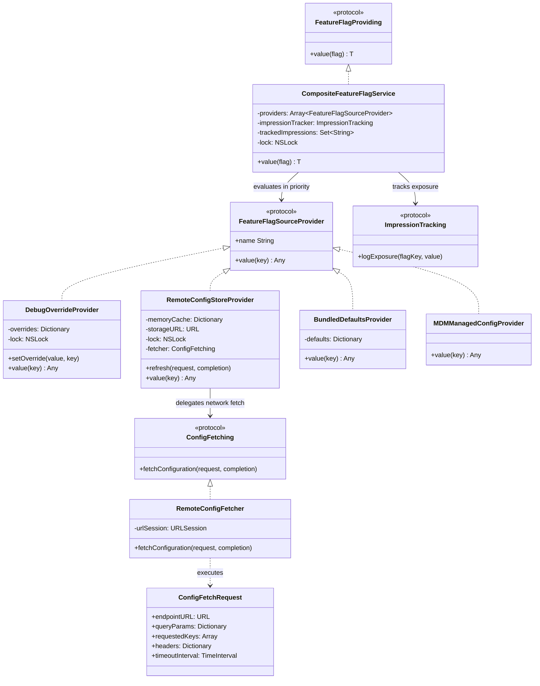
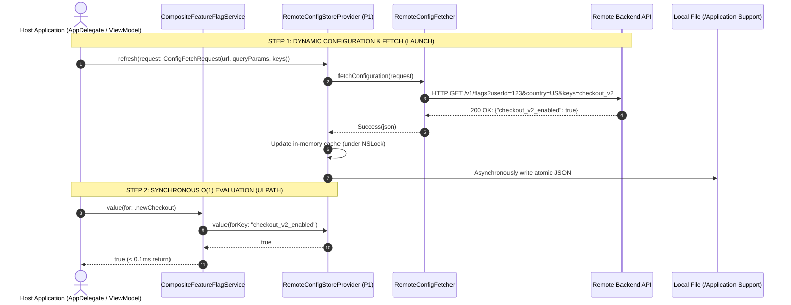

# Feature Flag & Experimentation System: Extensible SDK Architecture

## Overview
A Feature Flag (Remote Config) and Experimentation System allows mobile teams to dynamically alter app behavior, roll out features gradually, and execute A/B experiments without submitting new builds to the App Store. At scale, this is an infrastructure-critical SDK: a bad configuration or a crashing evaluation loop can brick the application for millions of users.

### The Core System Design Question:
> *"Design a generic, extensible Feature Flag SDK in iOS that provides synchronous O(1) flag evaluation, supports a multi-tier fallback chain, tracks A/B test impressions, allows passing dynamic endpoint URLs and targeting parameters from the outside, and strictly adheres to the Open/Closed Principle (open for extension, closed for modification without relying on a rigid, untestable singleton)."*

---

## Target Companies & Frequency
| Company | Why They Ask | Frequency |
| :--- | :--- | :--- |
| **Uber / Lyft** | Every flow is gated by flags; concurrent geo-based rollouts and rapid kill switches. | ★★★★★ |
| **Meta** | Massive continuous deployment relying on server-driven kill switches and gatekeepers. | ★★★★★ |
| **Airbnb** | Heavy data-driven experimentation culture where every UI change is an A/B test. | ★★★★☆ |
| **Google** | Creator of Firebase Remote Config; values scalable, robust client SDK architecture. | ★★★★☆ |
| **Apple / Stripe** | Focuses on SDK API ergonomics, thread safety, and clean object-oriented design. | ★★★★☆ |

---

## Scope & Constraints

### In Scope
- **High-Level Design (HLD)**: End-to-end system topology separating client device, edge ingress, cloud evaluation microservices, and analytics data pipelines.
- **Low-Level Design (LLD)**: Interface-driven architecture adhering to SOLID principles (Open/Closed Principle & Dependency Inversion).
- **Dynamic Configuration Injection**: Passing endpoint URL, user targeting attributes (userId, appVersion, country), and requested flag key subsets from outside the SDK.
- **Composite Provider Pattern**: Extensible source chain (Debug Overrides -> Remote Config Cache -> Bundled Defaults -> In-Code Defaults).
- **Synchronous O(1) Evaluation**: Thread-safe reads executing in < 0.1ms without blocking the main thread or requiring `await`.
- **Impression Tracking**: Session-deduplicated exposure logging for accurate A/B test data pipelines.
- **Activation Lifecycle**: Hybrid SLA launch strategy balancing consistency and freshness.
- **Emergency Kill Switch**: Fast remote invalidation via APNs high-priority silent push.

### Out of Scope
- Backend machine-learning statistical models for automated experiment termination.
- Web-based feature flag management UI portal.

---

## Requirements & Production SLAs

### Functional Requirements
1. The SDK must evaluate flags synchronously and return typed values (`Bool`, `Int`, `Double`, `String`, `JSON`).
2. The SDK must allow the host application to configure the target endpoint URL and contextual parameters (`userId`, `appVersion`, `country`, `tier`) from the outside.
3. The SDK must support plugging in new flag sources (QA debug menu, MDM config, third-party provider) without modifying core classes.
4. The SDK must never crash or block UI if a flag key is missing or corrupted (4-tier fallback guarantee).
5. When a user experiences an A/B test variant, a single deduplicated impression event must be sent to analytics.
6. In-flight network updates must not cause jarring mid-session UI shifts.

### Non-Functional Requirements & Budgets
| Requirement | Target SLA | Production Benchmark / Source |
| :--- | :--- | :--- |
| **Evaluation Latency** | **< 0.1ms** | In-memory synchronous dictionary read with `NSLock` |
| **Launch Fetch Timeout**| **1.5 - 2.0s** | Firebase Remote Config recommended mobile SLA |
| **Payload Size** | **< 50 KB** | Compressed JSON config payload |
| **Disk Storage** | **< 100 KB** | Atomic file write in Application Support directory |
| **Kill Switch Propagation** | **< 5-10 minutes** | APNs high-priority silent push delivery |
| **Crash Budget** | **0% crash rate** | Fallback chain must catch all missing/corrupt keys |

---

## 🏛️ 4. High-Level Design (HLD): The System Design Whiteboard

*Note: In an interview, the High-Level Design (HLD) represents the complete end-to-end system topology across Client Device, Network, Edge, and Cloud Infrastructure. This is fundamentally different from Low-Level Design (LLD), which details concrete Swift classes and protocols.*

### The Whiteboard System Architecture Canvas

```ascii
+-----------------------------------------------------------------------------------------------------------------------------------------------+
|                                                SYSTEM DESIGN WHITEBOARD ARCHITECTURE CANVAS                                                    |
+-----------------------------------------------------------------------------------------------------------------------------------------------+
| CLIENT DEVICE LAYER (iOS / iPadOS)                                            | CLOUD & EDGE INFRASTRUCTURE (BACKEND & PIPELINE)              |
|                                                                               |                                                               |
|  [HOST APPLICATION CONSUMERS]                                                 |  [EDGE INGRESS & GATEWAY TIER]                                |
|  +-------------------------------------------------------------------------+  |  +---------------------------------------------------------+  |
|  | SwiftUI Views / ViewModels / Feature Coordinators                       |  |  | Cloudflare / Fastly Anycast CDN (Edge Cache)            |  |
|  | (Calls: featureFlags.value(for: .newCheckout) -> O(1) synchronous read) |  |  | - Evaluates ETag / 304 Not Modified for global flags       |  |
|  +------------------------------------+------------------------------------+  |  | - DDoS mitigation & TLS 1.3 termination                    |  |
|                                       |                                       |  +----------------------------+----------------------------+  |
|                                       | 1. Read Flag                          |                               |                               |
|                                       v                                       |                               | Forward Request               |
|  [FEATURE FLAG CLIENT SDK SUBSYSTEM]                                          |                               v                               |
|  +-------------------------------------------------------------------------+  |  +---------------------------------------------------------+  |
|  | Evaluation & Orchestration Engine                                       |  |  | Envoy API Gateway / Reverse Proxy                       |  |
|  | - Priority Chain: Debug (P0) -> Remote (P1) -> Bundled (P2) -> Default  |  |  | - Authenticates request token                           |  |
|  | - Thread-safe lock-free memory cache (< 0.1ms latency)                  |  |  | - Routes to Config Service based on tenant / platform     |  |
|  | - Impression Deduplicator (Set<String> per session)                     |  |  +----------------------------+----------------------------+  |
|  +--------------------+--------------------------------+-------------------+  |                               |                               |
|                       |                                |                      |                               | gRPC Internal RPC             |
|                       | 2. Persist / Read              | 4. Log Exposure      |                               v                               |
|                       v                                v                      |  [REMOTE EXPERIMENTATION MICROSERVICES]                       |
|  +---------------------------+        +------------------------------------+  |  +---------------------------------------------------------+  |
|  | Local Storage Engine      |        | Analytics & Telemetry Tracker      |  |  | Feature Flag & Targeting Microservice                   |  |
|  | - /Library/Application    |        | - Queues exposure events           |  |  | - Parses query params: userId, country, appVersion      |  |
|  |   Support/flags.json      |        | - Flushes batched analytics to     |  |  | - Evaluates segmentation rules & MurmurHash3 bucketing  |  |
|  | - Atomic file replacement |        |   Data Pipeline                    |  |  | - Filters response by requested flag keys subset        |  |
|  +---------------------------+        +------------------+-----------------+  |  +--------------+---------------------------+--------------+  |
|                                                          |                    |                 |                           |                 |
|  [DYNAMIC NETWORK FETCHER & LISTENER]                    |                    |                 v                           v                 |
|  +----------------------------------------------------+  |                    |  [PERSISTENCE TIER]         [EMERGENCY KILL-SWITCH]           |
|  | ConfigFetcher Engine                               |  |                    |  +-----------------------+  +-------------------------------+ |
|  | - Injected Base URL: https://api.app.com/v1/flags  |  |                    |  | Redis Cluster         |  | APNs Silent Push Gateway      | |
|  | - Injected Query Params: userId, country, version  |  |                    |  | (< 5ms hot rule cache)|  | - Dispatches high-priority    | |
|  | - Injected Flag Subset: ["checkout_v2", "limit"]   |  |                    |  |                       |  |   silent push to invalidation  | |
|  | - Strict 1.5s launch timeout SLA                   |  |                    |  | Aurora PostgreSQL     |  |   endpoints in < 5 minutes    | |
|  +--------------------------+-------------------------+  |                    |  | (Authoritative DB)    |  +---------------+---------------+ |
|                             |                            |                    |  +-----------------------+                  |                 |
|                             | 3. Dynamic HTTP GET Fetch  |                    |                                             |                 |
|                             v                            |                    |                                             v                 |
|  [APNs SILENT PUSH LISTENER]|                            | 5. Stream Events   |                            [Apple Push Notification Network]  |
|  +--------------------------+-------------------------+  |                    |                                             |                 |
|  | SilentPushReceiver                                 |  |                    |                                             | 6. Silent Push  |
|  | - Receives Sev-1 kill switch push payload          |  |                    |                                             v                 |
|  | - Immediately flips memory and disk flags to false |  |                    |             +-------------------------------+                 |
|  +----------------------------------------------------+  |                    |             | (Delivered to iOS Client Device)                |
|                                                          |                    |             +-------------------------------------------------+
|                                                          v                    |
|                                           +---------------------------------+ |
|                                           | Kafka Stream -> ClickHouse / DW | |
|                                           | (A/B Test Experiment Analytics) | |
|                                           +---------------------------------+ |
+-----------------------------------------------------------------------------------------------------------------------------------------------+
```

### The 4 Primary Data Flows to Explain on the Whiteboard

```ascii
+----------------------------------------------------------------------------------------------------+
|                               THE 4 PRIMARY SYSTEM DATA FLOWS                                      |
+--------------------------+-------------------------------------------------------------------------+
| Flow 1: Synchronous Read | App UI calls SDK -> In-memory lock checks P0 -> P1 -> P2 -> Default.     |
| (Hot Path: < 0.1ms)      | Immediate O(1) return. Zero network wait. Never blocks main thread.     |
+--------------------------+-------------------------------------------------------------------------+
| Flow 2: Dynamic Fetch    | Launch triggers ConfigFetcher with injected URL, queryParams (userId,   |
| (Cold Path: 1.5s SLA)    | country), and requestedKeys. Updates disk atomically & stages for next  |
|                          | session (or activates if before splash screen dismisses).               |
+--------------------------+-------------------------------------------------------------------------+
| Flow 3: Kill Switch      | Severity-1 bug filed -> Backend triggers APNs high-priority silent push |
| (Emergency: < 5 mins)    | -> SilentPushReceiver updates memory & disk cache immediately.          |
+--------------------------+-------------------------------------------------------------------------+
| Flow 4: Exposure Logging | First time user sees feature -> SDK checks session Set<String> -> If new|
| (Analytics Pipeline)     | -> Dispatches exposure event to Kafka/ClickHouse for data scientists.   |
+--------------------------+-------------------------------------------------------------------------+
```

---

## 🛠️ 5. Low-Level Design (LLD): Extensible Architecture & Swift Implementation

*Note: The Low-Level Design (LLD) details the classes, protocols, thread synchronization primitives, and design patterns conforming to the Open/Closed Principle (OCP).*

### 1. Mermaid Class & Interface Diagram


```mermaid
classDiagram
    class FeatureFlagProviding {
        <<protocol>>
        +value(flag) T
    }

    class FeatureFlagSourceProvider {
        <<protocol>>
        +name String
        +value(key) Any
    }

    class ImpressionTracking {
        <<protocol>>
        +logExposure(flagKey, value)
    }

    class ConfigFetching {
        <<protocol>>
        +fetchConfiguration(request, completion)
    }

    class CompositeFeatureFlagService {
        -providers: Array~FeatureFlagSourceProvider~
        -impressionTracker: ImpressionTracking
        -trackedImpressions: Set~String~
        -lock: NSLock
        +value(flag) T
    }

    class ConfigFetchRequest {
        +endpointURL: URL
        +queryParams: Dictionary
        +requestedKeys: Array
        +headers: Dictionary
        +timeoutInterval: TimeInterval
    }

    class RemoteConfigFetcher {
        -urlSession: URLSession
        +fetchConfiguration(request, completion)
    }

    class DebugOverrideProvider {
        -overrides: Dictionary
        -lock: NSLock
        +setOverride(value, key)
        +value(key) Any
    }

    class RemoteConfigStoreProvider {
        -memoryCache: Dictionary
        -storageURL: URL
        -lock: NSLock
        -fetcher: ConfigFetching
        +refresh(request, completion)
        +value(key) Any
    }

    class BundledDefaultsProvider {
        -defaults: Dictionary
        +value(key) Any
    }

    class MDMManagedConfigProvider {
        +value(key) Any
    }

    FeatureFlagProviding <|.. CompositeFeatureFlagService
    CompositeFeatureFlagService --> FeatureFlagSourceProvider : evaluates in priority
    CompositeFeatureFlagService --> ImpressionTracking : tracks exposure
    FeatureFlagSourceProvider <|.. DebugOverrideProvider
    FeatureFlagSourceProvider <|.. RemoteConfigStoreProvider
    FeatureFlagSourceProvider <|.. BundledDefaultsProvider
    FeatureFlagSourceProvider <|.. MDMManagedConfigProvider
    RemoteConfigStoreProvider --> ConfigFetching : delegates network fetch
    ConfigFetching <|.. RemoteConfigFetcher
    RemoteConfigFetcher ..> ConfigFetchRequest : executes
```

---

### 2. Mermaid Sequence Diagram: Dynamic Fetch & Evaluation


```mermaid
sequenceDiagram
    autonumber
    actor HostApp as Host Application (AppDelegate / ViewModel)
    participant Service as CompositeFeatureFlagService
    participant RemoteStore as RemoteConfigStoreProvider (P1)
    participant Fetcher as RemoteConfigFetcher
    participant Cloud as Remote Backend API
    participant Disk as Local File (/Application Support)

    Note over HostApp,Cloud: STEP 1: DYNAMIC CONFIGURATION & FETCH (LAUNCH)
    HostApp->>RemoteStore: refresh(request: ConfigFetchRequest(url, queryParams, keys))
    RemoteStore->>Fetcher: fetchConfiguration(request)
    Fetcher->>Cloud: HTTP GET /v1/flags?userId=123&country=US&keys=checkout_v2
    Cloud-->>Fetcher: 200 OK: {"checkout_v2_enabled": true}
    Fetcher-->>RemoteStore: Success(json)
    RemoteStore->>RemoteStore: Update in-memory cache (under NSLock)
    RemoteStore->>Disk: Asynchronously write atomic JSON

    Note over HostApp,RemoteStore: STEP 2: SYNCHRONOUS O(1) EVALUATION (UI PATH)
    HostApp->>Service: value(for: .newCheckout)
    Service->>RemoteStore: value(forKey: "checkout_v2_enabled")
    RemoteStore-->>Service: true
    Service-->>HostApp: true (< 0.1ms return)
```

---

### 3. Production Swift Implementation (Clean Protocols, Dynamic Params, No Sendable)

#### Step 1: Dynamic Request Model & Network Protocol
```swift
import Foundation

// Injected from outside by the host application
public struct ConfigFetchRequest {
    public let endpointURL: URL
    public let queryParams: [String: String]
    public let requestedKeys: [String]? // Optional: filter specific flags
    public let headers: [String: String]
    public let timeoutInterval: TimeInterval

    public init(
        endpointURL: URL,
        queryParams: [String: String] = [:],
        requestedKeys: [String]? = nil,
        headers: [String: String] = [:],
        timeoutInterval: TimeInterval = 1.5
    ) {
        self.endpointURL = endpointURL
        self.queryParams = queryParams
        self.requestedKeys = requestedKeys
        self.headers = headers
        self.timeoutInterval = timeoutInterval
    }
}

public protocol ConfigFetching {
    func fetchConfiguration(
        request: ConfigFetchRequest,
        completion: @escaping (Result<[String: Any], Error>) -> Void
    )
}

public final class RemoteConfigFetcher: ConfigFetching {
    private let urlSession: URLSession

    public init(urlSession: URLSession = .shared) {
        self.urlSession = urlSession
    }

    public func fetchConfiguration(
        request: ConfigFetchRequest,
        completion: @escaping (Result<[String: Any], Error>) -> Void
    ) {
        guard var components = URLComponents(url: request.endpointURL, resolvingAgainstBaseURL: false) else {
            completion(.failure(URLError(.badURL)))
            return
        }

        var queryItems = request.queryParams.map { URLQueryItem(name: $0.key, value: $0.value) }
        if let keys = request.requestedKeys, !keys.isEmpty {
            queryItems.append(URLQueryItem(name: "keys", value: keys.joined(separator: ",")))
        }
        components.queryItems = queryItems.isEmpty ? nil : queryItems

        guard let finalURL = components.url else {
            completion(.failure(URLError(.badURL)))
            return
        }

        var urlRequest = URLRequest(url: finalURL)
        urlRequest.httpMethod = "GET"
        urlRequest.timeoutInterval = request.timeoutInterval
        for (headerKey, headerValue) in request.headers {
            urlRequest.setValue(headerValue, forHTTPHeaderField: headerKey)
        }

        let task = urlSession.dataTask(with: urlRequest) { data, response, error in
            if let error = error {
                completion(.failure(error))
                return
            }

            guard let data = data,
                  let json = try? JSONSerialization.jsonObject(with: data) as? [String: Any] else {
                completion(.failure(URLError(.cannotParseResponse)))
                return
            }

            completion(.success(json))
        }
        task.resume()
    }
}
```

---

#### Step 2: Strongly-Typed Flag Descriptor & Core Abstractions
```swift
// Strongly-typed flag token preventing string typo bugs
public struct Flag<T> {
    public let key: String
    public let defaultValue: T

    public init(key: String, defaultValue: T) {
        self.key = key
        self.defaultValue = defaultValue
    }
}

// Common flag definitions
public extension Flag where T == Bool {
    static let newCheckout = Flag<Bool>(key: "checkout_v2_enabled", defaultValue: false)
    static let biometricQuickLogin = Flag<Bool>(key: "biometric_quick_login", defaultValue: true)
}

public extension Flag where T == Int {
    static let maxCartItems = Flag<Int>(key: "cart_max_limit", defaultValue: 50)
}

public protocol FeatureFlagProviding {
    func value<T>(for flag: Flag<T>) -> T
}

public protocol FeatureFlagSourceProvider {
    var name: String { get }
    func value(forKey key: String) -> Any?
}

public protocol ImpressionTracking {
    func logExposure(flagKey: String, value: String)
}
```

---

#### Step 3: Pluggable Providers (Open for Extension)
```swift
// P0: Local Debug Overrides (QA & Developer Menu)
public final class DebugOverrideProvider: FeatureFlagSourceProvider {
    public let name = "DebugOverride"
    private var overrides: [String: Any] = [:]
    private let lock = NSLock()

    public init() {}

    public func setOverride<T>(value: T?, for key: String) {
        lock.lock()
        defer { lock.unlock() }
        overrides[key] = value
    }

    public func value(forKey key: String) -> Any? {
        lock.lock()
        defer { lock.unlock() }
        return overrides[key]
    }
}

// P1: Remote Config & Disk Storage Provider
public final class RemoteConfigStoreProvider: FeatureFlagSourceProvider {
    public let name = "RemoteConfig"
    private var memoryCache: [String: Any] = [:]
    private let lock = NSLock()
    private let storageURL: URL
    private let fetcher: ConfigFetching

    public init(storageURL: URL, fetcher: ConfigFetching = RemoteConfigFetcher()) {
        self.storageURL = storageURL
        self.fetcher = fetcher
        loadFromDisk()
    }

    public func value(forKey key: String) -> Any? {
        lock.lock()
        defer { lock.unlock() }
        return memoryCache[key]
    }

    public func refresh(request: ConfigFetchRequest, completion: ((Bool) -> Void)? = nil) {
        fetcher.fetchConfiguration(request: request) { [weak self] result in
            guard let self = self else { return }
            switch result {
            case .success(let newFlags):
                self.lock.lock()
                for (key, val) in newFlags {
                    self.memoryCache[key] = val
                }
                let snapshot = self.memoryCache
                self.lock.unlock()

                DispatchQueue.global(qos: .utility).async {
                    if let data = try? JSONSerialization.data(withJSONObject: snapshot) {
                        try? data.write(to: self.storageURL, options: .atomic)
                    }
                }
                completion?(true)

            case .failure:
                completion?(false)
            }
        }
    }

    private func loadFromDisk() {
        guard let data = try? Data(contentsOf: storageURL),
              let json = try? JSONSerialization.jsonObject(with: data) as? [String: Any] else { return }
        self.memoryCache = json
    }
}

// P2: Bundled Defaults Provider (Factory JSON shipped in IPA)
public final class BundledDefaultsProvider: FeatureFlagSourceProvider {
    public let name = "BundledDefaults"
    private let defaults: [String: Any]

    public init(bundle: Bundle = .main, resourceName: String = "FeatureFlagDefaults") {
        if let url = bundle.url(forResource: resourceName, withExtension: "json"),
           let data = try? Data(contentsOf: url),
           let json = try? JSONSerialization.jsonObject(with: data) as? [String: Any] {
            self.defaults = json
        } else {
            self.defaults = [:]
        }
    }

    public func value(forKey key: String) -> Any? {
        defaults[key]
    }
}
```

---

#### Step 4: Composite Orchestrator (`CompositeFeatureFlagService`)
```swift
public final class CompositeFeatureFlagService: FeatureFlagProviding {
    private let providers: [FeatureFlagSourceProvider]
    private let impressionTracker: ImpressionTracking?
    private var trackedImpressions: Set<String> = []
    private let lock = NSLock()

    public init(
        providers: [FeatureFlagSourceProvider],
        impressionTracker: ImpressionTracking? = nil
    ) {
        self.providers = providers
        self.impressionTracker = impressionTracker
    }

    public func value<T>(for flag: Flag<T>) -> T {
        for provider in providers {
            if let rawValue = provider.value(forKey: flag.key),
               let castedValue = rawValue as? T {
                trackImpressionIfNeeded(for: flag.key, value: castedValue)
                return castedValue
            }
        }

        trackImpressionIfNeeded(for: flag.key, value: flag.defaultValue)
        return flag.defaultValue
    }

    private func trackImpressionIfNeeded<T>(for key: String, value: T) {
        guard let impressionTracker = impressionTracker else { return }

        lock.lock()
        let alreadyTracked = trackedImpressions.contains(key)
        if !alreadyTracked {
            trackedImpressions.insert(key)
        }
        lock.unlock()

        if !alreadyTracked {
            impressionTracker.logExposure(flagKey: key, value: String(describing: value))
        }
    }
}
```

---

#### Step 5: How the Host App Wires It From the Outside
```swift
// Host App Assembly (AppDelegate / Composition Root)
let appSupportURL = FileManager.default.urls(for: .applicationSupportDirectory, in: .userDomainMask).first!
let flagFile = appSupportURL.appendingPathComponent("cached_flags.json")

let debugProvider = DebugOverrideProvider()
let remoteStore = RemoteConfigStoreProvider(storageURL: flagFile)
let bundledDefaults = BundledDefaultsProvider()

let featureFlagService = CompositeFeatureFlagService(
    providers: [debugProvider, remoteStore, bundledDefaults]
)

// Dynamic Configuration injected from outside!
let request = ConfigFetchRequest(
    endpointURL: URL(string: "https://api.mycompany.com/v1/config/resolve")!,
    queryParams: [
        "userId": "usr_88291",
        "appVersion": "5.2.0",
        "country": "US",
        "tier": "enterprise"
    ],
    requestedKeys: ["checkout_v2_enabled", "cart_max_limit"],
    headers: ["Authorization": "Bearer session_token_abc"],
    timeoutInterval: 1.5
)

remoteStore.refresh(request: request) { success in
    print("Flags updated from remote: \(success)")
}
```

---

## ⚖️ 6. Why Avoiding Direct Singletons Wins in Staff & EM Interviews

| Dimension | Hardcoded Singleton (`FeatureFlag.shared`) | Interface-Driven Composite (Our Design) |
|:---|:---|:---|
| **Unit Testing** | Tests share global mutable state; parallel execution causes test flakiness. | **100% Isolated**: Inject `MockFeatureFlagService` per test. |
| **SwiftUI Previews** | Stuck on whatever state the singleton holds; cannot preview both variants. | **Instant Multi-Variant**: Inject different mocks into `#Preview`. |
| **Open/Closed Principle** | Modifying sources requires editing the core singleton class. | **Zero Edits**: Add any new source conforming to `FeatureFlagSourceProvider`. |
| **Scoping & Tenants** | Inability to support multi-account or guest vs logged-in flag sets. | **Scopeable**: Different containers can have distinct flag service instances. |

---

## 🔄 7. Key Architectural Trade-offs & Dilemmas

### 1. The Activation Dilemma: When Do New Flags Take Effect?
- **Immediate In-Flight Activation**: Network response updates memory cache immediately.
  - *Risk*: Jarring UI mutation. If a user is on Step 2 of checkout and the flag updates, Step 3 might switch to a new flow, causing state crashes or broken user experience.
- **Next-Launch Activation**: New flags are saved to disk but only promoted to active memory cache on next cold boot.
  - *Benefit*: Guaranteed session consistency.
  - *Tradeoff*: Takes two launches for a new feature to appear.
- **The Hybrid SLA Pattern (Recommended)**:
  - On launch, fetch with a strict **1.5s timeout**.
  - If received before splash dismisses, apply immediately.
  - If timed out, run on cached disk config, save the new payload to a `staged_flags` disk buffer, and promote on next launch.
  - **Exception**: Emergency kill switches bypass this rule and deactivate instantly.

### 2. Client vs Server-Side Rule Evaluation
- **Server-Side Evaluation**: Client sends attributes (`user_id`, `app_version`, `country`); server returns a pre-evaluated flat key-value map.
  - *Advantage*: Tiny client payload (< 50KB), zero client battery/CPU cost, business targeting rules stay private.
- **Client-Side Evaluation**: Server sends raw rule sets; client evaluates locally using MurmurHash3.
  - *Advantage*: Works offline; instant re-evaluation if user changes profile attributes.
  - *Tradeoff*: Large payload (> 500KB); exposes unreleased feature names and targeting rules in client JSON.

### 3. Impression Tracking: Exposure vs Evaluation
- **The Anti-Pattern**: Firing an analytics impression event every time `value(for:)` is called. If a list cell pre-fetches off-screen items, analytics records phantom impressions for features the user never saw, corrupting A/B test sample data.
- **The Solution**: 
  1. Separate **Evaluation** (getting the value for logic) from **Exposure** (user actually rendered the UI).
  2. Maintain an in-memory `Set<String>` per session to deduplicate impressions so repetitive calls in scroll views only emit a single exposure event.

---

## 👔 8. The EM Dimension: Governance & Operations

### 1. Preventing "Flag Rot" (Technical Debt Governance)
- **The Problem**: After 6-12 months, an enterprise codebase accumulates hundreds of dead feature flags. Engineers leave, nobody knows if a flag is safe to delete, and apps suffer from nested `if/else` complexity.
- **The EM Governance Framework**:
  1. **Flag Expiration Metadata**: Every flag created in the dashboard must specify an owner and a `sunset_date` (90 days maximum).
  2. **Automated CI Alerts**: CI scripts query flags at 100% rollout for over 30 days and automatically file Jira/GitHub cleanup tickets assigned to the author.
  3. **Linter Enforcement**: A custom SwiftLint rule flags deprecated feature tokens older than 2 release cycles.

### 2. Emergency Kill-Switch Strategy (Sev-1 Defense)
- If a flagged feature causes a crash loop or security vulnerability:
  1. Update flag to `false` in the backend dashboard.
  2. Dispatch a high-priority **APNs Silent Push** payload: `{"action": "kill_flag", "key": "checkout_v2_enabled"}`.
  3. The client's background push handler updates disk cache and memory cache immediately without requiring an app launch.
  4. Global fleet deactivation SLA: **< 5-10 minutes**.

---

## ❓ 9. Mock Interview Q&A (Staff & EM Level)

### Q1: What is the difference between your HLD and your LLD in this design?
**Answer**: Our HLD captures the end-to-end system topology: dividing the client device (host app, SDK memory cache, disk persistence) from the edge tier (CDN / ETag validation) and cloud infrastructure (remote rule microservice, Redis hot cache, APNs silent push gateway, and Kafka analytics pipeline). Our LLD zooms into the client SDK internals: defining the `FeatureFlagProviding` interface, the `FeatureFlagSourceProvider` chain conforming to the Open/Closed Principle, the dynamic `ConfigFetchRequest` injection, and `NSLock` thread safety for sub-0.1ms reads.

### Q2: Why should we avoid a direct singleton for the Feature Flag SDK?
**Answer**: A direct singleton couples calling code to global mutable state, making parallel unit testing impossible, breaking SwiftUI preview multi-variant isolation, and violating the Open/Closed Principle whenever a new source (like QA debug overrides or MDM profiles) is added. We replace it by defining an interface and a composite service that evaluates an array of providers.

### Q3: How do you support passing dynamic endpoints and targeting parameters from the outside?
**Answer**: We decouple the network engine using a `ConfigFetchRequest` model passed into `RemoteConfigStoreProvider.refresh(request:)`. The host application injects the base URL (allowing staging vs production switches), query parameters (userId, country, appVersion), and an optional subset of requested keys with a strict 1.5-second timeout.

### Q4: How do you prevent over-counting A/B test impressions?
**Answer**: We implement session-level impression deduplication inside the composite service using an in-memory `Set<String>`. Furthermore, we decouple evaluation from exposure: background pre-warming checks do not log impressions until the user actually renders the view displaying the feature.

---

## 🔗 Related Specs
| Spec | Description |
| :--- | :--- |
| [A/B Testing & Experimentation SDK](ab-testing-experimentation-sdk.md) | Deep dive into MurmurHash bucketing, variance analysis, and statistical significance. |
| [App Modularization & DI System](app-modularization.md) | How feature flags intersect with decoupled module builds and dependency injection. |
| [Mobile Security & Privacy Engine](mobile-security-privacy-engine.md) | Managing secure MDM configurations and enterprise policy enforcement. |
