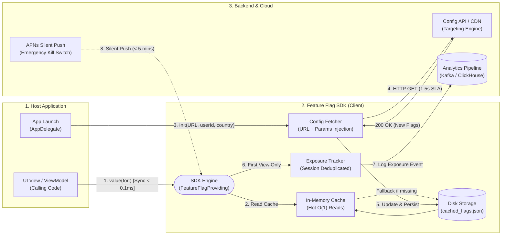

# Feature Flag & Experimentation SDK: Production System Design Guide

## 1. The Interview Problem

In mobile system design interviews at Tier-1 companies (Uber, Meta, Airbnb, Google, Stripe, Apple), interviewers ask:

> *"Design a generic, reusable Feature Flag SDK for iOS. It must support dynamic endpoint URLs and query parameters configured by the host app, guarantee synchronous O(1) reads without blocking the UI, support a resilient multi-tier fallback chain, track A/B test impressions without over-counting, and follow the Open/Closed Principle without relying on a rigid, hardcoded singleton."*

---

## 📋 2. Whiteboard Section 1: FR & NFR (What You Write on the Left)

Write these directly on the top-left of the board in 2 minutes:

### Functional Requirements (FR)
1. **Synchronous O(1) Reads**: Calling code evaluates flags instantly (`< 0.1ms`) without `await` or thread blocking.
2. **Dynamic Endpoint & Params**: Host app passes target URL, environment, and user attributes (`userId`, `country`, `appVersion`, `keys`) from the outside.
3. **4-Tier Fallback Chain**: Memory -> Disk -> Bundled JSON -> In-Code Default (app never crashes on missing keys or network failure).
4. **Impression Tracking**: Dispatches a deduplicated exposure event to analytics only when the user views the feature.
5. **Emergency Kill Switch**: Remote capability to deactivate a broken feature in < 5 minutes via APNs high-priority silent push.

### Non-Functional Requirements & Budgets (NFR)
| Metric | Production Target | Engineering Rationale |
| :--- | :--- | :--- |
| **Read Latency** | **< 0.1ms** | In-memory synchronous dictionary read under `NSLock` (main thread safe) |
| **Launch Timeout SLA** | **1.5s** | Strict splash-screen budget; never freezes app launch |
| **Payload Size** | **< 50 KB** | Compressed JSON config map |
| **Disk Storage** | **< 100 KB** | Atomic file replacement in `Application Support` directory |
| **Kill Switch SLA** | **< 5 minutes** | APNs high-priority silent push delivery |
| **Crash Budget** | **0% crashes** | Missing or corrupted keys must silently resolve to defaults |

---

## 🏛️ 3. Whiteboard Section 2: The Architecture Diagram (What You Draw in 5 Minutes)

This is the exact, clean diagram you draw on the whiteboard. It has **3 clear swimlanes** (Host App -> Client SDK -> Backend Cloud) and **7 core boxes**:


```mermaid
flowchart LR
    subgraph HostApp["1. Host Application"]
        direction TB
        UI["UI View / ViewModel
(Calling Code)"]
        Launch["App Launch
(AppDelegate)"]
    end

    subgraph SDK["2. Feature Flag SDK (Client)"]
        direction TB
        Engine(["SDK Engine
(FeatureFlagProviding)"])
        MemCache["In-Memory Cache
(Hot O(1) Reads)"]
        DiskStore[("Disk Storage
(cached_flags.json)")]
        Fetcher["Config Fetcher
(URL + Params Injection)"]
        Tracker["Exposure Tracker
(Session Deduplicated)"]
    end

    subgraph Backend["3. Backend & Cloud"]
        direction TB
        API["Config API / CDN
(Targeting Engine)"]
        Analytics[("Analytics Pipeline
(Kafka / ClickHouse)")]
        KillSwitch["APNs Silent Push
(Emergency Kill Switch)"]
    end

    %% Read Path
    UI -->|"1. value(for:) [Sync < 0.1ms]"| Engine
    Engine -->|"2. Read Cache"| MemCache
    MemCache -.->|"Fallback if missing"| DiskStore

    %% Fetch Path
    Launch -->|"3. Init(URL, userId, country)"| Fetcher
    Fetcher -->|"4. HTTP GET (1.5s SLA)"| API
    API -->|"200 OK (New Flags)"| Fetcher
    Fetcher -->|"5. Update & Persist"| DiskStore
    DiskStore --> MemCache

    %% Tracking Path
    Engine -->|"6. First View Only"| Tracker
    Tracker -->|"7. Log Exposure Event"| Analytics

    %% Emergency Kill Switch
    KillSwitch -.->|"8. Silent Push (< 5 mins)"| Engine
```

---

## 🎙️ 4. The 60-Second Verbal Script (What You Say While Drawing)

> *"I am breaking our system into three clear layers:*
>
> *1. **Host App**: Views and ViewModels call our public interface `value(for: .newCheckout)`. This is a synchronous, in-memory read taking under 0.1ms under an `NSLock`, so the main thread is never blocked.*
>
> *2. **Client SDK Core**: The SDK maintains a 4-tier fallback: hot memory cache -> atomic disk file in Application Support -> bundled factory defaults -> in-code default. If the network is down or a key is corrupt, the app never crashes.*
>
> *3. **Dynamic Network Engine**: On launch, the host app injects a `ConfigFetchRequest` with the target environment URL, user targeting attributes (userId, country, appVersion), and an optional subset of requested keys. We enforce a strict 1.5-second timeout so the splash screen is never held.*
>
> *4. **A/B Test Tracking**: We decouple evaluation from exposure. The SDK checks an in-memory session Set; only the first time a user views a feature do we emit an analytics exposure event to Kafka.*
>
> *5. **Sev-1 Kill Switch**: If a release causes a crash loop, backend operators send a high-priority APNs silent push that flips the flag to false in under 5 minutes without an app update."*

---

## 🛠️ 5. Low-Level Design (LLD): Clean Swift Code (No Sendable)

### 1. Dynamic Request Model & Network Fetcher
```swift
import Foundation

// Injected by the host app from outside
public struct ConfigFetchRequest {
    public let endpointURL: URL
    public let queryParams: [String: String]
    public let requestedKeys: [String]? // Optional: request specific flags
    public let headers: [String: String]
    public let timeoutInterval: TimeInterval

    public init(
        endpointURL: URL,
        queryParams: [String: String] = [:],
        requestedKeys: [String]? = nil,
        headers: [String: String] = [:],
        timeoutInterval: TimeInterval = 1.5
    ) {
        self.endpointURL = endpointURL
        self.queryParams = queryParams
        self.requestedKeys = requestedKeys
        self.headers = headers
        self.timeoutInterval = timeoutInterval
    }
}

public protocol ConfigFetching {
    func fetchConfiguration(
        request: ConfigFetchRequest,
        completion: @escaping (Result<[String: Any], Error>) -> Void
    )
}

public final class RemoteConfigFetcher: ConfigFetching {
    private let urlSession: URLSession

    public init(urlSession: URLSession = .shared) {
        self.urlSession = urlSession
    }

    public func fetchConfiguration(
        request: ConfigFetchRequest,
        completion: @escaping (Result<[String: Any], Error>) -> Void
    ) {
        guard var components = URLComponents(url: request.endpointURL, resolvingAgainstBaseURL: false) else {
            completion(.failure(URLError(.badURL)))
            return
        }

        var queryItems = request.queryParams.map { URLQueryItem(name: $0.key, value: $0.value) }
        if let keys = request.requestedKeys, !keys.isEmpty {
            queryItems.append(URLQueryItem(name: "keys", value: keys.joined(separator: ",")))
        }
        components.queryItems = queryItems.isEmpty ? nil : queryItems

        guard let finalURL = components.url else {
            completion(.failure(URLError(.badURL)))
            return
        }

        var urlRequest = URLRequest(url: finalURL)
        urlRequest.httpMethod = "GET"
        urlRequest.timeoutInterval = request.timeoutInterval
        for (headerKey, headerValue) in request.headers {
            urlRequest.setValue(headerValue, forHTTPHeaderField: headerKey)
        }

        let task = urlSession.dataTask(with: urlRequest) { data, response, error in
            if let error = error {
                completion(.failure(error))
                return
            }

            guard let data = data,
                  let json = try? JSONSerialization.jsonObject(with: data) as? [String: Any] else {
                completion(.failure(URLError(.cannotParseResponse)))
                return
            }

            completion(.success(json))
        }
        task.resume()
    }
}
```

---

### 2. Strongly-Typed Flag Descriptor & Core Protocols
```swift
// Strongly-typed flag token preventing string typo bugs
public struct Flag<T> {
    public let key: String
    public let defaultValue: T

    public init(key: String, defaultValue: T) {
        self.key = key
        self.defaultValue = defaultValue
    }
}

// Common flag definitions
public extension Flag where T == Bool {
    static let newCheckout = Flag<Bool>(key: "checkout_v2_enabled", defaultValue: false)
    static let biometricAuth = Flag<Bool>(key: "biometric_quick_login", defaultValue: true)
}

public extension Flag where T == Int {
    static let maxCartItems = Flag<Int>(key: "cart_max_limit", defaultValue: 50)
}

public protocol FeatureFlagProviding {
    func value<T>(for flag: Flag<T>) -> T
}

public protocol FeatureFlagSourceProvider {
    var name: String { get }
    func value(forKey key: String) -> Any?
}

public protocol ImpressionTracking {
    func logExposure(flagKey: String, value: String)
}
```

---

### 3. Pluggable Providers (Open for Extension)
```swift
// P0: Local Debug Overrides (QA & Developer Menu)
public final class DebugOverrideProvider: FeatureFlagSourceProvider {
    public let name = "DebugOverride"
    private var overrides: [String: Any] = [:]
    private let lock = NSLock()

    public init() {}

    public func setOverride<T>(value: T?, for key: String) {
        lock.lock()
        defer { lock.unlock() }
        overrides[key] = value
    }

    public func value(forKey key: String) -> Any? {
        lock.lock()
        defer { lock.unlock() }
        return overrides[key]
    }
}

// P1: Remote Config & Disk Storage Provider
public final class RemoteConfigStoreProvider: FeatureFlagSourceProvider {
    public let name = "RemoteConfig"
    private var memoryCache: [String: Any] = [:]
    private let lock = NSLock()
    private let storageURL: URL
    private let fetcher: ConfigFetching

    public init(storageURL: URL, fetcher: ConfigFetching = RemoteConfigFetcher()) {
        self.storageURL = storageURL
        self.fetcher = fetcher
        loadFromDisk()
    }

    public func value(forKey key: String) -> Any? {
        lock.lock()
        defer { lock.unlock() }
        return memoryCache[key]
    }

    public func refresh(request: ConfigFetchRequest, completion: ((Bool) -> Void)? = nil) {
        fetcher.fetchConfiguration(request: request) { [weak self] result in
            guard let self = self else { return }
            switch result {
            case .success(let newFlags):
                self.lock.lock()
                for (key, val) in newFlags {
                    self.memoryCache[key] = val
                }
                let snapshot = self.memoryCache
                self.lock.unlock()

                // Persist asynchronously with atomic write
                DispatchQueue.global(qos: .utility).async {
                    if let data = try? JSONSerialization.data(withJSONObject: snapshot) {
                        try? data.write(to: self.storageURL, options: .atomic)
                    }
                }
                completion?(true)

            case .failure:
                completion?(false)
            }
        }
    }

    private func loadFromDisk() {
        guard let data = try? Data(contentsOf: storageURL),
              let json = try? JSONSerialization.jsonObject(with: data) as? [String: Any] else { return }
        self.memoryCache = json
    }
}

// P2: Bundled Defaults Provider (Factory JSON in IPA)
public final class BundledDefaultsProvider: FeatureFlagSourceProvider {
    public let name = "BundledDefaults"
    private let defaults: [String: Any]

    public init(bundle: Bundle = .main, resourceName: String = "FeatureFlagDefaults") {
        if let url = bundle.url(forResource: resourceName, withExtension: "json"),
           let data = try? Data(contentsOf: url),
           let json = try? JSONSerialization.jsonObject(with: data) as? [String: Any] {
            self.defaults = json
        } else {
            self.defaults = [:]
        }
    }

    public func value(forKey key: String) -> Any? {
        defaults[key]
    }
}
```

---

### 4. Composite Orchestrator (`CompositeFeatureFlagService`)
```swift
public final class CompositeFeatureFlagService: FeatureFlagProviding {
    private let providers: [FeatureFlagSourceProvider]
    private let impressionTracker: ImpressionTracking?
    private var trackedImpressions: Set<String> = []
    private let lock = NSLock()

    public init(
        providers: [FeatureFlagSourceProvider],
        impressionTracker: ImpressionTracking? = nil
    ) {
        self.providers = providers
        self.impressionTracker = impressionTracker
    }

    public func value<T>(for flag: Flag<T>) -> T {
        for provider in providers {
            if let rawValue = provider.value(forKey: flag.key),
               let castedValue = rawValue as? T {
                trackImpressionIfNeeded(for: flag.key, value: castedValue)
                return castedValue
            }
        }

        trackImpressionIfNeeded(for: flag.key, value: flag.defaultValue)
        return flag.defaultValue
    }

    private func trackImpressionIfNeeded<T>(for key: String, value: T) {
        guard let impressionTracker = impressionTracker else { return }

        lock.lock()
        let alreadyTracked = trackedImpressions.contains(key)
        if !alreadyTracked {
            trackedImpressions.insert(key)
        }
        lock.unlock()

        if !alreadyTracked {
            impressionTracker.logExposure(flagKey: key, value: String(describing: value))
        }
    }
}
```

---

### 5. How the Host App Initializes and Uses the SDK
```swift
// In AppDelegate or AppLaunch
let appSupportURL = FileManager.default.urls(for: .applicationSupportDirectory, in: .userDomainMask).first!
let flagFile = appSupportURL.appendingPathComponent("cached_flags.json")

let debugProvider = DebugOverrideProvider()
let remoteStore = RemoteConfigStoreProvider(storageURL: flagFile)
let bundledDefaults = BundledDefaultsProvider()

let featureFlagService = CompositeFeatureFlagService(
    providers: [debugProvider, remoteStore, bundledDefaults]
)

// Dynamic Configuration injected by host app
let request = ConfigFetchRequest(
    endpointURL: URL(string: "https://api.mycompany.com/v1/config/resolve")!,
    queryParams: [
        "userId": "usr_99182",
        "appVersion": "5.4.0",
        "country": "US",
        "tier": "enterprise"
    ],
    requestedKeys: ["checkout_v2_enabled", "cart_max_limit"],
    headers: ["Authorization": "Bearer session_token_xyz"],
    timeoutInterval: 1.5
)

remoteStore.refresh(request: request) { success in
    print("Feature flags refreshed: \(success)")
}

// In SwiftUI View or ViewModel
let isNewCheckout = featureFlagService.value(for: .newCheckout)
```

---

## ⚖️ 6. Why Avoiding Direct Singletons Wins in Staff/EM Interviews

| Evaluation Dimension | Hardcoded Singleton (`FeatureFlag.shared`) | Protocol-Based Composite (This Design) |
|:---|:---|:---|
| **Unit Testing** | Tests share global mutable state; parallel execution causes test flakiness. | **100% Isolated**: Inject `MockFeatureFlagService` per test. |
| **SwiftUI Previews** | Stuck on whatever state the singleton holds; cannot preview both variants. | **Instant Multi-Variant**: Inject different mocks into `#Preview`. |
| **Open/Closed Principle** | Adding a source requires editing core SDK classes. | **Zero Edits**: Add any new source conforming to `FeatureFlagSourceProvider`. |
| **Scoping & Tenants** | Inability to support multi-account or guest vs logged-in flag sets. | **Scopeable**: Different containers have distinct flag service instances. |

---

## 🔄 7. Real Production Trade-offs

### 1. The Activation Dilemma: When Do New Flags Apply?
- **Immediate In-Flight Activation**: Network updates memory cache right away.
  - *Risk*: Jarring UI mutation. If a user is on Step 2 of checkout and the flag flips, Step 3 renders the new flow, causing state crashes or broken user experience.
- **Next-Launch Activation**: New flags are saved to disk and only activated on next cold start.
  - *Benefit*: Guaranteed session consistency.
  - *Tradeoff*: Takes two launches for a new feature to appear.
- **The Hybrid SLA Pattern (Recommended)**:
  - On launch, fetch with a strict **1.5s timeout**.
  - If received before splash dismisses, apply immediately.
  - If timed out, run on cached disk config, save the new payload to a `staged_flags` disk buffer, and promote on next launch.
  - **Exception**: Emergency kill switches bypass this rule and deactivate instantly.

### 2. Client vs Server-Side Rule Evaluation
- **Server-Side Evaluation (Standard)**: Client sends attributes (`userId`, `appVersion`, `country`); server returns a flat key-value map.
  - *Advantage*: Tiny payload (< 50KB), zero client battery/CPU cost, business targeting rules stay private.
- **Client-Side Evaluation**: Server sends raw rule sets; client evaluates locally using MurmurHash3.
  - *Advantage*: Works offline; instant re-evaluation if user changes profile attributes.
  - *Tradeoff*: Large payload (> 500KB); exposes unreleased feature names and targeting rules in client JSON.

### 3. Impression Tracking: Exposure vs Evaluation
- **Anti-Pattern**: Logging an analytics event every time `value(for:)` is called. If a list cell pre-fetches off-screen items, analytics records phantom impressions for features the user never saw, corrupting A/B test sample data.
- **Solution**:
  1. Separate **Evaluation** (getting the value for logic) from **Exposure** (user actually rendered the UI).
  2. Maintain an in-memory `Set<String>` per session to deduplicate impressions so repetitive calls in scroll views only emit a single exposure event.

---

## 👔 8. The EM Dimension: Governance & Operations

### 1. Preventing "Flag Rot" (Technical Debt)
- **The Problem**: After 6-12 months, an enterprise codebase accumulates hundreds of dead feature flags. Engineers leave, nobody knows if a flag is safe to delete, and apps suffer from nested `if/else` complexity.
- **The EM Governance Framework**:
  1. **Flag Expiration Metadata**: Every flag created in the dashboard must specify an owner and a `sunset_date` (90 days maximum).
  2. **Automated CI Alerts**: CI scripts query flags at 100% rollout for over 30 days and automatically file Jira/GitHub cleanup tickets assigned to the author.
  3. **Linter Enforcement**: A custom SwiftLint rule flags deprecated feature tokens older than 2 release cycles.

### 2. Emergency Kill-Switch Strategy (Sev-1 Defense)
- If a flagged feature causes a crash loop or security vulnerability:
  1. Update flag to `false` in the backend dashboard.
  2. Dispatch a high-priority **APNs Silent Push** payload: `{"action": "kill_flag", "key": "checkout_v2_enabled"}`.
  3. The client's background push handler updates disk cache and memory cache immediately without requiring an app launch.
  4. Global fleet deactivation SLA: **< 5-10 minutes**.

---

## ❓ 9. Mock Interview Q&A (Staff & EM Level)

### Q1: How does your HLD differ from your LLD?
**Answer**: Our HLD is the 3-swimlane system topology: Host App -> Feature Flag SDK -> Backend Cloud. It maps the synchronous read path (< 0.1ms), the dynamic launch fetch (1.5s SLA), the APNs silent push kill switch (< 5 mins), and the analytics stream. Our LLD zooms into the SDK internal classes: the `FeatureFlagProviding` interface, the `FeatureFlagSourceProvider` chain conforming to OCP, the dynamic `ConfigFetchRequest` model, and `NSLock` thread safety.

### Q2: Why should we avoid a direct singleton for this SDK?
**Answer**: A direct singleton couples calling code to global mutable state, making parallel unit testing impossible, breaking SwiftUI preview multi-variant isolation, and violating the Open/Closed Principle whenever a new source (like QA debug overrides or MDM profiles) is added. We replace it by defining an interface and a composite service that evaluates an array of providers.

### Q3: How do you support passing dynamic endpoints and targeting parameters from the outside?
**Answer**: We decouple the network engine using a `ConfigFetchRequest` model passed into `RemoteConfigStoreProvider.refresh(request:)`. The host application injects the base URL (allowing staging vs production switches), query parameters (userId, country, appVersion), and an optional subset of requested keys with a strict 1.5-second timeout.

### Q4: How do you prevent over-counting A/B test impressions?
**Answer**: We implement session-level impression deduplication inside the composite service using an in-memory `Set<String>`. Furthermore, we decouple evaluation from exposure: background pre-warming checks do not log impressions until the user actually renders the view displaying the feature.

---

## 🔗 Related Specs
| Spec | Description |
| :--- | :--- |
| [A/B Testing & Experimentation SDK](ab-testing-experimentation-sdk.md) | Deep dive into MurmurHash bucketing, variance analysis, and statistical significance. |
| [App Modularization & DI System](app-modularization.md) | How feature flags intersect with decoupled module builds and dependency injection. |
| [Mobile Security & Privacy Engine](mobile-security-privacy-engine.md) | Managing secure MDM configurations and enterprise policy enforcement. |
