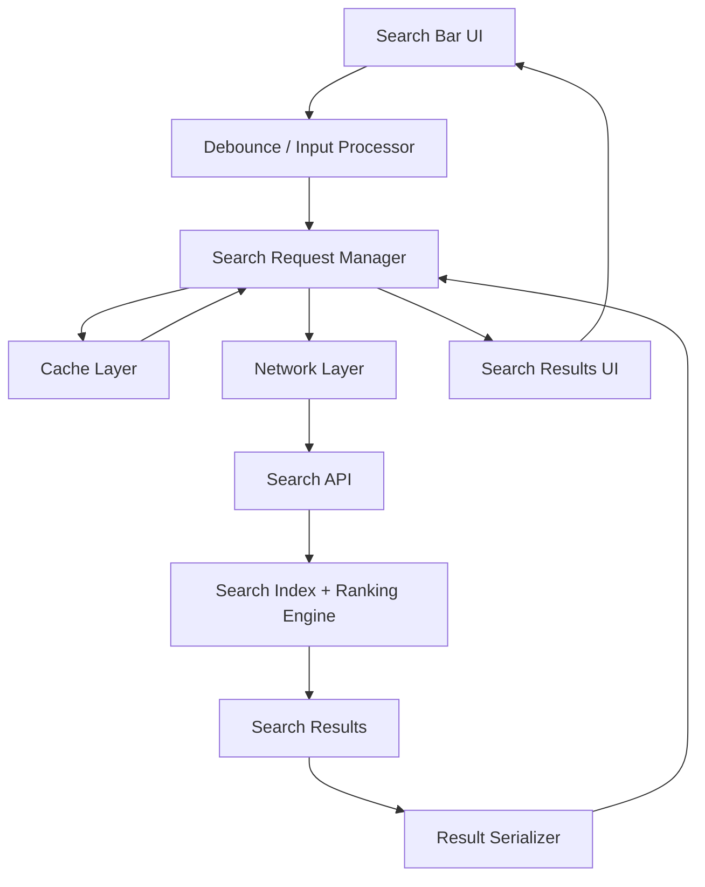

# Generic Mobile Problems

## Designing Search in Mobile Apps

This page covers the high-level design of search on mobile apps, with a focus on iOS implementation patterns, server interaction, and the architecture needed for a responsive user experience.

### Goals

- Fast search input response
- Minimal network usage
- Efficient server interaction
- Smooth results rendering in SwiftUI
- Support for offline-friendly behavior and caching

## High-Level Design (HLD)

The search flow is composed of three main layers:

1. **UI Layer**: Search input, search results list, and loading state.
2. **Client Layer**: Debounce logic, request orchestration, caching, and local filtering.
3. **Server Layer**: Search API, query ranking, pagination, and result formatting.

### HLD Diagram



### Component Responsibilities

- **Search Bar UI**: Captures user input and shows progress state.
- **Debounce / Input Processor**: Delays requests until user pauses typing.
- **Search Request Manager**: Decides whether to serve from cache or call the server.
- **Cache Layer**: Stores recent queries and results to reduce repeated network calls.
- **Network Layer**: Sends search requests to the server and handles retries.
- **Search API**: Processes query terms, applies ranking, and returns paginated results.
- **Result Serializer**: Converts server payloads into app models.
- **Search Results UI**: Displays list items and handles pagination or search suggestions.

## Server Interaction

### Typical API Contract

```http
GET /api/v1/search?q={query}&page={page}&limit={limit}&locale={locale}
Accept: application/json
Authorization: Bearer <token>
```

Response:

```json
{
  "query": "coffee",
  "results": [
    {"id": "123", "title": "Coffee Shops", "subtitle": "Nearby", "type": "location"},
    {"id": "456", "title": "Coffee Beans", "subtitle": "Products", "type": "product"}
  ],
  "page": 1,
  "total_pages": 3,
  "suggestions": ["coffee shop", "coffee beans"]
}
```

### Server Interaction Patterns

- **Debounced Requests**: Only send the request after the user stops typing for 250-400ms.
- **Incremental Loading**: Fetch first page quickly and load more results as the user scrolls.
- **Search Suggestions**: Provide lightweight suggestions before full results are loaded.
- **Fallback Handling**: Use cached results for repeated queries and show stale data if the network is unavailable.

## SwiftUI Implementation

### View Model Sketch

```swift
import Foundation
import SwiftUI

class SearchViewModel: ObservableObject {
    @Published var query: String = ""
    @Published var results: [SearchResult] = []
    @Published var isLoading: Bool = false
    @Published var errorMessage: String?

    private var debounceTask: DispatchWorkItem?
    private let searchService = SearchService()
    private let cache = SearchCache()

    func onQueryChanged(_ text: String) {
        query = text
        debounceTask?.cancel()

        let task = DispatchWorkItem { [weak self] in
            self?.performSearch()
        }

        debounceTask = task
        DispatchQueue.main.asyncAfter(deadline: .now() + 0.35, execute: task)
    }

    func performSearch() {
        guard !query.isEmpty else {
            results = []
            return
        }

        if let cached = cache.results(for: query) {
            results = cached
            return
        }

        isLoading = true
        searchService.search(query: query) { [weak self] result in
            DispatchQueue.main.async {
                self?.isLoading = false
                switch result {
                case .success(let newResults):
                    self?.results = newResults
                    self?.cache.save(newResults, for: self?.query ?? "")
                case .failure(let error):
                    self?.errorMessage = error.localizedDescription
                }
            }
        }
    }
}
```

### SwiftUI View Sketch

```swift
struct SearchView: View {
    @StateObject private var viewModel = SearchViewModel()

    var body: some View {
        VStack {
            TextField("Search", text: Binding(
                get: { viewModel.query },
                set: { viewModel.onQueryChanged($0) }
            ))
            .textFieldStyle(RoundedBorderTextFieldStyle())
            .padding()

            if viewModel.isLoading {
                ProgressView("Searching...")
            }

            List(viewModel.results) { result in
                SearchResultRow(result: result)
            }
        }
        .navigationTitle("Search")
    }
}
```

### Search Service Sketch

```swift
struct SearchResult: Identifiable, Codable {
    let id: String
    let title: String
    let subtitle: String?
    let type: String
}

class SearchService {
    func search(query: String, completion: @escaping (Result<[SearchResult], Error>) -> Void) {
        guard var components = URLComponents(string: "https://api.example.com/api/v1/search") else {
            completion(.failure(NetworkError.invalidURL))
            return
        }

        components.queryItems = [
            URLQueryItem(name: "q", value: query),
            URLQueryItem(name: "page", value: "1"),
            URLQueryItem(name: "limit", value: "20")
        ]

        guard let url = components.url else {
            completion(.failure(NetworkError.invalidURL))
            return
        }

        URLSession.shared.dataTask(with: url) { data, response, error in
            if let error = error {
                completion(.failure(error))
                return
            }
            guard let data = data else {
                completion(.failure(NetworkError.noData))
                return
            }
            do {
                let payload = try JSONDecoder().decode(SearchResponse.self, from: data)
                completion(.success(payload.results))
            } catch {
                completion(.failure(error))
            }
        }.resume()
    }
}

struct SearchResponse: Codable {
    let query: String
    let results: [SearchResult]
    let page: Int
    let totalPages: Int
}

enum NetworkError: Error {
    case invalidURL
    case noData
}
```

## Notes

- For iOS, use a custom SwiftUI search page with `TextField` for input and avoid `UISearchController` in this generic search design.
- Keep the HLD centered on user input, request debounce, cache checks, network fetch via `URLSession`, and result rendering.
- Server interaction should be lightweight, paginated, and able to support suggestion and ranking logic.
- This page is the starting point for generic mobile search design; additional pages can cover caching strategies, offline search, and personalized suggestions.
