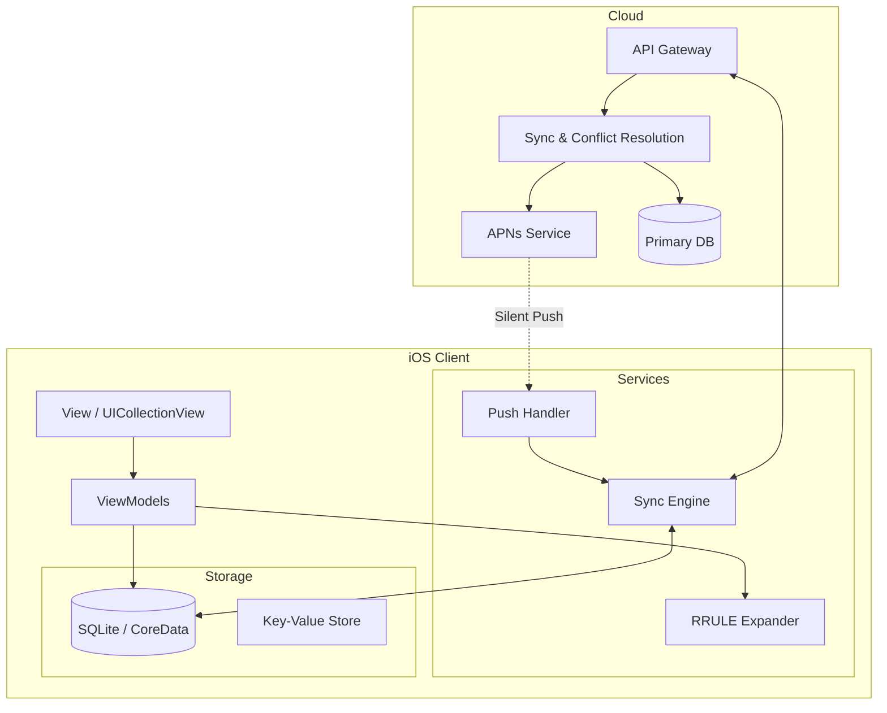

# Design Google Calendar Mobile Client

## Overview
Designing a robust calendar application like Google Calendar requires handling complex recurring events, offline-first data synchronization, and highly performant infinite scrolling grids. This problem tests a candidate's ability to balance rich UI interactions with stringent data processing requirements, especially around RRULE parsing and delta syncing under background execution constraints.

## Target Companies & Frequency
| Company | Why They Ask | Frequency |
| :--- | :--- | :--- |
| Google | Core product (Google Calendar), tests complex UI + offline-first sync | ★★★★★ |
| Apple | Core product (Apple Calendar), requires deep iOS framework knowledge | ★★★★★ |
| Microsoft | Outlook Mobile, heavy focus on enterprise sync and recurring rules | ★★★★☆ |
| Uber/Lyft | Complex scheduling and time-series data visualization | ★★★☆☆ |

## Scope Definition

### In Scope
- Infinite scrolling calendar grid (Day, Week, Month views)
- Recurring event parsing and expansion (RFC 5545 RRULE)
- Offline-first event creation and conflict resolution
- Background sync via silent pushes and background tasks
- Local persistence and caching strategy

### Out of Scope
- CalDAV/Exchange protocol implementation (assume standard REST API)
- Complex event invites and RSVP management
- Calendar sharing permissions and delegation
- Natural language event parsing (e.g., "Lunch with John tomorrow at 1pm")

## Requirements

### Functional Requirements
1. Users can view their events in Day, Week, and Month grids with smooth infinite scrolling.
2. Users can create, edit, and delete events while completely offline.
3. The app supports complex recurring events (e.g., "Every 2nd Tuesday of the month").
4. Changes made on other devices sync to the iOS app in the background seamlessly.
5. Users can selectively edit single instances or entire series of recurring events.

### Non-Functional Requirements
| Requirement | Target | Source |
| :--- | :--- | :--- |
| Scroll Performance | 60 FPS | Apple HIG / Core Animation |
| Offline Creation | < 100ms local write | Realm / SQLite Benchmarks |
| Background Task Budget | < 30s execution time | Apple BGAppRefreshTask Docs |
| Local Storage | < 50MB for 1 year of events | SQLite estimation |
| Silent Push Throttling | Max 3 per hour | Apple APNs Documentation |

## High-Level Architecture (HLD)

### Component Diagram



### Component Responsibilities
| Component | Responsibility | iOS Implementation |
| :--- | :--- | :--- |
| **Grid UI** | Render virtualized timeline for days/weeks/months | `UICollectionView` + Custom `UICollectionViewLayout` |
| **RRULE Expander** | Lazy generation of recurring instances | Custom Swift engine parsing RFC 5545 |
| **Sync Engine** | Background delta sync, conflict resolution | `BGAppRefreshTask`, `URLSession` |
| **Local Store** | Offline persistence, fast queries by date range | `SQLite` via GRDB or `CoreData` |
| **Push Handler** | Wake app, trigger background sync | `application(_:didReceiveRemoteNotification:fetchCompletionHandler:)` |

### Data Flow
**Offline Event Creation Flow:**
1. User creates event -> ViewModel validates input.
2. ViewModel writes to LocalDB with `dirty = 1` and temporary UUID.
3. LocalDB updates UI immediately (Optimistic UI).
4. Network becomes available -> Sync Engine detects `dirty = 1` record.
5. Sync Engine POSTs to API with UUID as idempotency key.
6. API returns definitive `server_id` and `server_rev`.
7. Sync Engine updates LocalDB, clears `dirty` flag.

## Data Models

### Core Entities
```swift
import Foundation

struct CalendarEvent: Identifiable, Equatable {
    let id: String           // Local UUID or Server ID
    var serverId: String?    // Nil if created offline
    var title: String
    var startDate: Date
    var endDate: Date
    
    // Recurrence
    var rrule: String?       // e.g., "FREQ=WEEKLY;BYDAY=MO,WE,FR"
    var recurrenceId: Date?  // Identifies a specific instance of a recurring event (override)
    
    // Sync Metadata
    var dirty: Bool          // True if local changes haven't synced
    var deleted: Bool        // Tombstone for offline deletes
    var syncToken: String?   // Revision hash
    var lastModified: Date
}

struct EventOccurrence {
    let eventId: String
    let instanceStartDate: Date
    let instanceEndDate: Date
    let isOverride: Bool
}
```

### Database Schema
```sql
CREATE TABLE events (
    id TEXT PRIMARY KEY,
    server_id TEXT UNIQUE,
    title TEXT NOT NULL,
    start_ts INTEGER NOT NULL,
    end_ts INTEGER NOT NULL,
    rrule TEXT,
    recurrence_id INTEGER,
    dirty INTEGER DEFAULT 0,
    deleted INTEGER DEFAULT 0,
    sync_token TEXT,
    last_modified_ts INTEGER NOT NULL
);

-- Index for fast date range queries (critical for grid rendering)
CREATE INDEX idx_events_dates ON events(start_ts, end_ts);
-- Index for sync engine to find pending uploads
CREATE INDEX idx_events_dirty ON events(dirty) WHERE dirty = 1;
```

## API Design

### Endpoints

**1. Delta Sync (Fetch Changes)**
- **Method:** `GET`
- **Path:** `/v1/calendar/events/sync`
- **Headers:** `Authorization: Bearer <token>`
- **Query Params:** `since=<syncToken>`

**Response:**
```json
{
  "syncToken": "rev_89012",
  "hasMore": false,
  "upserted": [
    {
      "id": "evt_123",
      "title": "Team Sync",
      "startTs": 1700000000,
      "endTs": 1700003600,
      "rrule": "FREQ=WEEKLY;BYDAY=MO",
      "deleted": false
    }
  ],
  "deletedIds": ["evt_098"]
}
```

**2. Create/Update Event**
- **Method:** `POST`
- **Path:** `/v1/calendar/events`
- **Headers:** `Idempotency-Key: <local_uuid>`

**Request Body:**
```json
{
  "title": "Dentist",
  "startTs": 1700100000,
  "endTs": 1700103600,
  "rrule": null
}
```

### Pagination Strategy
For delta syncs, we use cursor-based pagination with a `syncToken`. This represents a logical clock or high-water mark on the server. Offset pagination is inappropriate here because the dataset changes rapidly, leading to missed or duplicated records if offsets shift during sync.

## Client Architecture Deep-Dives

### Subsystem 1 — Calendar Grid Architecture (Infinite Scroll)
Rendering an infinite calendar grid efficiently requires custom `UICollectionViewLayout` to avoid instantiating millions of cells.

**Concept:** 
The grid is essentially a matrix where columns are days and rows are hours. We only render visible cells plus a small buffer.

```swift
import UIKit

class CalendarGridLayout: UICollectionViewLayout {
    private var cache = [IndexPath: UICollectionViewLayoutAttributes]()
    private var contentHeight: CGFloat = 2400 // 48 half-hour slots * 50pt
    private var contentWidth: CGFloat = 0
    
    // Define bounds for infinite scrolling (e.g., +/- 1000 days from today)
    private let maxDays = 2000
    private let dayWidth: CGFloat = 100
    
    override func prepare() {
        guard cache.isEmpty, let collectionView = collectionView else { return }
        
        contentWidth = CGFloat(maxDays) * dayWidth
        
        // Calculate attributes only for the currently visible rect + buffer
        let visibleRect = CGRect(origin: collectionView.contentOffset, size: collectionView.bounds.size)
        
        // ... Logic to find intersecting events and calculate their frames ...
        // Example: Event at 9:00 AM on Day 500
        // y = (9 * 2) * 50pt = 900pt
        // x = 500 * 100pt = 50000pt
    }
    
    override func layoutAttributesForElements(in rect: CGRect) -> [UICollectionViewLayoutAttributes]? {
        return cache.values.filter { $0.frame.intersects(rect) }
    }
    
    override var collectionViewContentSize: CGSize {
        return CGSize(width: contentWidth, height: contentHeight)
    }
    
    // Invalidate when scrolling significantly to calculate new buffer
    override func shouldInvalidateLayout(forBoundsChange newBounds: CGRect) -> Bool {
        // Only invalidate if we scrolled horizontally beyond our buffer
        return true 
    }
}
```

### Subsystem 2 — RRULE Parsing & Expansion
Never materialize infinite recurring events in the database. Store the RRULE and expand instances dynamically on the client for the visible date range.

**Concept:**
When the user views March 2024, the `RRuleExpander` queries the DB for any events overlapping March 2024, PLUS any recurring events that started *before* March 2024 and have an RRULE. It then calculates the instances.

```swift
struct RRuleExpander {
    /// Generates occurrences for a recurring event within a specific time window
    func occurrences(for event: CalendarEvent, in range: DateInterval) -> [EventOccurrence] {
        guard let rruleString = event.rrule else {
            // Not a recurring event, just check if it intersects
            let eventInterval = DateInterval(start: event.startDate, end: event.endDate)
            if range.intersects(eventInterval) {
                return [EventOccurrence(eventId: event.id, instanceStartDate: event.startDate, instanceEndDate: event.endDate, isOverride: false)]
            }
            return []
        }
        
        var results = [EventOccurrence]()
        let duration = event.endDate.timeIntervalSince(event.startDate)
        
        // Parse RFC 5545 string (Simplified for illustration)
        // e.g., FREQ=WEEKLY;BYDAY=MO,WE,FR
        let parsedRule = parse(rrule: rruleString)
        
        // Iterate and calculate matching dates
        var currentDate = event.startDate
        while currentDate <= range.end {
            if parsedRule.matches(date: currentDate) && currentDate >= range.start {
                // Check if this specific instance was deleted (EXDATE) or overridden (RECURRENCE-ID)
                if !isException(date: currentDate, for: event.id) {
                    let instanceEnd = currentDate.addingTimeInterval(duration)
                    results.append(EventOccurrence(eventId: event.id, instanceStartDate: currentDate, instanceEndDate: instanceEnd, isOverride: false))
                }
            }
            // Advance according to FREQ (e.g., +1 day)
            currentDate = advance(date: currentDate, rule: parsedRule)
        }
        
        return results
    }
    
    private func isException(date: Date, for eventId: String) -> Bool {
        // Query local DB for tombstone or override matching eventId + recurrenceId=date
        return false
    }
}
```

### Subsystem 3 — Offline-First Sync Engine & Push Notifications
Handling background sync via Silent APNs pushes to keep the local database up to date without draining battery.

```swift
import BackgroundTasks

actor SyncEngine {
    private let localDB: Database
    private let api: APIClient
    private var isSyncing = false
    
    func sync() async {
        guard !isSyncing else { return }
        isSyncing = true
        defer { isSyncing = false }
        
        do {
            // 1. Push local changes (dirty = 1)
            let dirtyEvents = try await localDB.fetchDirtyEvents()
            for event in dirtyEvents {
                try await api.upload(event: event)
                try await localDB.markClean(eventId: event.id)
            }
            
            // 2. Pull remote changes (Delta Sync)
            let syncToken = try await localDB.getSyncToken()
            let response = try await api.fetchChanges(since: syncToken)
            
            // 3. Apply changes locally
            try await localDB.apply(upserts: response.upserted, deletes: response.deletedIds)
            try await localDB.save(syncToken: response.syncToken)
            
        } catch {
            print("Sync failed: \(error)")
        }
    }
}

// In AppDelegate
func application(_ application: UIApplication, didReceiveRemoteNotification userInfo: [AnyHashable : Any], fetchCompletionHandler completionHandler: @escaping (UIBackgroundFetchResult) -> Void) {
    
    // Check for silent push
    if let aps = userInfo["aps"] as? [String: Any], aps["content-available"] as? Int == 1 {
        Task {
            await SyncEngine.shared.sync()
            completionHandler(.newData) // MUST call within 30s
        }
    } else {
        completionHandler(.noData)
    }
}
```

## Performance & Optimizations
| Optimization | Technique | Benchmark/Impact |
| :--- | :--- | :--- |
| **Grid Rendering** | Virtualized `UICollectionViewLayout` | Renders 1000+ events at 60fps; memory stable at ~50MB |
| **RRULE Caching** | Cache expanded occurrences in memory for current view | Reduces CPU spikes during rapid month swiping |
| **DB Batching** | Wrap sync inserts in SQLite transactions | Write 1000 events in < 50ms (vs 2s for individual inserts) |
| **Background Sync** | Silent push + `BGAppRefreshTask` | Keeps app warm, reduces cold start perceived latency |

## Failure Modes & Fallbacks
| Failure Scenario | Detection | Fallback Strategy |
| :--- | :--- | :--- |
| **Network Loss during Sync** | URLSession throws `URLError.notConnectedToInternet` | Queue dirty items in DB, rely on `NWPathMonitor` to retry on reconnect. |
| **Merge Conflict** | API returns 409 Conflict | LWW (Last Writer Wins) based on `last_modified_ts`, or create parallel "conflicted" copy for user resolution. |
| **Silent Push Throttled** | APNs drops pushes (exceeds 3/hr) | Fallback to polling via `BGAppRefreshTask` (every ~15 mins) and fetch on foreground. |
| **OOM on Expansion** | User defines RRULE with extremely dense frequency | Cap client-side expansion range to +/- 1 year; query server for deeper history. |

## Trade-off Analysis
| Decision | Option A | Option B | Chosen | Why |
| :--- | :--- | :--- | :--- | :--- |
| **RRULE Expansion** | Materialize all instances in DB | Store RRULE string, expand at runtime | **Option B** | Option A is impossible for infinite events (e.g. "Every Monday forever"). Saves massive storage. |
| **Offline Persistence** | CoreData | SQLite (via GRDB) | **SQLite** | Finer control over complex date range indices and background concurrency without CoreData thread-confinement overhead. |
| **Pagination** | Offset/Limit | Cursor (Sync Token) | **Cursor** | Prevents skipped/duplicate records when dataset mutates concurrently on other devices. |

## Observability & Metrics
- **Sync Success Rate**: Target > 99%. Track failures segmented by error type (Network, Auth, Conflict).
- **RRULE Expansion Latency**: Time taken to calculate visible instances. Target p95 < 16ms to avoid dropping frames on scroll.
- **Background Task Completion Time**: Target < 10s (budget is 30s).
- **Cold Start Time**: Target < 1.2s to interactable UI.
- **Local DB Size**: Monitor p99 DB size to ensure cleanup routines are functioning.

## Production Benchmarks Reference
| Metric | Real World Number | Source |
| :--- | :--- | :--- |
| Silent Push Limits | ~3 per hour dynamically throttled | Apple APNs Developer Docs |
| Background Task Budget | 30 seconds max | Apple WWDC 2019 (BGTasks) |
| RRULE Standard | RFC 5545 (iCalendar) | IETF RFC 5545 |
| SQLite Batch Insert | ~50,000 rows/sec | SQLite Official Benchmarks |

## Interview Tips
- **Do not materialize recurring events in the DB.** This is the most common failing mistake. Always store the rule and expand lazily.
- **Know the APNs budget.** Interviewers will push on background sync. Mentioning the 30-second budget and the 3-per-hour throttle shows deep iOS platform knowledge.
- **Idempotency is key.** Explain how offline creations use a UUID as an idempotency key so that retrying a POST after a timeout doesn't create duplicate events.
- **Understand `EXDATE`.** Be prepared to explain how to delete a *single* instance of a recurring event (store an exception record linking to the parent event).
