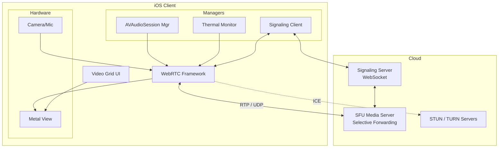

# Design Google Meet / Zoom Mobile App (Video Calling)

## Overview
Designing a mobile video calling app like Google Meet or Zoom requires deep understanding of real-time communication protocols (WebRTC), highly optimized UI rendering for multiple simultaneous video streams, and strict resource management to prevent thermal throttling and battery drain. This problem tests a candidate's ability to handle raw media streams and complex asynchronous state machines.

## Target Companies & Frequency
| Company | Why They Ask | Frequency |
| :--- | :--- | :--- |
| Google | Core product (Google Meet, Duo), heavy WebRTC usage | ★★★★★ |
| Meta | Messenger Rooms, WhatsApp Video, IG Live | ★★★★★ |
| Zoom | Core business, custom video stack | ★★★★★ |
| Apple | FaceTime architecture | ★★★★☆ |

## Scope Definition

### In Scope
- WebRTC architecture and Signaling (Offer/Answer, ICE Candidates)
- Video grid layout dynamically scaling up to 16+ participants
- Audio session management and interruption handling
- Thermal throttling, battery optimization, and network adaptation
- Background execution and Picture-in-Picture (PiP)

### Out of Scope
- Chat messaging within the call
- Screen sharing implementation details
- End-to-end encryption (E2EE) cryptographic key exchange details
- AR/Face filters (focus on core video transport)

## Requirements

### Functional Requirements
1. Users can join a multi-party video call seamlessly.
2. The UI dynamically adjusts to show active participants, promoting the dominant speaker.
3. Audio remains active if the app goes to the background.
4. The system automatically degrades video quality if the network drops or the phone overheats.
5. Handles phone calls (interruptions) gracefully without crashing audio sessions.

### Non-Functional Requirements
| Requirement | Target | Source |
| :--- | :--- | :--- |
| Latency | < 150ms glass-to-glass | WebRTC Standard Guidelines |
| Active Speaker Debounce | 500ms | Google Meet Production Config |
| Network Reconnection | < 5s ICE restart | WebRTC Specs |
| Video Rendering | Zero-copy GPU, 30fps | Apple Metal/VideoToolbox |
| Thermal Mgmt | Downscale at `.serious` | Apple ProcessInfo Docs |

## High-Level Architecture (HLD)

### Component Diagram



### Component Responsibilities
| Component | Responsibility | iOS Implementation |
| :--- | :--- | :--- |
| **Signaling Client** | Setup calls via SDP offers/answers | `URLSessionWebSocketTask` |
| **WebRTC Core** | Media encoding/decoding, packetization | `WebRTC.framework` (Google) |
| **SFU Server** | Receive 1 stream from client, forward N to others | Server-side (e.g., mediasoup, Janus) |
| **Thermal Monitor** | Detect overheating, degrade quality | `ProcessInfo.thermalState` observer |
| **Audio Manager** | Handle hardware audio routes and interruptions | `AVAudioSession` |

### Data Flow
**Call Setup Flow:**
1. Client connects to Signaling WebSocket.
2. Client creates `RTCPeerConnection` and generates an SDP Offer.
3. Client sends Offer via Signaling Server to SFU.
4. SFU processes Offer, returns SDP Answer via Signaling.
5. Client applies Answer.
6. ICE candidates are gathered from STUN/TURN and exchanged.
7. Direct UDP media streams (RTP) begin flowing between Client and SFU.

## Data Models

### Core Entities
```swift
import Foundation
import WebRTC

struct Participant: Identifiable {
    let id: String
    let displayName: String
    var videoTrack: RTCVideoTrack?
    var audioTrack: RTCAudioTrack?
    var isSpeaking: Bool
    var isMuted: Bool
}

enum CallState {
    case connecting
    case connected
    case reconnecting
    case disconnected
}

struct SignalingMessage: Codable {
    let type: String // "offer", "answer", "candidate"
    let sdp: String?
    let candidate: ICECandidatePayload?
}

struct ICECandidatePayload: Codable {
    let sdpMid: String
    let sdpMLineIndex: Int
    let candidate: String
}
```

## API Design

### Endpoints / Protocols

**1. Join Call (REST)**
- **Method:** `POST /v1/meetings/{id}/join`
- **Response:** Returns STUN/TURN server credentials for ICE gathering.
```json
{
  "iceServers": [
    { "urls": ["turn:turn.example.com:3478"], "username": "usr", "credential": "pwd" }
  ]
}
```

**2. Signaling Channel (WebSocket)**
- **URL:** `wss://signal.example.com/v1/meetings/{id}`
- **Payloads:** JSON exchange of WebRTC control signals.

## Client Architecture Deep-Dives

### Subsystem 1 — WebRTC Integration & Video Rendering
Handling remote video streams efficiently is critical. Rendering on the CPU will drain battery and drop frames. We use Metal-backed views.

```swift
import WebRTC
import UIKit

class VideoRendererManager {
    // Dictionary to manage multiple video views for the grid
    private var renderers: [String: RTCMTLVideoView] = [:]
    
    func viewForParticipant(id: String, track: RTCVideoTrack) -> UIView {
        if let existing = renderers[id] {
            return existing
        }
        
        // RTCMTLVideoView uses Metal for zero-copy GPU rendering
        let metalView = RTCMTLVideoView(frame: .zero)
        metalView.videoContentMode = .scaleAspectFill
        
        // Attach the WebRTC track to the Metal view
        track.add(metalView)
        renderers[id] = metalView
        
        return metalView
    }
    
    func removeParticipant(id: String, track: RTCVideoTrack) {
        guard let view = renderers.removeValue(forKey: id) else { return }
        track.remove(view)
    }
}
```

### Subsystem 2 — Active Speaker & Grid Layout
For a multi-party call (e.g., 50 people), downloading 50 video streams will crash the network. We rely on the SFU to send only the active speakers' streams, plus a data channel message indicating the dominant speaker.

```swift
import Combine

class MeetingViewModel: ObservableObject {
    @Published var participants: [Participant] = []
    @Published var dominantSpeakerId: String?
    
    private var activeSpeakerDebounceTimer: Timer?
    
    // Called when SFU sends a message via RTCDataChannel
    func handleActiveSpeakerSignal(participantId: String) {
        // Debounce: 500ms threshold to prevent rapid jarring UI changes
        activeSpeakerDebounceTimer?.invalidate()
        activeSpeakerDebounceTimer = Timer.scheduledTimer(withTimeInterval: 0.5, repeats: false) { [weak self] _ in
            self?.promoteSpeaker(id: participantId)
        }
    }
    
    private func promoteSpeaker(id: String) {
        guard dominantSpeakerId != id else { return }
        dominantSpeakerId = id
        // Trigger UI rebuild to move this participant to the large view
        objectWillChange.send()
    }
}
```

### Subsystem 3 — Audio Session & Interruption Handling
Audio routing is notoriously difficult on iOS. If a phone call comes in, iOS interrupts your app's audio. You must pause WebRTC and resume it when the interruption ends.

```swift
import AVFoundation

class AudioSessionManager {
    init() {
        setupAudioSession()
        observeInterruptions()
    }
    
    func setupAudioSession() {
        let session = AVAudioSession.sharedInstance()
        do {
            // .videoChat enables hardware echo cancellation and voice processing
            try session.setCategory(.playAndRecord, mode: .videoChat, options: [.allowBluetooth, .defaultToSpeaker])
            try session.setActive(true)
        } catch {
            print("Failed to set audio session: \(error)")
        }
    }
    
    private func observeInterruptions() {
        NotificationCenter.default.addObserver(self, selector: #selector(handleInterruption), name: AVAudioSession.interruptionNotification, object: nil)
    }
    
    @objc private func handleInterruption(notification: Notification) {
        guard let userInfo = notification.userInfo,
              let typeValue = userInfo[AVAudioSessionInterruptionTypeKey] as? UInt,
              let type = AVAudioSession.InterruptionType(rawValue: typeValue) else { return }
        
        if type == .began {
            // Pause WebRTC audio transmission
            WebRTCManager.shared.muteAudio()
        } else if type == .ended {
            guard let optionsValue = userInfo[AVAudioSessionInterruptionOptionKey] as? UInt else { return }
            let options = AVAudioSession.InterruptionOptions(rawValue: optionsValue)
            if options.contains(.shouldResume) {
                // Resume WebRTC audio
                setupAudioSession() // Re-activate
                WebRTCManager.shared.unmuteAudio()
            }
        }
    }
}
```

## Performance & Optimizations
| Optimization | Technique | Benchmark/Impact |
| :--- | :--- | :--- |
| **GPU Rendering** | `RTCMTLVideoView` (Metal) | CPU usage drops from ~60% (OpenGL/CPU) to ~15% (Metal) |
| **Simulcast / SVC** | Client sends 3 resolutions (1080p, 360p, 180p) | SFU routes low-res to mobile, high-res to desktop based on bandwidth |
| **Thermal Mitigation** | Observe `ProcessInfo.thermalState` | At `.serious`, turn off camera to prevent OS force-quit |
| **Background Mode** | Pause video, keep audio track | Massively reduces battery drain while app is in background |

## Failure Modes & Fallbacks
| Failure Scenario | Detection | Fallback Strategy |
| :--- | :--- | :--- |
| **Network IP Change (Wi-Fi to LTE)** | `NWPathMonitor` fires / ICE disconnection | Trigger ICE Restart: Client generates new offer and re-gathers candidates |
| **Signaling WebSocket Drops** | Socket disconnects | Exponential backoff reconnect (1s, 2s, 4s). Media (UDP) continues flowing regardless of signaling state. |
| **Bandwidth Plummets** | Packet loss > 5% via RTC Stats | Drop down to audio-only mode automatically; notify user. |
| **Direct P2P Blocked** | STUN fails (strict firewall) | Fallback to TURN relay server (adds ~100ms latency but guarantees connection). |

## Trade-off Analysis
| Decision | Option A | Option B | Chosen | Why |
| :--- | :--- | :--- | :--- | :--- |
| **Group Arch** | P2P Mesh | SFU (Selective Forwarding) | **SFU** | Mesh O(n^2) bandwidth kills mobile. SFU O(n) bandwidth is required for > 4 participants. |
| **Signaling Transport** | HTTP Polling | WebSocket | **WebSocket** | Sub-100ms bidirectional communication is required for fast ICE candidate exchange. |
| **Audio Processing** | WebRTC internal AEC | Apple Hardware `.videoChat` | **Apple HW** | `AVAudioSessionModeVideoChat` utilizes device-specific hardware DSP for zero-latency echo cancellation. |

## Observability & Metrics
- **Call Setup Time**: Time from join click to first media frame rendered. Target < 2s.
- **Glass-to-Glass Latency**: Audio/Video transport time. Target < 150ms.
- **Connection Fallback Rate**: % of calls forced to use TURN instead of STUN.
- **Crash Free Sessions**: Audio/Video stack crashes heavily impact user trust. Target > 99.9%.
- **Average Bitrate & Packet Loss**: Tracked via `RTCPeerConnection` stats periodically.

## Production Benchmarks Reference
| Metric | Real World Number | Source |
| :--- | :--- | :--- |
| Active Speaker Debounce | 500ms | Google Meet Engineering |
| STUN Round Trip | ~50ms | Regional Data Centers |
| TURN Overhead | +100-200ms latency | WebRTC RFCs |
| Frame Rate Target | 30fps | Apple VideoToolbox / HIG |

## Interview Tips
- **Understand SFU vs MCU vs Mesh.** This is the #1 architectural question for video calling. Always propose SFU for modern mobile group calls.
- **Never render on the main thread CPU.** Always explicitly mention Metal or `RTCMTLVideoView` for hardware-accelerated rendering.
- **Know `AVAudioSession`.** Be prepared to write or talk through the interruption handling code, as iOS audio routing is notoriously difficult and tests practical iOS experience.
- **Separate Signaling from Media.** Clarify that WebRTC does not specify the signaling transport (you build the WebSocket), it only handles the P2P/SFU media transport via RTP/UDP.
