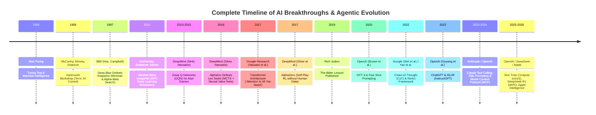
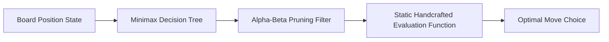
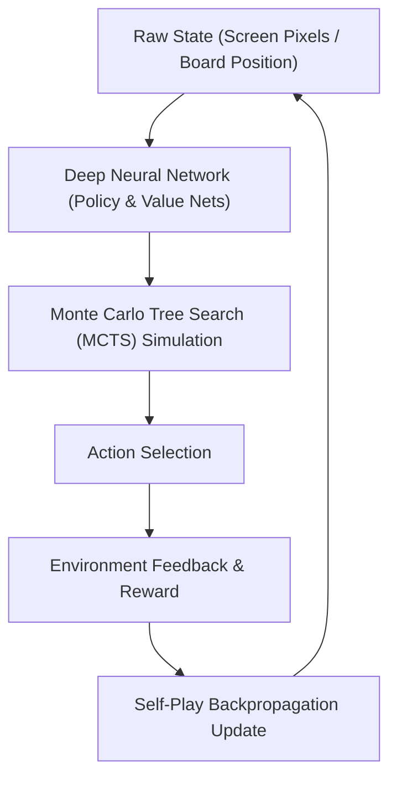
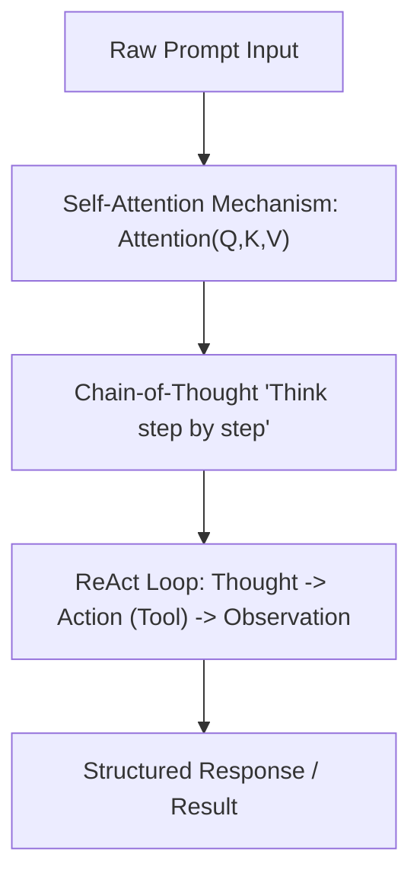
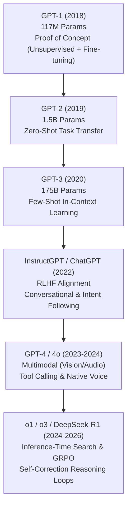
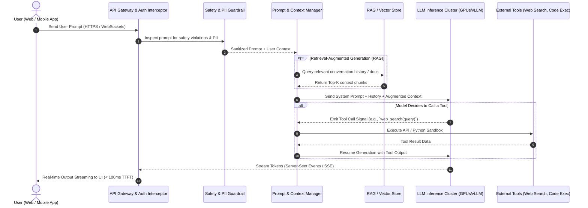
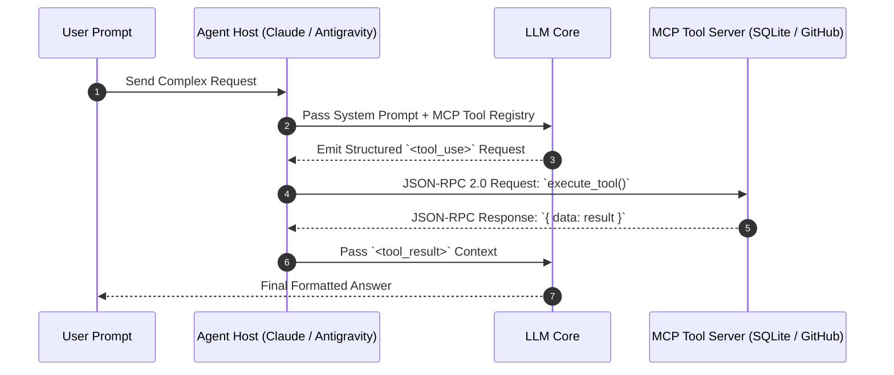
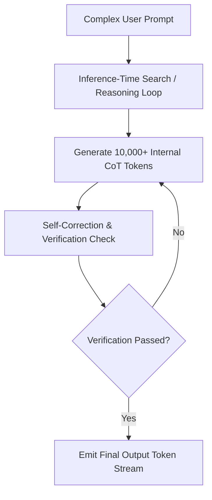

# The Complete History & Evolution of Agentic AI, Loop Engineering & ML

## Executive Overview
Understanding the evolution of Artificial Intelligence is not just about memorizing milestones; it is about grasping a fundamental shift in paradigm: **moving from static, rule-based algorithms to autonomous, reasoning feedback loops**.

This document traces the complete history of AI agentic loops from 1950 to 2026—explaining major breakthroughs, key researchers and institutions, foundational papers, and key mental models that every AI engineer must master.

---

## 🗺️ Complete Breakthrough Timeline (1950 – 2026)

---

## 📜 Detailed Breakthrough Analysis by Era

### Era 1: Symbolic AI & Game Search Loops (1950 – 1997)

* **1950 — Alan Turing (Turing Test)**: Published *"Computing Machinery and Intelligence"*, asking *"Can machines think?"* and proposing the Imitation Game.
* **1956 — Dartmouth Workshop (McCarthy, Minsky, Rochester, Shannon)**: The founding event of AI as a formal discipline. John McCarthy coined the term *"Artificial Intelligence"*.
* **1997 — IBM Deep Blue (Feng-hsiung Hsu, Murray Campbell)**:
  * **Breakthrough**: Defeated World Chess Champion Garry Kasparov 3.5–2.5.
  * **Mechanism**: Custom hardware evaluating up to $200\text{ million}$ positions per second using an **Alpha-Beta Pruning Minimax Search Loop**.
  * **Limitation**: Zero learning ability. Hardcoded static chess evaluations.

---

### Era 2: Deep Reinforcement Learning & Tree Search Loops (2012 – 2017)

* **2012 — AlexNet (Alex Krizhevsky, Ilya Sutskever, Geoffrey Hinton)**:
  * Won the ImageNet competition by a massive margin using Convolutional Neural Networks (CNNs) trained on GPUs. Launched the modern Deep Learning era.
* **2013–2015 — DeepMind Deep Q-Networks / DQN (Volodymyr Mnih, Demis Hassabis et al.)**:
  * **Breakthrough**: First AI agent to master Atari 2600 games directly from raw pixel inputs using Reinforcement Learning.
  * **Key Concept**: **Experience Replay Buffer**—storing past state-action-reward tuples in a memory queue to break correlation in training data.
* **2016 — DeepMind AlphaGo (David Silver, Demis Hassabis et al.)**:
  * Defeated 18-time world champion Lee Sedol 4–1 in Go.
  * **Mechanism**: Combined **Monte Carlo Tree Search (MCTS)** with Policy Networks (predicting next move) and Value Networks (evaluating position win probability).
* **2017 — DeepMind AlphaZero (David Silver et al.)**:
  * Mastered Chess, Shogi, and Go starting from random play with **zero human domain knowledge**, relying solely on a **Self-Play RL Loop**.

---

### Era 3: The Transformer Era & Prompt Engineering (2017 – 2022)

* **2017 — Transformer Architecture (Ashish Vaswani, Noam Shazeer et al., Google Research)**:
  * Published *"Attention Is All You Need"*, introducing the **Self-Attention Mechanism**:
    $$\text{Attention}(Q, K, V) = \text{softmax}\left(\frac{QK^T}{\sqrt{d_k}}\right)V$$
  * Replaced Recurrent Neural Networks (RNNs) with parallelizable attention layers.
* **2020 — GPT-3 & Scaling Laws (Tom Brown et al., OpenAI / Kaplan et al.)**:
  * Demonstrated **Few-Shot Prompting**: Large models can perform new tasks in-context without weight updates simply by receiving examples in the prompt.
  * **Kaplan et al. Scaling Laws**: Established that model performance predictably scales with compute budget, dataset size, and parameter count.
* **2022 — Chinchilla Scaling Laws (Hoffmann et al., DeepMind)**:
  * Showed that most models were over-parameterized and under-trained. Proved that for optimal performance, training tokens should scale proportionally with model parameter count ($20\text{ tokens per parameter}$).
* **2022 — Chain-of-Thought / CoT (Jason Wei et al., Google)**:
  * Proved that prompting LLMs to generate intermediate reasoning tokens (`"Think step by step"`) dramatically improved mathematical and logical accuracy.
* **2022 — ReAct Framework (Shunyu Yao et al., Princeton / Google Brain)**:
  * Formalized the first LLM agentic loop: **Reasoning (Thought) + Acting (Tool Call) + Observation**.
* **2022 — ChatGPT & RLHF (Long Ouyang et al., OpenAI)**:
  * Applied **Reinforcement Learning from Human Feedback (RLHF)** using Proximal Policy Optimization (PPO) to align raw language models into helpful conversational assistants (InstructGPT / ChatGPT).

---

## 🤖 The GPT Evolution & High-Level ChatGPT Architecture

### 1. GPT Evolution: What, How & Why

The Generative Pre-trained Transformer (GPT) lineage created by **OpenAI** (founded by Ilya Sutskever, Sam Altman, Greg Brockman, Wojciech Zaremba, Elon Musk, et al. in 2015) transformed AI from specialized tools to general-purpose conversational & agentic intelligence.

| Model | Release | Key Creator / Lab | Key Innovation | Why It Mattered |
| :--- | :--- | :--- | :--- | :--- |
| **GPT-1** | 2018 | Alec Radford et al. (OpenAI) | Unsupervised Generative Pre-training + Supervised Fine-Tuning | Proved that pre-training a decoder Transformer on unlabeled text yields transfer learning. |
| **GPT-2** | 2019 | Alec Radford et al. (OpenAI) | Scaling to 1.5B parameters, "Zero-Shot" task transfer | Showed that models learn tasks (translation, summarization) automatically simply by predicting next words. |
| **GPT-3** | 2020 | Tom Brown et al. (OpenAI) | 175B parameters, In-Context Few-Shot Prompting | Proved that emergent reasoning appears at scale without modifying model weights. |
| **InstructGPT / ChatGPT** | 2022 | Long Ouyang, John Schulman et al. (OpenAI) | RLHF (Reinforcement Learning from Human Feedback) via PPO | Fixed raw text completion ("hallucinated rambling") into a helpful, safe, conversational assistant. |
| **GPT-4 / GPT-4o** | 2023–24 | OpenAI Team | Multimodal Mixture of Experts (MoE) & Native Audio/Vision | Enabled real-time vision, low-latency audio interaction, and complex tool execution. |
| **o1 / o3 / DeepSeek-R1** | 2024–26 | OpenAI / DeepSeek AI | Inference-Time Search & GRPO RL Reasoning Loops | Shifted paradigm: models think/verify internally *before* responding, solving PhD-level math & code. |

---

### 2. High-Level ChatGPT System Architecture

How does a web or mobile request to ChatGPT actually work under the hood?

---

### 3. Step-by-Step Breakdown: What Happens When You Press "Send"

1. **API Gateway & Auth**: The client app connects via TLS 1.3. Your token is authenticated, rate limits are evaluated (Token Bucket), and request is logged.
2. **Safety & Moderation Guard**: High-speed lightweight classifiers (or regex rules) screen the input for malicious prompts, PII leaks, or policy violations.
3. **Context Assembly (RAG & Session)**: The Orchestrator combines:
   * **System Instruction**: `"You are a helpful assistant..."`
   * **Conversation Memory**: Past $N$ turns of dialogue stored in database.
   * **Retrieved Knowledge**: Relevant user files or memory entries retrieved via embedding vector search.
4. **LLM Inference Execution**:
   * The context is tokenized and fed into the GPU cluster running high-throughput inference engines (like vLLM, TensorRT-LLM, or SGLang).
   * Key-Value (KV) Caching speeds up past context processing.
5. **Autoregressive Token Streaming**:
   * Tokens are generated sequentially ($25\text{--}100\text{ tokens/sec}$).
   * Streamed back to the client UI in real time using **Server-Sent Events (SSE)** so the user sees text appear instantly without waiting for completion.

---

### Era 4: Tool Calling, Claude & Model Context Protocol (2023 – 2024)

* **2023 — Anthropic Claude Prompting Standards**:
  * Introduced XML tag isolation (`<instructions>`, `<thinking>`, `<tool_use>`) and the **`<thinking>` scratchpad pattern**, setting the standard for enterprise agent prompting.
* **2023 — Direct Preference Optimization / DPO (Rafailov et al., Stanford)**:
  * Simplified alignment by eliminating the complex separate reward model in RLHF, optimizing policy weights directly from preference pairs.
* **November 2024 — Model Context Protocol / MCP (Anthropic)**:
  * Released an open JSON-RPC 2.0 protocol establishing a universal client-server interface for LLMs to query external tools, databases, and local operating system resources.

---

### Era 5: Modern Current State — Test-Time Compute & RL Reasoning Loops (2025 – 2026)

* **2024–2025 — Test-Time Compute & Reasoning Models (OpenAI o1 / o3)**:
  * Shifted the scaling paradigm from pre-training compute to **Inference-Time Compute**. Models run an internal tree-search reasoning loop before producing the first output token.
* **2025 — DeepSeek-R1 & GRPO (DeepSeek AI)**:
  * Introduced **Group Relative Policy Optimization (GRPO)**—an open-weights RL technique allowing LLMs to naturally develop self-correction, verification, and long chain-of-thought reasoning loops without human annotations.
* **2025–2026 — On-Device Agent Runtimes**:
  * **Apple Intelligence**: CoreML + Apple Neural Engine (ANE) running on-device foundation models and local RAG indexes with privacy guarantees.
  * **Meta ExecuTorch**: 4-bit INT4 quantized Llama-3 models running on mobile GPUs/NPUs backed by memory-mapped files (`mmap`).

---

## 🧠 Mental Models & Core Principles Every AI Learner Must Know

### 1. The Bitter Lesson (Rich Sutton, 2019)
> *"The biggest lesson that can be read from 70 years of AI research is that general methods that leverage computation are the most effective, and by a large margin."*

* **Key Takeaway**: Human-engineered heuristics, rules, and domain-specific tricks always get surpassed by general methods (**Search** and **Learning/Compute**) as hardware scales.

### 2. Pre-Training Compute vs. Test-Time Compute
* **Pre-Training Compute**: Training a massive model on trillions of tokens once (expensive, static knowledge).
* **Test-Time Compute**: Allowing a model to generate thousands of internal reasoning/search tokens *during inference* for a specific hard problem (dynamic, adaptive reasoning).

### 3. The Agentic Loop Core Equation
Every modern agent operates on this continuous state loop:

$$S_{t+1} = \text{Environment}(\text{Action}_t, \text{Observation}_t)$$
$$\text{Action}_t = \text{LLM Policy}(\text{System Prompt}, \text{History}_{0..t}, \text{Thought}_t)$$

---

## 📚 Summary Reference Matrix

| Metric / Milestone | Author / Institution | Year | Core Takeaway |
| :--- | :--- | :--- | :--- |
| **Deep Blue** | IBM (Hsu et al.) | 1997 | $200\text{M}$ moves/sec Minimax search |
| **AlexNet** | Krizhevsky, Sutskever, Hinton | 2012 | GPU Deep Learning revolution |
| **DQN (Atari)** | DeepMind (Mnih, Hassabis) | 2013 | Experience Replay Buffer in RL |
| **AlphaGo / AlphaZero** | DeepMind (David Silver) | 2016-17 | MCTS + Self-Play RL |
| **Transformer** | Vaswani et al. (Google) | 2017 | Self-Attention $\text{softmax}(QK^T/\sqrt{d_k})V$ |
| **The Bitter Lesson** | Rich Sutton | 2019 | Search + Compute beat human heuristics |
| **Scaling Laws** | Kaplan et al. (OpenAI) | 2020 | Predictable scaling with compute & data |
| **Chinchilla** | Hoffmann et al. (DeepMind) | 2022 | Compute-optimal token ratio ($20:1$) |
| **ReAct** | Yao et al. (Princeton/Google) | 2022 | Thought $\rightarrow$ Action $\rightarrow$ Observation loop |
| **RLHF / InstructGPT** | Ouyang et al. (OpenAI) | 2022 | Human alignment via PPO |
| **MCP Protocol** | Anthropic | 2024 | Universal JSON-RPC 2.0 tool interface |
| **DeepSeek-R1 / GRPO** | DeepSeek AI | 2025 | Open-weights RL reasoning loops |
