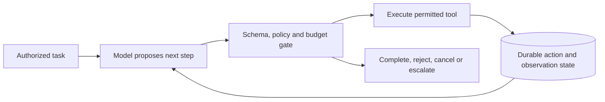

# Primary Reading Map: Learning Systems, Language Models and Agent Loops

This is a focused reading map for engineering interviews, not a complete history or a claim that all AI systems evolved into one architecture. Distinguish training, inference, search and application tool orchestration.

## Selected published milestones

| Year | Primary reading | Engineering concept to understand |
| :--- | :--- | :--- |
| 2013 | [Playing Atari with Deep Reinforcement Learning](https://arxiv.org/abs/1312.5602) | Learning action values from experience; training and acting have distinct roles |
| 2017 | [Attention Is All You Need](https://arxiv.org/abs/1706.03762) | Attention-based sequence modeling; masking and model architecture |
| 2020 | [Language Models are Few-Shot Learners](https://arxiv.org/abs/2005.14165) | Conditioning a language model on task examples in context |
| 2022 | [Chain-of-Thought Prompting](https://arxiv.org/abs/2201.11903) | Prompting with intermediate reasoning examples; results depend on task and model |
| 2022 | [Large Language Models are Zero-Shot Reasoners](https://arxiv.org/abs/2205.11916) | A distinct prompting study; do not conflate it with the few-shot paper |
| 2022 | [ReAct](https://arxiv.org/abs/2210.03629) | Interleaving language-model reasoning and actions in evaluated environments |

Years here refer to the linked initial preprints. Consult the paper's actual setup and results before generalizing to a different model or production workload.

## Distinguish four loops

**Training loop:** adjusts parameters using data and an optimization objective. It requires reproducible dataset, configuration, compute and evaluation records.

**Inference loop:** generates output using fixed parameters and the current context. Sampling and KV-cache behavior are implementation choices, not evidence of independent learning from each interaction.

**Search or planning loop:** explores alternatives and evaluates candidate actions. Its objective, state representation and evaluation mechanism must be specified.

**Tool orchestration loop:** an application validates model proposals, executes authorized actions, returns results and decides whether to continue. The application's permission system and durable state remain authoritative.

These mechanisms can be combined. A text generator, a self-play training system and a tool-using application do not share every correctness or safety property.

## Backend engineering questions

For an application loop, explain durable task identity, accepted side effects, replay, cancellation, credentials, resource limits, terminal states and auditability. A worker restart must not cause an untracked external action.

Treat tool results and retrieved documents as data. They cannot authorize broader access. Each tool action needs server-enforced permissions and an appropriate idempotency or reconciliation strategy.

Evaluate success on versioned tasks and actual observations. Count quality failures and unsafe actions separately from request availability. Cap spending and execution according to actual constraints; do not invent benchmark outcomes.

## Leadership questions

- What evidence justifies adopting a new technique?
- Who owns task quality, access policy and operations?
- What production behavior differs from the paper's experiment?
- How will you detect regressions, stop a harmful action and recover?
- Which parts are research uncertainty and which are ordinary software reliability?

Rahul's AI workflow experience supports discussing real tooling adoption and safeguards. It does not by itself establish model research or distributed-training experience. See [the resume plan](rahul-backend-interview-plan.md) and [AI infrastructure practice](backend-system-design-casebook.md#12-ai-inference-gateway-and-evaluation-platform).

## Understand the loops without leaving this page

### Training: improve parameters over a dataset

The system samples training data, computes outputs/loss, calculates an update and changes parameters. Evaluation checks the resulting model on a defined task set. A checkpoint is recoverable training state, not proof that a deployed model continues learning from each chat. In reinforcement learning, interaction and reward supply a learning signal under the chosen algorithm; that is distinct from merely calling a tool in an app.

### Inference: generate with current parameters

Input is tokenized and processed, then output is generated under a decoding policy. Context can condition behavior without changing weights. KV-cache is request/runtime state, not permanent learning. Cancelling a generation must reclaim active work under the supported serving contract; dropping the client connection alone may leave provider computation running.

### Search: compare alternatives before selecting

A search/planning loop keeps a state representation, proposes alternatives and evaluates them under an objective. More exploration can improve some tasks but consumes compute and requires a valid evaluation mechanism. A list of candidates is not proof that the system found the best action, and the evaluator can be wrong.

### Tool orchestration: effects happen outside generation

```mermaid
flowchart LR
    Task[Authorized task] --> Model[Model proposes next step]
    Model --> Gate[Schema, policy and budget gate]
    Gate --> Tool[Execute permitted tool]
    Tool --> State[(Durable action and observation state)]
    State --> Model
    Gate --> Stop[Complete, reject, cancel or escalate]
```

The model proposes; application policy authorizes. Reads and writes have different recovery needs. A tool result is data, including hostile text, and cannot grant a broader credential. Persist mutating action identity before relying on recovery. If the tool succeeds and the worker crashes, retrieve/reconcile that same action before considering another execution.

| Interviewer asks | Explain the mechanism |
| :--- | :--- |
| Is every chatbot an agent? | A generation-only conversation differs from an application-controlled action loop |
| Why does the loop stop? | Explicit terminal state, useful deadline, action/token budget or permission failure |
| How does it recover? | Durable task/action records and destination-aware reconciliation |
| What is evaluated? | Actual task outcome, unsupported claims, permission violations, spend and service behavior |
| How does a new model launch safely? | Same versioned tasks, policy checks and rollout evidence; faster output alone is insufficient |

This is the practical architectural meaning of the milestone table. The papers provide research context; the learner can explain the request lifecycle and effect boundaries here.
