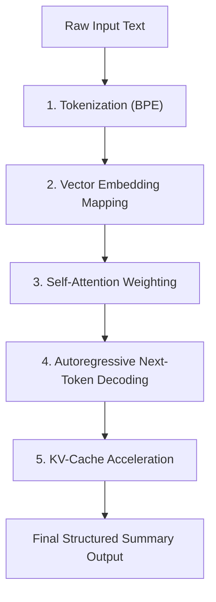

# Under the Hood: How AI Text Summarization Agents Work

## Executive Summary
Text summarization is one of the most widely deployed applications of Large Language Models (LLMs). Whether condensing long legal contracts, customer support transcripts, or news feeds, AI summarization agents transform massive unstructured text into structured, actionable insights.

This article provides an end-to-end technical deep dive into how text summarization agents work internally—from raw text tokenization to attention weighting, KV-cache acceleration, and multi-pass Map-Reduce architectures.

---

## 1. The 5-Step Internal Execution Pipeline



---

## 2. Step 1: Tokenization — Translating Text into Barcodes

LLMs do not understand human letters, words, or sentences. They operate strictly on numerical identifiers called **Tokens**.

### Tokenization Mechanics (Byte-Pair Encoding / BPE)
* **Token Math**: In English text, $1\text{ token} \approx 0.75\text{ words}$ (or $\sim 4\text{ characters}$).
* **Vocabulary Size**: Modern models like Llama-3 use a fixed vocabulary dictionary of **128,256 unique tokens**.
* **Example**:
  $$\text{Text: } \text{"Summarize this article"}$$
  $$\text{Token IDs: } [3481, 10245, 874]$$

```
+---------------------------+---------------------------------+
| Raw Text Fragment         | Token ID Representation        |
+---------------------------+---------------------------------+
| "Summarize"               | 3481                            |
| " this"                   | 10245                           |
| " article"                | 874                             |
+---------------------------+---------------------------------+
```

---

## 3. Step 2: Dense Vector Embeddings — Mapping Semantic Meaning

Once text is tokenized, each Token ID is converted into a **Dense Vector Embedding**—a long array of floating-point numbers (e.g., 384 or 1,536 dimensions).

### The Math of Meaning Space
Words with similar meanings are positioned close together in high-dimensional space. Searching or filtering text relies on **Cosine Similarity**:

$$\text{Cosine Similarity}(\vec{A}, \vec{B}) = \frac{\vec{A} \cdot \vec{B}}{\|\vec{A}\| \|\vec{B}\|}$$

```
"Doctor"  <----> "Physician"   (Cosine Distance: 0.04 - Very Close)
"Doctor"  <----> "Submarine"   (Cosine Distance: 0.91 - Far Apart)
```

---

## 4. Step 3: Self-Attention — The AI "Highlighter"

The core engine of the Transformer architecture is **Self-Attention**. When reading a 5,000-word document, self-attention calculates mathematical relationships between *every word* and *every other word* in the input.

### The Self-Attention Formula
$$\text{Attention}(Q, K, V) = \text{softmax}\left(\frac{QK^T}{\sqrt{d_k}}\right)V$$

Where:
* $Q$ (Query): What the current word is looking for.
* $K$ (Key): What each previous word offers.
* $V$ (Value): The actual information content stored.

### How Attention Summarizes Text
Self-attention assigns an **Attention Weight (Importance Score)** between 0.0 and 1.0 to every word:
* **High Attention Weight ($\sim 0.95$)**: Key names, metrics, financial numbers, dates, and conclusions.
* **Low Attention Weight ($\sim 0.02$)**: Grammar filler words ("the", "and", "basically").

```ascii
Document: "The enterprise customer reported an unexpected Q3 revenue increase of $5M."
           └─────────────────┬──────────────────┘   └───┬────┘ └──┬─┘           └─────┬──┘
                           Filler (0.02)         Key Fact (0.92)  Key Fact (0.88)    Key Fact (0.95)
```

---

## 5. Step 4 & 5: Autoregressive Generation & KV-Cache Acceleration

### Autoregressive Decoding
The model does *not* output a summary all at once. It predicts the **most probable next token**, appends it to the prompt, and repeats the loop:

1. Prompt $\rightarrow$ Predicts: `"The"`
2. Prompt + `"The"` $\rightarrow$ Predicts: `"company"`
3. Prompt + `"The company"` $\rightarrow$ Predicts: `"grew"`
4. Continues until `<|end_of_text|>` token is emitted.

### KV-Cache (Key-Value Cache) Memory Math
Without a cache, generating token #100 would require re-calculating attention over all preceding 99 tokens, resulting in quadratic $O(N^2)$ slowdown. 

The **KV-Cache** stores past Key ($K$) and Value ($V$) tensors in memory:

$$\text{KV Cache Size (Bytes)} = 2 \times N_{\text{layers}} \times N_{\text{heads}} \times d_{\text{head}} \times N_{\text{seq}} \times \text{BytesPerElement}$$

On mobile or backend servers, KV-Caching boosts generation speed from **2 tokens/sec** to **>25 tokens/sec**.

---

## 6. Architectural Summarization Strategies

Depending on document size relative to the context window ($2k - 128k$ tokens), production systems use one of three architectural patterns:

```ascii
+-------------------------------------------------------------------------------+
|                        SUMMARIZATION ARCHITECTURES                            |
+-------------------------------------------------------------------------------+

 1. STUFFING (<4k tokens)
    [ Entire Document ] -----------------------------> [ LLM ] ---> [ Summary ]

 2. MAP-REDUCE (>10k tokens)
    [ Chunk 1 ] --------------------> [ LLM ] ---+
    [ Chunk 2 ] --------------------> [ LLM ] ---+---> [ Synthesis LLM ] ---> [ Final Summary ]
    [ Chunk 3 ] --------------------> [ LLM ] ---+

 3. REFINE (Sequential Depth)
    [ Chunk 1 ] --------------------> [ LLM ] ---> [ Summary 1 ]
    [ Chunk 2 + Summary 1 ] ---------> [ LLM ] ---> [ Summary 2 ] (Iterative update)
```

---

## 7. Production Code Reference

### Swift (iOS On-Device / Client-Side Concurrent Map-Reduce)

```swift
import Foundation

public actor SummarizationEngine {
    private let maxChunkChars = 4000
    
    public init() {}
    
    public func summarizeDocument(_ text: String) async throws -> String {
        if text.count <= maxChunkChars {
            return try await singlePassSummarize(text)
        } else {
            return try await mapReduceSummarize(text)
        }
    }
    
    private func mapReduceSummarize(_ text: String) async throws -> String {
        let chunks = chunkTextBySentences(text, maxChars: maxChunkChars)
        
        // Concurrent Map Phase
        let chunkSummaries = try await withThrowingTaskGroup(of: String.self) { group in
            for chunk in chunks {
                group.addTask {
                    try await self.singlePassSummarize(chunk)
                }
            }
            var results: [String] = []
            for try await summary in group {
                results.append(summary)
            }
            return results
        }
        
        // Reduce Phase
        let combined = chunkSummaries.joined(separator: "\n---\n")
        return try await singlePassSummarize("Synthesize these section summaries:\n\(combined)")
    }
    
    private func singlePassSummarize(_ text: String) async throws -> String {
        // CoreML / REST API call simulation
        return "Executive summary of section: " + String(text.prefix(100)) + "..."
    }
    
    private func chunkTextBySentences(_ text: String, maxChars: Int) -> [String] {
        var chunks: [String] = []
        var current = ""
        for sentence in text.components(separatedBy: ". ") {
            if (current.count + sentence.count) > maxChars {
                chunks.append(current)
                current = sentence + ". "
            } else {
                current += sentence + ". "
            }
        }
        if !current.isEmpty { chunks.append(current) }
        return chunks
    }
}
```

---

## 8. Summary Checklist for System Design Interviews

| Subsystem | Core Mechanism | Key SLA / Target |
| :--- | :--- | :--- |
| **Tokenizer** | Byte-Pair Encoding (BPE) | $1\text{ token} \approx 0.75\text{ words}$ |
| **Vector Space** | Cosine Similarity Angle | Match threshold $\ge 0.80$ |
| **Attention Engine** | $\text{softmax}(QK^T / \sqrt{d_k})V$ | Highlights key facts, ignores fluff |
| **KV-Cache** | Memory-buffered attention states | Generation speed $\ge 25\text{ tokens/sec}$ |
| **Long Doc Handling** | Map-Reduce Parallel Task Group | O(1) context scaling per chunk |
