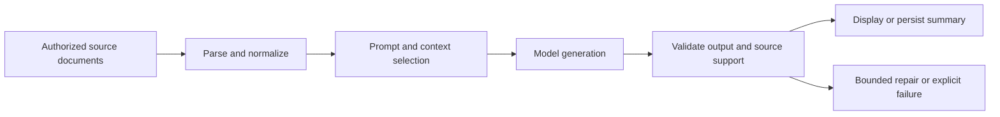

# How AI Summarization Systems Work

This guide separates model computation from application orchestration. A summarization call does not automatically constitute an autonomous agent. This is educational architecture, not a claimed production implementation.

## Model computation

A tokenizer converts text into model-specific token IDs. Segmentation, vocabulary, token counts and IDs depend on the exact tokenizer. Verify its actual output; no invented mapping or universal word-to-token ratio is used here.

Token IDs select learned representations. Those token representations are not interchangeable with document embeddings from a retrieval model. Contextual representations depend on model computation, and an embedding distance is not a factual-truth score.

Transformer attention combines queries, keys and values:

$$\operatorname{Attention}(Q,K,V)=\operatorname{softmax}(QK^T/\sqrt{d_k})V$$

The original [Transformer paper](https://arxiv.org/abs/1706.03762) describes scaled dot-product attention and masking. A causal decoder attends only to allowed preceding positions. Attention is computed over token representations, and an attention weight is not an authoritative explanation of a generated claim.

An autoregressive decoder predicts successive tokens conditioned on context. Decoding policy changes output distribution; a plausible sentence can still be unsupported. Lowering temperature does not provide a factual correctness guarantee.

KV-caching reuses keys and values from earlier positions during incremental generation. It increases memory demand with context and active sequences. It is an execution optimization within decoding, not a separate reasoning stage performed after a completed answer.

## Application architecture

```mermaid
flowchart LR
    I[Authorized source documents] --> N[Parse and normalize]
    N --> P[Prompt and context selection]
    P --> M[Model generation]
    M --> V[Validate output and source support]
    V --> O[Display or persist summary]
    V --> F[Bounded repair or explicit failure]
```

Define document access, maximum input, retained provenance, output schema, cancellation and timeout behavior. Treat document content as untrusted input, including instructions embedded in it. Model output cannot grant itself tool or data privileges.

For short documents, a direct call may be enough. For long documents, compare supported context with retrieval, chunking or hierarchical summarization. Chunk boundaries can lose references and global relationships. Hierarchical compression can omit minority evidence and compound errors; overlapping chunks do not eliminate these risks.

A chunked pipeline should retain source identity, location and version, intermediate results, completion state and retry identity. Resume failed work without duplicating external effects. Bound parallelism and preserve a useful end-to-end deadline.

## Source-grounded evaluation

Use actual authorized source documents and observed results. Assess:

- Whether each factual summary claim is supported by the source.
- Whether material findings, exceptions and disagreements are omitted.
- Whether quotations and references preserve their actual meaning.
- Whether numeric values, dates and entities are preserved correctly.
- Whether sensitive content is exposed beyond the intended audience.
- Whether the output meets schema and length requirements.

Keep source, model, prompt and evaluation versions traceable. A model judging another model can be useful evidence, but should be validated against an appropriate human-reviewed sample rather than treated as unquestionable truth.

## Backend and client responsibilities

**Backend:** authorize document access, persist job identity, enforce quotas, schedule work, handle retries, propagate deletion, store permitted artifacts and monitor provider failures.

**Client:** represent queued, streaming, completed, cancelled and failed states; prevent stale responses from overwriting new user work; provide provenance where available. Use SwiftUI and an ObservableObject ViewModel with injected services for app/UI implementations.

**EM:** establish ownership of quality, security, cost and availability. Define release criteria and incident response for a quality regression as well as an outage.

**Staff:** defend job state, replay behavior, cancellation, context selection and evaluation reproducibility through concrete implementation detail.

## Practice follow-ups

- What happens when generation finishes but persisting its result fails?
- How does document deletion reach intermediate summaries and caches?
- How do you prevent prompt content from authorizing a tool action?
- How do you compare models on the same versioned task set?
- How does the system expose an unsupported or incomplete summary?

Further reading: [ReAct](https://arxiv.org/abs/2210.03629) for an approach combining reasoning and actions; [backend inference exercise](backend-system-design-casebook.md#12-ai-inference-gateway-and-evaluation-platform); [local inference architecture](on-device-llm-ai-engine.md).

## Learn the computation step by step

Tokenization maps source text to the selected model's vocabulary. The embedding layer selects learned representations for those token IDs. Positional information and subsequent layers let representations depend on context. Attention combines information from allowed positions; feed-forward transformations further change the representation. A decoder produces output logits and a decoding policy selects the next token. That token is added to context and generation continues until a stopping condition.

The KV-cache reuses earlier attention keys and values during incremental decoding. It avoids recomputing those particular values, but does not eliminate all computation or storage. The model still processes each new output step. Sampling can select different valid continuations; neither deterministic decoding nor confident language proves the summary is supported.

**Interview explanation:** "The application supplies authorized text and an instruction. The model generates a probable continuation, not a verified database answer. I therefore preserve source references and validate factual support separately from whether generation completed."

## Compare the three long-document strategies here

| Strategy | Request flow | Benefit | Failure to explain |
| :--- | :--- | :--- | :--- |
| Direct context | Entire permitted text enters one supported request | Preserves relationships within that available context | Input may exceed limits/resource envelope; long context does not guarantee full coverage |
| Hierarchical map/reduce | Versioned chunks produce partial summaries; synthesis combines them | Independent chunk work can be bounded and retried | Local compression may drop exceptions that the synthesis can no longer recover |
| Sequential refinement | Each chunk updates the preceding intermediate summary | Incorporates new sections with a persistent working summary | Early mistakes or omissions can propagate; serial execution can increase latency |

Retrieval is another option when the task asks a focused question. It may miss information needed for a comprehensive document summary. Choose based on the task's coverage requirement, not only request cost.

### Walk a recoverable document job

1. Authorize the exact source version and persist job identity, requested output, model/prompt version and deadline.
2. Parse while retaining section boundaries and source locations. Decide chunking from actual tokenizer/context behavior.
3. Persist chunk identities and completion state. Execute bounded independent work and retain only permitted intermediate artifacts.
4. Validate intermediate outputs and synthesize when required inputs are present. Missing chunks must not silently become a complete summary.
5. Verify schema, important facts/exceptions and source support. Store completed output and job transition consistently.
6. Reauthorize status/download as needed. Propagate cancellation and source deletion to stored intermediates and outputs.

**Failure:** synthesis finishes, persistence fails. A worker retry reads persisted job/chunk state and resumes under the same job identity. It may repeat generation, which can differ and incur spend. Publish a winning completed artifact through the authoritative job transition; do not deliver two unrelated results as the same completed job.

**Quality failure:** the output omits an exception that changes the conclusion. A JSON-valid result still fails the task. Evaluate omission/contradiction alongside factual support and record the source, model and prompt versions needed to reproduce it.

**What to say when challenged:** "I would show which source supports the disputed claim and whether the chunking/synthesis lost the necessary context. I would reject an unsupported completed answer or repair it within policy. A model judge can assist review, but cannot replace evidence of source support."
