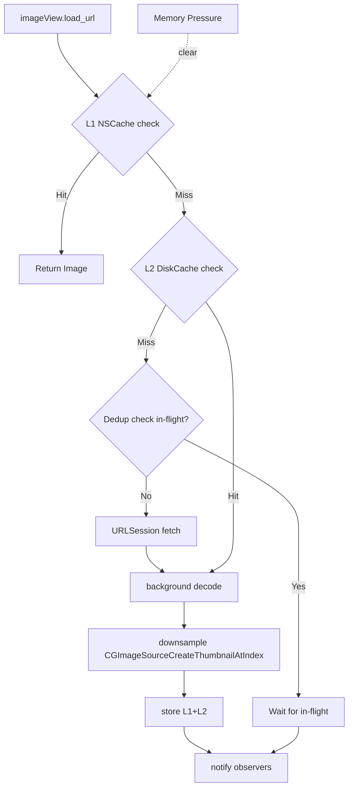

<[Problem Title]>
# Image Loading Library

## Overview
Designing an image loading library is one of the most common and critical iOS system design questions asked at top tech companies. The library needs to efficiently download, decode, cache, and display images from the network while minimizing memory footprint and CPU usage. It evaluates a candidate's understanding of networking, concurrency, memory management, and caching strategies.

## Target Companies & Frequency
| Company | Why They Ask | Frequency |
| :--- | :--- | :--- |
| Meta | Heavy reliance on images in Instagram, Facebook, and Threads | ★★★★★ |
| Twitter / X | Media-rich timelines require highly optimized image fetching | ★★★★★ |
| Airbnb | High-resolution property images dictate booking conversions | ★★★★★ |
| Booking.com | Similar to Airbnb, highly visual listings with offline needs | ★★★★☆ |
| Uber | Maps, driver profiles, and receipts need fast, reliable loading | ★★★★☆ |

## Scope Definition

### In Scope
- Asynchronous image downloading from a remote URL.
- 3-tier caching mechanism (L1 Memory, L2 Disk, L3 Network).
- Image decoding and downsampling off the main thread.
- Request deduplication (coalescing multiple requests for the same URL).
- Image cancellation and reuse handling (e.g., in UICollectionView).
- Memory pressure handling and cache eviction policies.
- Request prioritization based on UI visibility.

### Out of Scope
- Video or animated GIF decoding (can be mentioned but not designed).
- Image editing or filtering.
- Uploading images to the server.
- Custom CDN architecture (focus is entirely on the client SDK).

## Requirements

### Functional Requirements
1. **Fetch and Display**: The library must fetch an image from a URL and display it in a UIImageView.
2. **Caching**: It must cache images in memory for fast retrieval and on disk for offline/subsequent launches.
3. **Cancellation**: In-flight requests must be cancellable when the UI component goes off-screen.
4. **Deduplication**: Multiple UI components requesting the same URL simultaneously should trigger only one network request.
5. **Downsampling**: Large images must be resized to fit the target view dimensions to save memory.

### Non-Functional Requirements
| Requirement | Target | Source / Justification |
| :--- | :--- | :--- |
| Main Thread Block Time | < 16ms per frame | Apple UI Guidelines (60fps target) |
| Memory Footprint | < 50MB for L1 Cache | SDWebImage defaults, prevents OOM |
| Disk Cache Size | < 500MB | Prevents OS from aggressively purging |
| Disk Cache TTL | 7 days | Standard TTL for image assets |
| Decoding Thread | 100% Background | Prevents UI stuttering |

## High-Level Architecture (HLD)

### Component Diagram
```ascii
+-------------------+       +--------------------+       +-------------------+
|                   |       |                    |       |                   |
|   UIImageView     | <---> |   ImageLoader      | <---> |   ImageCache      |
|   (Extension)     |       |   (Coordinator)    |       |   (L1: Memory)    |
|                   |       |                    |       |                   |
+-------------------+       +--------------------+       +-------------------+
                                     ^                             ^
                                     |                             |
                                     v                             v
                            +--------------------+       +-------------------+
                            |                    |       |                   |
                            |   NetworkManager   | <---> |   DiskCache       |
                            |   (URLSession)     |       |   (L2: FileSys)   |
                            |                    |       |                   |
                            +--------------------+       +-------------------+
                                     ^
                                     |
                                     v
                            +--------------------+
                            |                    |
                            |       CDN          |
                            |   (L3: Network)    |
                            |                    |
                            +--------------------+
```

### Component Responsibilities
| Component | Responsibility | iOS Implementation |
| :--- | :--- | :--- |
| UIImageView+Ext | Provides easy API for UI, manages current request token | Swift extension on UIImageView |
| ImageLoader | Orchestrates fetch, checks caches, triggers network | Singleton or Injectable service |
| ImageCache (L1) | Fast memory access, auto-evicts on memory warning | NSCache<NSString, UIImage> |
| DiskCache (L2) | Persistent storage, survives app restarts, LRU | FileManager, SQLite for metadata |
| NetworkManager | Downloads data, handles deduplication, priority | URLSession, URLSessionDataTask |
| ImageDecoder | Downsamples and decodes raw data to UIImage | ImageIO (CGImageSource) |

### Data Flow
1. UI calls `imageView.loadImage(url: url, targetSize: size)`.
2. Extension generates a `CancellationToken` and passes the request to `ImageLoader`.
3. `ImageLoader` checks L1 Memory Cache. If hit, return immediately.
4. If L1 miss, check L2 Disk Cache asynchronously. If hit, decode/downsample, save to L1, return.
5. If L2 miss, `ImageLoader` asks `NetworkManager` to fetch.
6. `NetworkManager` checks if a request for this URL is already in-flight (Deduplication). If so, it attaches an observer.
7. If no request is in-flight, it starts a `URLSessionDataTask` with appropriate priority.
8. Upon network completion, raw data is passed to `ImageDecoder`.
9. `ImageDecoder` decodes and downsamples the image on a background thread.
10. The decoded image is stored in L1, the raw data is stored in L2, and the image is returned to the UI on the main thread.

## Data Models

### Core Entities
```swift
import Foundation
import UIKit

/// Represents a request for an image
struct ImageRequest {
    let url: URL
    let targetSize: CGSize
    let priority: Float // e.g., URLSessionTask.priority
    
    // The cache key must include the target size because a 100x100 decoded image
    // is a different bitmap than a 500x500 decoded image of the same URL.
    var cacheKey: String {
        return "\(url.absoluteString)_\(targetSize.width)x\(targetSize.height)"
    }
}

/// Token used to cancel an in-flight request, usually tied to a UI element's lifecycle
class CancellationToken {
    var isCancelled: Bool = false
    private let lock = NSLock()
    
    func cancel() {
        lock.lock()
        isCancelled = true
        lock.unlock()
    }
}
```

### Database Schema
For the Disk Cache, we store the actual files on the file system, but use SQLite for O(1) LRU eviction and TTL management.

```sql
CREATE TABLE IF NOT EXISTS disk_cache_metadata (
    cache_key TEXT PRIMARY KEY,
    file_path TEXT NOT NULL,
    size_bytes INTEGER NOT NULL,
    last_accessed_at REAL NOT NULL,
    created_at REAL NOT NULL
);

CREATE INDEX idx_last_accessed ON disk_cache_metadata(last_accessed_at);
```

## API Design

### Endpoints
For an image library, the "API" is typically just GET requests to a CDN.

**GET {image_url}**
- **Method**: GET
- **Headers**:
  - `Accept`: `image/webp, image/avif, image/jpeg, image/png`
- **Response**:
  - **Body**: Binary image data.
  - **Headers**: `Cache-Control: max-age=604800` (7 days)

### Pagination Strategy
Not applicable for fetching single images. However, when a client fetches a list of URLs (like a social feed), image prefetching should use cursor-based pagination. (Covered in Social Feed spec).

## Client Architecture Deep-Dives

### [Subsystem 1 — The 3-Tier Cache (L1, L2, L3)]
The core of an image loader is its caching mechanism. L1 is an `NSCache` which automatically responds to `UIApplication.didReceiveMemoryWarningNotification` and evicts objects. We limit L1 to ~50MB. L2 is a disk cache capped at 500MB, managed via `FileManager`.

```swift
import UIKit

actor MemoryCache {
    static let shared = MemoryCache()
    private let cache = NSCache<NSString, UIImage>()
    
    init() {
        // 50MB limit (SDWebImage default)
        // 1000x1000 ARGB8888 image = 1000 * 1000 * 4 bytes = 4MB
        cache.totalCostLimit = 50 * 1024 * 1024
    }
    
    func insert(_ image: UIImage, forKey key: String) {
        // Cost is the approximate size in bytes of the decoded image
        let cost = Int(image.size.width * image.size.height * image.scale * image.scale * 4)
        cache.setObject(image, forKey: key as NSString, cost: cost)
    }
    
    func value(forKey key: String) -> UIImage? {
        return cache.object(forKey: key as NSString)
    }
    
    func clear() {
        cache.removeAllObjects()
    }
}
```

### [Subsystem 2 — Decoding & Downsampling]
Decoding a JPEG/PNG into a bitmap is highly CPU intensive. If done on the main thread, it causes severe UI hitching. Furthermore, loading a 4K image into a 100x100 thumbnail wastes massive amounts of memory. We use `ImageIO` to downsample the image during decoding.

```swift
import ImageIO
import UIKit

struct ImageDecoder {
    /// Downsamples raw data to a target size on a background thread
    static func downsample(imageData: Data, to pointSize: CGSize, scale: CGFloat) async throws -> UIImage {
        // Shift to background task
        return try await Task.detached(priority: .userInitiated) {
            let imageSourceOptions = [kCGImageSourceShouldCache: false] as CFDictionary
            guard let imageSource = CGImageSourceCreateWithData(imageData as CFData, imageSourceOptions) else {
                throw URLError(.cannotDecodeRawData)
            }
            
            let maxDimensionInPixels = max(pointSize.width, pointSize.height) * scale
            let downsampleOptions = [
                kCGImageSourceCreateThumbnailFromImageAlways: true,
                kCGImageSourceShouldCacheImmediately: true, // Decode immediately!
                kCGImageSourceCreateThumbnailWithTransform: true,
                kCGImageSourceThumbnailMaxPixelSize: maxDimensionInPixels
            ] as CFDictionary
            
            guard let downsampledImage = CGImageSourceCreateThumbnailAtIndex(imageSource, 0, downsampleOptions) else {
                throw URLError(.cannotDecodeRawData)
            }
            
            return UIImage(cgImage: downsampledImage)
        }.value
    }
}
```

### [Subsystem 3 — Request Deduplication & Cancellation]
In a UICollectionView, multiple cells might request the same image URL concurrently (e.g., repeating avatars). We must coalesce these requests. Also, fast scrolling means cells are reused, so we must cancel obsolete requests to save bandwidth and CPU.

```swift
actor NetworkManager {
    static let shared = NetworkManager()
    
    private var inFlightRequests: [URL: Task<Data, Error>] = [:]
    
    func fetch(url: URL, priority: Float) async throws -> Data {
        if let existingTask = inFlightRequests[url] {
            // Deduplication: await the already in-flight task
            return try await existingTask.value
        }
        
        let task = Task { () -> Data in
            var request = URLRequest(url: url)
            let sessionTask = URLSession.shared.dataTask(with: request)
            sessionTask.priority = priority
            
            let (data, response) = try await URLSession.shared.data(for: request)
            guard let httpResponse = response as? HTTPURLResponse, 200..<300 ~= httpResponse.statusCode else {
                throw URLError(.badServerResponse)
            }
            return data
        }
        
        inFlightRequests[url] = task
        
        defer {
            inFlightRequests.removeValue(forKey: url)
        }
        
        return try await task.value
    }
}
```

## Performance & Optimizations
| Optimization | Technique | Benchmark/Impact |
| :--- | :--- | :--- |
| Downsampling | Use `CGImageSourceCreateThumbnailAtIndex` | Reduces 12MB (3000x3000px) down to 360KB (300x300px) in memory |
| Decoding Off-Main | Dispatch to global queue / Task.detached | Saves 20-50ms main thread time per image, keeping app at 60fps |
| Deduplication | Dictionary of in-flight `[URL: Task]` | Prevents 5 identical requests consuming 5x bandwidth |
| Format Choice | Negotiate WebP/AVIF via `Accept` header | WebP is 25-35% smaller than JPEG, AVIF even smaller |
| Priority Queueing | Set `URLSessionTask.priority` | Visible UI (1.0) loads before prefetch (0.1) |

## Failure Modes & Fallbacks
| Failure Scenario | Detection | Fallback Strategy |
| :--- | :--- | :--- |
| Memory Warning | `UIApplication.didReceiveMemoryWarning` | Clear L1 `NSCache` entirely. OS might still terminate if severe. |
| Network Timeout | `URLError.timedOut` | Retry with exponential backoff if critical, or show placeholder |
| Offline | NWPathMonitor says `.unsatisfied` | Only check L1/L2 caches. Fail fast instead of spinning network |
| Disk Full | `FileManager` write throws error | Execute LRU eviction immediately on L2, freeing up 20% space |
| Invalid Image Data | `CGImageSourceCreateWithData` fails | Delete from disk cache, log telemetry, show placeholder |

## Trade-off Analysis
| Decision | Option A | Option B | Chosen | Why |
| :--- | :--- | :--- | :--- | :--- |
| L1 Cache Key | URL only | URL + Target Size | URL + Target Size | Prevents a tiny downsampled thumbnail from being stretched to fill a large view if both share the same URL. |
| Disk Cache Strategy | File System only | SQLite + File System | SQLite + File System | File system is great for blobs, but terrible for sorting by `last_accessed_at` (requires traversing dir). SQLite makes LRU O(1). |
| Image Decoding | Decode on read | `kCGImageSourceShouldCacheImmediately` | `ShouldCacheImmediately` | Forces decoding on the background thread. Normal UIImage decoding is lazy and happens on main thread during `draw()`. |

## Observability & Metrics
- **Cache Hit Rate (L1 & L2)**: (Hits / Total Requests) * 100. Target > 40% for L1, > 80% combined.
- **Image Decode Time**: P50 < 10ms, P99 < 50ms.
- **Network Request Duration**: P50 < 200ms, P99 < 1s.
- **OOM Crash Rate**: Must remain < 0.1% after shipping downsampling.
- **Bytes Downloaded per Session**: Monitor to ensure deduplication and caching are working.

## Production Benchmarks Reference
| Metric | Target | Source / Justification |
| :--- | :--- | :--- |
| L1 Memory Limit | 50MB - 100MB | SDWebImage standard defaults |
| L2 Disk Limit | 500MB - 1GB | Kingfisher / SDWebImage defaults |
| Image Size (Decoded)| W * H * 4 bytes | Standard 32-bit ARGB formula (e.g., 1000x1000 = 4MB) |
| WebP Size Reduction | 25-35% | Google WebP documentation vs standard JPEG |

## Interview Tips
- **Always mention downsampling**: It is the #1 reason candidates fail this question. Showing a 4K image in a 50x50 cell will cause an OOM crash.
- **Explain "CacheImmediately"**: Default UIImage behavior decodes lazily on the main thread when rendering. You MUST force decode on a background thread.
- **Handle Cell Reuse**: Mention `prepareForReuse()` and how you cancel the in-flight network request so a fast-scrolling user doesn't download hundreds of off-screen images.
- **Distinguish Cache Keys**: URL is not enough. `URL + Size + Transformations` is required.

## Mermaid Architecture Diagram


## Common Mistakes
- Using `UIImage(named:)` for remote images (no caching)
- Not cancelling image loads on cell reuse (wrong image in cell)
- Caching full-resolution decoded bitmap (4x memory waste)
- Not deduplicating concurrent requests for same URL
- Using main thread for image decoding (frame drops)
- Not responding to memory warnings (OOM)

## Mock Interview Q&A
- **Q: Two UIImageViews request the same URL at the same time. What happens?**
  **A:** Request deduplication kicks in. The second view attaches an observer to the in-flight URLSession task rather than starting a new network request.
- **Q: How do you decide the L1 cache size?**
  **A:** It depends on device memory, but typically capping at 50-100MB is safe. SDWebImage defaults to this to prevent jetsam (OOM) kills.
- **Q: What's your cancellation strategy when a cell scrolls off screen?**
  **A:** In `prepareForReuse()`, cancel the `CancellationToken` associated with the request. This halts network downloads and prevents obsolete image decoding.
- **Q: Why use CGImageSource instead of UIImage rendering for downsampling?**
  **A:** UIImage rendering often happens on the main thread and requires loading the full bitmap into memory first, which defeats the purpose of downsampling to save memory.
- **Q: What happens if the disk cache gets too large?**
  **A:** We use an LRU eviction policy, triggered when writing new files. If we exceed the 500MB threshold, we delete the least recently used files based on SQLite metadata.

## Related Specs
| Spec | Relationship |
| :--- | :--- |
| [Social Feed](social-feed.md) | Feeds rely heavily on prefetching images and cancelling off-screen cells. |
| [Networking Layer](networking-layer.md) | Image downloader uses URLSession but requires a different caching strategy than REST APIs. |
