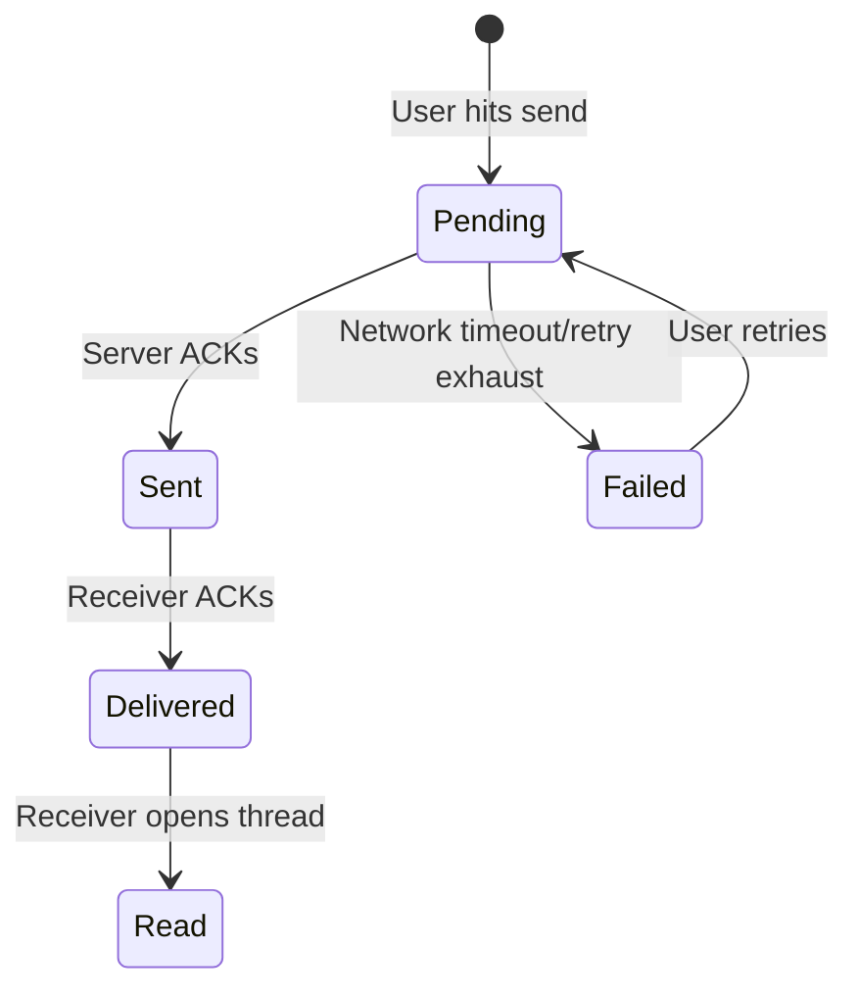
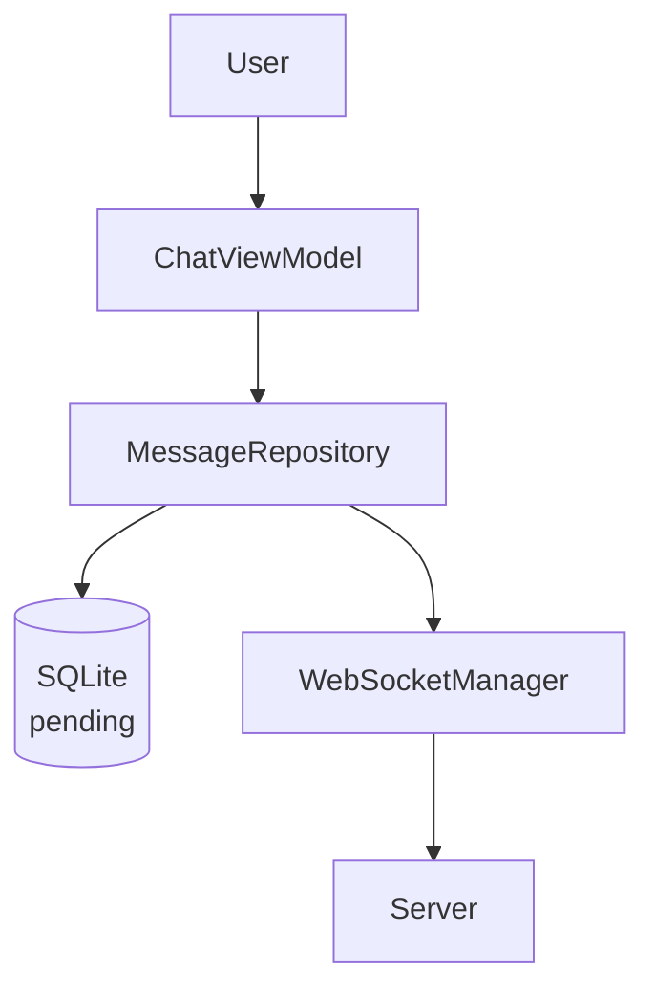

# Instant Messaging & Chat App (WhatsApp / Slack / iMessage)

## Overview
Designing an instant messaging application requires handling real-time bi-directional communication, offline support, and efficient local storage. It's a staple of FAANG interviews because it tests a candidate's understanding of WebSockets, local persistence (CoreData/SQLite), background tasks, and complex state machines for message delivery.

## Target Companies & Frequency
| Company | Why They Ask | Frequency |
|---------|--------------|-----------|
| Meta | WhatsApp & Messenger are core products; heavy focus on offline resilience. | ★★★★★ |
| Slack | Enterprise chat needs complex group state and unread synchronization. | ★★★★★ |
| Google | Google Messages (RCS) demands robust networking and media pipelines. | ★★★★☆ |
| Apple | iMessage requires deep integration with iOS system and E2EE. | ★★★★★ |

## Scope Definition

### In Scope
- 1-on-1 and group text messaging.
- Real-time message delivery and receipt statuses (Sent, Delivered, Read).
- Offline support and local caching.
- Media upload pipeline (Images/Video).
- WebSocket connection lifecycle and reconnection logic.
- E2EE surface level concepts.

### Out of Scope
- Voice/Video calling (WebRTC).
- Deep push notification payload structures (APNs specifics beyond wake-up).
- Story/Status features.
- User registration and contact sync.

## Requirements

### Functional Requirements
1. Users can send and receive text messages in real-time.
2. Users can see message status (pending, sent, delivered, read).
3. Users can send media (photos/videos).
4. Users can view their inbox (threads sorted by recent activity).
5. App must function seamlessly when offline and sync when reconnected.
6. Unread counts must stay synchronized across devices.

### Non-Functional Requirements
| Requirement | Target | Source |
|-------------|--------|--------|
| Message Delivery Latency | < 200ms | WhatsApp Engineering |
| Cold Start Time | < 1.5s | Apple HIG |
| WebSocket Heartbeat | 30s | RFC 6455 |
| Crash-free Sessions | > 99.9% | Industry Standard |
| Local Storage Size | < 500MB (auto-evict) | iOS Storage Guidelines |
| Battery Impact | < 2% / hour active | iOS Energy Guidelines |

## High-Level Architecture (HLD)

### Component Diagram
```text
[iOS Client]
    │
    ├─► UI Layer (SwiftUI + ViewModels)
    │
    ├─► Domain Layer (Use Cases, Message State Machine)
    │
    ├─► Repository Layer (Local Storage + Network Sync)
    │      │
    │      ├─► SQLite (Local Cache, WAL mode)
    │      └─► Offline Queue (Pending Ops)
    │
    └─► Network Layer
           │
           ├─► WebSocketManager (Real-time Pub/Sub)
           ├─► REST API (Media Upload, History Fetch)
           └─► Media Upload Pipeline (S3/GCS Pre-signed URLs)

[Backend Infrastructure]
    │
    ├─► API Gateway / Load Balancer
    ├─► WebSocket Connection Handlers (Erlang/Go)
    ├─► Message Router / PubSub (Kafka/Redis)
    ├─► Primary Database (Cassandra/DynamoDB)
    └─► Blob Storage (S3 for Media)
```

### Component Responsibilities
| Component | Responsibility | iOS Implementation |
|-----------|----------------|--------------------|
| WebSocketManager | Persistent connection, heartbeats, reconnects. | `URLSessionWebSocketTask` |
| LocalDatabase | Store threads and messages for offline access. | SQLite (via GRDB) or CoreData |
| OfflineQueue | Track pending messages/events to retry on reconnect. | SQLite backed queue |
| ChatViewModel | Bind data to UI, handle user input. | `ObservableObject` / `@Observable` |
| MediaUploader | Request presigned URL, upload, notify server. | `URLSession` background task |

### Data Flow
1. **Send Message**: User taps send -> Message appended to SQLite as `pending` -> Added to OfflineQueue -> UI updates instantly.
2. **Network Dispatch**: Queue sends via WebSocket.
3. **Ack**: Server ACKs via WS -> SQLite updates to `sent` -> UI updates.
4. **Receive Message**: WS receives payload -> Saved to SQLite -> Triggers UI update -> Client sends `delivered` ACK.
5. **Media**: Request presigned URL via REST -> Upload to S3 directly -> Send message with S3 URL via WS.

## Data Models

### Core Entities
```swift
import Foundation

enum MessageStatus: Int, Codable {
    case pending = 0
    case sent = 1
    case delivered = 2
    case read = 3
    case failed = 4
}

struct Thread: Identifiable, Codable, Equatable {
    let id: String
    let name: String?
    let isGroup: Bool
    let lastMessage: String?
    let lastMessageDate: Date
    let unreadCount: Int
}

struct Message: Identifiable, Codable, Equatable {
    let id: String // UUID idempotency key
    let threadId: String
    let senderId: String
    let body: String
    let mediaUrl: String?
    var status: MessageStatus
    let createdAt: Date
}
```

### Database Schema
```sql
-- SQLite Schema in WAL mode for high concurrency
PRAGMA journal_mode=WAL;

CREATE TABLE threads (
    id TEXT PRIMARY KEY,
    name TEXT,
    is_group INTEGER DEFAULT 0,
    last_message TEXT,
    last_message_date REAL,
    unread_count INTEGER DEFAULT 0
);

CREATE TABLE messages (
    id TEXT PRIMARY KEY,
    thread_id TEXT NOT NULL,
    sender_id TEXT NOT NULL,
    body TEXT,
    media_url TEXT,
    status INTEGER NOT NULL,
    created_at REAL NOT NULL,
    FOREIGN KEY(thread_id) REFERENCES threads(id) ON DELETE CASCADE
);

-- Critical indexes for performance
CREATE INDEX idx_messages_thread_date ON messages(thread_id, created_at DESC);
CREATE INDEX idx_messages_status ON messages(status) WHERE status = 0; -- pending
```

## API Design

### Endpoints

**1. WebSocket Connection**
- **URL**: `wss://api.example.com/v1/chat`
- **Headers**: `Authorization: Bearer <token>`
- **Payloads**:
```json
// Client -> Server (Send Message)
{
  "type": "message_send",
  "id": "uuid-1234",
  "thread_id": "thread-567",
  "body": "Hello FAANG!",
  "timestamp": 1690000000
}

// Server -> Client (Ack)
{
  "type": "message_ack",
  "id": "uuid-1234",
  "status": "sent",
  "timestamp": 1690000005
}

// Server -> Client (Incoming)
{
  "type": "message_incoming",
  "message": {
      "id": "uuid-999",
      "thread_id": "thread-567",
      "sender_id": "user-888",
      "body": "Hi there!",
      "status": "sent",
      "created_at": 1690000010
  }
}
```

**2. GET /v1/threads (REST)**
- **Response**:
```json
{
  "threads": [...],
  "next_cursor": "base64_encoded_timestamp_and_id"
}
```

### Pagination Strategy
We use **Cursor-based pagination** (e.g., `created_at` + `id` to break ties) rather than offset-based. Offset-based is brittle in chat apps because new messages arriving continuously will shift offsets, causing duplicate or missed messages during pagination.
```swift
func fetchHistory(threadId: String, cursor: String?, limit: Int = 50) async throws -> [Message] {
    var url = URL(string: "https://api.example.com/v1/threads/\(threadId)/messages?limit=\(limit)")!
    if let cursor = cursor {
        url.append(queryItems: [URLQueryItem(name: "cursor", value: cursor)])
    }
    // ... networking
}
```

## Client Architecture Deep-Dives

### 1. WebSocket Connection Lifecycle & Reconnection
Managing a persistent connection is critical. We must implement exponential backoff with jitter to prevent thundering herd problems when a server drops thousands of clients simultaneously.

```swift
import Foundation
import Network

class WebSocketManager: ObservableObject {
    private var webSocketTask: URLSessionWebSocketTask?
    private let session = URLSession(configuration: .default)
    private var reconnectAttempt = 0
    private let maxReconnectDelay: TimeInterval = 60
    private var pingTimer: Timer?
    
    func connect() {
        let url = URL(string: "wss://api.example.com/chat")!
        var request = URLRequest(url: url)
        request.setValue("Bearer token", forHTTPHeaderField: "Authorization")
        
        webSocketTask = session.webSocketTask(with: request)
        webSocketTask?.resume()
        
        reconnectAttempt = 0
        receiveMessage()
        startHeartbeat()
    }
    
    private func receiveMessage() {
        webSocketTask?.receive { [weak self] result in
            guard let self = self else { return }
            switch result {
            case .success(let message):
                self.handleIncoming(message: message)
                self.receiveMessage() // recursive call for next message
            case .failure(let error):
                self.handleDisconnection(error: error)
            }
        }
    }
    
    private func handleDisconnection(error: Error) {
        stopHeartbeat()
        let baseDelay = pow(2.0, Double(reconnectAttempt))
        let jitter = Double.random(in: -0.3...0.3) * baseDelay
        let delay = min(baseDelay + jitter, maxReconnectDelay)
        
        reconnectAttempt += 1
        
        DispatchQueue.main.asyncAfter(deadline: .now() + delay) {
            self.connect()
        }
    }
    
    private func startHeartbeat() {
        // RFC 6455 requires ping/pong. Server may close connection if idle for > 30s.
        pingTimer = Timer.scheduledTimer(withTimeInterval: 30.0, repeats: true) { [weak self] _ in
            self?.webSocketTask?.sendPing { error in
                if let error = error {
                    self?.handleDisconnection(error: error)
                }
            }
        }
    }
    
    private func stopHeartbeat() {
        pingTimer?.invalidate()
        pingTimer = nil
    }
    
    // Abstracted parsing omitted for brevity
    private func handleIncoming(message: URLSessionWebSocketTask.Message) {}
}
```

### 2. Message Delivery State Machine & Offline Queue
When offline, messages must be queued. When reconnecting, the queue drains. Idempotency keys (UUIDs) prevent duplicate sending.

```swift
import Foundation
import Combine
import Network

class OfflineQueueManager {
    private let db: DatabaseManager // Abstracted SQLite wrapper
    private let wsManager: WebSocketManager
    private let monitor = NWPathMonitor()
    
    init(db: DatabaseManager, wsManager: WebSocketManager) {
        self.db = db
        self.wsManager = wsManager
        setupNetworkMonitoring()
    }
    
    private func setupNetworkMonitoring() {
        monitor.pathUpdateHandler = { [weak self] path in
            if path.status == .satisfied {
                self?.drainQueue()
            }
        }
        let queue = DispatchQueue(label: "NetworkMonitor")
        monitor.start(queue: queue)
    }
    
    func enqueue(message: Message) {
        db.saveMessage(message)
        if monitor.currentPath.status == .satisfied {
            send(message: message)
        }
    }
    
    private func drainQueue() {
        let pending = db.fetchMessages(status: .pending)
        for msg in pending {
            send(message: msg)
        }
    }
    
    private func send(message: Message) {
        let payload = ["id": message.id, "body": message.body] // Simplified
        wsManager.send(payload) { [weak self] success in
            if success {
                // Wait for server ACK to update to .sent
            }
        }
    }
}
```

### 3. E2EE (End-to-End Encryption) Surface Level
In a FAANG interview, understanding the concepts of E2EE is a strong signal:
- **X3DH (Extended Triple Diffie-Hellman)**: Used for initial key exchange.
- **Double Ratchet Algorithm**: Ensures perfect forward secrecy (PFS) and post-compromise security. Each message uses a new ephemeral key.
- **Client implementation**: The payload is encrypted *before* hitting the SQLite database for outbox, and decrypted *after* retrieval for inbox. The server only sees ciphertext.

## Performance & Optimizations
| Optimization | Technique | Benchmark/Impact |
|--------------|-----------|------------------|
| Pagination | Cursor-based indexing on `(thread_id, created_at)` | O(1) fetch vs O(N) for offset |
| Smooth Scrolling | Pre-calculate row heights, cache text layouts (CoreText) | 60fps / 120fps (ProMotion) |
| Image Loading | Downsample before memory load (`CGImageSource`) | Reduces memory footprint by 80% |
| Batching | Batch SQLite inserts for incoming message floods | 100 inserts in 5ms vs 500ms |

## Failure Modes & Fallbacks
| Failure Scenario | Detection | Fallback Strategy |
|------------------|-----------|-------------------|
| WebSocket Fails | Ping timeout or OS socket error | Fallback to HTTP Long Polling (legacy) or Exponential backoff |
| App Killed during Send | Background Task expiration | Message remains `.pending` in SQLite, retried on next cold start |
| Media Upload Fails | HTTP 5xx on S3 | Retry with progressive backoff, show visual retry button |

## Trade-off Analysis
| Decision | Option A | Option B | Chosen | Why |
|----------|----------|----------|--------|-----|
| Local Storage | CoreData | SQLite (GRDB) | SQLite | Better multithreading control, precise WAL mode config, predictable SQL queries for complex chat logic. |
| Group Sync | Server Push | Pull on Open | Hybrid | Fanout on write for small groups (<100). For large groups (10k), push silent notification, client pulls state to save server load. |
| Media Upload | Through WS | Direct to CDN (S3) | CDN | WS blocks head-of-line and is bad for large binary streams. Pre-signed CDN URLs offload traffic. |

## Observability & Metrics
- **Delivery Latency**: Time from local `pending` to `delivered` ACK. (Target p99 < 500ms)
- **Connection Drop Rate**: Count of WS drops per session.
- **Offline Queue Size**: Alert if p99 offline queue > 100 messages (indicates stuck queue).
- **SQLite DB Size**: Track local storage ballooning.

## Production Benchmarks Reference
| Metric | Value | Source |
|--------|-------|--------|
| Daily Volume | 100B+ messages/day | WhatsApp (2020) |
| Avg Payload | < 500 bytes text | Industry Standard |
| Heartbeat | 30s | RFC 6455 |
| Max Delay | 60s max reconnect | AWS Architecture Blog |

## Interview Tips
- **Drive the requirements**: Always ask if media is in scope, if groups are in scope, and what the max group size is.
- **Network Resilience is Key**: Emphasize offline handling and idempotent operations. Do not assume the network is reliable.
- **Don't overcomplicate E2EE**: Mention Signal protocol, Double Ratchet, and PFS, but don't dive into the cryptographic math unless asked.
- **Pagination**: Explicitly call out why offset pagination fails in a chat app (messages shifting the array).

## Architecture Diagram



## Common Mistakes
- Using main thread for SQLite writes, not using WAL mode (concurrent read lock).
- Generating new UUID on message retry (duplicate messages).
- Polling for messages instead of WebSocket.
- Not implementing heartbeat (zombie connections).
- Fetching all message history on load instead of paginating.

## Mock Interview Q&A
**Q: What happens when a user sends a message while offline?**
A: The message is saved to the local SQLite DB immediately with a `pending` status. The UI updates optimistically. A background network monitor waits for connectivity to drain the pending queue.

**Q: How do you guarantee messages are delivered in order?**
A: We use a sequence number assigned by the server. Locally, we sort by `created_at` initially, but reconcile with the server's sequence to ensure deterministic ordering across all clients.

**Q: How does the unread count stay accurate across devices?**
A: Unread counts are derived from a `last_read_watermark` synchronized via the server. When device A reads a thread, it updates the watermark, and the server pushes this to device B.

**Q: How do you handle zombie connections?**
A: By implementing a client-side heartbeat. If the server doesn't respond to a ping within 30 seconds, the client actively drops the connection and initiates an exponential backoff reconnect.

**Q: Why not use CoreData for this?**
A: Chat apps require high write throughput and precise control over threading. CoreData's context merging and faulting can introduce overhead and unpredictability compared to a lean SQLite wrapper.

## Related Specs
| Spec | Reason |
|------|--------|
| [Offline Sync Engine](./offline-sync-engine.md) | Deep dive into background queues and optimistic UI. |
| [Real-time Location](./realtime-location-tracking.md) | Shares WebSocket connection lifecycle and reconnection logic. |
