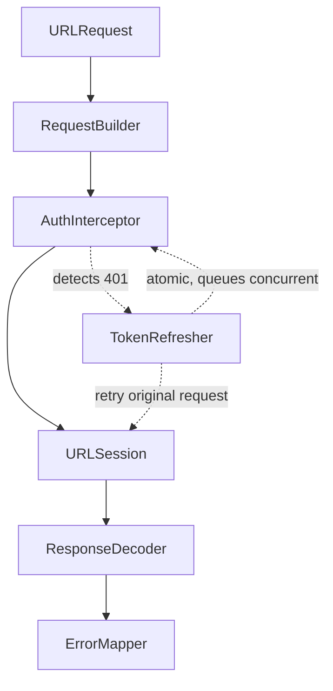

# Networking Layer / HTTP Client SDK Architecture

## Overview
A robust, protocol-oriented networking layer is the backbone of almost every modern iOS application. This system design problem asks candidates to build an extensible, testable, and secure HTTP client SDK. Interviewers at all major tech companies use this to evaluate a candidate's grasp of generics, concurrency (async/await), dependency injection, request lifecycle management (retries, auth), and security practices (pinning).

## Target Companies & Frequency
| Company | Why They Ask | Frequency |
| :--- | :--- | :--- |
| Uber / Lyft | Massive API surface area requiring strict SDK abstractions and low latency. | ★★★★☆ |
| Meta | Heavily modularized apps requiring universal, standardized network clients. | ★★★★☆ |
| Spotify | High-throughput streaming and metadata requests needing precise priority queues. | ★★★★☆ |
| Any Startup | Foundational piece of infrastructure needed for day-one app architecture. | ★★★★★ |

## Scope Definition

### In Scope
- Protocol-based `APIEndpoint` abstraction
- Generic request execution and JSON decoding
- Request building (URLRequest construction)
- Authentication interception (token injection and auto-refresh)
- Retry policies (exponential backoff)
- Security (SSL/TLS Public Key Pinning)
- Request prioritization and cancellation
- Testability (mocking without real network calls)

### Out of Scope
- GraphQL or WebSocket implementations (focus is on REST/HTTP)
- Offline caching strategies (handled by a separate caching layer/DB layer)
- Image downloading and caching (handled by tools like SDWebImage/Kingfisher)

## Requirements

### Functional Requirements
1. The SDK must provide a generic interface for executing network requests and returning strongly-typed Swift models.
2. It must automatically inject authorization tokens into requests.
3. If a request fails due to an expired token (401), it must transparently refresh the token, queue pending requests, and retry.
4. It must support request cancellation to free up resources (e.g., when a user leaves a screen).
5. It must support multiple base URLs (e.g., staging, production, specialized microservices).

### Non-Functional Requirements
| Requirement | Target | Source |
| :--- | :--- | :--- |
| Handshake Overhead | ~1 RTT | TLS 1.3 Specification |
| Network Timeout | 30s (default) | Typical URLSession configuration |
| Concurrent Connections | 6 per host (HTTP/1.1), Multiplexed (HTTP/2) | Apple URLSession Docs |
| SSL Pinning Rotation | Every 60-90 days | OWASP Mobile Security Guidelines |

## High-Level Architecture (HLD)

### Component Diagram

```ascii
+-----------------------------------------------------------------------+
|                             App Layer                                 |
|  +----------------+     +----------------+     +----------------+     |
|  | UserViewModel  |     | FeedViewModel  |     | AuthViewModel  |     |
|  +-------+--------+     +-------+--------+     +-------+--------+     |
+----------|----------------------|----------------------|--------------+
           |                      |                      |
           v                      v                      v
+-----------------------------------------------------------------------+
|                          Networking SDK Layer                         |
|                                                                       |
|  +-----------------------------------------------------------------+  |
|  |                          NetworkService                         |  |
|  |     (Coordinates execution, decoding, and error mapping)        |  |
|  +-------+-----------------------+-----------------------+---------+  |
|          |                       |                       |            |
|          v                       v                       v            |
|  +---------------+       +---------------+       +---------------+    |
|  | RequestBuilder|       | Interceptors  |       | TokenRefresher|    |
|  | (APIEndpoint) |       | (Auth, Logs)  |       | (Handles 401s)|    |
|  +-------+-------+       +-------+-------+       +-------+-------+    |
|          |                       |                       |            |
|          +-----------------------+-----------------------+            |
|                                  |                                    |
|                                  v                                    |
|  +-----------------------------------------------------------------+  |
|  |                          URLSession                             |  |
|  |       (Connection pooling, HTTP/2 multiplexing, TLS)            |  |
|  +-----------------------------------------------------------------+  |
+----------------------------------|------------------------------------+
                                   | HTTP/HTTPS
                                   v
+-----------------------------------------------------------------------+
|                            Cloud API Gateway                          |
+-----------------------------------------------------------------------+
```

### Component Responsibilities
| Component | Responsibility | iOS Implementation |
| :--- | :--- | :--- |
| `APIEndpoint` | Defines the contract for a single API call (path, method). | `protocol APIEndpoint` |
| `NetworkService` | The main interface for the app. Handles async execution. | `class NetworkService` |
| `RequestBuilder` | Translates an `APIEndpoint` into a `URLRequest`. | Internal struct/class |
| `Interceptors` | Modifies requests (adding headers) and responses (logging). | Array of `Interceptor` protocols |
| `TokenRefresher` | Manages the atomic refresh of OAuth tokens upon a 401. | Actor or serial queue class |

### Data Flow
1. **Initiation**: `ViewModel` calls `networkService.execute(endpoint: GetUserProfile())`.
2. **Build**: `RequestBuilder` constructs the `URLRequest`.
3. **Intercept (Pre)**: `AuthInterceptor` attaches the current Bearer token.
4. **Execute**: `URLSession` executes the request.
5. **Intercept (Post)**: `AuthInterceptor` checks the response. If 401, it pauses, calls `TokenRefresher`, and retries the original request.
6. **Decode**: `NetworkService` receives raw data, validates HTTP status (200-299), and uses `JSONDecoder` to parse it into the requested struct.
7. **Return**: The strongly-typed model is returned to the `ViewModel`.

## Data Models

### Core Entities

```swift
import Foundation

// MARK: - API Endpoint Protocol
protocol APIEndpoint {
    associatedtype Response: Decodable
    
    var baseURL: URL { get }
    var path: String { get }
    var method: HTTPMethod { get }
    var headers: [String: String]? { get }
    var queryParameters: [String: String]? { get }
    var body: Data? { get }
    var priority: Float { get } // URLSessionTask.priority
}

enum HTTPMethod: String {
    case get = "GET"
    case post = "POST"
    case put = "PUT"
    case delete = "DELETE"
}

// MARK: - App Network Error
enum AppNetworkError: Error {
    case invalidURL
    case noConnection
    case unauthorized          // 401
    case clientError(Int)      // 400-499
    case serverError(Int)      // 500-599
    case decodingFailed(Error)
    case timeout
    case unknown
}
```

## Client Architecture Deep-Dives

### [Subsystem 1 — Generic Network Service]
The core execution engine using Swift `async/await`.

```swift
class NetworkService {
    private let session: URLSession
    private let authManager: AuthManager
    
    init(session: URLSession = .shared, authManager: AuthManager) {
        self.session = session
        self.authManager = authManager
    }
    
    func execute<T: APIEndpoint>(_ endpoint: T) async throws -> T.Response {
        var request = try buildRequest(for: endpoint)
        
        // Intercept: Inject Token
        if let token = await authManager.getAccessToken() {
            request.addValue("Bearer \(token)", forHTTPHeaderField: "Authorization")
        }
        
        let (data, response) = try await session.data(for: request)
        
        guard let httpResponse = response as? HTTPURLResponse else {
            throw AppNetworkError.unknown
        }
        
        // Handle 401 Unauthorized -> Token Refresh
        if httpResponse.statusCode == 401 {
            return try await handleUnauthorized(endpoint: endpoint, request: request)
        }
        
        try validate(statusCode: httpResponse.statusCode)
        
        return try decode(data: data)
    }
    
    private func decode<T: Decodable>(data: Data) throws -> T {
        let decoder = JSONDecoder()
        decoder.keyDecodingStrategy = .convertFromSnakeCase
        do {
            return try decoder.decode(T.self, from: data)
        } catch {
            throw AppNetworkError.decodingFailed(error)
        }
    }
    
    private func buildRequest<T: APIEndpoint>(for endpoint: T) throws -> URLRequest {
        // Implementation builds URL components, attaches query params, body, etc.
        var components = URLComponents(url: endpoint.baseURL.appendingPathComponent(endpoint.path), resolvingAgainstBaseURL: false)
        // ... build query items ...
        guard let url = components?.url else { throw AppNetworkError.invalidURL }
        
        var request = URLRequest(url: url)
        request.httpMethod = endpoint.method.rawValue
        request.allHTTPHeaderFields = endpoint.headers
        request.httpBody = endpoint.body
        return request
    }
    
    private func validate(statusCode: Int) throws {
        switch statusCode {
        case 200...299: return
        case 401: throw AppNetworkError.unauthorized
        case 400...499: throw AppNetworkError.clientError(statusCode)
        case 500...599: throw AppNetworkError.serverError(statusCode)
        default: throw AppNetworkError.unknown
        }
    }
}
```

### [Subsystem 2 — Atomic Token Refresh (The Concurrency Challenge)]
Handling 401s is tricky when multiple requests fire simultaneously. If 5 requests fail with 401, you should only refresh the token ONCE, while the other 4 requests wait. We use an `actor` for this.

```swift
actor AuthManager {
    private var accessToken: String?
    private var isRefreshing = false
    private var refreshTask: Task<String, Error>?
    
    func getAccessToken() -> String? {
        return accessToken
    }
    
    func refreshToken() async throws -> String {
        // If already refreshing, wait for the existing task to finish
        if let refreshTask = refreshTask {
            return try await refreshTask.value
        }
        
        // Create a new refresh task
        let task = Task { () -> String in
            // Pseudo-code: Make actual network call to /v1/auth/refresh
            let newToken = try await executeRefreshAPI()
            self.accessToken = newToken
            return newToken
        }
        
        self.refreshTask = task
        
        defer { self.refreshTask = nil }
        
        return try await task.value
    }
    
    private func executeRefreshAPI() async throws -> String {
        // Implementation of hitting the refresh endpoint
        return "new_token_123"
    }
}
```
In the `NetworkService`, `handleUnauthorized` simply calls `try await authManager.refreshToken()`. If it succeeds, it rebuilds the request with the new token and executes it *once* more.

### [Subsystem 3 — Unit Testing with URLProtocol]
To test the networking layer without hitting live servers, we subclass `URLProtocol`.

```swift
class MockURLProtocol: URLProtocol {
    static var mockData: Data?
    static var mockResponse: HTTPURLResponse?
    static var mockError: Error?
    
    override class func canInit(with request: URLRequest) -> Bool { return true }
    override class func canonicalRequest(for request: URLRequest) -> URLRequest { return request }
    
    override func startLoading() {
        if let error = MockURLProtocol.mockError {
            client?.urlProtocol(self, didFailWithError: error)
        } else {
            if let response = MockURLProtocol.mockResponse {
                client?.urlProtocol(self, didReceive: response, cacheStoragePolicy: .notAllowed)
            }
            if let data = MockURLProtocol.mockData {
                client?.urlProtocol(self, didLoad: data)
            }
        }
        client?.urlProtocolDidFinishLoading(self)
    }
    
    override func stopLoading() {}
}

// In Tests:
// let config = URLSessionConfiguration.ephemeral
// config.protocolClasses = [MockURLProtocol.self]
// let mockSession = URLSession(configuration: config)
```

## Performance & Optimizations
| Optimization | Technique | Benchmark/Impact |
| :--- | :--- | :--- |
| **Connection Reuse** | Keep-Alive and HTTP/2 Multiplexing | Eliminates ~100-200ms TCP/TLS handshake latency for subsequent requests. |
| **Prioritization** | `task.priority = 1.0` (UI) vs `0.1` (Analytics) | Ensures critical user-facing JSON loads before heavy background logs. |
| **JSON Decoding** | Use default Swift `JSONDecoder` | Very fast in Swift 5+, but can optimize via custom `init(from decoder:)` for massive payloads. |
| **GZIP Compression** | `Accept-Encoding: gzip` | Reduces JSON payload sizes by up to 70%. URLSession handles decompression automatically. |

## Failure Modes & Fallbacks
| Failure Scenario | Detection | Fallback Strategy |
| :--- | :--- | :--- |
| **Network Loss** | `URLError.notConnectedToInternet` | Surface precise error to UI. Do NOT retry blindly. |
| **Server 502/503/504** | HTTP 5xx Status Code | Implement Exponential Backoff with Jitter (e.g., retry after 1s, 2s, 4s, up to 3 times max). |
| **Token Refresh Fails** | 401 on the refresh endpoint | Log out the user immediately, clear local keychain, navigate to Login Screen. |
| **MITM Attack** | SSL Pinning mismatch error | Terminate connection, log security event. Do not allow bypass. |

## Trade-off Analysis
| Decision | Option A | Option B | Chosen | Why |
| :--- | :--- | :--- | :--- | :--- |
| **3rd Party vs Native** | Alamofire / Moya | Native `URLSession` | **URLSession** | Swift 5.5 `async/await` made `URLSession` extremely powerful and ergonomic. Adding Alamofire adds dependency bloat for minimal gain in modern apps. |
| **JSON Parsing** | SwiftyJSON / Dictionary | `Codable` (Decodable) | **Codable** | Type-safe, compile-time checked, zero boilerplate, built into Swift standard library. |
| **Concurrency** | Combine / RxSwift | `async/await` | **async/await** | Native concurrency avoids callback hell and publisher chain complexity. Much easier to read top-to-bottom. |

## Observability & Metrics
- **Error Rates**: Grouped by status code (4xx vs 5xx). Trigger PagerDuty if 5xx rate > 1%.
- **Latency Tracking**: Measure P50, P90, P99 request times. Attach unique `X-Request-ID` headers to trace backend performance.
- **Payload Sizes**: Monitor average response sizes. If a JSON payload exceeds 1MB, it should be paginated.
- **Logging Interceptor**: Log `[Method] [Path] [Status Code] [Duration ms]` in Debug builds. NEVER log body payloads in production (PII risk).

## Production Benchmarks Reference
| Benchmark | Value | Source |
| :--- | :--- | :--- |
| TLS Handshake (TLS 1.2) | 2 Round Trips | IETF TLS 1.2 Specs |
| TLS Handshake (TLS 1.3) | 1 Round Trip | IETF TLS 1.3 Specs |
| URLSession Timeout | 60s Request / 7 Days Resource | Apple Documentation |
| Pinning Rotation Limit | Max 90 days validity | OWASP Mobile Security |

## Interview Tips
- **Avoid 3rd Party Libraries**: Never rely on Alamofire as your answer. Interviewers want to see if you understand the underlying Apple frameworks.
- **The Token Refresh Problem**: The atomic token refresh is the "trick" question of this topic. If you just retry wildly, you'll spam the auth server. Use an `actor` or `DispatchQueue` with a barrier/lock to freeze other requests.
- **Protocol-Oriented**: Always define requests as structs adopting a protocol (`APIEndpoint`), not as raw strings or massive enum switches (which violate the Open-Closed Principle).
- **Testability**: Explicitly mention `URLProtocol` mocking. It scores huge points with senior engineers.

## Mermaid Architecture Diagram


## Common Mistakes
- Not implementing atomic token refresh (multiple simultaneous 401 → multiple refresh calls → token invalidation race)
- Retrying 4xx responses (client errors are not retriable)
- Using certificate pinning instead of public key pinning (cert rotation = app update required)
- Logging request/response bodies in debug (PII leak in logs)
- Over-architecting with Combine when simple async/await suffices

## Mock Interview Q&A
- **Q: A user's token expires. How does your network layer handle it without the caller knowing?**
  **A:** The AuthInterceptor detects the 401, suspends the request, acquires a lock via an actor to refresh the token (while queueing other requests), and then retries the original request with the new token.
- **Q: How do you test the network layer without making real API calls?**
  **A:** We subclass `URLProtocol`, inject it into the `URLSessionConfiguration`, and intercept outgoing requests to return mock data or specific errors synchronously.
- **Q: What's the difference between certificate pinning and public key pinning?**
  **A:** Certificate pinning checks the exact cert, breaking when it expires. Public key pinning checks the underlying public key, which can remain the same across certificate renewals, preventing forced app updates.
- **Q: How do you handle requests that need to outlive a view controller?**
  **A:** We use background `URLSession` tasks or simply detached Tasks that aren't tied to the view's lifecycle for operations that must complete, like telemetry.
- **Q: Why use an interceptor pattern instead of putting auth logic directly in the executor?**
  **A:** It decouples concerns. Interceptors allow us to easily add logging, custom headers, or caching logic without modifying the core `execute` method, honoring the Open-Closed Principle.

## Related Specs
| Spec | Relationship |
| :--- | :--- |
| [Image Loading Library](image-loading-library.md) | Images are fetched over the network but often bypass strict JSON decoding and authentication. |
| [Analytics SDK](analytics-sdk.md) | Requires network batch uploads and exponential backoff retry logic. |
