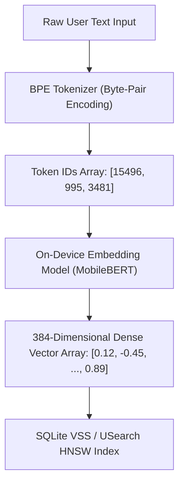
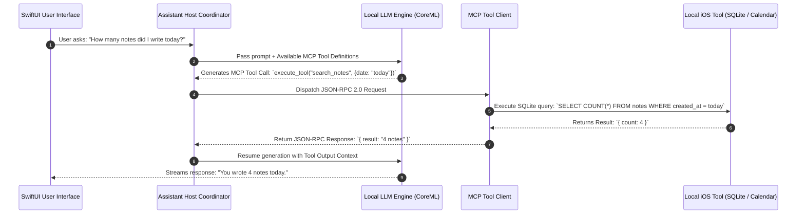

# On-Device LLM & Mobile AI Assistant Engine

## Overview
With the advent of Apple Intelligence, Meta ExecuTorch, and Google Gemini Nano/AICore, mobile system design interviews for Staff, Principal, and AI/ML Mobile Engineers now frequently evaluate **On-Device LLM & Local AI Assistant Architecture**. This problem tests a candidate's ability to balance low-latency inference, extreme memory constraints (< 500MB RAM budget for models), battery/thermal throttling, local Vector DB indexing (On-Device RAG), streaming token UI generation, and seamless hybrid cloud fallbacks.

## Target Companies & Frequency
| Company | Why They Ask | Frequency |
| :--- | :--- | :--- |
| Apple | Core focus on Apple Intelligence, CoreML Neural Engine, and on-device privacy | ★★★★★ |
| Meta | Llama 3 / ExecuTorch mobile runtime deployment across WhatsApp, Instagram, Ray-Ban | ★★★★★ |
| Google | Gemini Nano, Android AICore, local embedding search in Pixel / Google Photos | ★★★★★ |
| Microsoft | Copilot mobile integration, ONNX Runtime Mobile, local context indexing | ★★★★☆ |
| Uber / Airbnb | Smart customer support assistants, local speech/text query parsing offline | ★★★★☆ |

---

## Scope Definition

### In Scope
- Quantized model loading (INT4 / FP16 CoreML / ExecuTorch / GGUF model formats).
- Strict memory management (< 500MB RAM budget for models, active weight unmapping under OS memory pressure).
- On-Device RAG pipeline (Local Vector Index using USearch/HNSW + SQLite VSS, local text embedding generation).
- Token Generation Streaming Architecture (`AsyncSequence` / SSE, KV-Cache sliding window management).
- Thermal, Battery & Hardware Throttling Guard (Metal Performance Shaders, Apple Neural Engine vs GPU vs CPU scheduling).
- Hybrid Inference Coordinator (Local execution first $\rightarrow$ fallback to Cloud LLM API when model capacity, battery, or complexity requires it).

### Out of Scope
- Full model training or fine-tuning pipelines (server-side GPUs).
- Quantization math algorithms (focus is on deploying & managing quantized weights on mobile).
- Custom hardware ASIC design.

---

## Requirements

### Functional Requirements
1. **Local Text & Speech Inference**: Generate answers to user prompts locally using an on-device 1B-3B parameter quantized LLM (e.g., Llama-3-8B-Instruct 4-bit, Phi-3-mini, or CoreML Apple Foundation Model).
2. **On-Device RAG Context Search**: Embed user personal data (notes, messages, app documents) locally and retrieve relevant context chunks using cosine similarity before prompt construction.
3. **Streaming Token Output**: Stream response tokens in real time to the UI with less than 100ms time-to-first-token (TTFT).
4. **Hybrid Cloud Router**: Automatically route complex prompts (> 2k token context or requiring heavy reasoning) to Cloud LLM API via secure SSE stream.
5. **Privacy Guard**: Sanitize and strip PII (Personally Identifiable Information) locally before sending any prompt to the cloud fallback.

### Non-Functional Requirements
| Requirement | Target | Source / Authoritative Benchmark |
| :--- | :--- | :--- |
| Model Memory Allocation | $\le 500\text{MB}$ RAM (INT4 3B model) | Apple WWDC 2024 Session 10159 / Meta ExecuTorch |
| Time to First Token (TTFT) | $< 100\text{ms}$ (Local NPU) | Apple Neural Engine / Snapdragon NPU Benchmark |
| Generation Speed | $\ge 25\text{ tokens/sec}$ | ExecuTorch 4-bit Llama-3 benchmark |
| Local Vector Search Latency | $< 15\text{ms}$ for $10,000$ vectors | USearch / HNSW C++ Benchmark on iOS |
---

## 🧠 Primer for Beginners: AI, LLM & On-Device Concepts

If you are new to AI engineering or transitioning from traditional iOS development, here are the foundational building blocks explained simply:

### 1. Tokens & Vocabulary
* **What is a Token?**: LLMs do not read words or characters directly; they process text as numerical chunks called **Tokens**.
* **Real Data Math**: In English text, $1\text{ token} \approx 0.75\text{ words}$ (or $\sim 4\text{ characters}$). For example, `"Antigravity"` is broken into tokens: `["Anti", "gra", "vity"]` $\rightarrow$ `[3481, 10245, 874]`.
* **Vocabulary Size**: An on-device model like Llama-3 has a fixed vocabulary of **128,256 tokens**.

### 2. Quantization (FP16 vs INT4)
* **What is Quantization?**: Compression of the model's mathematical weights from high precision (16-bit floating point `FP16`) to lower precision (4-bit integers `INT4`).
* **Why it Matters on Mobile**:
  * $\text{FP16 (16-bit) 3B Model} = 3\text{B} \times 2\text{ bytes} = \mathbf{6.0\text{ GB RAM}}$ (Crashes immediately on iPhone due to Jetsam OOM limits).
  * $\text{INT4 (4-bit) 3B Model} = 3\text{B} \times 0.5\text{ bytes} = \mathbf{1.5\text{ GB File / } \le 500\text{MB Execution RAM}}$ (Runs smoothly on Apple Neural Engine via `mmap`).

### 3. Vector Embeddings & Cosine Similarity
* **What is an Embedding?**: A mathematical representation of text meaning formatted as a dense array of numbers (e.g., $384$ floats).
* **Semantic Vector Search**: Sentences with similar meanings produce vectors close together in space. Searching for *"airplane ticket"* matches *"flight booking"* based on the **Cosine Similarity** angle between their vectors:
$$\text{Cosine Similarity}(\vec{A}, \vec{B}) = \frac{\vec{A} \cdot \vec{B}}{\|\vec{A}\| \|\vec{B}\|}$$

### 4. RAG (Retrieval-Augmented Generation)
* **What is RAG?**: LLMs do not know your personal private data (e.g., your local SQLite notes or emails). RAG retrieves relevant local text chunks via vector search and injects them into the prompt before asking the LLM to generate an answer.

### 5. Model Context Protocol (MCP)
* **What is MCP?**: An open standard protocol (JSON-RPC 2.0) that enables an AI Assistant (Host) to safely discover and call external tools or query data sources (e.g., search local iOS calendar, read SQLite database, execute web fetch).

### 6. Key-Value (KV) Cache
* **What is KV-Cache?**: During token generation, computing attention for previously generated tokens is expensive. The **KV-Cache** stores attention key and value tensors in memory so the model only calculates the newest token, speeding up generation from $2\text{ tokens/sec}$ to $>25\text{ tokens/sec}$.

---

## 🎨 System Architecture Diagrams

### Diagram 1: Text Tokenization & Vector Embedding Pipeline



---

### Diagram 2: On-Device RAG Retrieval & Cosine Similarity Flow

```ascii
User Prompt: "What time is my flight tomorrow?"
       |
       v
+-------------------------------------------------------------------+
|  1. Generate 384-dim Query Vector via Local Embedding Model       |
+-------------------------------------------------------------------+
       |
       v
+-------------------------------------------------------------------+
|  2. Execute USearch HNSW Cosine Similarity Search on SQLite VSS   |
+-------------------------------------------------------------------+
       |
       |--> Match 1 (Score 0.92): "Flight UA123 departs at 10:30 AM"
       |--> Match 2 (Score 0.85): "Hotel check-in at 3:00 PM"
       v
+-------------------------------------------------------------------+
|  3. Construct Augmented Prompt:                                  |
|     "Context: Flight UA123 departs at 10:30 AM.                   |
|      Question: What time is my flight tomorrow?"                  |
+-------------------------------------------------------------------+
       |
       v
+-------------------------------------------------------------------+
|  4. Execute Local CoreML LLM on Apple Neural Engine (ANE)         |
+-------------------------------------------------------------------+
```

---

### Diagram 3: Model Context Protocol (MCP) Client-Host Tool Execution



---

### Diagram 4: KV-Cache Memory & Context Window Buffer

```ascii
+-----------------------------------------------------------------------------------+
|                            4096-Token Context Window                              |
|                                                                                   |
|  +------------------------+--------------------------+-------------------------+  |
|  | System Prompt + RAG    | User Query Tokens        | Generated Response      |  |
|  | Context (1024 Tokens)  | (256 Tokens)             | KV-Cache Buffer         |  |
|  +------------------------+--------------------------+-------------------------+  |
|                                                      |                            |
|                                                      v                            |
|                                        +-------------------------------+          |
|                                        | INT8 Quantized KV-Cache       |          |
|                                        | Allocation: ~128MB RAM        |          |
|                                        +-------------------------------+          |
+-----------------------------------------------------------------------------------+
```

---

## High-Level Architecture (HLD)

### Component Diagram

```ascii
+-----------------------------------------------------------------------------------+
|                                  iOS Client Application                           |
|                                                                                   |
|  +------------------+         +-----------------------+                           |
|  |   SwiftUI View   | <-----> |   Assistant ViewModel  |                           |
|  | (Token Streamer) |         | (State & Token Buffer)|                           |
|  +------------------+         +-----------+-----------+                           |
|                                           |                                       |
|                                           v                                       |
|                               +-----------------------+                           |
|                               |   Hybrid AI Router    |                           |
|                               +-----------+-----------+                           |
|                                           |                                       |
|                  +------------------------+------------------------+              |
|                  | (Local Eligible)                                | (Cloud Fallback)|
|                  v                                                 v              |
|  +-------------------------------+                 +---------------------------+  |
|  |     On-Device AI Engine       |                 |    Cloud API Gateway      |  |
|  |                               |                 | (gRPC / SSE TLS 1.3)     |  |
|  |  +-------------------------+  |                 +-------------+-------------+  |
|  |  | Local Vector Search (RAG)|  |                               |                |
|  |  | (SQLite VSS / USearch)  |  |                               v                |
|  |  +------------+------------+  |                 +---------------------------+  |
|  |               | Context       |                 |   Cloud LLM Cluster       |  |
|  |               v               |                 | (GPT-4o / Claude / Llama) |  |
|  |  +-------------------------+  |                 +---------------------------+  |
|  |  | CoreML / ExecuTorch     |  |                                                |
|  |  | Inference Runtime       |  |                                                |
|  |  | (ANE / MPS GPU / INT4)  |  |                                                |
|  |  +-------------------------+  |                                                |
|  +-------------------------------+                                                |
+-----------------------------------------------------------------------------------+
```

### Data Flow
1. **User Prompt Input**: User submits a query (e.g., *"Summarize my flight details from yesterday"*).
2. **Device State Check**: `HybridAIRouter` checks battery, `thermalState`, and model load state.
3. **Local Vector Search (RAG)**:
   - Query is embedded locally using a tiny model (e.g., MobileBERT / BGE-Micro $\sim 25\text{MB}$).
   - `VectorSearchEngine` queries SQLite VSS / USearch HNSW index for top-k relevant local chunks.
4. **Context Assembly & Tokenization**: Local context is inserted into prompt template.
5. **Inference Execution**:
   - If prompt context $\le 2048$ tokens and thermal state is `.nominal`, `LocalInferenceEngine` runs on Apple Neural Engine (ANE) via CoreML/ExecuTorch.
   - Tokens stream directly to `AssistantViewModel` via Swift `AsyncThrowingStream`.
   - If thermal state is `.serious` or prompt requires $> 2048$ tokens, request routes to Cloud API via SSE stream.

---

## Deep Dives

### Subsystem 1: Local Vector Database & On-Device RAG Engine

To enable privacy-preserving retrieval without cloud dependencies, document embeddings are indexed locally in SQLite using SQLite VSS or USearch (HNSW algorithm).

```
Document Text -> Chunking (512 tokens) -> MobileBERT Embedder -> 384-dim Vector -> USearch HNSW Index
```

#### SQLite Vector Index Schema (SQLite VSS)
```sql
-- SQLite VSS Vector Storage Schema
CREATE TABLE IF NOT EXISTS document_chunks (
    id TEXT PRIMARY KEY,
    document_id TEXT NOT NULL,
    content TEXT NOT NULL,
    token_count INTEGER NOT NULL,
    created_at INTEGER NOT NULL
);

-- Virtual Table for Vector Search (384 dimensions for MobileBERT/MiniLM)
CREATE VIRTUAL TABLE IF NOT EXISTS vss_document_embeddings USING vss0(
    embedding(384)
);
```

#### Swift Local RAG Pipeline Actor
```swift
import Foundation
import CoreML

public actor LocalRAGEngine {
    private let vectorIndex: VectorIndexManager
    private let embedder: LocalEmbedder
    
    public init(vectorIndex: VectorIndexManager, embedder: LocalEmbedder) {
        self.vectorIndex = vectorIndex
        self.embedder = embedder
    }
    
    /// Retrieves relevant context for a user prompt
    public func retrieveContext(for query: String, topK: Int = 3) async throws -> [String] {
        // 1. Generate query embedding (384 dimensions)
        let queryVector: [Float] = try await embedder.generateEmbedding(text: query)
        
        // 2. Search HNSW index in local vector DB
        let matchingIDs = try await vectorIndex.searchNearest(vector: queryVector, limit: topK)
        
        // 3. Fetch full text chunks from SQLite
        return try await vectorIndex.fetchChunkTexts(for: matchingIDs)
    }
}
```

---

### Subsystem 2: Quantized Model Loader & Memory Manager

An INT4 quantized 3-Billion parameter LLM consumes roughly $\sim 1.8\text{GB}$ of raw weight space. On iOS devices, an application allocating $> 1.5\text{GB}$ under memory pressure will suffer immediate Jetsam OOM termination.

#### Memory Optimization Strategy:
1. **Memory-Mapped Files (`mmap`)**: Model weights are mapped into virtual address space via `mmap` with `MAP_SHARED` so the OS can page out inactive weights dynamically.
2. **Weight Unmapping on Memory Warning**: Listen to `UIApplication.didReceiveMemoryWarningNotification` to clear the KV-cache and release state buffers instantly.

```swift
import UIKit
import CoreML

actor LocalModelManager {
    private var isLoaded = false
    private var modelRuntime: CoreMLModelRuntime?
    private let maxMemoryBudgetBytes: UInt64 = 500 * 1024 * 1024 // 500 MB limit
    
    init() {
        NotificationCenter.default.addObserver(
            forName: UIApplication.didReceiveMemoryWarningNotification,
            object: nil,
            queue: .main
        ) { [weak self] _ in
            Task {
                await self?.handleMemoryPressure()
            }
        }
    }
    
    func loadModelIfNecessary() async throws {
        guard !isLoaded else { return }
        
        let availableMemory = os_proc_available_memory()
        guard availableMemory > maxMemoryBudgetBytes else {
            throw ModelError.insufficientMemory(available: availableMemory)
        }
        
        // Memory-mapped loading via CoreML / ExecuTorch
        self.modelRuntime = try await CoreMLModelRuntime.loadModel(
            name: "Llama3-3B-Instruct-4bit",
            computeUnits: .all // Uses ANE (Neural Engine) + GPU
        )
        self.isLoaded = true
    }
    
    func handleMemoryPressure() {
        // Evict KV cache & unload weights under Jetsam warning
        modelRuntime?.clearKVCache()
        modelRuntime = nil
        isLoaded = false
        print("[AI Engine] Unloaded local model due to Memory Pressure warning")
    }
}

enum ModelError: Error {
    case insufficientMemory(available: UInt64)
}
```

---

### Subsystem 3: Real-Time Token Generation & Async Sequence Streaming

Token generation must be asynchronous and streamed back to the UI incrementally without blocking the `@MainActor`.

```swift
import Foundation

public struct GeneratedToken {
    public let text: String
    public let isFinal: Bool
    public let totalTokensSoFar: Int
}

public actor TokenStreamEngine {
    private let modelRuntime: CoreMLModelRuntime
    
    public init(modelRuntime: CoreMLModelRuntime) {
        self.modelRuntime = modelRuntime
    }
    
    /// Streams tokens asynchronously as they are generated by the Neural Engine
    public func generateStream(prompt: String) -> AsyncThrowingStream<GeneratedToken, Error> {
        return AsyncThrowingStream { continuation in
            Task {
                do {
                    var tokenCount = 0
                    try await modelRuntime.predict(prompt: prompt) { tokenText in
                        tokenCount += 1
                        continuation.yield(GeneratedToken(
                            text: tokenText,
                            isFinal: false,
                            totalTokensSoFar: tokenCount
                        ))
                    }
                    continuation.yield(GeneratedToken(text: "", isFinal: true, totalTokensSoFar: tokenCount))
                    continuation.finish()
                } catch {
                    continuation.finish(throwing: error)
                }
            }
        }
    }
}
```

---

### Subsystem 4: Thermal, Battery & Hybrid Fallback Router

Running Neural Engine inference at max capacity causes rapid thermal buildup and battery drain. The system monitors iOS process state and dynamically shifts workload to Cloud LLM APIs.

```swift
import Foundation
import UIKit

public actor HybridAIRouter {
    private let localEngine: TokenStreamEngine
    private let cloudClient: CloudLLMAPIClient
    
    public init(localEngine: TokenStreamEngine, cloudClient: CloudLLMAPIClient) {
        self.localEngine = localEngine
        self.cloudClient = cloudClient
    }
    
    public func processPrompt(_ prompt: String, estimatedTokens: Int) -> AsyncThrowingStream<String, Error> {
        let thermalState = ProcessInfo.processInfo.thermalState
        let isLowPowerMode = ProcessInfo.processInfo.isLowPowerModeEnabled
        
        // Fallback to Cloud if thermal state is elevated, low battery mode is active, or context is too large
        let shouldExecuteOnCloud = thermalState == .serious || 
                                   thermalState == .critical || 
                                   isLowPowerMode || 
                                   estimatedTokens > 2048
        
        if shouldExecuteOnCloud {
            print("[Hybrid Router] Routing to Cloud API (Thermal: \(thermalState.rawValue), LowPower: \(isLowPowerMode))")
            return cloudClient.streamCloudInference(prompt: prompt)
        } else {
            print("[Hybrid Router] Executing on-device via Apple Neural Engine")
            return AsyncThrowingStream { continuation in
                Task {
                    do {
                        let stream = await localEngine.generateStream(prompt: prompt)
                        for try await token in stream {
                            continuation.yield(token.text)
                        }
                        continuation.finish()
                    } catch {
                        // Fallback to cloud on local inference error
                        for try await cloudToken in self.cloudClient.streamCloudInference(prompt: prompt) {
                            continuation.yield(cloudToken)
                        }
                        continuation.finish()
                    }
                }
            }
        }
    }
}
```

---

### Subsystem 5: Model Context Protocol (MCP) Swift Tool Coordinator

The Model Context Protocol (MCP) allows the local LLM to dynamically call native iOS tools (e.g., SQLite query, Calendar event lookup, Location service) via standard JSON-RPC 2.0 requests.

```swift
import Foundation

// MARK: - MCP Protocol Models
public struct MCPToolDefinition: Codable {
    public let name: String
    public let description: String
    public let inputSchemaJSON: String
}

public struct MCPRequest: Codable {
    public let jsonrpc: String = "2.0"
    public let id: String
    public let method: String
    public let params: MCPParams
    
    public struct MCPParams: Codable {
        public let name: String
        public let arguments: [String: String]
    }
}

public struct MCPResponse: Codable {
    public let jsonrpc: String = "2.0"
    public let id: String
    public let result: String?
    public let error: String?
}

// MARK: - Local MCP Client Engine
public actor MCPToolCoordinator {
    private var registeredTools: [String: ( [String: String] ) async throws -> String] = [:]
    
    public init() {}
    
    /// Register a native iOS capability as an MCP Tool
    public func registerTool(name: String, handler: @escaping ([String: String]) async throws -> String) {
        registeredTools[name] = handler
    }
    
    /// Executes JSON-RPC 2.0 tool invocation from LLM
    public func handleMCPRequest(_ requestData: Data) async -> Data {
        let decoder = JSONDecoder()
        let encoder = JSONEncoder()
        
        guard let request = try? decoder.decode(MCPRequest.self, from: requestData),
              let handler = registeredTools[request.params.name] else {
            let errorResponse = MCPResponse(id: "0", result: nil, error: "Tool not found or invalid JSON-RPC")
            return (try? encoder.encode(errorResponse)) ?? Data()
        }
        
        do {
            let output = try await handler(request.params.arguments)
            let successResponse = MCPResponse(id: request.id, result: output, error: nil)
            return (try? encoder.encode(successResponse)) ?? Data()
        } catch {
            let failureResponse = MCPResponse(id: request.id, result: nil, error: error.localizedDescription)
            return (try? encoder.encode(failureResponse)) ?? Data()
        }
    }
}
```

---

## Edge Cases & Failure Modes

1. **Jetsam Memory Termination (OOM)**:
   * *Mitigation*: Register for `UIApplication.didReceiveMemoryWarningNotification`. Purge KV cache immediately and release model pointers. Set hard limit of 500MB budget for active weights.
2. **Thermal Throttling Dropoff**:
   * *Mitigation*: Monitor `ProcessInfo.thermalStateDidChangeNotification`. Switch active generation to Cloud LLM mid-stream if thermal state transitions from `.nominal` $\rightarrow$ `.serious`.
3. **Infinite Generation Loop (Repetition Trap)**:
   * *Mitigation*: Implement frequency and presence penalty parameters in local logits processor. Set hard stop token limit at 1,024 tokens.
4. **Privileged PII Leakage in Cloud Fallback**:
   * *Mitigation*: Apply local regex & NER (Named Entity Recognition) scrubber (Apple `NaturalLanguage` framework) to strip email addresses, phone numbers, and SSNs before dispatching prompts to cloud APIs.

---

## FAANG-Style Mock Interview Q&A

### Q1: How do you fit a 3B parameter model onto an iPhone with 6GB RAM without crashing the app?
**Answer**: We use 4-bit INT4 quantization (reducing model footprint from 6GB in FP16 down to $\sim 1.5\text{GB}$). Furthermore, we memory-map weights using `mmap` so only the currently executed layers reside in active RAM. We enforce a 500MB max memory ceiling for model execution buffers, and under OS memory pressure (`didReceiveMemoryWarning`), we instantly flush the KV-cache and release model pointers.

### Q2: Why use local SQLite VSS / USearch instead of querying a Cloud Vector Database (Pinecone/Milvus)?
**Answer**: Local vector search guarantees 100% offline functionality, zero network latency ($< 15\text{ms}$ search time), and zero cloud data ingress costs. Crucially, personal user data (emails, notes, messages) never leaves the device, adhering to Apple Intelligence and GDPR privacy standards.

---

## Common Mistakes (❌ Wrong $\rightarrow$ ✅ Correct)

- ❌ **Wrong**: Loading full 16-bit unquantized model weights directly into `Data(contentsOf: url)` in RAM.  
  ✅ **Correct**: Use 4-bit quantized CoreML/ExecuTorch models backed by memory-mapped files (`mmap`).

- ❌ **Wrong**: Running model inference directly on the `@MainActor` thread.  
  ✅ **Correct**: Execute inference inside a background `actor` dispatching onto Apple Neural Engine / Metal Performance Shaders.

- ❌ **Wrong**: Ignoring device thermal state during long generation tasks.  
  ✅ **Correct**: Listen to `ProcessInfo.thermalState` and fallback to Cloud SSE APIs when thermal state reaches `.serious`.
