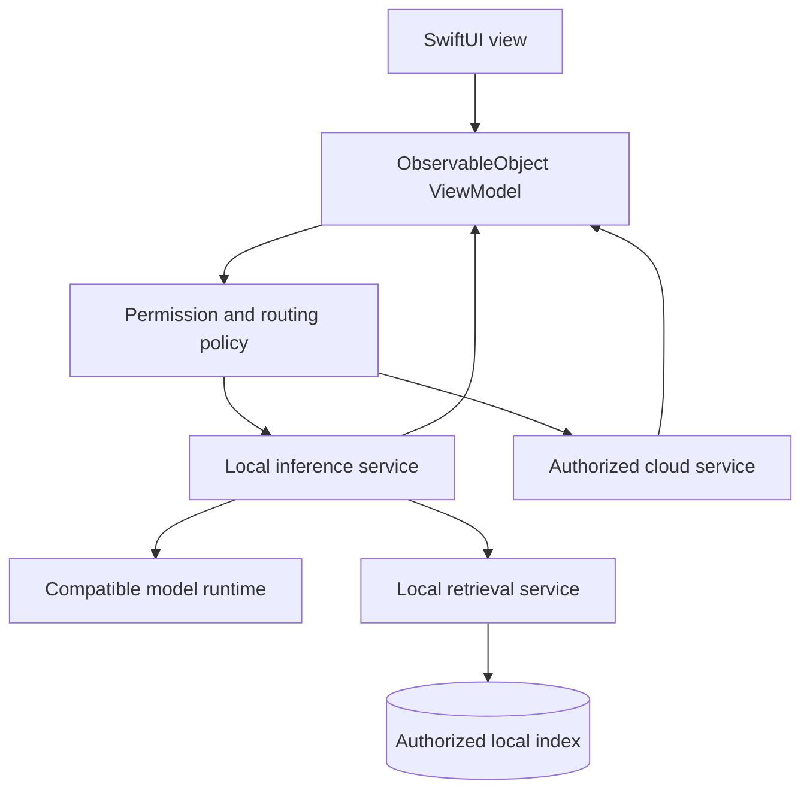

# On-Device LLM and Mobile AI Architecture

Design local inference around measured device capability, model quality, permissions and recovery. This is an architecture exercise, not a verified deployment at a named company. For backend serving, use [the AI inference case](backend-system-design-casebook.md#12-ai-inference-gateway-and-evaluation-platform).

## Scope and platform selection

Clarify the task, supported devices and OS versions, model license, offline requirements, languages, context length, output limits and data policy. Separate using an OS-provided model from bundling your own model. They have different availability, distribution, runtime and operational constraints.

Use [Apple Foundation Models](https://developer.apple.com/documentation/foundationmodels) for the actual framework contract. Use [ExecuTorch documentation](https://docs.pytorch.org/executorch/stable/index.html) for model export, backend support, runtime integration and profiling. Do not assume every model operation executes on an NPU or that runtime formats are interchangeable.

## Architecture

```mermaid
flowchart TD
    V[SwiftUI view] --> VM[ObservableObject ViewModel]
    VM --> P[Permission and routing policy]
    P --> L[Local inference service]
    P --> C[Authorized cloud service]
    L --> M[Compatible model runtime]
    L --> R[Local retrieval service]
    R --> D[(Authorized local index)]
    L --> VM
    C --> VM
```

Keep presentation in the view, state and user-event orchestration in the ViewModel, and runtime, retrieval and network work in injectable services. Propagate cancellation to inference and networking. A local failure must not silently send personal data to a cloud endpoint.

## Memory model

Packed weight storage = parameter count multiplied by bits per weight / 8, before quantization scales, metadata and runtime overhead.

For a dense model with 3 billion parameters:

- FP16 weight storage alone is 6 billion bytes.
- Packed INT4 weight storage alone is 1.5 billion bytes.

These are arithmetic lower bounds, not measured resident memory or model-file sizes. Runtime allocations, activations and KV-cache add to the footprint. Memory mapping does not guarantee a low resident footprint or NPU compatibility. A model can revisit weights repeatedly, and paging can impose substantial cost.

For a conventional dense KV-cache, approximate bytes = 2 multiplied by layers, cached tokens, KV heads, head dimension and bytes per element, summed over active sequences. Architecture, quantization, sharing and allocation layout can change the actual footprint. Distinguish query heads from KV heads.

Profile the exact runtime, context and device. Respond to memory pressure with a safe cancellation and release policy. Do not claim a universal jetsam limit or assume freeing the KV-cache preserves the active generation. See [Apple memory diagnosis](https://developer.apple.com/documentation/xcode/identifying-high-memory-use-with-jetsam-event-reports).

## Latency and scheduling

Measure model initialization, prompt processing, time to first token, steady decoding rate, completion time, peak memory, thermal behavior and energy impact separately. Record model/runtime versions, device, context and output lengths, warm versus cold state and observation window.

Bound concurrent requests and pending work. A cancelled screen should not continue expensive generation. Long contexts and concurrent sessions increase demand. Choose routing thresholds from actual quality and performance evidence rather than an arbitrary token count.

## Retrieval and privacy

A retrieval index needs chunk identity, provenance, permissions, versioning, deletion and rebuild semantics. Search authorization applies before material reaches the model. Keep the original source available to support an answer or summary; embedding similarity does not establish factual correctness.

Offline operation requires the model, index and necessary data to be resident and usable. Cloud fallback, analytics and synchronization can still transfer personal information. Define consent, allowed destinations, retention and redaction by data flow. Do not claim privacy compliance just because retrieval happens locally.

## Quality and failure evaluation

Use authorized representative inputs and record actual outcomes. Evaluate task accuracy, unsupported statements, source coverage, unsafe output, retrieval failures and language/device cohorts. Keep evaluation set and model versions traceable. Structured output still needs validation.

| Failure | Recovery decision to define |
| :--- | :--- |
| Model unavailable | Explain availability and offer an authorized alternative |
| Memory or thermal pressure | Cancel or reduce supported work safely; preserve recoverable user state |
| Retrieval contains deleted data | Enforce deletion and rebuild/version rules before use |
| Client cancels during streaming | Stop work and prevent late results overwriting new state |
| Cloud endpoint unavailable | Expose recoverable failure within the request deadline |
| Output fails validation | Reject or repair within a bounded policy; do not display invalid data as fact |
| Quality regression | Compare against versioned evidence and restore a known acceptable configuration |

## Interview follow-ups

- Why is model-file size different from peak runtime memory?
- Why does memory mapping not prove a fixed resident budget?
- How do you prevent a late generation overwriting a newer request?
- Which operation requires user permission before cloud routing?
- How do deletion and authorization reach the retrieval index?
- What measured evidence supports the local versus cloud decision?
- What does the EM own across model, client, privacy and backend teams?

Related material: [summarization mechanics](how-ai-summarization-agents-work.md), [evidence standard](evidence-and-sources.md), [backend guide](backend-engineering-manager-guide.md).
