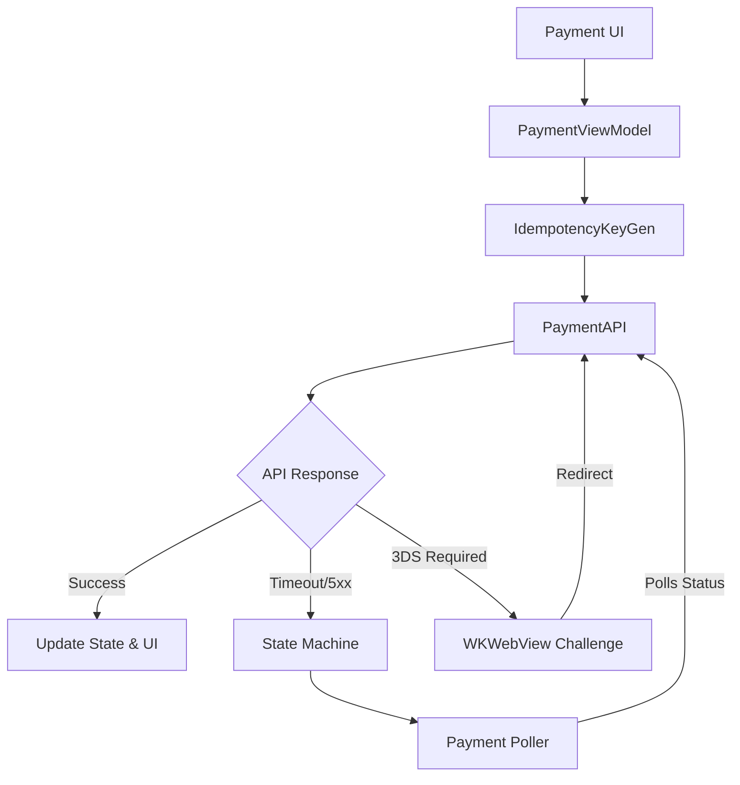

# Mobile Payment Checkout Flow

> Reference status: client architecture study material. Embedded code and payloads are incomplete design sketches, not verified production implementations or records from the named products. Do not quote remaining numeric tuning choices as employer benchmarks. For backend preparation, start with the [backend guide](backend-engineering-manager-guide.md) and [evidence standard](evidence-and-sources.md).


## Overview
The Mobile Payment Checkout Flow is a critical component of any e-commerce or fintech application, handling the secure transfer of funds from a user to a merchant.

## Scope Definition

### In Scope
- Payment tokenization and secure data handling (Apple Pay, Stripe SDK)
- Stable operation identity, durable idempotency and payment reconciliation
- Payment state machine and local state persistence
- Timeout handling, polling, and terminal state resolution
- Security (cert pinning, Biometrics, Secure Enclave)
- 3DS authentication flow and deep link callbacks
- Retry policies and error classification

### Out of Scope
- Backend payment gateway integration with acquiring banks
- Complex multi-vendor cart splits (e.g., marketplace payouts)
- Detailed UI/UX design of the checkout screen
- Receipt generation and email notification systems

## Requirements

### Functional Requirements
1. The app must securely tokenize payment methods without exposing raw PANs to the merchant server.
2. The backend must atomically enforce operation identity and reconcile ambiguous provider outcomes. Client retries alone cannot guarantee exactly-once external effects.
3. The app must handle network interruptions and device reboots during a payment attempt.
4. The system must support 3DS (3D Secure) authentication via web challenge.
5. The app must expose pending or unknown outcomes and resume status reconciliation. Prevent a new payment attempt while the previous outcome remains ambiguous, under the documented backend/provider contract.

### Non-Functional Requirements

Define and measure these dimensions for the actual workload; values require evidence under [the evidence standard](evidence-and-sources.md):

- Payment Success Rate
- Idempotency Key TTL
- API Timeout
- Polling Duration
- PCI DSS Compliance
- 3DS Fraud Reduction


## Worked learning walkthrough: The app restarts during an unknown payment

**Failure drill:** The provider outcome is unresolved when the user closes the app. This is a proposed design walkthrough.

1. Persist order/operation identity and pending status before relying on recoverable UI. Server owns price and payment attempt state.
2. On relaunch, retrieve authorized status rather than initiating a fresh attempt. Server reconciles the persisted provider identity through its supported contract.
3. Handle late success, failure and expired inventory with explicit policy. Polling ends according to deadline/lifecycle, but unresolved backend state remains recoverable.

**Why the obvious answer breaks:** A local timeout or polling deadline is not proof that the provider failed. Erasing the pending identity can cause another charge when the user returns.

**Answer to rehearse:**

> I would separate customer navigation from business recovery: the user can leave a pending screen while durable reconciliation continues. Support needs the same operation trace and exception owner.

## High-Level Architecture (HLD)

### Component Diagram
```text
+----------------+        +-----------------+        +-----------------+
|   Apple Pay /  |        |    Merchant     |        | Payment Gateway |
|   Stripe SDK   |        |    Backend      |        | (Stripe/Adyen)  |
+-------+--------+        +--------+--------+        +--------+--------+
        |                          |                          |
        | 1. Request Token         |                          |
        |------------------------->|                          |
        |                          |                          |
        | 2. Token Response        |                          |
        |<-------------------------|                          |
        |                          |                          |
        | 3. Initiate Payment      |                          |
        |    (Token, Idempotency)  |                          |
        |------------------------->|                          |
        |                          | 4. Server-to-Server Auth |
        |                          |------------------------->|
        |                          |                          |
        | 5. Challenge Required    |<-------------------------|
        |<-------------------------|                          |
        |                          |                          |
        | 6. Complete 3DS / Polling|                          |
        |------------------------->|                          |
        |                          |                          |
        | 7. Final Status          |                          |
        |<-------------------------|                          |
+-------+--------+                 |                          |
|   iOS Client   |                 |                          |
| (Local SQLite) |                 |                          |
+----------------+                 +--------------------------+
```

### Component Responsibilities
| Component | Responsibility | iOS Implementation |
| :--- | :--- | :--- |
| Payment UI | Collects user intent, shows loading/success/error states. | `SwiftUI View`, `PKPaymentButton` |
| Tokenization Engine | Securely captures card details, requests network token. | `PassKit`, `Stripe SDK` |
| Payment Repository | Manages API calls, applies idempotency keys. | `PaymentRepository` (URLSession) |
| State Machine | Tracks payment lifecycle (Initiated -> Processing -> Terminal). | `PaymentStateMachine` |
| State Persistence | Saves current transaction state to disk to survive app kills. | `SQLite`, `CoreData` (FileProtection) |
| Polling Engine | Periodically checks payment status if initial request times out. | `PaymentPoller` (Task.sleep) |

### Data Flow
1. User taps "Pay".
2. App requests a payment token from the Payment Gateway (via SDK or Apple Pay).
3. App generates a UUID for the `Idempotency-Key` and saves the `Initiated` state to SQLite.
4. App sends the Token and Idempotency Key to the Merchant Backend.
5. Backend processes the payment. If 3DS is required, it returns a challenge URL.
6. App presents the 3DS challenge in a `WKWebView`. User completes it.
7. Backend receives a webhook from the Gateway. App polls the Backend for status.
8. Backend returns `Succeeded`. App updates SQLite to `Succeeded` and shows confirmation UI.

## Data Models

### Core Entities
```swift
import Foundation

/// Represents the state of a payment transaction.
enum PaymentState: String, Codable {
    case initiated
    case processing
    case requiresChallenge
    case succeeded
    case failed
    case cancelled
}

/// The local record of a payment attempt.
struct PaymentTransaction: Codable, Identifiable {
    let id: UUID // The idempotency key
    let orderId: String
    let amount: Decimal
    let currency: String
    var state: PaymentState
    let createdAt: Date
    var updatedAt: Date
    var challengeUrl: URL?
    var errorReason: String?
}

/// Error classification for retry logic.
enum PaymentError: Error {
    case retriable(URLError)
    case nonRetriable(reason: String)
    case requiresPolling
}
```

### Database Schema
```sql
CREATE TABLE payment_transactions (
    id TEXT PRIMARY KEY, -- Idempotency key (UUID)
    order_id TEXT NOT NULL,
    amount DECIMAL NOT NULL,
    currency TEXT NOT NULL,
    state TEXT NOT NULL,
    created_at DATETIME NOT NULL,
    updated_at DATETIME NOT NULL,
    challenge_url TEXT,
    error_reason TEXT
);

CREATE INDEX idx_payment_order_id ON payment_transactions(order_id);
CREATE INDEX idx_payment_state ON payment_transactions(state);
```

## API Design

### Endpoints

#### 1. Initiate Payment
- **Method:** `POST /v1/payments/initiate`
- **Headers:**
  - `Authorization: Bearer <token>`
  - `Idempotency-Key: <UUID>`
- **Request Body:**
```json
{
  "order_id": "ord_12345",
  "payment_method_token": "tok_visa_123",
  "amount": 1000,
  "currency": "USD"
}
```
- **Response Body (200 OK - Requires Action):**
```json
{
  "payment_id": "pi_98765",
  "status": "requires_action",
  "next_action": {
    "type": "redirect_to_url",
    "url": "https://hooks.stripe.com/3d_secure/..."
  }
}
```

#### 2. Check Payment Status
- **Method:** `GET /v1/payments/{payment_id}/status`
- **Headers:** `Authorization: Bearer <token>`
- **Response Body (200 OK):**
```json
{
  "payment_id": "pi_98765",
  "status": "succeeded"
}
```

### Pagination Strategy
Not strictly applicable for the checkout flow, but for listing past transactions, cursor-based pagination is preferred.
```swift
// GET /v1/payments?cursor=prev_item_id&limit=20
```

## Client Architecture Deep-Dives

### Idempotency and Ambiguous Payment Outcomes
Idempotency is crucial. If the app sends a payment request and the network drops before the response arrives, the app doesn't know if the server processed it. Retrying blindly could result in a double charge. By generating a UUID on the client and sending it as an `Idempotency-Key` header, the server can cache the result of the first request. Any subsequent request with the same key will return the cached response instead of charging again.

```swift
final class IdempotencyKeyGenerator {
    static func generateKey() -> String {
        return UUID().uuidString
    }
}

actor PaymentRepository {
    private let session: URLSession
    
    init(session: URLSession = .shared) {
        self.session = session
    }
    
    func initiatePayment(orderId: String, token: String, idempotencyKey: String) async throws -> PaymentResponse {
        var request = URLRequest(url: URL(string: "https://api.merchant.com/v1/payments/initiate")!)
        request.httpMethod = "POST"
        request.addValue(idempotencyKey, forHTTPHeaderField: "Idempotency-Key")
        request.addValue("application/json", forHTTPHeaderField: "Content-Type")
        
        let body = ["order_id": orderId, "payment_method_token": token]
        request.httpBody = try JSONSerialization.data(withJSONObject: body)
        
        let (data, response) = try await session.data(for: request)
        guard let httpResponse = response as? HTTPURLResponse else {
            throw PaymentError.nonRetriable(reason: "Invalid response")
        }
        
        if httpResponse.statusCode == 200 {
            return try JSONDecoder().decode(PaymentResponse.self, from: data)
        } else if (500...599).contains(httpResponse.statusCode) {
            // Server error, we should poll status using the idempotency key context
            throw PaymentError.requiresPolling
        } else {
            throw PaymentError.nonRetriable(reason: "HTTP \(httpResponse.statusCode)")
        }
    }
}
```

### Polling and Terminal State Resolution
If a request times out (e.g., after 30s) or the app crashes, we must never assume the payment failed. We must poll the server for the definitive state.

```swift
final class PaymentPoller {
    private let repository: PaymentRepository
    private let maxDuration: TimeInterval = 300 // 5 minutes
    private let pollInterval: TimeInterval = 5
    
    init(repository: PaymentRepository) {
        self.repository = repository
    }
    
    func waitForTerminalState(paymentId: String) async throws -> PaymentState {
        let startTime = Date()
        
        while Date().timeIntervalSince(startTime) < maxDuration {
            do {
                let status = try await repository.checkStatus(paymentId: paymentId)
                if status == .succeeded || status == .failed || status == .cancelled {
                    return status // Terminal state reached
                }
            } catch {
                // Ignore temporary network errors during polling
                print("Poll failed, retrying: \(error)")
            }
            
            try await Task.sleep(nanoseconds: UInt64(pollInterval * 1_000_000_000))
        }
        
        throw PaymentError.nonRetriable(reason: "Polling timed out. Payment pending.")
    }
}
```

### State Persistence and App Kill Recovery
To survive app terminations mid-payment, we store the state locally. Upon next launch, we check for any unresolved payments and resume polling.

```swift
class PaymentManager: ObservableObject {
    private let db: Database // Wrapper around SQLite
    private let poller: PaymentPoller
    
    func startPayment(orderId: String, amount: Decimal) async {
        let transaction = PaymentTransaction(
            id: UUID(), 
            orderId: orderId, 
            amount: amount, 
            currency: "USD", 
            state: .initiated, 
            createdAt: Date(), 
            updatedAt: Date()
        )
        // 1. Save state BEFORE network call
        try? db.save(transaction)
        
        do {
            // 2. Network call
            let result = try await repository.initiatePayment(
                orderId: orderId, 
                token: "token", 
                idempotencyKey: transaction.id.uuidString
            )
            // 3. Update state
            updateState(for: transaction.id, to: result.state)
        } catch {
            // 4. Handle failure, update state, or start polling
        }
    }
    
    func onAppLaunch() async {
        let pending = try? db.fetchTransactions(inStates: [.initiated, .processing, .requiresChallenge])
        for tx in pending ?? [] {
            // Resume polling for terminal state
            Task {
                let finalState = try? await poller.waitForTerminalState(paymentId: tx.id.uuidString)
                if let state = finalState {
                    updateState(for: tx.id, to: state)
                }
            }
        }
    }
}
```

## Performance & Optimizations

| Decision | Mechanism | What to verify |
| :--- | :--- | :--- |
| Connection reuse | Supported pooled transport | Measure handshake frequency and request latency |
| Pinning policy | Supported pin validation with rotation/recovery | Assess threat coverage and outage exposure; pinning alone is not compliance |
| Durable reconciliation | Server workers with client foreground status recovery | Measure unknown-attempt age; background tasks are optional opportunities |

## Failure Modes & Fallbacks
| Failure Scenario | Detection | Fallback Strategy |
| :--- | :--- | :--- |
| Initial POST Times Out | `URLError.timedOut` (>30s) | Transition to `Processing` UI. Start polling `/status` every 5s. Do not show error. |
| App Crash Mid-Payment | Read SQLite on launch | Detect non-terminal states, resume polling silently, notify user via banner when resolved. |
| 4xx Response (Client Error) | HTTP 400-499 | Terminal failure. Do not retry. Show specific error (e.g., Insufficient Funds). |
| 5xx Response (Server Error) | HTTP 500-599 | Treat as ambiguous. Begin polling `/status` using the idempotency key. |

## Trade-off Analysis
| Decision | Option A | Option B | Chosen | Why |
| :--- | :--- | :--- | :--- | :--- |
| Idempotency Key Generation | Client generates UUID | Server generates token | Client generates UUID | Protects against network drops where client never receives the server token. Requires durable, atomic backend enforcement and provider reconciliation. |
| Pending State Handling | Block UI indefinitely | Show 'Pending' & Background | Show 'Pending' & Background | Better UX. Polling can take minutes. Let user navigate away while we check. |
| Local Storage | CoreData | SQLite (via GRDB) | SQLite | Lighter weight, exact control over schema and threading, easier to ensure strict consistency for financial data. |

## Observability & Metrics
- `payment_attempt_count`: Counter.
- `payment_success_rate`: Percentage of terminal `succeeded` states. Target > 99.5%.
- `payment_latency_ms`: Histogram of time from initiate to terminal state.
- `3ds_challenge_rate`: Percentage of transactions requiring 3DS.
- `app_kill_recovery_count`: Number of pending transactions recovered on app launch.

## Measurement and evidence

Use [the evidence standard](evidence-and-sources.md) for published limits and measurement methods. The previous benchmark table lacked traceable support and has been removed. Establish workload, device or server configuration, metric denominator and observation window before setting targets.

## Interview Tips
- **Never assume failure:** Emphasize that a network timeout does NOT mean the payment failed. It is an ambiguous state. Blindly retrying or showing a failure message can lead to double charges or extreme user frustration.
- **Idempotency is king:** Be prepared to explain exactly how idempotency keys work, who generates them, and their lifecycle.
- **State Machines:** Use a formal state machine for payments. Ad-hoc boolean flags (`isProcessing`, `isDone`) will lead to messy, buggy code.
- **Security:** Mention `FileProtection.completeUnlessOpen` for the SQLite DB to ensure payment records are encrypted when the device is locked.

## Architecture Diagram


## Common Mistakes
❌ **Mistake**: Showing a "Payment Failed" error on a 30s network timeout.
✅ **Correct**: Treat timeouts as ambiguous. Transition the UI to a "Processing" state and background poll the server for the definitive state using the idempotency key.

❌ **Mistake**: Not using a client-generated idempotency key.
✅ **Correct**: Generate a UUID on the iOS client before the request. Reuse the same identity on retry. Duplicate-effect protection requires caller scope, request fingerprint, atomic persistence and provider-specific reconciliation.

❌ **Mistake**: Retrying 4xx errors.
✅ **Correct**: Classify status and provider reason together. Authentication recovery and rate limiting differ from rejected payment details. Network errors and 5xx responses can leave an unknown outcome; reconcile before retrying an external effect.

❌ **Mistake**: Not persisting payment state locally.
✅ **Correct**: Save the `Initiated` state to SQLite before the network call. If the app is killed mid-flow, you can read the DB on next launch and resume polling.

❌ **Mistake**: Sending raw credit card numbers (PANs) through your own API.
✅ **Correct**: Tokenize the card via Apple Pay or Stripe SDK first, then send the secure token to your backend to achieve PCI compliance.

## Mock Interview Q&A
**Q: A user loses network connection mid-payment. What does the client do?**
A: If the request times out (e.g., >30s), we enter an ambiguous state. We NEVER assume failure. We persist the "Processing" state to SQLite, show a pending UI, and start a `PaymentPoller`. The poller queries the `/status` endpoint every 5s for up to 5 minutes using our client-generated Idempotency Key until we get a terminal Succeeded or Failed state.

> 🔍 *Interviewer follow-up: How do you prevent double charges if the user aggressively taps the "Retry" button?*
> A: The "Retry" button shouldn't fire a new payment. It should just trigger the poller. But even if a new payment is fired, because we generated a UUID `Idempotency-Key` and tied it to that transaction order, the backend will recognize the duplicate key and return the cached response of the first attempt, subject to the backend and provider idempotency contract. A timeout can remain pending until reconciliation resolves it.

**Q: How do you handle 3DS (3D Secure) authentication?**
A: If the initial API call returns a `requires_action` status with a challenge URL, the State Machine transitions to `requiresChallenge`. We open a `WKWebView` or SafariViewController with the URL. The user authenticates with their bank. The bank redirects to a specific app deep link (e.g., `app://payment/3ds-complete`), which our `SceneDelegate` intercepts to resume the polling flow.

## Related Specs
| Related Spec | Why It's Related |
| :--- | :--- |
| [Video Streaming Player](file:///Users/rahulgoel/ios-system-design/docs/video-streaming-player.md) | Requires similar background polling and local state persistence for reliability. |
| [SDUI Engine](file:///Users/rahulgoel/ios-system-design/docs/sdui-engine.md) | Checkout forms often use SDUI to dynamically render varying required fields per country. |
