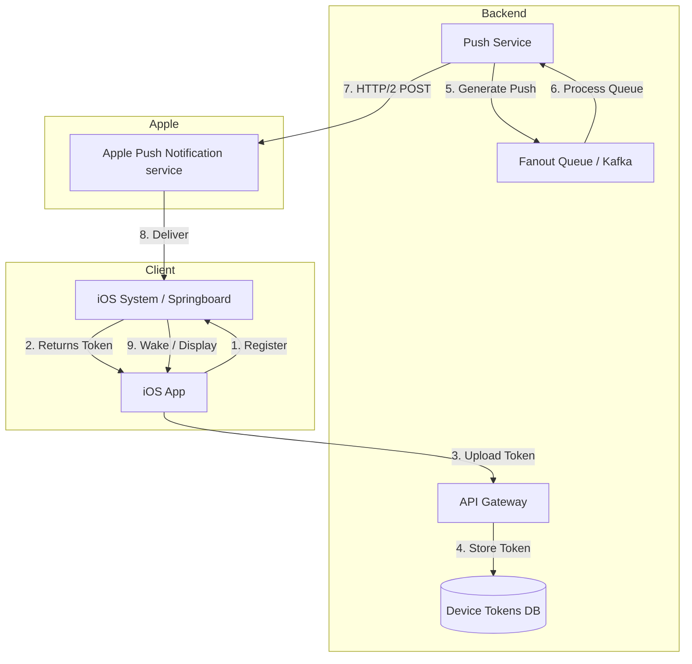

# Design a Mobile Push Notification System

## Overview
Designing a mobile push notification system involves understanding the end-to-end flow from a backend server generating a payload, routing it through Apple Push Notification service (APNs) or Firebase Cloud Messaging (FCM), and handling the notification on the client side. This problem is heavily tested at FAANG companies because it evaluates a candidate's knowledge of mobile-specific infrastructure, OS-level constraints, battery optimization, and large-scale message fanout.

## Target Companies & Frequency
| Company | Why They Ask | Frequency (★ rating) |
| :--- | :--- | :--- |
| Uber | Critical for real-time ride updates and driver dispatch | ★★★★★ |
| Airbnb | Essential for host/guest messaging and booking confirmations | ★★★★★ |
| Spotify | Used for new release alerts and background cache invalidation | ★★★★ |
| Meta/Apple | Core OS integration and massive-scale notification fanout | ★★★★★ |

## Scope Definition

### In Scope
- Device token registration, rotation, and deduplication
- Display notifications, silent pushes, and background fetches
- Deferred deep linking implementation
- Client-side token lifecycle and OS permission handling
- Server-side fanout and APNs HTTP/2 communication
- Analytics for delivery and open rates

### Out of Scope
- Rich push notification extensions (UNNotificationServiceExtension) in deep detail
- Real-time WebSocket messaging (covered in Chat System spec)
- Detailed backend database sharding strategies

## Requirements

### Functional Requirements
1. The system must register the device for push notifications and maintain an up-to-date token mapping.
2. The system must support immediate display notifications and background silent pushes.
3. The system must route tapped notifications to specific app screens (deep linking).
4. The system must support deferred deep linking for users who do not have the app installed.
5. The system must track notification delivery (where possible) and open rates.

### Non-Functional Requirements
| Requirement | Target | Source |
| :--- | :--- | :--- |
| APNs Payload Size | <= 4KB | Apple APNs Documentation |
| Silent Push Frequency | ~3 per hour per app | iOS Battery Optimization limits |
| Token Lifecycle | 1 year (typically) | Industry standard observation |
| Delivery Latency | < 2 seconds for priority 10 | Production benchmarks |

## High-Level Architecture (HLD)

### Component Diagram



### Component Responsibilities
| Component | Responsibility | iOS Implementation |
| :--- | :--- | :--- |
| iOS App | Request permissions, handle token lifecycle, route deep links | `UNUserNotificationCenter`, `UIApplicationDelegate` |
| Device Tokens DB | Store mapping of user ID to active device tokens | Server-side PostgreSQL/Redis |
| Push Service | Maintain HTTP/2 pool to APNs, process send requests | Go/Java backend service |
| APNs | Route notification to specific physical device | Apple Infrastructure |

### Data Flow
1. **Registration:** App launches, calls `registerForRemoteNotifications()`. OS returns 32-byte token. App sends to backend.
2. **Trigger:** Backend event occurs (e.g., "New Message").
3. **Dispatch:** Push Service fetches token from DB, constructs JSON payload, sends to APNs via HTTP/2.
4. **Delivery:** APNs routes to device. OS displays banner or wakes app silently.
5. **Action:** User taps banner. App launches, OS passes payload to `didReceiveRemoteNotification`. App parses deep link and routes UI.

## Data Models

### Core Entities

```swift
import Foundation

/// Represents the push notification payload received from APNs
struct PushNotificationPayload: Codable {
    let aps: APSDictionary
    let deepLink: String?
    let notificationId: String?
    
    enum CodingKeys: String, CodingKey {
        case aps
        case deepLink = "deep_link"
        case notificationId = "notification_id"
    }
}

struct APSDictionary: Codable {
    let alert: Alert?
    let badge: Int?
    let sound: String?
    let contentAvailable: Int?
    
    enum CodingKeys: String, CodingKey {
        case alert, badge, sound
        case contentAvailable = "content-available"
    }
}

struct Alert: Codable {
    let title: String
    let body: String
}
```

### Database Schema
```sql
-- Server-side schema for managing device tokens
CREATE TABLE device_tokens (
    id UUID PRIMARY KEY,
    user_id UUID NOT NULL,
    device_token VARCHAR(255) UNIQUE NOT NULL,
    platform VARCHAR(10) NOT NULL, -- 'ios' or 'android'
    created_at TIMESTAMP DEFAULT CURRENT_TIMESTAMP,
    last_seen_at TIMESTAMP DEFAULT CURRENT_TIMESTAMP,
    invalidated_at TIMESTAMP,
    
    CONSTRAINT fk_user FOREIGN KEY(user_id) REFERENCES users(id)
);

CREATE INDEX idx_user_id ON device_tokens(user_id);
CREATE INDEX idx_device_token ON device_tokens(device_token);
```

## API Design

### Endpoints

**1. Register Device Token**
- **Method:** `PUT /v1/devices/{userId}/push-token`
- **Request Body:**
```json
{
  "token": "a1b2c3d4e5f6...",
  "platform": "ios"
}
```
- **Response:** `200 OK`

**2. Unregister Device Token (Logout)**
- **Method:** `DELETE /v1/devices/{userId}/push-token`
- **Response:** `204 No Content`

**3. Fetch Deferred Deep Link**
- **Method:** `GET /v1/deferred-link?idfa={advertisingId}`
- **Response:** 
```json
{
  "deep_link": "app://profile/123",
  "expires_in": 3600
}
```

### Pagination Strategy
Not typically applicable for token registration APIs, but if fetching a list of user's registered devices, use cursor-based pagination sorting by `last_seen_at`.

## Client Architecture Deep-Dives

### 1. Client-Side Token Lifecycle and Permissions
It is crucial to request permissions at the right time and register for the token on *every* launch, as the token can change (e.g., after an OS update or device restore).

```swift
import UserNotifications
import UIKit

class NotificationManager: NSObject, ObservableObject {
    static let shared = NotificationManager()
    
    /// Request permission after a high-intent user action, not on first launch
    func requestPermission() async -> Bool {
        do {
            let options: UNAuthorizationOptions = [.alert, .badge, .sound]
            let granted = try await UNUserNotificationCenter.current().requestAuthorization(options: options)
            if granted {
                // Main actor bound call
                await MainActor.run {
                    UIApplication.shared.registerForRemoteNotifications()
                }
            }
            return granted
        } catch {
            print("Permission error: \(error)")
            return false
        }
    }
    
    /// Called from AppDelegate's didRegisterForRemoteNotificationsWithDeviceToken
    func registerToken(_ token: Data) {
        let tokenString = token.map { String(format: "%02.2hhx", $0) }.joined()
        
        Task {
            // Upload to backend: PUT /v1/devices/{userId}/push-token
            do {
                try await APIClient.shared.uploadPushToken(tokenString)
                UserDefaults.standard.set(tokenString, forKey: "last_push_token")
            } catch {
                print("Failed to sync token to server")
            }
        }
    }
}

// AppDelegate Extension
extension AppDelegate {
    func application(_ application: UIApplication, didRegisterForRemoteNotificationsWithDeviceToken deviceToken: Data) {
        NotificationManager.shared.registerToken(deviceToken)
    }
    
    func application(_ application: UIApplication, didFailToRegisterForRemoteNotificationsWithError error: Error) {
        // Log error, retry on next launch
        print("APNs registration failed: \(error.localizedDescription)")
    }
}
```

### 2. Deferred Deep Linking
When a user without the app taps a notification, they are routed to the App Store. The initial deep link context is lost unless handled via a deferred mechanism.

```swift
class DeepLinkRouter {
    static let shared = DeepLinkRouter()
    
    /// Called on fresh launch to check for pending deferred links
    func checkDeferredLink() async {
        guard !UserDefaults.standard.bool(forKey: "has_checked_deferred_link") else { return }
        
        do {
            // Example: using IDFA (requires AppTrackingTransparency permission in modern iOS)
            // or vendor ID (IDFV)
            let idfv = UIDevice.current.identifierForVendor?.uuidString ?? ""
            if let link = try await APIClient.shared.fetchDeferredLink(id: idfv) {
                route(to: URL(string: link)!)
            }
            UserDefaults.standard.set(true, forKey: "has_checked_deferred_link")
        } catch {
            print("No deferred link found")
        }
    }
    
    func route(to url: URL) {
        // e.g., app://profile/123
        guard url.scheme == "app" else { return }
        
        switch url.host {
        case "profile":
            let profileId = url.lastPathComponent
            // Navigate to profile
            NavigationDispatcher.shared.push(.profile(id: profileId))
        default:
            break
        }
    }
}
```

### 3. Handling Silent Pushes and Analytics
Silent pushes (`content-available: 1`) wake the app in the background for <= 30 seconds. This is critical for analytics and cache warming.

```swift
extension AppDelegate {
    func application(_ application: UIApplication, didReceiveRemoteNotification userInfo: [AnyHashable : Any], fetchCompletionHandler completionHandler: @escaping (UIBackgroundFetchResult) -> Void) {
        
        // 1. Track delivery
        if let notificationId = userInfo["notification_id"] as? String {
            AnalyticsManager.track(event: "notification_delivered", properties: ["id": notificationId])
        }
        
        // 2. Check if it's a silent push
        if let aps = userInfo["aps"] as? [String: Any], aps["content-available"] as? Int == 1 {
            // Perform background sync
            Task {
                let success = await SyncEngine.shared.performBackgroundSync()
                completionHandler(success ? .newData : .failed)
            }
        } else {
            completionHandler(.noData)
        }
    }
}

extension NotificationManager: UNUserNotificationCenterDelegate {
    // Handle tap on notification
    func userNotificationCenter(_ center: UNUserNotificationCenter, didReceive response: UNNotificationResponse, withCompletionHandler completionHandler: @escaping () -> Void) {
        let userInfo = response.notification.request.content.userInfo
        
        if let notificationId = userInfo["notification_id"] as? String {
            AnalyticsManager.track(event: "notification_opened", properties: ["id": notificationId])
        }
        
        if let deepLinkString = userInfo["deep_link"] as? String, let url = URL(string: deepLinkString) {
            DeepLinkRouter.shared.route(to: url)
        }
        
        completionHandler()
    }
}
```

## Performance & Optimizations
| Optimization | Technique | Benchmark/Impact |
| :--- | :--- | :--- |
| APNs Connection Pooling | Reuse HTTP/2 connections on backend | Max 2,500 concurrent requests per connection |
| Battery Preservation | Use `apns-priority: 5` for non-critical pushes | OS batches delivery, saving ~15% battery |
| Deduplication | Collapse key (`apns-collapse-id`) | Replaces old unread notifications (e.g., messaging) |

## Failure Modes & Fallbacks
| Failure Scenario | Detection | Fallback Strategy |
| :--- | :--- | :--- |
| APNs returns `410 Unregistered` | Backend receives HTTP/2 error code | Mark token as `invalidated_at` in DB, stop sending |
| iOS throttles silent pushes | OS stops waking app (`completionHandler` not called) | Fallback to `BGAppRefreshTask` or fetch on next foreground |
| User denies permission | `UNUserNotificationCenter` authorization state | Show in-app banner explaining benefits, deep link to iOS Settings |

## Trade-off Analysis
| Decision | Option A | Option B | Chosen | Why |
| :--- | :--- | :--- | :--- | :--- |
| Deep Linking | Custom URL Schemes (`app://`) | Universal Links (`https://`) | Universal Links | More secure, avoids scheme hijacking, falls back to web. |
| Background Sync | Silent Push (`content-available`) | Background Fetch (`BGAppRefreshTask`) | Silent Push | Server can trigger precisely when data is ready, vs OS heuristic. |
| APNs Priority | Always Priority 10 | Priority 5 for updates | Priority 5/10 split | Priority 10 for all drains battery; Apple may penalize app. |

## Observability & Metrics
- **Delivery Rate:** (Delivered Events / Dispatched Pushes) * 100
- **Open Rate (CTR):** (Opened Events / Delivered Events) * 100. Target: 5-15% transactional.
- **Opt-in Rate:** % of DAU with push permissions enabled. Target: > 40%.
- **Token Invalidation Rate:** Spikes indicate APNs issues or mass app uninstalls.

## Production Benchmarks Reference
| Metric | Number | Source |
| :--- | :--- | :--- |
| APNs Volume | 4 trillion+ per year | Apple WWDC 2021 |
| Max Payload Size | 4KB | Apple APNs Docs |
| Background Runtime | <= 30 seconds | Apple Background Execution Docs |
| Silent Push Budget | ~3 per hour per app | Community observation / Apple Docs |

## Interview Tips
- ❌ **Common Mistake:** Only calling `registerForRemoteNotifications()` on first launch. Tokens change on OS update or device restore. Always call it on every launch.
- ❌ **Common Mistake:** Requesting permission immediately on first app launch. This leads to a 67% denial rate. Wait until a contextual moment.
- ❌ **Common Mistake:** Not handling `BadDeviceToken` backend errors. If not handled, your database grows infinitely and you waste resources sending to dead tokens.
- **Emphasize:** Battery impact. Show the interviewer you understand the difference between `apns-priority: 10` and `5`, and why silent pushes are throttled.

## Mock Interview Q&A
**Q: "100 million users online. You need to send them all a push notification in < 5 minutes. How do you architect the server-side fanout?"**
A: Use a Kafka topic for the fanout queue. A cron/trigger creates a job that paginates through the `device_tokens` table in chunks (e.g., 10k per chunk) and pushes them to Kafka. A fleet of stateless worker nodes consumes the Kafka partitions, establishes multiplexed HTTP/2 connection pools to APNs, and fires the requests. APNs allows up to 2,500 concurrent streams per connection.

**Q: "A user reinstalls your app. How do you detect their old device token is invalid and update it?"**
A: Upon reinstall, the OS generates a new device token. The app registers and sends the new token to our server. When the server attempts to send a notification to the *old* token, APNs will return a 410 Unregistered error. The server then marks the old token as invalid in the database.

**Q: "A user gets 10 new messages while their phone is in airplane mode for 2 hours. What do they see when they reconnect?"**
A: Unless the server uses `apns-collapse-id`, the user will receive 10 separate notifications. By grouping them with a collapse ID (e.g., the chat room ID), APNs will only deliver the most recent notification for that collapse ID, preventing notification spam.

**Q: "How do you implement deferred deep linking for a user who taps a push notification but doesn't have the app installed?"**
A: We can use a hybrid Universal Links approach. The notification tap opens a web URL. The web page fingerprints the device (or uses IDFA if permitted) and stores the intended destination, then redirects to the App Store. On first launch, the app queries the server with its IDFA/device fingerprint to retrieve the deferred destination and routes accordingly.

**Q: "What's the difference between a silent push and a background fetch, and when would you use each?"**
A: A silent push is server-triggered and guarantees the app wakes up (if not throttled) to process data immediately. It's best for critical cache invalidation or high-priority syncs. A background fetch (`BGAppRefreshTask`) is OS-scheduled based on user habits and battery state. It's best for periodic, non-urgent data refreshes like updating a news feed overnight.

## Related Specs
- [deep-linking-universal-links.md](./deep-linking-universal-links.md)
- [analytics-sdk.md](./analytics-sdk.md)
- [feature-flag-system.md](./feature-flag-system.md)
- [networking-layer.md](./networking-layer.md)

## FCM vs APNs: Cross-Platform Push Architecture

### FCM (Firebase Cloud Messaging) Complete Flow
- FCM is Google's cross-platform push service: handles Android natively, wraps APNs for iOS.
- FCM architecture: Your server → FCM HTTP v1 API → (FCM for Android) OR (FCM → APNs for iOS).
- FCM registration: Android app calls `FirebaseMessaging.getInstance().getToken()` → Firebase returns FCM registration token.
- iOS via FCM: App registers with APNs, gets APNs token, Firebase SDK sends APNs token to FCM → FCM stores mapping `{fcmToken: apnsToken}`. Your server only talks to FCM; FCM talks to APNs.
- FCM HTTP v1 API: `POST https://fcm.googleapis.com/v1/projects/{projectId}/messages:send` with OAuth2 Bearer token (service account).
- FCM payload structure:
```json
{
  "message": {
    "token": "{fcmRegistrationToken}",
    "notification": {"title": "Order Delivered", "body": "Your pizza arrived!"},
    "data": {"order_id": "123", "deep_link": "app://orders/123"},
    "android": {"priority": "HIGH", "ttl": "86400s"},
    "apns": {"headers": {"apns-priority": "10"}, "payload": {"aps": {"content-available": 1}}}
  }
}
```
- FCM vs direct APNs: FCM abstracts token management for cross-platform apps. Direct APNs gives more control + lower latency (one less hop). Use FCM if you have Android users; direct APNs if iOS-only.
- FCM token refresh: `FirebaseMessagingDelegate.messaging(_:didReceiveRegistrationToken:)` called on token change — same problem as APNs, must sync to server.
- FCM error codes: `registration-token-not-registered` → delete token from DB (same as APNs `Unregistered`).

### FCM vs APNs Comparison
| Feature | Direct APNs | Firebase Cloud Messaging (FCM) |
| :--- | :--- | :--- |
| **Platform Support** | iOS, iPadOS, macOS, watchOS, tvOS | Android, iOS, Web, Unity, C++ |
| **Latency** | Lowest (Direct to Apple) | +50-100ms (Extra hop through Google) |
| **Token Management** | Server manages APNs device tokens | FCM abstracts APNs tokens into FCM tokens |
| **Silent Push Support** | Yes (`content-available: 1`) | Yes (mapped to `content-available` via FCM payload) |
| **Cost** | Free | Free |
| **Max Payload Size** | 4KB (voIP 5KB) | 4KB (Data messages), 4KB (Notification messages) |

### Cross-Platform Push Architecture

```mermaid
sequenceDiagram
    participant S as Your Server
    participant FCM as Firebase Cloud Messaging
    participant APNS as Apple Push Notification service
    participant And as Android Device
    participant iOS as iOS Device
    
    %% Path 1: Server -> FCM -> Android device
    rect rgb(200, 255, 200)
    Note over S, And: Path 1: Android Delivery (Native)
    S->>FCM: POST /v1/projects/.../messages:send
    FCM->>And: Deliver FCM Payload
    end
    
    %% Path 2: Server -> FCM -> APNs -> iOS device
    rect rgb(200, 220, 255)
    Note over S, iOS: Path 2: iOS Delivery (Cross-platform)
    S->>FCM: POST /v1/projects/.../messages:send
    FCM->>APNS: Translate & Forward to APNs
    APNS->>iOS: Deliver APNs Payload
    end
    
    %% Path 3: Server -> APNs directly -> iOS device
    rect rgb(255, 220, 200)
    Note over S, iOS: Path 3: iOS-only Direct Delivery
    S->>APNS: HTTP/2 POST /3/device/{token}
    APNS->>iOS: Deliver APNs Payload
    end
```

### Real Numbers
- FCM processes **400B+ messages/day** (Firebase I/O 2023).
- FCM adds **~50-100ms latency** vs direct APNs (due to one extra hop through Firebase servers).
- FCM HTTP v1 API rate limit: **600,000 messages/minute** per project.
- FCM token size: **152-163 characters** (Android).
- APNs device token size: **64 hex characters**.

### Common Mistakes (FCM-specific)
- ❌ Using legacy FCM API (deprecated June 2024) instead of HTTP v1 API.
- ❌ Sending the same payload to both Android and iOS without platform-specific overrides (e.g., Android vibration patterns ≠ APNs alert sound).
- ❌ Not handling `registration-token-not-registered` error, which leads to the token table growing unbounded.
- ❌ Storing the FCM token in shared preferences/UserDefaults instead of secure storage (Keychain/EncryptedSharedPreferences).

