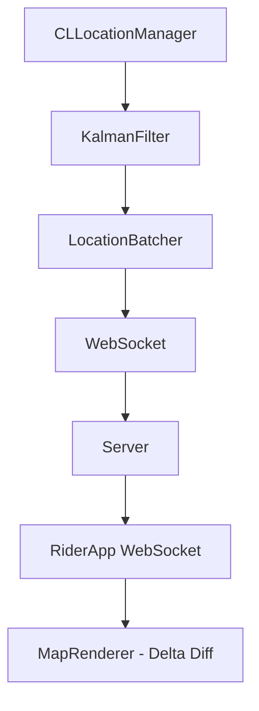

# Real-Time Geospatial Tracking & Ride Tracking (Uber / Lyft / DoorDash)

> Reference status: client architecture study material. Embedded code and payloads are incomplete design sketches, not verified production implementations or records from the named products. Do not quote remaining numeric tuning choices as employer benchmarks. For backend preparation, start with the [backend guide](backend-engineering-manager-guide.md) and [evidence standard](evidence-and-sources.md).


## Overview
Designing a system for real-time location tracking involves capturing high-frequency GPS data on a provider app (driver), transmitting it efficiently, and smoothly rendering it on a consumer app (rider). It tests hardware API knowledge (CoreLocation), battery optimization, noisy data filtering, and real-time networking.

## Scope Definition

### In Scope
- Driver app: GPS capture, noise filtering, efficient transmission.
- Rider app: Real-time map rendering, car animation, route interpolation.
- Network transport (WebSockets / Server-Sent Events).
- Battery and thermal management.
- Offline/Network failure caching.

### Out of Scope
- Ride matching algorithms (dispatch).
- Payment processing.
- Routing engine (Google Maps API backend).

## Requirements

### Functional Requirements
1. Driver app transmits location every few seconds.
2. Rider app shows car moving smoothly on a map.
3. System calculates and updates ETA.
4. Must handle GPS dead zones (tunnels, rural areas).

### Non-Functional Requirements

Define and measure these dimensions for the actual workload; values require evidence under [the evidence standard](evidence-and-sources.md):

- Transmission Frequency
- Location Accuracy
- Battery Consumption
- Render Framerate


## Worked learning walkthrough: The latest arrival is not the latest position

**Failure drill:** A driver reconnects and uploads older queued location points after a fresh one. This is a proposed design walkthrough.

1. Attach source/session sequence, capture time and accuracy to observations. Preserve authorized trip association and define accepted ordering.
2. Keep historical track ingestion separate from the current-position projection. Older accepted history must not regress the live marker.
3. Show position age and uncertainty; bound interpolation/extrapolation. Tune capture and upload against observed energy, timeliness and quality.

**Why the obvious answer breaks:** Animating stale points smoothly can make an inaccurate location look trustworthy. A filter does not guarantee a fixed error reduction in every environment.

**Answer to rehearse:**

> I would separate historical telemetry, current location and ETA. HTTP can reuse connections, so transport choice needs actual energy/latency evidence rather than assuming every POST pays a new handshake.

## High-Level Architecture (HLD)

### Component Diagram
```text
[Driver App]                              [Rider App]
    │                                         │
    ├─► CoreLocation Manager                  ├─► MapKit / UI Layer
    ├─► Kalman Filter (Noise reduction)       ├─► Animation Engine (Interpolator)
    ├─► Location Batcher                      ├─► WebSocketManager
    ├─► WebSocketManager                      └─► Local Cache
    │                                         
    ▼                                         ▼
[ API Gateway / Load Balancer (Envoy) ] ◄─────┘
    │
    ├─► WebSocket Connection Handlers (Go)
    ├─► Pub/Sub Message Bus (Kafka)
    ├─► ETA / Routing Service
    └─► Geospatial DB (PostGIS / Redis Geo)
```

### Component Responsibilities
| Component | Responsibility | iOS Implementation |
|-----------|----------------|--------------------|
| LocationTracker | Interfaces with OS, requests permissions. | `CLLocationManager` |
| KalmanFilter | Smooths GPS jitter before network send. | Swift math logic |
| LocationBatcher | Groups coordinates to reduce HTTP/WS overhead. | Swift Queue |
| MapViewController | Renders map, polylines, and car annotations. | `MKMapView` / MapKit |
| TripViewModel | Manages state machine (waiting, active, complete). | `ObservableObject` |

### Data Flow
1. **Capture**: OS wakes driver app, provides raw `CLLocation`.
2. **Process**: Filter applies logic (drop inaccurate points, Kalman smooth).
3. **Transmit**: Location appended to batch. Sent via WS every 4s.
4. **Broadcast**: Backend receives, saves to Redis, pushes to Kafka topic.
5. **Consume**: Rider app WS receives location payload.
6. **Render**: Rider app interpolates car from old coordinate to new coordinate over 4 seconds.

## Data Models

### Core Entities
```swift
import Foundation
import CoreLocation

struct TripLocation: Codable, Equatable {
    let latitude: Double
    let longitude: Double
    let accuracy: Double
    let speed: Double
    let heading: Double
    let timestamp: TimeInterval
}

struct TripState: Codable {
    let tripId: String
    let status: String // "en_route", "arrived", "in_progress"
    let estimatedTimeOfArrival: TimeInterval
    let remainingDistanceMeters: Double
}
```

## API Design

### Endpoints

**1. WebSocket Connection (Driver & Rider)**
- **URL**: `wss://realtime.example.com/v2/trips/{tripId}`
- **Payload (Driver -> Server)**:
```json
{
  "type": "location_batch",
  "locations": [
    {
      "lat": 37.7749,
      "lng": -122.4194,
      "accuracy": 5.0,
      "heading": 90.0,
      "timestamp": 1690000000
    }
  ]
}
```
- **Payload (Server -> Rider)**:
```json
{
  "type": "driver_update",
  "location": { "lat": 37.7749, "lng": -122.4194, "heading": 90.0 },
  "eta_seconds": 320
}
```

## Client Architecture Deep-Dives

### 1. Driver Side: CoreLocation & Battery Management
CoreLocation is heavily optimized, but poor configuration kills batteries. We use `distanceFilter` and monitor `ProcessInfo` for low power mode.

```swift
import CoreLocation
import Foundation

class LocationTracker: NSObject, CLLocationManagerDelegate {
    private let manager = CLLocationManager()
    private var isLowPowerMode: Bool { ProcessInfo.processInfo.isLowPowerModeEnabled }
    
    override init() {
        super.init()
        manager.delegate = self
        manager.allowsBackgroundLocationUpdates = true
        manager.pausesLocationUpdatesAutomatically = false
        
        configureAccuracy()
        
        NotificationCenter.default.addObserver(self, selector: #selector(powerModeChanged), name: .NSProcessInfoPowerStateDidChange, object: nil)
    }
    
    @objc private func powerModeChanged() {
        configureAccuracy()
    }
    
    private func configureAccuracy() {
        if isLowPowerMode {
            // Battery saving
            manager.desiredAccuracy = kCLLocationAccuracyHundredMeters
            manager.distanceFilter = 50 // meters
        } else {
            // High fidelity for driving
            manager.desiredAccuracy = kCLLocationAccuracyBestForNavigation
            manager.distanceFilter = 10 // meters
        }
    }
    
    func locationManager(_ manager: CLLocationManager, didUpdateLocations locations: [CLLocation]) {
        guard let latest = locations.last, latest.horizontalAccuracy < 20 else { return }
        // Filter out bad accuracy points (e.g., cell tower triangulation)
        
        // 1. Pass to Kalman Filter
        // 2. Batch and transmit
    }
}
```

### 2. Driver Side: GPS Smoothing (Kalman Filter Concept)
Raw GPS jumps around. A Kalman filter uses the driver's speed and heading to predict where they should be, and merges it with the raw GPS coordinate to produce a smoothed result. Its accuracy depends on sensor quality, motion model and environment; no fixed improvement is assumed. *Note: Full matrix math is usually abstracted in interviews, but knowing the concept is a strong signal.*

### 3. Rider Side: Smooth Map Animation & Interpolation
If we receive an update every 4 seconds, simply setting the car annotation's coordinate makes it "teleport". We must interpolate the movement.

```swift
import MapKit

class DriverAnnotation: MKPointAnnotation {}

class MapViewController: UIViewController {
    var mapView = MKMapView()
    var driverMarker = DriverAnnotation()
    
    func updateDriverLocation(to newLocation: CLLocationCoordinate2D, heading: CLLocationDirection) {
        // CoreAnimation to smoothly slide the marker over 4 seconds
        UIView.animate(withDuration: 4.0, delay: 0, options: [.curveLinear, .allowUserInteraction]) {
            self.driverMarker.coordinate = newLocation
        }
        
        // Rotate the marker view to match heading
        if let view = mapView.view(for: driverMarker) {
            UIView.animate(withDuration: 1.0) {
                view.transform = CGAffineTransform(rotationAngle: CGFloat(heading * .pi / 180))
            }
        }
    }
    
    // Polyline updates: Only redraw the delta!
    // Re-rendering a 1000-point polyline takes 16ms+. 
    // Re-rendering just the sliced path in front of the driver is <1ms.
}
```

### 4. WebSocket Reconnection & Jitter
Like the chat app, the WebSocket must use exponential backoff (1s → 2s → 4s → 8s → max 60s) with ±30% jitter to prevent DDOSing the server on reconnects.

## Performance & Optimizations

| Decision | Mechanism | What to verify |
| :--- | :--- | :--- |
| Capture/upload policy | Batch within agreed freshness and history needs | Measure energy, bytes and position age |
| Map updates | Bound route/annotation work | Measure frame hitches and uncertainty display |
| Lifecycle recovery | Use supported location modes and foreground reconcile | Verify state freshness; ordinary sockets cannot run indefinitely in background |

## Failure Modes & Fallbacks
| Failure Scenario | Detection | Fallback Strategy |
|------------------|-----------|-------------------|
| Dead Zone (Driver) | Network offline | Queue GPS points in SQLite. Burst send when reconnected. |
| WS Disconnect (Rider)| Heartbeat fail | Fallback to HTTP Polling (every 5s) for ETAs until WS recovers. |
| GPS Spoofing | Unrealistic speed/jumps | Server-side validation drops points > 200mph or impossible jumps. |

## Trade-off Analysis
| Decision | Option A | Option B | Chosen | Why |
|----------|----------|----------|--------|-----|
| Transport | SSE (Server-Sent Events) | WebSockets | WebSockets | WS is bidirectional, which is perfect for the Driver sending up. SSE is fine for Rider, but WS standardizes stack. |
| Location API | `.nearestTenMeters` | `.bestForNavigation` | `.best` (contextual) | `.bestForNavigation` uses more battery but provides sensor fusion (gyro+accelerometer) for smoother headings. |
| Rider Sync | Pull | Push (WS) | Push | Polling wastes bandwidth and battery on the rider device. |

## Observability & Metrics
- **Location Fix Rate**: Percentage of GPS points with accuracy < 10m.
- **Data Freshness**: Latency between driver timestamp and rider receive timestamp (p99 < 1s).
- **Battery Drain**: Monitored via OS metrics; critical SLA for driver app.

## Measurement and evidence

Use [the evidence standard](evidence-and-sources.md) for published limits and measurement methods. The previous benchmark table lacked traceable support and has been removed. Establish workload, device or server configuration, metric denominator and observation window before setting targets.

## Interview Tips
- **Drive the dual-app narrative**: Explicitly separate your design into "Provider (Driver)" and "Consumer (Rider)". The constraints are completely different.
- **Battery is everything**: The interviewer wants to hear about `distanceFilter`, `desiredAccuracy`, and batching. If you don't mention battery on the driver side, you fail.
- **Interpolation**: Mention that cars shouldn't "teleport" on the map. This shows product-minded UI engineering.

## Architecture Diagram


## Common Mistakes
- No Kalman filter (raw GPS ±15m noise in map).
- Sending every location update over WebSocket without batching (battery drain).
- Using CLLocationManager.startUpdatingLocation without distanceFilter (constant updates).
- Redrawing entire polyline on each update (16ms per update).
- Not handling WebSocket reconnection (trip tracking silently stops).

## Mock Interview Q&A
**Q: A driver goes through a tunnel - no GPS for 60 seconds. What does the rider's app show?**
A: The rider app interpolates based on the last known speed and heading, within a bounded extrapolation policy, then shows stale location/uncertainty rather than presenting unlimited predicted travel as fact. Once out of the tunnel, the app smoothly animates to the new true coordinate over a few seconds to avoid teleporting.

**Q: How do you make location tracking battery-efficient?**
A: On the driver side, we rely heavily on `distanceFilter` to avoid processing micro-movements, batch location updates to reduce radio wake-ups, and dynamically downgrade `desiredAccuracy` if the device enters Low Power Mode.

**Q: How do you handle the WebSocket dropping while the trip is active?**
A: The client instantly starts an exponential backoff reconnect loop. While disconnected, we rely on local queuing for the driver, and HTTP polling for ETA updates for the rider.

**Q: Why not send data over a simple REST API POST every 5 seconds?**
A: HTTP requests can reuse connections. Compare supported transport behavior, wake-ups, batching and recovery using device measurements. WebSocket enables bidirectional sessions but does not guarantee lower energy.

**Q: How do you render 10,000 route points efficiently?**
A: We don't. We slice the polyline array based on the driver's current index and only render the remaining delta. Redrawing the entire path on every 4-second tick will drop frames.

## Related Specs
| Spec | Reason |
|------|--------|
| [Messaging Chat](./messaging-chat.md) | Deep dive into WebSocket lifecycle and background processing. |
