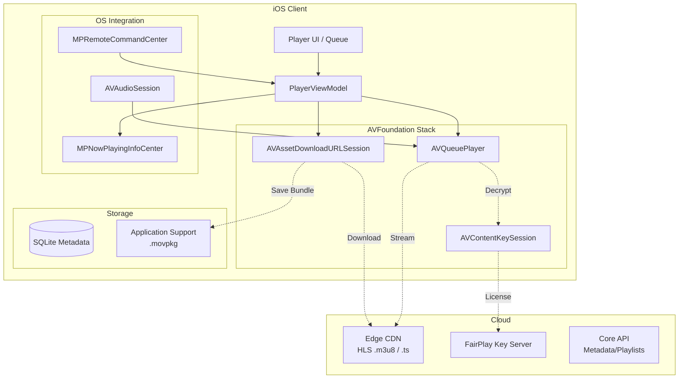

# Design Spotify / Apple Music Audio Player with Offline Mode

## Overview
Designing an audio streaming app like Spotify or Apple Music requires handling uninterrupted background playback, seamless offline DRM (Digital Rights Management) downloads, and gapless transitions between tracks. This problem evaluates a candidate's mastery of the `AVFoundation` framework, OS-level integration (Lock Screen, Control Center), and robust background resource management.

## Target Companies & Frequency
| Company | Why They Ask | Frequency |
| :--- | :--- | :--- |
| Apple | Music / Podcasts / Books teams | ★★★★★ |
| Spotify | Core competency | ★★★★★ |
| Amazon | Amazon Music, Audible | ★★★★☆ |
| Netflix / Disney+ | Video players share similar AVFoundation traits | ★★★☆☆ |

## Scope Definition

### In Scope
- Audio streaming via HLS (HTTP Live Streaming)
- Gapless playback and crossfading
- Offline downloading with FairPlay DRM
- Background audio, Lock Screen, and Control Center integration (MPRemoteCommandCenter)
- Playback queue and playlist state management
- Interruption handling (phone calls, headphone unplug)

### Out of Scope
- Music recommendation algorithms
- Social features (collaborative playlists)
- Complex UI animations (lyrics syncing)
- Audio encoding server architecture

## Requirements

### Functional Requirements
1. Play audio streams seamlessly over network with gapless transitions.
2. Download tracks for offline listening, respecting DRM licensing.
3. Play music in the background while the device is locked.
4. Provide lock screen controls and sync playback state (play/pause/scrub).
5. Pause playback when headphones are disconnected.

### Non-Functional Requirements
| Requirement | Target | Source |
| :--- | :--- | :--- |
| Start Latency | < 500ms (Time to first audio) | Spotify Engineering / HIG |
| Gapless Transition | 0ms | Core Audio |
| Lock Screen Sync | 1s interval | Apple MediaPlayer Docs |
| Concurrent Downloads| Max 3 | Spotify bandwidth heuristics |
| Offline Key Expiry | e.g., 48 hours | FairPlay Streaming constraints |

## High-Level Architecture (HLD)

### Component Diagram



### Component Responsibilities
| Component | Responsibility | iOS Implementation |
| :--- | :--- | :--- |
| **Player Engine** | Streaming, gapless buffering | `AVQueuePlayer` + `AVPlayerItem` |
| **Download Mgr** | Background chunked downloads | `AVAssetDownloadURLSession` |
| **DRM Manager** | FairPlay key acquisition/storage | `AVContentKeySession` |
| **OS Integrator** | Lock screen controls, interrupts | `MediaPlayer`, `AVAudioSession` |
| **Queue State** | Shuffle, repeat, track order | Actor `PlaybackQueue` |

### Data Flow
**Streaming Playback Flow:**
1. User taps "Play" -> `PlaybackQueue` loads track metadata from DB.
2. App fetches HLS `.m3u8` manifest URL from API.
3. `AVQueuePlayer` wraps URL in `AVPlayerItem` and begins buffering.
4. `AVAudioSession` is set to `.playback` and activated.
5. Audio begins playing; `MPNowPlayingInfoCenter` is updated with artwork.
6. When item is 80% complete, `AVQueuePlayer` buffers the next item for gapless play.

## Data Models

### Core Entities
```swift
import Foundation

struct Track: Identifiable, Equatable {
    let id: String
    let title: String
    let artist: String
    let durationMs: Int
    let streamUrl: URL
    
    // Offline status
    var offlineState: DownloadState
    var localAssetPath: String? // Path to .movpkg
}

enum DownloadState {
    case none
    case downloading(progress: Double)
    case downloaded
    case error
}
```

### Database Schema
```sql
CREATE TABLE tracks (
    id TEXT PRIMARY KEY,
    title TEXT NOT NULL,
    artist TEXT NOT NULL,
    duration_ms INTEGER NOT NULL,
    stream_url TEXT,
    local_path TEXT,
    download_state TEXT,
    drm_key_expiry INTEGER
);

CREATE TABLE playlists (
    id TEXT PRIMARY KEY,
    snapshot_id TEXT NOT NULL, -- For delta syncs
    name TEXT
);

CREATE TABLE playlist_tracks (
    playlist_id TEXT,
    track_id TEXT,
    position INTEGER,
    PRIMARY KEY (playlist_id, track_id)
);
```

## API Design

### Endpoints

**1. Fetch Stream Metadata**
- **Method:** `GET /v1/tracks/{id}/stream`
- **Response:**
```json
{
  "hlsUrl": "https://cdn.example.com/audio/123/master.m3u8?token=xyz",
  "licenseUrl": "https://kms.example.com/fairplay/123"
}
```

**2. Playback Heartbeat (Cross-Device Resume)**
- **Method:** `POST /v1/playback/heartbeat`
- **Body:** `{ "trackId": "123", "positionMs": 45000, "deviceId": "ios-abc" }`

## Client Architecture Deep-Dives

### Subsystem 1 — Gapless Playback Engine
To achieve 0ms latency between tracks, you cannot destroy and recreate `AVPlayer`. You must use `AVQueuePlayer`.

```swift
import AVFoundation

class AudioPlayerEngine {
    private let player = AVQueuePlayer()
    private var timeObserverToken: Any?
    
    func play(tracks: [Track]) {
        let items = tracks.map { buildPlayerItem(for: $0) }
        
        // Load initial tracks into queue
        items.prefix(3).forEach { player.insert($0, after: nil) }
        
        player.play()
        setupObservers()
    }
    
    private func buildPlayerItem(for track: Track) -> AVPlayerItem {
        // If downloaded, use local file URL, else use remote HLS URL
        let url = track.offlineState == .downloaded ? URL(fileURLWithPath: track.localAssetPath!) : track.streamUrl
        let asset = AVURLAsset(url: url)
        return AVPlayerItem(asset: asset)
    }
    
    private func setupObservers() {
        // Observe queue advancement for gapless loading
        NotificationCenter.default.addObserver(self, selector: #selector(itemDidFinishPlaying), name: .AVPlayerItemDidPlayToEndTime, object: nil)
    }
    
    @objc private func itemDidFinishPlaying(notification: Notification) {
        // Track finished; AVQueuePlayer automatically starts the next item gaplessly.
        // We now append the next upcoming track to the end of the queue.
        enqueueNextTrack()
    }
}
```

### Subsystem 2 — Offline DRM Downloads
Downloading DRM-protected HLS streams requires a specialized URL session and writing into a specialized bundle format (`.movpkg`). Standard `URLSession` will corrupt DRM assets.

```swift
import AVFoundation

class DownloadManager: NSObject, AVAssetDownloadDelegate {
    private var downloadSession: AVAssetDownloadURLSession!
    
    override init() {
        super.init()
        let config = URLSessionConfiguration.background(withIdentifier: "com.app.audio.downloads")
        downloadSession = AVAssetDownloadURLSession(configuration: config, assetDownloadDelegate: self, delegateQueue: .main)
    }
    
    func startDownload(for track: Track) {
        let asset = AVURLAsset(url: track.streamUrl)
        
        // Must use AVAssetDownloadTask for HLS streams
        guard let task = downloadSession.makeAssetDownloadTask(
            asset: asset,
            assetTitle: track.title,
            assetArtworkData: nil,
            options: [AVAssetDownloadTaskMinimumRequiredMediaBitrateKey: 256000] // 256kbps
        ) else { return }
        
        task.taskDescription = track.id
        task.resume()
    }
    
    // Delegate Callback
    func urlSession(_ session: URLSession, assetDownloadTask: AVAssetDownloadTask, didFinishDownloadingTo location: URL) {
        // Location points to a .movpkg folder in a temporary directory
        // Move it to Application Support (NOT Caches, as OS can purge Caches)
        let destination = getAppSupportDirectory().appendingPathComponent("\(assetDownloadTask.taskDescription!).movpkg")
        try? FileManager.default.moveItem(at: location, to: destination)
        
        // Update DB: track.localAssetPath = destination.path, track.offlineState = .downloaded
    }
}
```

### Subsystem 3 — OS Audio Integrations
A production player must handle lock screen controls and respond to hardware interrupts (like pulling out AirPods).

```swift
import AVFoundation
import MediaPlayer

class OSIntegrationManager {
    init() {
        setupAudioSession()
        setupRemoteCommands()
    }
    
    private func setupAudioSession() {
        let session = AVAudioSession.sharedInstance()
        do {
            // .playback allows playing silently/in background. .default mode is standard for music.
            try session.setCategory(.playback, mode: .default)
            try session.setActive(true)
            
            // Observe headphone unplug
            NotificationCenter.default.addObserver(self, selector: #selector(handleRouteChange), name: AVAudioSession.routeChangeNotification, object: nil)
        } catch {
            print("Audio session setup failed")
        }
    }
    
    @objc private func handleRouteChange(notification: Notification) {
        guard let userInfo = notification.userInfo,
              let reasonValue = userInfo[AVAudioSessionRouteChangeReasonKey] as? UInt,
              let reason = AVAudioSession.RouteChangeReason(rawValue: reasonValue) else { return }
        
        // Pause playback if headphones were removed
        if reason == .oldDeviceUnavailable {
            AudioPlayerEngine.shared.pause()
        }
    }
    
    private func setupRemoteCommands() {
        let center = MPRemoteCommandCenter.shared()
        center.playCommand.addTarget { _ in
            AudioPlayerEngine.shared.play()
            return .success
        }
        center.pauseCommand.addTarget { _ in
            AudioPlayerEngine.shared.pause()
            return .success
        }
    }
    
    func updateNowPlaying(track: Track, currentTime: TimeInterval) {
        var info = [String: Any]()
        info[MPMediaItemPropertyTitle] = track.title
        info[MPMediaItemPropertyArtist] = track.artist
        info[MPNowPlayingInfoPropertyElapsedPlaybackTime] = currentTime
        info[MPMediaItemPropertyPlaybackDuration] = Double(track.durationMs) / 1000.0
        
        MPNowPlayingInfoCenter.default().nowPlayingInfo = info
    }
}
```

## Performance & Optimizations
| Optimization | Technique | Benchmark/Impact |
| :--- | :--- | :--- |
| **Gapless** | `AVQueuePlayer` pre-buffering | 0ms latency between tracks (vs 500ms+ for `AVPlayer` recreation) |
| **App Storage** | Save `.movpkg` to Application Support | Prevents OS from randomly deleting downloaded tracks on low disk space |
| **Artwork Caching** | `NSCache` for UIImage + `MPMediaItemArtwork` | Avoids Lock Screen flicker and network spikes on track change |
| **Bandwidth** | Limit concurrent downloads to 3 | Prevents TCP congestion, ensures current streaming track doesn't stutter |

## Failure Modes & Fallbacks
| Failure Scenario | Detection | Fallback Strategy |
| :--- | :--- | :--- |
| **DRM Key Expiry** | Offline play fails with AVError | Delete local key, prompt user to go online briefly to re-authenticate with KMS. |
| **Headphone Unplug** | `AVAudioSession.routeChangeNotification` | Pause playback immediately. Do not auto-resume on re-plug unless explicitly built. |
| **Network Loss Mid-Stream** | AVPlayerItem stalls | Fallback to next track if it happens to be offline, or surface network UI. |
| **Background Download Killed** | App terminated by OS | Background `URLSession` wakes app when download completes; reconcile state via `task.taskDescription`. |

## Trade-off Analysis
| Decision | Option A | Option B | Chosen | Why |
| :--- | :--- | :--- | :--- | :--- |
| **Player Engine** | Multiple `AVPlayer` instances | Single `AVQueuePlayer` | **Option B** | Creating multiple players spikes memory. AVQueuePlayer is explicitly built for memory-efficient gapless lists. |
| **Offline Storage** | `/Caches` Directory | `/Application Support` | **Option B** | OS will purge Caches if disk is low. Users pay for offline music; silent deletion is unacceptable. |
| **Crossfade** | `AVAudioMix` | Two `AVPlayer` instances | **Option B** | Though memory heavier, manipulating volume curves dynamically across two overlapping players provides finer control than static `AVAudioMix` parameters. |

## Observability & Metrics
- **Playback Start Time**: Target < 500ms.
- **Stall Rate**: % of tracks that stop to buffer. Target < 1%.
- **Download Success Rate**: Track chunk failures and DRM key acquisition failures.
- **Background Suspension Rate**: How often iOS kills the app while playing (usually memory-related).

## Production Benchmarks Reference
| Metric | Real World Number | Source |
| :--- | :--- | :--- |
| Max Concurrent Downloads | 3 | Spotify bandwidth architecture |
| Audio Bitrates | 24kbps - 320kbps | Spotify Quality Settings |
| DRM Key Expiry | ~48-72 hours | Apple FairPlay Streaming |
| Audio Segment Size | ~10 seconds | HLS Audio Guidelines |

## Interview Tips
- **Know `AVAssetDownloadURLSession`.** If you suggest standard `URLSession` for DRM/HLS downloads, you will fail the iOS domain portion.
- **Understand Audio Session Interruptions.** Mentioning `.oldDeviceUnavailable` (headphone unplug) is a huge positive signal to interviewers at Apple.
- **Explain `.movpkg`.** Mention that HLS downloads are stored as a bundle, not a simple `.mp3` file, and require `AVURLAsset` to read locally.
- **Mention App Storage Paths.** Caches vs Application Support is a classic iOS trivia question disguised as architecture.
