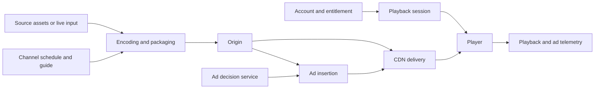
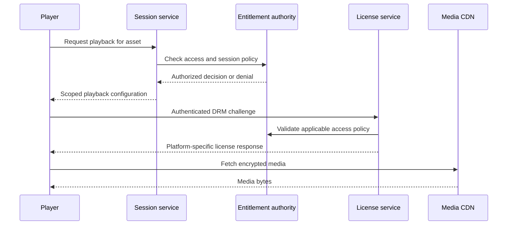

# Streaming Business Models and Architecture: FAST, SVOD, AVOD and TVOD

Connect the revenue model to entitlement, media delivery, advertising, measurement and operations. Definitions are sourced below; architecture questions and exercises are preparation advice, not claims about a company's internal implementation. Sources reviewed on 4 October 2026.

## Read by preparation need

| Need | Jump to |
| :--- | :--- |
| Business models | [FAST, SVOD, AVOD and TVOD](#1-separate-monetization-from-viewing-behavior) |
| Protected playback | [DRM licensing walkthrough](#8-drm-licensing-media-access-is-not-key-access) |
| Advertising evidence | [Ad measurement walkthrough](#9-ad-measurement-insertion-delivery-and-viewing-differ) |
| Delayed live video | [Live latency walkthrough](#10-live-latency-find-the-delay-before-changing-the-player) |
| Delivery outage | [CDN failover walkthrough](#11-cdn-failover-origin-failover-and-multi-cdn-steering-differ) |
| Paid access denied | [Entitlement walkthrough](#12-entitlement-payment-access-and-active-playback-have-different-state) |
| Complete app response | [Join the failure paths](#13-put-all-five-failure-paths-into-one-app-answer) |

For the fundamentals behind these decisions, follow the [backend interview track](backend-interview-track.md).

## 1. Separate monetization from viewing behavior

| Term | Meaning | Design questions to practice |
| :--- | :--- | :--- |
| SVOD | Subscription video on demand | Subscription lifecycle, entitlement, cancellation, restore purchases and concurrent-session policy |
| AVOD | Advertising-supported video on demand | Ad decisions, breaks, consent, measurement and playback continuity |
| TVOD | Transactional video on demand, such as title rental or purchase | Payment reconciliation, rights windows, entitlement and expiry |
| FAST | Free ad-supported streaming television, commonly delivered as scheduled linear channels | Channel schedules, guide data, playout, ad breaks and live continuity |
| Hybrid | A product combines subscription, advertising or transactional access | Tier-specific access, advertising policy, upgrades and consistent rights enforcement |

For VOD monetization definitions, see [Amazon Ads](https://advertising.amazon.com/library/guides/avod-svod-tvod-video-on-demand). For scheduled FAST channel construction, see [AWS virtual linear channels](https://aws.amazon.com/blogs/media/deploying-virtual-linear-ott-channels-using-aws-media-services/).

VOD means viewers select when to start an asset. Linear channels follow a schedule. Live refers to media produced and delivered as the event happens. A linear channel can include prerecorded content. A subscription alone does not specify whether ads are present; state the product's actual tier policy. Advertising and access policy are separate design dimensions.

## 2. End-to-end architecture

This is a conceptual map. Choose actual boundaries from the requirements; ad insertion placement depends on the approach. Separate media delivery from session authorization and configuration. A segment request need not invoke every control-plane service.

The [CloudFront streaming guide](https://docs.aws.amazon.com/AmazonCloudFront/latest/DeveloperGuide/on-demand-streaming-video.html) describes encoding, packaging and delivery. [MediaTailor](https://docs.aws.amazon.com/mediatailor/latest/ug/what-is.html) documents ad insertion and channel assembly capabilities.

## 3. FAST: channel operations and program continuity

Practice a channel model containing program identity, scheduled start and end, asset version, rights, ad opportunities and publication version. Define which time source and schedule revision control playout. Explain how guide metadata stays aligned with the delivered channel.

Prepare for schedule gaps, asset unavailability, encoder failure, regional rights differences and stale guide data. Define permitted filler content and recovery rather than promising uninterrupted playback. Decide whether start-over and catch-up are supported; these introduce additional rights and timeline semantics.

**Interview drill:** a prerecorded program is unavailable as its scheduled slot begins. Explain detection, replacement, guide correction, ad behavior and customer impact. Then explain who owns channel operations during the incident.

## 4. SVOD and TVOD: entitlement correctness

Model subscription or purchase state separately from payment attempts and playback sessions. Authenticate the caller, authorize the asset and region, check the applicable rights window, and define session expiry and concurrency policy.

For TVOD, define whether a rental window starts at purchase or first playback and how offline access behaves. For SVOD, explain delayed billing callbacks, cancellation, renewal failure and restoring an existing purchase. These are product decisions to establish, not universal rules.

A timeout during payment creates an unknown outcome. Reconcile the existing attempt before producing a duplicate external effect. Avoid granting access from an unverified client receipt or indefinitely trusting a stale entitlement cache.

**Interview drill:** payment confirmation arrives after the client times out. Explain persisted states, request identity, access restoration and support diagnostics. Use the [checkout case](backend-system-design-casebook.md#1-checkout-payments-and-inventory).

## 5. AVOD, CSAI and SSAI

**CSAI**, client-side ad insertion, places ad playback coordination in the client. **SSAI**, server-side ad insertion, incorporates ads into the delivered stream path. The implementation still needs ad decisions, timing, compatible media and measurement. For a concrete supported integration, see [Amazon IVS SSAI](https://docs.aws.amazon.com/ivs/latest/LowLatencyUserGuide/server-side-ad-insertion.html).

| Decision | What to defend |
| :--- | :--- |
| Ad request deadline | How long the viewer waits and what happens after timeout |
| Creative compatibility | Codec, media timing, renditions, audio and transition behavior |
| Personalized manifests | Session isolation, cache policy, expiry and retry behavior |
| Empty or failed ad decision | Permitted content continuation, filler or failed playback policy |
| Consent and targeting | Trusted permission state and permitted data sent to ad systems |
| Measurement | Which actor records each event and how duplicate reporting is handled |

Do not assume SSAI eliminates all client integration or proves an ad was viewed. Delivery, insertion, playback and measurement are different observations.

**Interview drill:** the ad decision service becomes slow during a live event. Define a bounded fallback, protect media delivery, and reconcile measurement without claiming an impression for an unobserved playback.

## 6. Standards and terms worth knowing

| Concept | Why it matters | Primary reference |
| :--- | :--- | :--- |
| HLS and adaptive bitrate | Playlist and rendition behavior across supported Apple playback paths | [Apple HLS resources](https://developer.apple.com/streaming/) and [authoring specification](https://developer.apple.com/documentation/http-live-streaming/hls-authoring-specification-for-apple-devices/) |
| DASH and CMAF | Manifest interoperability and compatible media profiles; a shared container does not guarantee all codec or DRM combinations work | [DASH-IF guidelines](https://dashif.org/guidelines/iop-v5/) |
| VAST | Standard video-ad response structure; it is not an ad auction or a playback guarantee | [IAB Tech Lab VAST 4.3 specification](https://iabtechlab.com/wp-content/uploads/2022/09/VAST_4.3.pdf) |
| SCTE-35 | Ad opportunity and program signaling to understand in a selected streaming pipeline | [MediaTailor ad-marker passthrough](https://docs.aws.amazon.com/mediatailor/latest/ug/ad-marker-passthrough.html) |
| DRM and content access | License acquisition and permitted playback must align with device support and rights policy | [Apple FairPlay Streaming](https://developer.apple.com/streaming/fps/) |
| CDN and origin | Cache policy, origin protection, delivery cost and failure domains | [CloudFront streaming documentation](https://docs.aws.amazon.com/AmazonCloudFront/latest/DeveloperGuide/on-demand-streaming-video.html) |

For each selected standard, consult the actual version and provider contract. Do not memorize one segment duration, ad-load ratio, latency target or DRM combination as universal.

## 7. Measure outcomes with explicit denominators

| Measure | Definition to establish before discussing results |
| :--- | :--- |
| Playback start success | Which valid attempts count and what event proves start? |
| Startup time | Where timing begins and which cohorts and percentiles are reported? |
| Rebuffering | Stall count, stall duration and eligible playback duration |
| Live delay | Which capture timestamp is compared with presentation, and how clocks align? |
| Ad fill | Which eligible opportunities received usable ads, excluding what failures? |
| Ad playback completion | Which actual starts complete, and which actor observes them? |
| Subscription retention | Cohort, billing period, cancellations and excluded accounts |
| Media unit cost | Delivery, encoding, storage, DRM, ad and operational costs per defined unit |

No benchmark results are supplied here. Use measured evidence. Concurrent viewers do not directly determine control-plane QPS; derive request demand from actual session, manifest, segment and renewal behavior.

## 8. DRM licensing: media access is not key access

A CDN may serve encrypted media successfully while playback fails because the device cannot acquire or use the required license. Separate account authentication, entitlement, media URL authorization and DRM licensing in both the diagram and telemetry.

In FairPlay's documented exchange, the client creates an SPC request and the key service returns a CKC response. Key expiration and persistent/offline contexts have specific platform semantics. FairPlay does not replace application authentication. Consult [Apple's FairPlay overview](https://developer.apple.com/streaming/fps/FairPlayStreamingOverview.pdf) and the current [FairPlay resources](https://developer.apple.com/streaming/fps/) rather than treating its older overview as a current compatibility matrix. For other devices, assess the supported [Widevine architecture](https://developers.google.com/widevine/drm/overview).

### What to put on the whiteboard

This is a proposed logical flow. The exact exchange and any repeated entitlement check depend on the platform and contract. Bind the license request to the correct asset, key and session context. Never expose raw content keys in application logs or shared caches.

### Failure walkthrough: media loads, license acquisition times out

| Step | State or observation | Decision to explain |
| :--- | :--- | :--- |
| Session accepted | An authorized playback session exists | Session acceptance alone does not prove playable content |
| Manifest and media reachable | CDN delivery succeeds | Diagnose the licensing path separately |
| License response missing | Client lacks a usable outcome | Distinguish network failure, invalid challenge, denied access and service failure |
| Retry considered | Request and platform context are known | Follow the DRM challenge contract; do not assume arbitrary challenge replay is valid |
| Existing playback considered | A usable license may already exist | Continue only within its actual permitted scope and expiry behavior |
| Recovery unavailable | Required key cannot be used | Return an actionable playback failure; do not bypass DRM |
| Service recovers | New authorized request can succeed | Check playback outcomes, not only license endpoint health |

**Spoken answer:**

> I would separate entitlement success from license acquisition and media delivery. I would classify the license failure, bound retries using the platform contract, and verify whether an existing license permits continuation. If the required key cannot be acquired, I would fail playback explicitly rather than weakening content protection.

**Probes:** what happens during key rotation? Does the backup region have the right key mapping and protected credentials? What happens when an offline license expires? Can a cached response be reused for another device? How do you avoid a renewal retry storm?

## 9. Ad measurement: insertion, delivery and viewing differ

An ad decision, stitched manifest, segment request, rendered start and completion are different events. Define which event a metric measures before calling it an impression or completion. VAST provides ad-response and tracking structures; follow the applicable measurement and vendor contract. [MediaTailor client-side tracking](https://docs.aws.amazon.com/mediatailor/latest/ug/ad-reporting-client-side.html) exposes tracking information for player-emitted events; [its beaconing guidance](https://docs.aws.amazon.com/mediatailor/latest/ug/ad-reporting-client-side-beaconing.html) discusses timing.

### Failure walkthrough: prefetch succeeds but the viewer leaves

| Step | Observation | Measurement consequence |
| :--- | :--- | :--- |
| Ad selected | Decision server returns an eligible creative | A selection is not a rendered impression |
| Media prefetched | Bytes are requested ahead of playback | Prefetch must not be mistaken for completed viewing |
| Viewer exits | Playback never reaches the ad | Emit only events actually justified by the measurement contract |
| Tracking retries | A previously observed event may be resent | Preserve event identity and define deduplication and retry window |
| Server and client both report | Two reporting paths exist | Assign ownership; do not blindly sum both streams |
| Reporting connection fails | Observation exists but delivery is uncertain | Buffer only within consent and retention policy and expose reporting uncertainty |
| Reports reconciled | Provider and internal counts differ | Compare definitions, clocks, deduplication and excluded events before attributing fraud or revenue loss |

**Spoken answer:**

> I would track ad selection, media delivery and observed playback separately. I would assign one reporting responsibility for each event, preserve identity across retries, and reconcile vendor counts using the same definitions. If the viewer exits after prefetch, I would not infer completion from successful segment delivery.

**Probes:** can seeking retrigger a beacon? What is the rule after a reconnect? What happens when consent changes? What evidence exists when client reporting is unavailable? Is the source authorized for billing, diagnostic analysis or both?

## 10. Live latency: find the delay before changing the player

Explain the path from capture through encoding, packaging, origin/CDN discovery, transfer, player buffering and presentation. Distinguish live delay, time to first frame and rebuffering. A measured capture-to-display delay needs a trustworthy timestamp mapping; otherwise state the limitation of the proxy being used.

Low-Latency HLS introduces partial segments and blocking playlist reload behavior, among other mechanisms. It requires compatible origin, CDN and player behavior. See [Apple's LL-HLS guidance](https://developer.apple.com/documentation/http-live-streaming/enabling-low-latency-http-live-streaming-hls) and [blocking reload explanation](https://developer.apple.com/videos/play/wwdc2020/10231/). It is not a guarantee of one universal latency number.

### Failure walkthrough: delay grows while playback remains smooth

| Investigation | What to establish | Possible response to defend |
| :--- | :--- | :--- |
| Measurement | Does the delay represent capture-to-display or distance from a playlist edge? | Validate clock and timeline mapping before interpreting the number |
| Source | Is capture/encoding producing timely output? | Repair upstream delay rather than forcing the player to chase unavailable media |
| Packaging | Are parts and playlists published consistently? | Correct publication timing and inspect missing media |
| Delivery | Is a cached playlist stale or a blocking reload unsupported? | Inspect cache keys, freshness and timeout behavior for the selected protocol |
| Transfer | Does the available bitrate exceed network capacity? | Select a sustainable rendition and avoid repeated failed fetches |
| Player | Has buffering or a reconnect moved playback behind the target? | Use a supported bounded catch-up or seek policy and measure viewing impact |
| Recovery | Do delay and stalls improve together? | Evaluate both rather than declaring success from latency alone |

**Spoken answer:**

> I would identify where delay accumulates and validate the measurement first. I would then inspect source timing, publication, cache freshness and player position. Reducing the buffer can lower delay but raise stalls, so I would choose a recovery policy against the actual viewing goal and network evidence.

**Probes:** what is different for sports and an interactive event? How does DVR change the target? What happens to an ad break during catch-up? What does a player do when the playlist points to a missing part?

## 11. CDN failover: origin failover and multi-CDN steering differ

Origin failover changes where a CDN fetches content; multi-CDN steering changes the viewer's delivery pathway. DNS, control-plane changes, manifest steering and player fallback have different timing and compatibility constraints. [Apple HLS Content Steering](https://developer.apple.com/streaming/HLSContentSteeringSpecification.pdf) defines pathway selection behavior for compatible clients.

CloudFront origin groups use configured failover conditions and support failover for GET, HEAD and OPTIONS requests, not arbitrary write APIs. Consult [CloudFront's actual behavior](https://docs.aws.amazon.com/AmazonCloudFront/latest/DeveloperGuide/high_availability_origin_failover.html). An origin group does not itself solve regional entitlement or licensing availability.

### Failure walkthrough: a delivery region fails during live playback

| Step | Check | Recovery decision |
| :--- | :--- | :--- |
| Detect | Segment errors, delay and stalls by pathway and region | Avoid switching everyone because one viewer has a local network failure |
| Validate alternate | Asset versions, timeline, current manifests and rights | A reachable backup is insufficient if its media is incompatible or stale |
| Validate access | Signed URL, host, cookie and license policy | Ensure alternate delivery is authorized without weakening access checks |
| Bound switching | Request deadlines, retries and client support | Choose a supported pathway and avoid repeated oscillation |
| Absorb traffic | Backup capacity and cold-cache origin load | Ramp or shed eligible work; protect the surviving origin |
| Verify continuity | Playback state, timeline and ad session | Preserve progress and avoid replaying an ad or resetting entitlement accidentally |
| Fail back | Stable recovery and comparable outcome evidence | Return deliberately rather than flip on each successful health check |

**Spoken answer:**

> I would determine whether the failed boundary is the origin, CDN pathway or a control dependency. Before switching, I would verify media alignment, authorization and backup capacity. I would use bounded supported steering, inspect playback continuity and avoid oscillating between pathways.

**Probes:** what if the backup has a stale manifest? How do cache keys affect personalization? What happens to signed URLs on a different hostname? What if both CDNs depend on the same unavailable origin? Can existing installed clients understand the steering method?

## 12. Entitlement: payment, access and active playback have different state

Represent the commerce event, authoritative access decision and active playback session separately. Determine asset rights, tier, geography, rental window and concurrency policy from trusted data. A signed media URL is a time-scoped access mechanism; it is not the complete business entitlement model.

For App Store purchases, use the actual [App Store Server API](https://developer.apple.com/documentation/appstoreserverapi) and associated verification/notification contracts. Do not infer paid access merely from client-provided fields. Other payment providers have their own status and event semantics.

### Failure walkthrough: purchase succeeds, access still appears denied

| Step | State | Decision to explain |
| :--- | :--- | :--- |
| Payment attempt accepted | Provider outcome may still be pending | Preserve the attempt and request identity |
| Confirmation received | A trusted successful commerce event exists | Apply only validated, legal transitions |
| Access update delayed | Entitlement projection is stale | Reconcile or read authoritative state within policy; do not ask the user to pay again |
| Callback duplicated | Same event arrives again | Make the access update repeat-safe |
| Older event arrives later | It could overwrite newer cancellation/refund state | Order or reconcile events using the provider's actual semantics, not blind arrival order |
| Active session exists | Viewer has time-scoped playback access | Define renewal, cancellation and revocation effects explicitly |
| Regional store unavailable | New decisions cannot be verified | Distinguish existing valid sessions from new grants; follow the agreed availability and rights policy |

**Spoken answer:**

> I would treat purchase and entitlement as related but separate state. A verified confirmation updates access through a replay-safe process. If that projection lags, I would reconcile the existing transaction rather than create another charge. Active-session continuation and revocation would follow an explicit rights and freshness policy.

**Probes:** how do you reserve a concurrent-stream slot atomically? What frees it after a crash? Can an old heartbeat extend a replaced session? What is the maximum permitted stale access? Can offline playback be revoked immediately without communication?

## 13. Put all five failure paths into one app answer

**Practice prompt:** design a streaming service with a subscription tier, advertising tier and live channels.

1. Clarify catalog, live/linear/VOD behavior, rights, tier rules and target devices.
2. Define authoritative account, commerce, entitlement, playback-session and asset/key identities.
3. Trace session creation, license acquisition, manifest/segment delivery and optional ads.
4. Explain entitlement lag and licensing failure without weakening access enforcement.
5. Trace live delay and delivery failover without claiming every healthy endpoint proves healthy playback.
6. Define observed ad events and replay-safe reporting.
7. Finish with launch rehearsals, ownership, recovery criteria and measured unit cost.

Start with a coherent baseline. Add complexity when the requirement justifies it. These walkthroughs describe proposed interview designs, not actual outages or results from Rahul's employers.

## 14. EM, staff and leadership follow-ups

**Staff:** defend manifest correctness, entitlement freshness, timing, cache keys, failure isolation and retry semantics. Trace one playback session through authorization, media and advertising.

**EM:** assign ownership across player, encoding, CDN, identity, advertising and analytics. Explain launch rehearsals, on-call coordination, compatibility testing and recovery for old client versions.

**Leadership:** connect tier strategy, content rights, revenue, viewing quality, cost and operational capacity. State which investment you would prioritize and what evidence could reverse that choice.

These role lenses are rehearsal guidance, not a private company scorecard.

## 15. Practice sequence and related material

1. Design SVOD playback authorization and restoration after an ambiguous payment.
2. Add a permitted AVOD tier and defend ad-service failure behavior.
3. Design a FAST channel schedule, guide and asset-failure fallback.
4. Introduce a live-event traffic burst and an unavailable origin.
5. Explain a measured cost optimization without changing the definition of playback success.

Read [long-form playback](video-streaming-player.md), [short-form feeds](video-feed-streaming.md), [audio playback](spotify-audio-player.md), [the live-event backend exercise](backend-system-design-casebook.md#8-streaming-platform-and-live-event-control-plane), [the backend guide](backend-engineering-manager-guide.md), and [Rahul's evidence plan](rahul-backend-interview-plan.md).

Rahul's resume supplies streaming project anchors. Establish actual ownership of player, backend, CDN or advertising work before presenting any of these practice designs as past experience.
