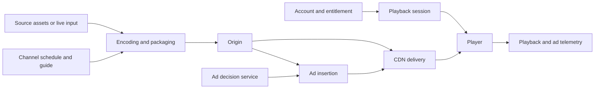

# Streaming Business Models and Architecture: FAST, SVOD, AVOD and TVOD

Connect the revenue model to entitlement, media delivery, advertising, measurement and operations. Definitions are sourced below; architecture questions and exercises are preparation advice, not claims about a company's internal implementation. Sources reviewed on 4 October 2026.

## 1. Separate monetization from viewing behavior

| Term | Meaning | Design questions to practice |
| :--- | :--- | :--- |
| SVOD | Subscription video on demand | Subscription lifecycle, entitlement, cancellation, restore purchases and concurrent-session policy |
| AVOD | Advertising-supported video on demand | Ad decisions, breaks, consent, measurement and playback continuity |
| TVOD | Transactional video on demand, such as title rental or purchase | Payment reconciliation, rights windows, entitlement and expiry |
| FAST | Free ad-supported streaming television, commonly delivered as scheduled linear channels | Channel schedules, guide data, playout, ad breaks and live continuity |
| Hybrid | A product combines subscription, advertising or transactional access | Tier-specific access, advertising policy, upgrades and consistent rights enforcement |

For VOD monetization definitions, see [Amazon Ads](https://advertising.amazon.com/library/guides/avod-svod-tvod-video-on-demand). For scheduled FAST channel construction, see [AWS virtual linear channels](https://aws.amazon.com/blogs/media/deploying-virtual-linear-ott-channels-using-aws-media-services/).

VOD means viewers select when to start an asset. Linear channels follow a schedule. Live refers to media produced and delivered as the event happens. A linear channel can include prerecorded content. A subscription alone does not specify whether ads are present; state the product's actual tier policy. Advertising and access policy are separate design dimensions.

## 2. End-to-end architecture

This is a conceptual map. Choose actual boundaries from the requirements; ad insertion placement depends on the approach. Separate media delivery from session authorization and configuration. A segment request need not invoke every control-plane service.

The [CloudFront streaming guide](https://docs.aws.amazon.com/AmazonCloudFront/latest/DeveloperGuide/on-demand-streaming-video.html) describes encoding, packaging and delivery. [MediaTailor](https://docs.aws.amazon.com/mediatailor/latest/ug/what-is.html) documents ad insertion and channel assembly capabilities.

## 3. FAST: channel operations and program continuity

Practice a channel model containing program identity, scheduled start and end, asset version, rights, ad opportunities and publication version. Define which time source and schedule revision control playout. Explain how guide metadata stays aligned with the delivered channel.

Prepare for schedule gaps, asset unavailability, encoder failure, regional rights differences and stale guide data. Define permitted filler content and recovery rather than promising uninterrupted playback. Decide whether start-over and catch-up are supported; these introduce additional rights and timeline semantics.

**Interview drill:** a prerecorded program is unavailable as its scheduled slot begins. Explain detection, replacement, guide correction, ad behavior and customer impact. Then explain who owns channel operations during the incident.

## 4. SVOD and TVOD: entitlement correctness

Model subscription or purchase state separately from payment attempts and playback sessions. Authenticate the caller, authorize the asset and region, check the applicable rights window, and define session expiry and concurrency policy.

For TVOD, define whether a rental window starts at purchase or first playback and how offline access behaves. For SVOD, explain delayed billing callbacks, cancellation, renewal failure and restoring an existing purchase. These are product decisions to establish, not universal rules.

A timeout during payment creates an unknown outcome. Reconcile the existing attempt before producing a duplicate external effect. Avoid granting access from an unverified client receipt or indefinitely trusting a stale entitlement cache.

**Interview drill:** payment confirmation arrives after the client times out. Explain persisted states, request identity, access restoration and support diagnostics. Use the [checkout case](backend-system-design-casebook.md#1-checkout-payments-and-inventory).

## 5. AVOD, CSAI and SSAI

**CSAI**, client-side ad insertion, places ad playback coordination in the client. **SSAI**, server-side ad insertion, incorporates ads into the delivered stream path. The implementation still needs ad decisions, timing, compatible media and measurement. For a concrete supported integration, see [Amazon IVS SSAI](https://docs.aws.amazon.com/ivs/latest/LowLatencyUserGuide/server-side-ad-insertion.html).

| Decision | What to defend |
| :--- | :--- |
| Ad request deadline | How long the viewer waits and what happens after timeout |
| Creative compatibility | Codec, media timing, renditions, audio and transition behavior |
| Personalized manifests | Session isolation, cache policy, expiry and retry behavior |
| Empty or failed ad decision | Permitted content continuation, filler or failed playback policy |
| Consent and targeting | Trusted permission state and permitted data sent to ad systems |
| Measurement | Which actor records each event and how duplicate reporting is handled |

Do not assume SSAI eliminates all client integration or proves an ad was viewed. Delivery, insertion, playback and measurement are different observations.

**Interview drill:** the ad decision service becomes slow during a live event. Define a bounded fallback, protect media delivery, and reconcile measurement without claiming an impression for an unobserved playback.

## 6. Standards and terms worth knowing

| Concept | Why it matters | Primary reference |
| :--- | :--- | :--- |
| HLS and adaptive bitrate | Playlist and rendition behavior across supported Apple playback paths | [Apple HLS resources](https://developer.apple.com/streaming/) and [authoring specification](https://developer.apple.com/documentation/http-live-streaming/hls-authoring-specification-for-apple-devices/) |
| DASH and CMAF | Manifest interoperability and compatible media profiles; a shared container does not guarantee all codec or DRM combinations work | [DASH-IF guidelines](https://dashif.org/guidelines/iop-v5/) |
| VAST | Standard video-ad response structure; it is not an ad auction or a playback guarantee | [IAB Tech Lab VAST 4.3 specification](https://iabtechlab.com/wp-content/uploads/2022/09/VAST_4.3.pdf) |
| SCTE-35 | Ad opportunity and program signaling to understand in a selected streaming pipeline | [MediaTailor ad-marker passthrough](https://docs.aws.amazon.com/mediatailor/latest/ug/ad-marker-passthrough.html) |
| DRM and content access | License acquisition and permitted playback must align with device support and rights policy | [Apple FairPlay Streaming](https://developer.apple.com/streaming/fps/) |
| CDN and origin | Cache policy, origin protection, delivery cost and failure domains | [CloudFront streaming documentation](https://docs.aws.amazon.com/AmazonCloudFront/latest/DeveloperGuide/on-demand-streaming-video.html) |

For each selected standard, consult the actual version and provider contract. Do not memorize one segment duration, ad-load ratio, latency target or DRM combination as universal.

## 7. Measure outcomes with explicit denominators

| Measure | Definition to establish before discussing results |
| :--- | :--- |
| Playback start success | Which valid attempts count and what event proves start? |
| Startup time | Where timing begins and which cohorts and percentiles are reported? |
| Rebuffering | Stall count, stall duration and eligible playback duration |
| Live delay | Which capture timestamp is compared with presentation, and how clocks align? |
| Ad fill | Which eligible opportunities received usable ads, excluding what failures? |
| Ad playback completion | Which actual starts complete, and which actor observes them? |
| Subscription retention | Cohort, billing period, cancellations and excluded accounts |
| Media unit cost | Delivery, encoding, storage, DRM, ad and operational costs per defined unit |

No benchmark results are supplied here. Use measured evidence. Concurrent viewers do not directly determine control-plane QPS; derive request demand from actual session, manifest, segment and renewal behavior.

## 8. EM, staff and leadership follow-ups

**Staff:** defend manifest correctness, entitlement freshness, timing, cache keys, failure isolation and retry semantics. Trace one playback session through authorization, media and advertising.

**EM:** assign ownership across player, encoding, CDN, identity, advertising and analytics. Explain launch rehearsals, on-call coordination, compatibility testing and recovery for old client versions.

**Leadership:** connect tier strategy, content rights, revenue, viewing quality, cost and operational capacity. State which investment you would prioritize and what evidence could reverse that choice.

These role lenses are rehearsal guidance, not a private company scorecard.

## 9. Practice sequence and related material

1. Design SVOD playback authorization and restoration after an ambiguous payment.
2. Add a permitted AVOD tier and defend ad-service failure behavior.
3. Design a FAST channel schedule, guide and asset-failure fallback.
4. Introduce a live-event traffic burst and an unavailable origin.
5. Explain a measured cost optimization without changing the definition of playback success.

Read [long-form playback](video-streaming-player.md), [short-form feeds](video-feed-streaming.md), [audio playback](spotify-audio-player.md), [the live-event backend exercise](backend-system-design-casebook.md#8-streaming-platform-and-live-event-control-plane), [the backend guide](backend-engineering-manager-guide.md), and [Rahul's evidence plan](rahul-backend-interview-plan.md).

Rahul's resume supplies streaming project anchors. Establish actual ownership of player, backend, CDN or advertising work before presenting any of these practice designs as past experience.
