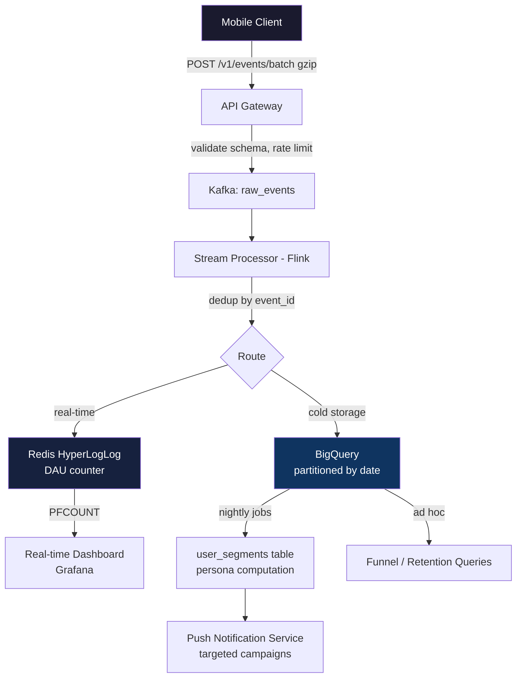

# Design User Analytics Event Pipeline
### EM / Staff Interview — What to Capture, Why, and How to Derive Insight from Minimal Events

**Reported at**: Meta, Google, Uber, Airbnb, DoorDash, Spotify  
**Domain**: Platform Analytics / Growth Engineering  
**Seniority**: Staff IC · EM · Principal  
**Interview Prompts**: *"Design an analytics system"*, *"How do you measure feature success?"*, *"User retention dropped 15% — what events tell you where they're dropping off?"*

---

## The 3 Questions Every Analytics System Must Answer

Before writing a single line of code or naming a single event, anchor your design around these:

| # | Question | Metric | Signal Event |
|:---:|:---|:---|:---|
| 1 | **Is the product alive?** | DAU / MAU / Stickiness | `app_open` |
| 2 | **Is the feature working?** | Funnel conversion rate | `screen_viewed` + key action |
| 3 | **Are users coming back?** | D1 / D7 / D30 retention | `app_open` keyed by `first_open_date` |

Everything else is derivative. A well-designed event schema answers all 3 from ≤8 event types.

---

## The Minimal Event Taxonomy (Industry Standard)

> **Staff-level insight**: Most companies track 300+ events. The best teams get 90% of insight from 8.  
> More events = more schema drift, more data swamp, more engineering cost. Design for signal density.

### The 8 Essential Events

```
1. app_open              → DAU signal, source attribution, cold-start detection
2. screen_viewed         → Navigation graph, funnel entry/exit, page depth
3. feature_engaged       → Core action taken (generic: "user did the thing")
4. conversion_completed  → Purchase / signup / subscribe — the money metric
5. conversion_abandoned  → Checkout exit, form exit — where users leave
6. error_occurred        → Quality signal, rage taps, 4xx/5xx from client
7. notification_tapped   → Attribution: did push drive engagement?
8. session_ended         → Session duration, engagement depth
```

### Why These 8 Cover Almost Everything

```
DAU:         COUNT(DISTINCT user_id) WHERE event = 'app_open' AND date = today
MAU:         COUNT(DISTINCT user_id) WHERE event = 'app_open' AND date >= 30 days ago
Retention:   % of users who app_opened on day 0 AND app_opened again on day N
Funnel:      screen_viewed('checkout') → feature_engaged('add_payment') → conversion_completed
Attribution: notification_tapped.notification_id ↔ conversion_completed within 24h session
Quality:     error_occurred rate per app_version per screen
```

> **EM-level insight**: You can compute every OKR metric from these 8 events. When engineers want to add a 9th event, ask: *"Which of the 3 core questions does this answer that we can't answer now?"*

---

## Event Schema — Property Design Is Where Insight Lives

The event name is cheap. **The properties determine what you can infer.**

### Base Schema (Every Event Carries This)

```json
{
  "event_id":      "uuid-v4",          // deduplication key — idempotent on retry
  "event_name":    "screen_viewed",
  "user_id":       "u_123",            // null if not logged in
  "device_id":     "d_abc",            // stable, Keychain-persisted, always present
  "session_id":    "s_xyz",            // new UUID after 30min inactivity
  "timestamp":     1721234567890,      // client-side epoch ms (send server_timestamp too)
  "app_version":   "5.2.1",
  "os_version":    "iOS 17.4",
  "device_model":  "iPhone15,3",
  "platform":      "ios",
  "properties":    { ... }            // event-specific (see below)
}
```

### Why `device_id` AND `user_id`?

| Scenario | Use |
|:---|:---|
| User not logged in | `device_id` as identity (anonymous journey) |
| User logs in mid-session | identity stitch: link all prior `device_id` events to `user_id` |
| Multi-device user | same `user_id`, different `device_id` → deduplicate in DAU by `user_id` |
| DAU for anonymous users | `COALESCE(user_id, device_id)` — count distinct |

### Event-Specific Properties (What Makes Inference Possible)

```json
// app_open — source attribution
{ "source": "push_notification", "notification_id": "n_789",
  "utm_source": "instagram", "utm_campaign": "summer_sale",
  "is_cold_start": true, "cold_start_ms": 1240 }

// screen_viewed — funnel tracking
{ "screen_name": "CheckoutReview", "referrer_screen": "Cart",
  "is_first_view": false, "load_time_ms": 340 }

// feature_engaged — the generic action event
{ "feature_name": "add_to_cart", "item_id": "prod_456",
  "item_category": "electronics", "price": 29.99 }

// conversion_completed — the money event
{ "conversion_type": "purchase", "value": 89.97, "currency": "USD",
  "item_count": 3, "payment_method": "apple_pay",
  "notification_id": "n_789" }   // ← links notification → conversion

// conversion_abandoned — where you lose users
{ "screen_name": "PaymentEntry", "step": 3, "total_steps": 4,
  "time_spent_ms": 45000, "abandon_reason": "back_gesture" }

// error_occurred — quality signal
{ "error_type": "network", "error_code": "timeout", "screen_name": "Feed",
  "url_template": "/v1/feed", "latency_ms": 8000 }
  // NOTE: use url_template NOT full URL — prevents PII + cardinality explosion

// notification_tapped — attribution
{ "notification_id": "n_789", "notification_type": "order_update",
  "delivery_delay_ms": 3400, "app_state": "background" }
```

---

## How to Derive Rich Inferences from Minimal Events

### 1. Funnel Conversion (from `screen_viewed` + `conversion_*`)

```sql
-- BigQuery: Checkout funnel conversion rate, last 7 days
WITH funnel AS (
  SELECT user_id,
    MAX(CASE WHEN event_name = 'screen_viewed'
             AND JSON_EXTRACT(properties,'$.screen_name') = 'Cart'
        THEN 1 ELSE 0 END) AS reached_cart,
    MAX(CASE WHEN event_name = 'screen_viewed'
             AND JSON_EXTRACT(properties,'$.screen_name') = 'CheckoutReview'
        THEN 1 ELSE 0 END) AS reached_checkout,
    MAX(CASE WHEN event_name = 'conversion_completed' THEN 1 ELSE 0 END) AS converted
  FROM events
  WHERE event_date >= DATE_SUB(CURRENT_DATE(), INTERVAL 7 DAY)
  GROUP BY user_id
)
SELECT
  SUM(reached_cart)     AS cart_users,
  SUM(reached_checkout) AS checkout_users,
  SUM(converted)        AS purchasers,
  ROUND(SUM(converted) / NULLIF(SUM(reached_cart), 0) * 100, 2) AS cart_to_purchase_pct
FROM funnel;
```

> **Staff-level call**: Always use `MAX(CASE WHEN...)` not `COUNT(event)` for funnels — prevents double-counting users who visited a screen twice.

### 2. D1 / D7 / D30 Retention (from `app_open` alone)

```sql
-- D7 retention cohort
WITH cohorts AS (
  SELECT user_id, MIN(DATE(timestamp)) AS cohort_day
  FROM events WHERE event_name = 'app_open'
  GROUP BY user_id
),
activity AS (
  SELECT DISTINCT user_id, DATE(timestamp) AS active_day
  FROM events WHERE event_name = 'app_open'
)
SELECT
  c.cohort_day,
  COUNT(DISTINCT c.user_id) AS cohort_size,
  COUNT(DISTINCT CASE WHEN DATE_DIFF(a.active_day, c.cohort_day, DAY) = 7
        THEN a.user_id END) AS retained_d7,
  ROUND(COUNT(DISTINCT CASE WHEN DATE_DIFF(a.active_day, c.cohort_day, DAY) = 7
        THEN a.user_id END) / COUNT(DISTINCT c.user_id) * 100, 1) AS d7_retention_pct
FROM cohorts c
LEFT JOIN activity a USING (user_id)
GROUP BY c.cohort_day
ORDER BY c.cohort_day;
```

**Industry benchmarks (real)**:

| Product Type | D1 Retention | D7 Retention | D30 Retention |
|:---|:---:|:---:|:---:|
| Top social apps | 40-60% | 20-40% | 10-25% |
| E-commerce | 25-40% | 10-20% | 5-12% |
| Average app | 20-30% | 8-15% | 3-8% |
| Poor | < 20% | < 5% | < 2% |

### 3. Notification Attribution (from `notification_tapped` + `conversion_completed`)

```sql
-- What % of purchases came from push notifications?
SELECT
  n.notification_id,
  n.notification_type,
  COUNT(DISTINCT n.user_id)                                     AS tapped,
  COUNT(DISTINCT c.user_id)                                     AS converted,
  ROUND(COUNT(DISTINCT c.user_id) / COUNT(DISTINCT n.user_id) * 100, 1) AS push_cvr
FROM (SELECT user_id, JSON_EXTRACT(properties,'$.notification_id') AS notification_id,
             JSON_EXTRACT(properties,'$.notification_type') AS notification_type,
             timestamp
      FROM events WHERE event_name = 'notification_tapped') n
LEFT JOIN (SELECT user_id, JSON_EXTRACT(properties,'$.notification_id') AS notification_id,
                  timestamp
           FROM events WHERE event_name = 'conversion_completed') c
       ON n.user_id = c.user_id
      AND n.notification_id = c.notification_id
      AND c.timestamp > n.timestamp
      AND c.timestamp < n.timestamp + INTERVAL 24 HOUR  -- 24h attribution window
GROUP BY 1, 2;
```

### 4. User Persona from Behavioral Signals (No ML Needed)

```sql
-- Compute personas nightly, write to user_segments table
SELECT
  user_id,
  CASE
    WHEN COUNT(DISTINCT event_date) >= 25 AND SUM(CAST(event_name='conversion_completed' AS INT)) >= 3
         THEN 'power_user'
    WHEN COUNT(DISTINCT event_date) BETWEEN 5 AND 24
         THEN 'casual_user'
    WHEN MAX(event_date) < DATE_SUB(CURRENT_DATE(), INTERVAL 14 DAY)
     AND MAX(event_date) >= DATE_SUB(CURRENT_DATE(), INTERVAL 30 DAY)
         THEN 'at_risk'
    WHEN MAX(event_date) < DATE_SUB(CURRENT_DATE(), INTERVAL 60 DAY)
         THEN 'churned'
    WHEN MIN(event_date) >= DATE_SUB(CURRENT_DATE(), INTERVAL 7 DAY)
         THEN 'new_user'
    ELSE 'regular'
  END AS persona,
  COUNT(DISTINCT event_date) AS active_days_30,
  MAX(event_date) AS last_active
FROM events
WHERE event_date >= DATE_SUB(CURRENT_DATE(), INTERVAL 30 DAY)
  AND event_name = 'app_open'
GROUP BY user_id;
```

> **EM insight**: Personas drive push notification targeting, A/B test audience splits, and UI personalization — without ever touching an ML model. Rule-based is auditable, debuggable, and sufficient for most product decisions.

---

## Client-Side Architecture (Mobile FE)

```
User Action
    ↓
AnalyticsSDK.track("screen_viewed", properties)   ← single entry point
    ↓
EventQueue (Swift actor — thread-safe)
    ↓
SQLite buffer (flush: every 30s OR 100 events OR app background)
    ↓
POST /v1/events/batch  ← max 500 events, gzipped JSON, retry on failure
```

### Swift Implementation

```swift
actor AnalyticsSDK {
    static let shared = AnalyticsSDK()

    private var queue: [AnalyticsEvent] = []
    private let flushThreshold = 100
    private let db: AnalyticsDatabase  // SQLite wrapper

    func track(_ name: String, properties: [String: Any] = [:]) {
        let event = AnalyticsEvent(
            eventId: UUID().uuidString,       // dedup key
            eventName: name,
            userId: IdentityManager.userId,   // nil if anonymous
            deviceId: IdentityManager.deviceId, // always present, Keychain-persisted
            sessionId: SessionManager.current.sessionId,
            timestamp: Date().timeIntervalSince1970 * 1000,
            properties: properties
        )
        queue.append(event)
        db.save(event)                        // persist first, then upload

        if queue.count >= flushThreshold {
            Task { await flush() }
        }
    }

    func flush() async {
        let pending = db.loadUnsent(limit: 500)
        guard !pending.isEmpty else { return }

        do {
            try await APIClient.post("/v1/events/batch", body: pending)
            db.markSent(ids: pending.map(\.eventId))
        } catch {
            // exponential backoff — leave sent=0, retry next cycle
        }
    }
}

// Session: new UUID after 30min inactivity (industry standard)
class SessionManager {
    static var current = SessionManager()
    private(set) var sessionId = UUID().uuidString
    private var lastActiveAt = Date()

    func heartbeat() {
        let inactiveDuration = Date().timeIntervalSince(lastActiveAt)
        if inactiveDuration > 1800 {  // 30 minutes
            sessionId = UUID().uuidString  // new session
            AnalyticsSDK.shared.track("session_started")
        }
        lastActiveAt = Date()
    }
}
```

### Critical: Flush on Background

```swift
// AppDelegate — non-negotiable
func applicationWillResignActive(_ application: UIApplication) {
    let bgTask = application.beginBackgroundTask(expirationHandler: nil)
    Task {
        await AnalyticsSDK.shared.track("session_ended",
            properties: ["duration_ms": SessionManager.current.durationMs])
        await AnalyticsSDK.shared.flush()
        application.endBackgroundTask(bgTask)
    }
}
```

> Without this, ~15-20% of events are lost on app kill. This single line is the difference between trustworthy and untrustworthy analytics data.

---

## Server-Side HLD



### Key Design Decisions

| Decision | Choice | Why |
|:---|:---|:---|
| **Event ingestion** | Kafka | Durable, ordered per user (partition by `user_id`), absorbs traffic spikes |
| **Real-time DAU** | Redis HyperLogLog | `PFADD dau:2024-01-15 user_123` → O(1), 12KB per day, 0.81% error |
| **Exact DAU (billing)** | BigQuery `COUNT(DISTINCT)` | Runs nightly, not real-time, fully accurate |
| **Deduplication** | Bloom filter (Flink) + Redis exact (24h) | Bloom for high-speed check, Redis for exact within window |
| **MAU from DAU** | `PFMERGE mau:jan dau:jan-01 ... dau:jan-31` | HyperLogLog union is O(1) — merge 30 day-HLLs into 1 MAU count |

### DAU/MAU Computation

```
Real-time DAU (< 1min lag):
  Flink consumer: on every app_open → PFADD dau:{date} {user_id}
  Dashboard: PFCOUNT dau:{date} → ~0.81% error, good enough for monitoring

Exact DAU (daily reporting, next morning):
  SELECT COUNT(DISTINCT COALESCE(user_id, device_id))
  FROM events
  WHERE event_name = 'app_open' AND event_date = '2024-01-15'

Stickiness = DAU / MAU
  Slack ~50% (exceptional), Instagram ~40% (great), average app ~20%
```

---

## What NOT to Track (Anti-Patterns)

| Anti-Pattern | Problem | Fix |
|:---|:---|:---|
| **Full URL in event properties** | PII in `?email=foo@bar.com` + cardinality explosion in dashboards | Use `url_template`: `/v1/users/{id}` |
| **Event per button** (300+ events) | Schema drift, nobody owns it, can't query | 1 `feature_engaged` event + `feature_name` property |
| **Raw user input in properties** | GDPR violation when uploaded to server | Never log text field content, search queries verbatim |
| **Device-id only for DAU** | Inflates DAU 20-30% on multi-device users | Always `COALESCE(user_id, device_id)` |
| **Rolling 24h window for DAU** | DAU varies by timezone — not comparable across days | Calendar day UTC midnight to midnight |
| **Synchronous tracking in UI** | Frame drops on main thread | Always async via `actor` |

---

## The Identity Graph Problem

**Scenario**: User browses anonymously → creates account → uses app on 2nd device.

```
Pre-login:  device_id = "d_abc", user_id = null
Post-login: device_id = "d_abc", user_id = "u_123"
2nd device: device_id = "d_xyz", user_id = "u_123"
```

**Server-side resolution**:
```sql
-- On login event: link all prior device_id events to user_id
UPDATE events SET user_id = 'u_123'
WHERE device_id = 'd_abc' AND user_id IS NULL;
-- (or do this at query time with a JOIN to identity_map table)
```

**identity_map table**: `{device_id, user_id, linked_at}` — updated on every login. Query-time join is cheaper than backfilling event table.

> **Staff-level interview point**: Identity resolution is where most analytics systems break. If you don't stitch pre-login events to post-login user_id, your funnel conversion rates are artificially low (pre-login steps not attributed to converting users).

---

## Common Mistakes (Interview Killers)

| ❌ Wrong | ✅ Correct |
|:---|:---|
| Tracking everything "just in case" | Define business question first, then pick minimum events that answer it |
| Counting DAU with `device_id` | `COALESCE(user_id, device_id)` — user has multiple devices |
| Firing analytics on main thread | Always async via Swift `actor` — prevents frame drops |
| Not flushing on app background | ~20% event loss — flush in `applicationWillResignActive` |
| Not deduplicating retried events | Double-counting on retry — `event_id` UUID + server-side dedup |
| Logging PII in properties | GDPR violation — never log email/name/address in event properties |
| Using `COUNT(event)` in funnels | Use `COUNT(DISTINCT user_id)` — same user may trigger event twice |
| Building 300-event taxonomy | Schema drift, no ownership, unusable — 8 core events cover 90% of needs |

---

## Mock Interview Q&A — EM / Staff Level

**Q: "User retention dropped 15% after a redesign. You have 8 events. Where do you start?"**

> Start with `screen_viewed` to compare navigation paths before/after release, segmented by `app_version`. Look for screens that now have higher `conversion_abandoned` or where users stop appearing in the funnel. D1 retention query from `app_open` cohorted by `app_version` will tell you if new installs are returning less. If `feature_engaged` on core actions dropped, the redesign hurt discoverability.

---

**Q: "How does Meta count DAU for 3B users in real-time?"**

> Two-tier: real-time via HyperLogLog in Redis — `PFADD dau:{date} {user_id}` on every `app_open` event from the stream processor. This gives < 1min lag with 0.81% error — good enough for dashboards. For exact billing-grade DAU, nightly BigQuery job runs `COUNT(DISTINCT user_id)` on the full partitioned events table. Cost: BigQuery scans only 1 day's partition (~2TB) instead of full table. The HLL approach uses max 12KB of Redis memory per day regardless of cardinality.

---

**Q: "A new push notification campaign claims 40% CTR. How do you validate it?"**

> Query: `notification_tapped` events with `notification_id` from the campaign ÷ total sends. But CTR is a vanity metric — ask: did those taps lead to `conversion_completed` within 24h? Join `notification_tapped.notification_id` with `conversion_completed.notification_id` (both events carry `notification_id`). Also check: what % of those conversions would have happened anyway (holdout group with no push). That delta is the true lift.

---

**Q: "You have 1M users. Your funnel shows 60% drop between 'Add to Cart' and 'Checkout'. What do you do?"**

> First, validate the data: is the funnel query using `COUNT(DISTINCT user_id)` not `COUNT(event)`? Is the session window correct? Next, segment: does the drop differ by `device_model`, `os_version`, `app_version`? A recent bug may be causing it. Then look at `conversion_abandoned` events from the cart screen — what's `time_spent_ms` and `abandon_reason`? If `time_spent_ms` is high, users are trying but failing. If it's low, they're bouncing immediately — likely a UX problem, not a bug. This is your test hypothesis for the next A/B test.

---

**Q: "How do you design the event taxonomy for a brand new product feature?"**

> Always start with the business question: what does success look like for this feature? Define 1-2 conversion metrics. Then work backwards: what's the funnel entry point? Add `screen_viewed` for the entry screen. What's the core action? Add `feature_engaged` with `feature_name`. What does success look like? Add `conversion_completed` with relevant properties. What's failure? Add `conversion_abandoned`. That's 4 events that cover the entire feature lifecycle. Resist requests to add more until you've shipped and proven these 4 don't answer your question.

---

**Q: "How do you compute D30 retention without scanning the entire events table every day?"**

> Partition BigQuery events table by `event_date` and cluster by `user_id`. For retention, pre-compute and materialize a `daily_active_users` table nightly: `{user_id, event_date}` from `app_open` events. This is 1 row/user/day instead of N events/user/day. D30 retention query then only joins two small tables — O(MAU) not O(total events). Alternatively, use a time-series DB like Druid that computes retention natively.

---

## Production Benchmarks (Real Numbers)

| Metric | Number | Source |
|:---|:---|:---|
| Meta DAU | 3.27B (Q1 2024) | Meta earnings |
| Meta stickiness (DAU/MAU) | ~67% | Meta earnings |
| Slack stickiness | ~50% | Slack S-1 2019 |
| Average app D1 retention | 25-35% | Adjust Mobile Report 2023 |
| Average app D30 retention | 5-10% | Adjust Mobile Report 2023 |
| Redis HyperLogLog error | 0.81% std dev | Redis docs |
| Redis HLL memory | max 12KB per counter | Redis docs |
| Kafka throughput | 1M+ events/sec per broker | LinkedIn engineering |
| Session timeout | 30 minutes | Google Analytics, Amplitude, Mixpanel |
| Push notification 24h attribution | Industry standard window | AppsFlyer, Branch, Adjust |
| BigQuery partition scan | ~2TB/day for 100M DAU product | GCP pricing |

---

## Related Specs

- [`analytics-sdk.md`](analytics-sdk.md) — client-side SDK implementation depth
- [`ab-testing-experimentation-sdk.md`](ab-testing-experimentation-sdk.md) — experiment exposure events + analysis
- [`push-notification-system.md`](push-notification-system.md) — `notification_tapped` event source
- [`feature-flag-system.md`](feature-flag-system.md) — flag evaluation events
- [`crash-reporting-sdk.md`](crash-reporting-sdk.md) — `error_occurred` event pipeline
