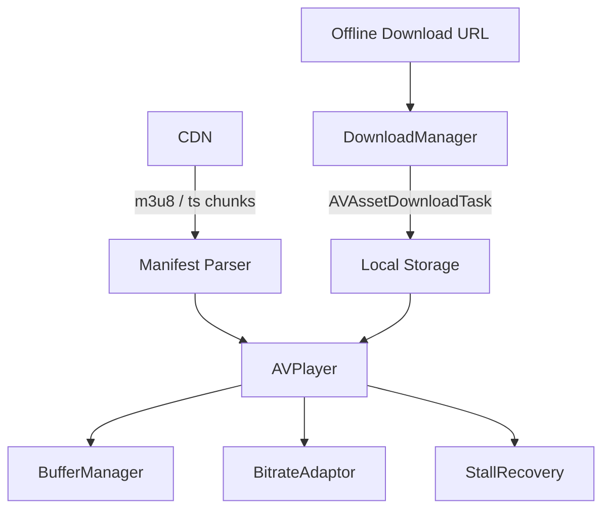

Long-form Video Streaming App (Netflix / Disney+ / Hotstar / Apple TV+)
## Overview
Building a long-form video streaming client involves handling DRM, adaptive bitrate streaming (ABR), offline downloads, and precise state synchronization across devices. It tests deep knowledge of AVFoundation, networking, and device resource management over long sessions.

## Target Companies & Frequency
| Company | Why They Ask | Frequency |
|---------|--------------|-----------|
| Netflix | Core product engineering. | ★★★★★ |
| Apple | Apple TV+ architecture. | ★★★★★ |
| Google | YouTube architecture (long form).| ★★★★★ |
| Hotstar/Disney | Streaming scale, live events. | ★★★★☆ |

## Scope Definition

### In Scope
- HLS (HTTP Live Streaming) integration using AVFoundation.
- Adaptive Bitrate (ABR) and stall recovery mechanisms.
- DRM implementation (FairPlay Streaming).
- Offline downloads using `AVAssetDownloadURLSession`.
- Playback synchronization (heartbeat sync for cross-device resume).
- Pre-buffering strategy based on network conditions.

### Out of Scope
- Backend video encoding and transcoding pipelines.
- Recommendation engines (focus is on the player).
- Short-form vertical swipe feeds (see other spec).

## Requirements

### Functional Requirements
1. Stream encrypted HLS content securely (DRM).
2. Adapt video quality seamlessly based on changing network bandwidth.
3. Support offline viewing with chunked, resumable downloads.
4. Save user playback progress to resume on other devices (e.g., TV -> iPhone).
5. Recover gracefully from network stalls without infinite loading spinners.

### Non-Functional Requirements
| Requirement | Target | Source |
|-------------|--------|--------|
| Pre-buffer time | 10s of video within 3s | Netflix Engineering |
| Video Stalls | < 0.5% of sessions | Industry standard |
| Concurrent users (Live)| Up to 25M | Hotstar IPL scaling |
| Heartbeat sync delay | < 10s accuracy | Disney+ architecture |

## High-Level Architecture (HLD)

### Component Diagram
```text
[ Client Application ]
         |
         v
  [ VideoPlayerViewModel ] <-----> [ HeartbeatTracker ]
         |                                 |
         +--> [ DRM Manager (FairPlay)]    v
         |                          [ Playback Sync API ]
         v
  [ AVPlayer / AVPlayerItem ]
         |
         +--> [ AVAssetDownloadTask (Offline) ]
         |
         v
  [ HLS Manifest Parser / BufferManager ]
         |
         v
[ Video CDN (Akamai/AWS) ] <---> [ DRM Key Server ]
```

### Component Responsibilities
| Component | Responsibility | iOS Implementation |
|-----------|----------------|--------------------|
| AVPlayer | Core playback, manifest parsing, ABR | AVFoundation natively |
| DRMManager | Fetch and inject FairPlay keys | AVContentKeySession |
| DownloadManager| Background video downloading | AVAssetDownloadURLSession |
| HeartbeatTracker| Track and sync current timestamp | Timer + CoreData + URLSession |
| StallRecoveryEngine| Detect stalls, force lower bitrate if needed| AVPlayerItem.playbackLikelyToKeepUp |

### Data Flow
1. **Manifest Fetch**: App requests `.m3u8` master manifest.
2. **DRM Challenge**: Player hits encrypted segment, asks `AVContentKeySession` for key. Client sends SPC (Server Playback Challenge) to Key Server, gets CKC (Content Key Context).
3. **Playback**: AVPlayer starts pulling 6s segments.
4. **Adaptive Bitrate**: AVFoundation monitors bandwidth; shifts from 720p stream to 1080p stream dynamically.
5. **Heartbeat**: Every 10s, `HeartbeatTracker` saves `currentTime` locally and fires background API call.

## Data Models

### Core Entities
```swift
import Foundation

struct VideoManifest: Codable {
    let videoId: String
    let hlsUrl: URL
    let isDrmProtected: Bool
    let resumePosition: TimeInterval
}

struct HeartbeatPayload: Codable {
    let videoId: String
    let positionSeconds: TimeInterval
    let deviceId: String
    let timestamp: Date
}
```

### Database Schema
```sql
-- For offline heartbeat sync
CREATE TABLE IF NOT EXISTS playback_progress (
    video_id TEXT PRIMARY KEY,
    position REAL NOT NULL,
    updated_at TIMESTAMP DEFAULT CURRENT_TIMESTAMP,
    is_synced INTEGER DEFAULT 0
);
```

## API Design

### Endpoints
**GET /v1/video/{id}/manifest**
Returns the HLS stream URL and DRM info.

```json
{
  "video_id": "mov_999",
  "hls_url": "https://cdn.example.com/hls/mov_999/master.m3u8",
  "is_drm_protected": true,
  "license_server_url": "https://drm.example.com/fairplay",
  "resume_position": 1245.5
}
```

**POST /v1/playback/heartbeat**
Syncs progress to backend.

```json
{
  "video_id": "mov_999",
  "position_seconds": 1255.0,
  "device_id": "iphone_14_pro"
}
```

## Client Architecture Deep-Dives

### DRM: FairPlay Streaming Integration
Handling encrypted content requires acting as a delegate between AVFoundation and the Key Server.

```swift
import AVFoundation

class DRMManager: NSObject, AVContentKeySessionDelegate {
    private let keySession = AVContentKeySession(keySystem: .fairPlayStreaming)
    private let licenseServerURL: URL
    
    init(licenseServerURL: URL) {
        self.licenseServerURL = licenseServerURL
        super.init()
        keySession.setDelegate(self, queue: DispatchQueue.main)
    }
    
    func attach(to asset: AVURLAsset) {
        keySession.addContentKeyRecipient(asset)
    }
    
    // Delegate callback when player hits encrypted content
    func contentKeySession(_ session: AVContentKeySession, didProvide keyRequest: AVContentKeyRequest) {
        do {
            // 1. Get app certificate (usually hardcoded or fetched on boot)
            let appCert = try getAppCertificate()
            
            // 2. Generate SPC (Server Playback Challenge)
            keyRequest.makeStreamingContentKeyRequestData(forApp: appCert,
                                                          contentIdentifier: "asset_id".data(using: .utf8),
                                                          options: nil) { spcData, error in
                
                guard let spcData = spcData else {
                    keyRequest.processContentKeyResponseError(error!)
                    return
                }
                
                // 3. Send SPC to server, get CKC (Content Key Context) back
                self.fetchCKCFromServer(spcData: spcData) { ckcData in
                    // 4. Provide key to AVPlayer
                    let keyResponse = AVContentKeyResponse(fairPlayStreamingKeyResponseData: ckcData)
                    keyRequest.processContentKeyResponse(keyResponse)
                }
            }
        } catch {
            keyRequest.processContentKeyResponseError(error)
        }
    }
}
```

### Heartbeat & Cross-Device Sync
We must handle poor network connections by storing progress locally and syncing when possible.

```swift
import Foundation

class HeartbeatTracker {
    private var timer: Timer?
    private let db: DatabaseManager // SQLite wrapper
    private let apiClient: APIClient
    
    func startTracking(player: AVPlayer, videoId: String) {
        timer = Timer.scheduledTimer(withTimeInterval: 10.0, repeats: true) { [weak self] _ in
            guard let time = player.currentItem?.currentTime().seconds, !time.isNaN else { return }
            self?.recordProgress(videoId: videoId, position: time)
        }
    }
    
    private func recordProgress(videoId: String, position: TimeInterval) {
        // 1. Save locally instantly
        db.execute("INSERT OR REPLACE INTO playback_progress (video_id, position, is_synced) VALUES (?, ?, 0)",
                   arguments: [videoId, position])
        
        // 2. Attempt network sync
        let payload = HeartbeatPayload(videoId: videoId, positionSeconds: position, deviceId: "device_id", timestamp: Date())
        
        apiClient.post(endpoint: "/v1/playback/heartbeat", payload: payload) { success in
            if success {
                self.db.execute("UPDATE playback_progress SET is_synced = 1 WHERE video_id = ?", arguments: [videoId])
            }
        }
    }
    
    func stopTracking() {
        timer?.invalidate()
        timer = nil
    }
}
```

### Offline Downloads
Using Apple's specialized API to download HLS streams in the background.

```swift
import AVFoundation

class OfflineDownloadManager: NSObject, AVAssetDownloadDelegate {
    private var downloadSession: AVAssetDownloadURLSession!
    
    override init() {
        super.init()
        let config = URLSessionConfiguration.background(withIdentifier: "com.app.video-downloads")
        downloadSession = AVAssetDownloadURLSession(configuration: config,
                                                    assetDownloadDelegate: self,
                                                    delegateQueue: .main)
    }
    
    func startDownload(hlsUrl: URL, title: String) {
        let asset = AVURLAsset(url: hlsUrl)
        
        // Request minimum bitrate (e.g. 720p) for download to save space
        guard let task = downloadSession.makeAssetDownloadTask(asset: asset,
                                                               assetTitle: title,
                                                               assetArtworkData: nil,
                                                               options: [AVAssetDownloadTaskMinimumRequiredMediaBitrateKey: 2_000_000]) else { return }
        task.resume()
    }
    
    // Delegate callback for progress
    func urlSession(_ session: URLSession, assetDownloadTask: AVAssetDownloadTask, didLoad timeRange: CMTimeRange, totalTimeRangesLoaded loadedTimeRanges: [NSValue], timeRangeExpectedToLoad: CMTimeRange) {
        var percentComplete = 0.0
        for value in loadedTimeRanges {
            let loadedTimeRange = value.timeRangeValue
            percentComplete += loadedTimeRange.duration.seconds / timeRangeExpectedToLoad.duration.seconds
        }
        print("Download Progress: \(percentComplete * 100)%")
    }
}
```

## Performance & Optimizations
| Optimization | Technique | Benchmark/Impact |
|--------------|-----------|------------------|
| ABR Logic | Let `AVFoundation` handle parsing | Apple optimizes this at the OS level; don't write manual segment parsing unless required. |
| Prefetch Buffering | `preferredForwardBufferDuration` | Set to 10-15 seconds. Too high wastes bandwidth if user exits; too low causes stalls. |
| Stall Recovery | Observer `isPlaybackLikelyToKeepUp` | If false for > 3s, show low-impact UI loader, drop preferred bitrate constraint. |

## Failure Modes & Fallbacks
| Failure Scenario | Detection | Fallback Strategy |
|------------------|-----------|-------------------|
| Network Stall | `playbackBufferEmpty` == true | Pause player, show spinner, wait for `playbackLikelyToKeepUp`. |
| DRM Key Failure | `AVContentKeySession` fails | Display clear error "Content unavailable for playback on this device." |
| App Killed in BG | Standard app lifecycle | Background `AVAssetDownloadURLSession` continues via OS daemon. |

## Trade-off Analysis
| Decision | Option A | Option B | Chosen | Why |
|----------|----------|----------|--------|-----|
| Protocol | HLS | DASH | **HLS** | Natively supported by iOS/AVFoundation. DASH requires third-party parsers (battery drain, crash prone). |
| Offline API | `URLSession` | `AVAssetDownloadURLSession` | **AVAsset...** | Standard URLSession cannot parse `.m3u8` manifests and download segmented chunked streams securely. |
| Sync DB | CoreData | SQLite | **SQLite / Realm** | Frequent heartbeat updates (every 10s) can cause CoreData context lock contention on main thread. |

## Observability & Metrics
- `rebuffer_ratio`: Time spent buffering / total watch time. Target < 1%.
- `video_start_time`: Time from play tap to first frame. Target < 2.5s.
- `average_bitrate_played`: Ensures users aren't stuck on 360p due to aggressive ABR.
- `drm_license_failure_rate`: Tracks key server outages.

## Production Benchmarks Reference
| Metric | Value | Source |
|--------|-------|--------|
| Target Pre-buffer | 10 seconds of video | Netflix Engineering Blog |
| Peak Concurrent | 25M users (Live Sports) | Hotstar IPL scaling blog |
| Video Segment Size | Standard 6 seconds | HLS Authoring Guidelines |
| 1080p Frame Size | ~8-10MB/s bandwidth | Apple HLS guidelines |

## Interview Tips
- **HLS Knowledge is Mandatory**: You must explain that HLS consists of a Master Playlist containing different bandwidth variant playlists, which contain pointers to 6-second `.ts` or `.fmp4` chunks.
- **Don't fight AVFoundation**: A common mistake is proposing to download video chunks manually via `URLSession`. `AVPlayer` handles ABR and manifest parsing natively. Focus on configuring it (`preferredPeakBitRate`, `preferredForwardBufferDuration`) rather than rebuilding it.
- **DRM**: Knowing that FairPlay uses SPC (Server Playback Challenge) and CKC (Content Key Context) shows senior-level domain expertise.

## Architecture Diagram


## Common Mistakes
❌ **Mistake**: Using `URLSession` to manually download HLS `.ts` chunks.
✅ **Correct**: Use `AVPlayer` and AVFoundation directly for streaming, and `AVAssetDownloadURLSession` for offline downloads. Manually parsing HLS manifests is error-prone and fights OS-level optimizations.

❌ **Mistake**: Not handling stall events or infinite buffering.
✅ **Correct**: Observe `AVPlayerItem.isPlaybackLikelyToKeepUp`. If false for >3s, pause, show a loader, and adjust the `preferredPeakBitRate` to force a lower quality stream.

❌ **Mistake**: Assuming video quality upgrade is always safe.
✅ **Correct**: Rely on AVFoundation's ABR, but clamp the max bitrate based on `NWPathMonitor` (e.g., cap at 720p on cellular) to save user data and prevent stalling.

❌ **Mistake**: Not persisting resume position locally.
✅ **Correct**: Save the heartbeat position to SQLite every 10s. If the app is killed before the API syncs, you don't lose the user's progress.

❌ **Mistake**: Polling the heartbeat API too frequently (e.g., every 1s).
✅ **Correct**: Batch progress updates every 10-15s to conserve battery and reduce backend load, as syncing 25M live users every second will DDoS your API.

## Mock Interview Q&A
**Q: How does ABR (Adaptive Bitrate) work and when would you step down quality?**
A: ABR works via an HLS master manifest containing multiple stream variants (e.g., 480p, 720p, 1080p). AVFoundation handles this automatically by estimating bandwidth. However, we can step down quality manually by capping the `preferredPeakBitRate` on the `AVPlayerItem` if we detect `NWPathMonitor` shifting to cellular, or if `isPlaybackLikelyToKeepUp` drops to false, ensuring a stall-free experience.

> 🔍 *Interviewer follow-up: What's your strategy for offline download with DRM?*
> A: We use `AVAssetDownloadURLSession` which runs in a background daemon, ensuring downloads continue even if the app is suspended. For DRM, we use `AVContentKeySession` to fetch a persistent offline FairPlay key (CKC) from the license server, which we bind to the downloaded asset on disk.

**Q: A user is watching a movie on their TV, then opens your iOS app. How do you sync the state?**
A: The TV client fires a heartbeat API every 10s. When the iOS app launches, it fetches the `/manifest` endpoint which includes a `resume_position` (e.g., 1245.5s). We instantiate the `AVPlayer` and immediately call `seek(to: CMTime(seconds: 1245.5))` before beginning playback.

## Related Specs
| Related Spec | Why It's Related |
| :--- | :--- |
| [Video Feed Streaming](file:///Users/rahulgoel/ios-system-design/docs/video-feed-streaming.md) | Explores managing multiple concurrent players vs one long-form player. |
| [Payment Checkout](file:///Users/rahulgoel/ios-system-design/docs/payment-checkout.md) | Similar need for background persistence (heartbeats vs payment state). |
